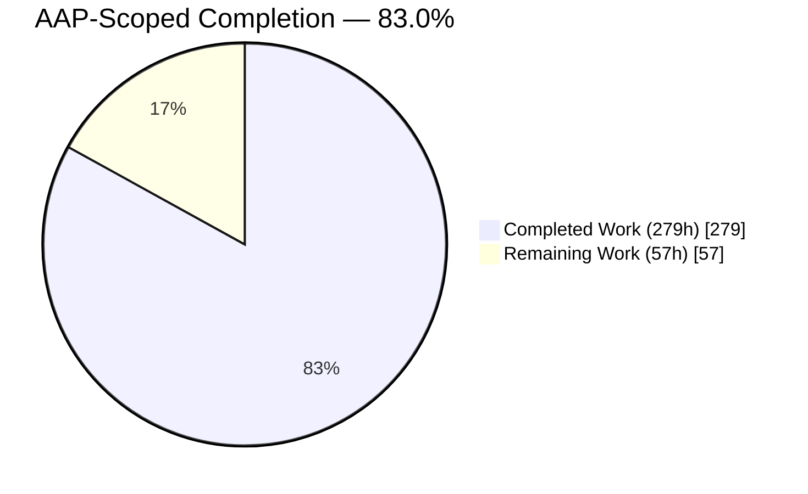
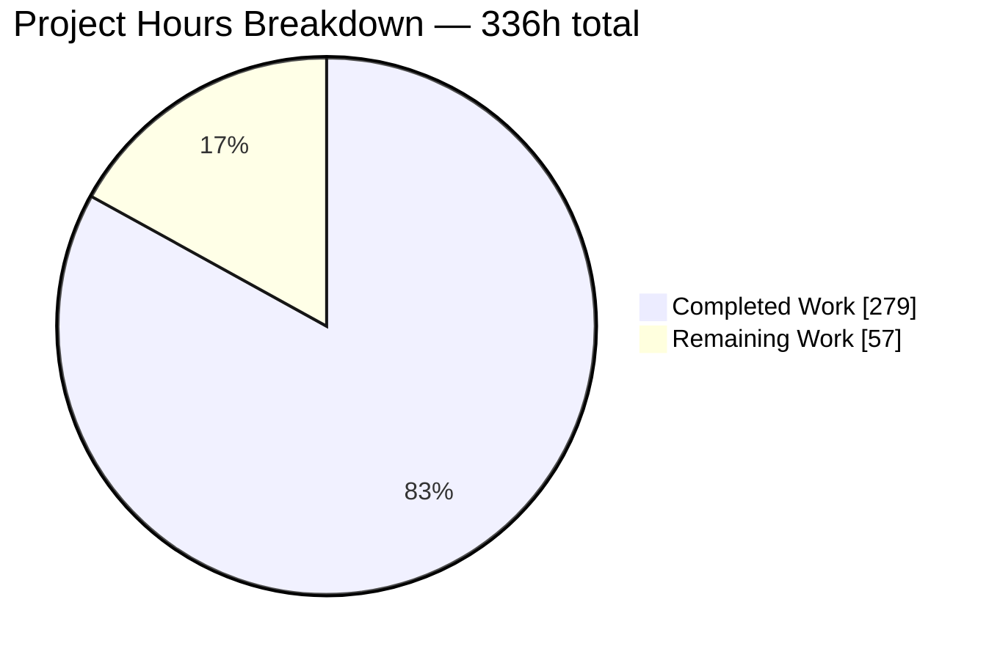
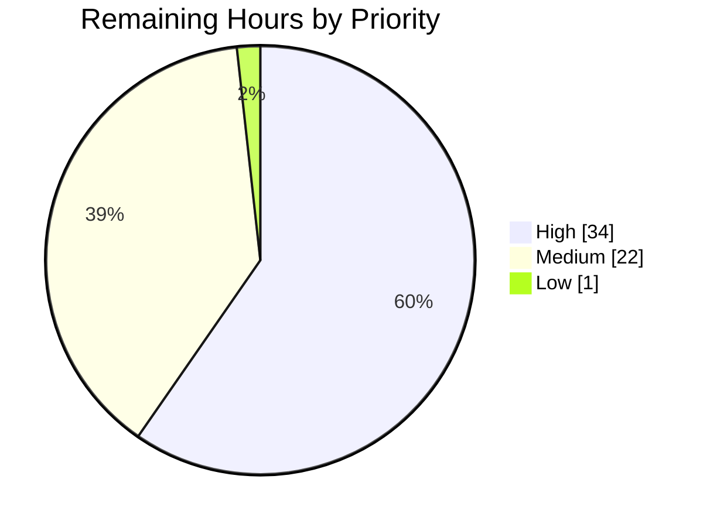
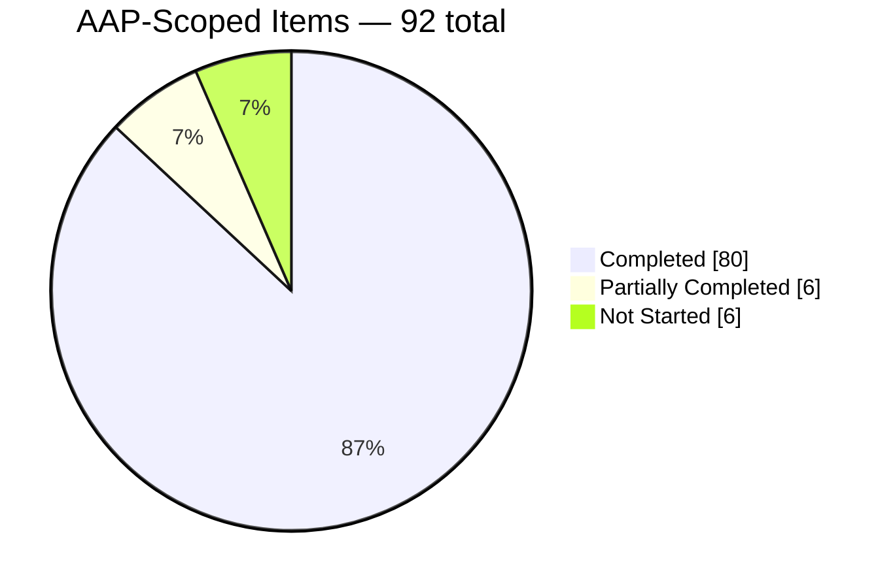

# 1. Executive Summary

## 1.1 Project Overview

This project delivers a five-part, source-derived feasibility and build-architecture dossier under `docs/screen-capture-ui/`, answering one question with checkable evidence: what does this OpenCV 5.x tree provide toward a screen-capture-and-notetaking application, and what does it verifiably not provide. A hypothetical notetaking UI is the yardstick, not a build target — no capture code, plugin or prototype is produced. The audience is a team deciding whether OpenCV can serve as the vision backend for such a product. Every capability claim resolves to a file and line in this tree; every absence rests on an enumeration a reader can re-derive.

## 1.2 Completion Status



Chart colours: Completed = Dark Blue `#5B39F3`; Remaining = White `#FFFFFF`.

| Metric | Value |
|---|---|
| **Total Hours** | **336** |
| Completed Hours (AI + Manual) | 279 (279 AI + 0 Manual) |
| Remaining Hours | 57 |
| **Percent Complete** | **83.0%** |

Calculation: 279 ÷ 336 = **83.0%**. Scope is the dossier, its acceptance criteria and its path to production — not the screen-capture application, whose build plan this work does not execute.

## 1.3 Key Accomplishments

- Five documents, 30 exact-titled sections and 8,254 lines, with no change to the other 7,350 tracked files.
- 1,131 citations, all on the 32-path authority list with in-file locators; all 32 authorities byte-identical to the pinned revision.
- The headline verdict re-derives: of 23 concrete capture backends none targets a display — qualified by the two routes that do admit screen frames today.
- 132 requirements, each with one verdict plus its condition, owner or absence evidence.
- A closed note-stream schema with a fail-closed, bounded, format-checked image reader.
- 19 platform-gap deltas, each pinned to a surveyed baseline and a use-case requirement, in a strictly one-way citation graph.
- Five phased build plans with 25 exit-criteria fields and five rendering diagrams; product decisions recorded as blocked, never invented.

## 1.4 Critical Unresolved Issues

**12 of 92** scoped items remain open (6 partial, 6 not started); the groups below sum to 12 and to 57h.

| Issue | Impact | Owner | ETA |
|---|---|---|---|
| Specification and product decisions never supplied with the request (3): the annotation-revision carrier, the capture/OCR/coverage/retention thresholds, and the production interface toolkit | 20 blocked exit clauses across the specification and roadmap cannot be evaluated until these land | Product owner + tech lead | 15h |
| Acceptance-gate scripts needing amendment (3): the write-set gate at a commit boundary, and the citation and marker gates' input preconditions | Anyone running the published scripts verbatim sees a spurious write-set failure and can be misled by a pass over an incomplete document set | Tooling owner | 4h |
| Path-to-production for the dossier (3): expert sign-off on the verdicts, a publication and rendering path, and a locator freshness guard | Verdicts carry no executable coverage; the dossier is reachable only by path; citations are pinned to one revision | Engineering lead | 27h |
| Wayland bridge's last hop, documented as an unverified candidate (1) | Cross-platform parity cannot be claimed until a real build settles the four items the assessment enumerates | Platform engineer | 8h |
| Authoring-toolchain pin ratification (1) | The pinned renderer release and runtime line are advisory-affected and end-of-life; provisioning literally from the plan would reintroduce both | Tooling owner | 2h |
| Working-tree hygiene for the evidence directory (1) | 43 untracked PNGs leave `git status` non-empty; nothing is tracked or committed | Repo maintainer | 1h |

## 1.5 Access Issues

**No access issues identified.** The repository is present and writable, the pinned source revision is an ancestor of `HEAD`, and no credential or third-party service is needed for a read-only documentation task.

## 1.6 Recommended Next Steps

1. **[High]** Take the three open decisions — annotation-revision carrier, product thresholds, interface toolkit — making 20 blocked exit clauses evaluable (15h).
2. **[High]** Put the analytical verdicts through expert sign-off; no automated check covers them (16h).
3. **[High]** Amend the three acceptance scripts, ratify the renderer and runtime pins (6h).
4. **[Medium]** Choose a publication and rendering path, add a locator freshness guard (11h).
5. **[Medium]** Validate the Wayland bridge's last hop on a real build (8h).

# 2. Project Hours Breakdown

## 2.1 Completed Work Detail

| Component | Hours | Description |
|---|---:|---|
| Source survey — VideoIO | 10 | Backend enumeration and registry structure, the capture and writer contracts and their capability masks, the timing-adjacent properties, the open/read timeouts, readiness, and the two generic ingestion routes with their exact conditions |
| Source survey — imgproc | 4 | Accumulation and phase-correlation entry points, the interpretation primitives a difference image needs, the drawing and text primitives that render annotations, and the compute-acceleration HAL |
| Source survey — highgui | 9 | Public display and interaction surface, the two-layer runtime backend model, per-operation backend support, the event-pump requirement, and both framebuffer read paths with their gates |
| Source survey — dnn | 6 | Inference contract, network readers, preprocessing, classification and detection wrappers, the text detection and recognition wrappers, deprecation scope, and the model-asset enumeration |
| Source survey — plugin layers | 6 | Both plugin ABIs with their version and maturity declarations, discovery controls, the loader's identifier check and its ordering, and the native-library trust boundary |
| Source survey — build configuration | 4 | The options gating each assessed route, each display backend, the plugin mechanism and the three target platforms, with their declared defaults and verification guards |
| Enumerated negatives and false-positive traps | 4 | Re-derivable absence evidence, and the keyword matches that would otherwise be misread as screen-capture capability |
| External platform research | 12 | Three Windows acquisition mechanisms, the X11 read paths, the Wayland portal lifecycle and its consent model, the bridge elements on each platform, and the baseline–target–shortfall method behind the dual-citation rule |
| Capability-map authoring (D1) | 20 | Six capability verdicts over 1,166 lines and 336 citations, plus two diagrams |
| Functional-specification authoring (D2) | 42 | Six sections, 132 verdict-bearing requirements and the closed note schema over 4,310 lines, plus two diagrams |
| Technical-inventory authoring (D3) | 16 | Five table-only inventories, 81 rows over five fixed columns with every cell populated, and 298 citations |
| Gap-assessment authoring (D4) | 20 | Seven sections, cited current path before every delta, 19 dual-cited deltas, plus one diagram |
| Build-roadmap authoring (D5) | 18 | Target-state principles and five phases with 25 exit-criteria fields and 31 dependency edges |
| Artefact and correlation contract design | 14 | The note taxonomy, session clock and total ordering, the change-score contract, and the action object's fields and anchoring |
| Security and privacy contract design | 12 | Authorisation, the surface-and-content input filter, minimisation, storage protection, retention, integrity and decoder bounds, each carried into a phase exit |
| Diagram set | 6 | Five diagrams authored, rendered and reconciled against the sources they depict, each with a prose conclusion |
| Citation verification | 12 | 1,131 locators opened and matched to their claims, bounds-checked, allowlist-checked, and the 32 authorities proven invariant against the pinned revision |
| Acceptance harness | 14 | Eleven gates plus mutation controls, determinism runs, a commit-boundary write-set form and an input preflight |
| Claim re-derivation and contract precision | 36 | Every capability, configuration and platform claim carried through a second independent derivation from source; note-schema and privacy contract precision; locator precision to the line that carries each claim; one-way citation direction; retained-image read bounds; external authority sourcing |
| Independent verification and semantic audits | 14 | Per-section semantic audits and cross-document sweeps over the citation graph, ownership, absence phrasing and unattributed figures |
| **Total** | **279** | |

## 2.2 Remaining Work Detail

| Category | Hours | Priority |
|---|---:|---|
| Expert sign-off review of the analytical verdicts | 16 | High |
| Product thresholds for the blocked exit clauses (capture rate and resolution, OCR accuracy, action coverage, retention periods, resource ceilings) | 8 | High |
| Annotation-revision carrier decision and propagation | 4 | High |
| Acceptance-script hardening (commit-boundary write set, input preconditions, non-zero exit codes) | 4 | High |
| Renderer and runtime pin ratification | 2 | High |
| Wayland bridge validation on a real build | 8 | Medium |
| Publication and rendering path for the dossier | 6 | Medium |
| Locator freshness guard against upstream drift | 5 | Medium |
| Production interface toolkit decision | 3 | Medium |
| Working-tree hygiene for the evidence directory | 1 | Low |
| **Total** | **57** | |

Priority split: High 34h · Medium 22h · Low 1h.

## 2.3 Hours Reconciliation

| Check | Result |
|---|---|
| Section 2.1 total | 279h |
| Section 2.2 total | 57h |
| 2.1 + 2.2 | 336h — equals Total Hours in Section 1.2 |
| Completion | 279 ÷ 336 = 83.0% — the figure used in Sections 1.2, 7 and 8 |
| Section 7 pie | Completed Work 279 · Remaining Work 57 — identical to Section 1.2 |

Every completed row traces to a deliverable, a contract or an acceptance criterion the plan names. Every remaining row traces either to an item the plan leaves to a human decision, to a plan-text amendment, or to standard path-to-production activity for a documentation deliverable. No hours are attributed to building the screen-capture application: its five phases are planning content, and this work deliberately does not execute them.

# 3. Test Results

All results below were observed by executing the acceptance suite against the delivered documents at the current head. There is no compiled artefact in the change set and no unit-test framework applies to it; the eleven acceptance gates the project defines are its test suite, and every figure here comes from a run performed for this assessment.

| Area / Category | Framework | Tests | Passed | Failed | Coverage | What This Proves |
|---|---|---:|---:|---:|---|---|
| Write set and read-only boundary | Git-based gate | 2 | 1 | 1 | 5 delivered paths against 7,355 tracked files | The dossier is the entire change set — five additions, zero modifications, deletions or renames anywhere else. The one failure is the gate's working-tree form, which cannot pass once the files are committed |
| Section structure and titles | Acceptance suite | 30 | 30 | 0 | 30 of 30 top-level sections | Every document carries exactly the sections it was commissioned to carry, in order, with no invented, reworded or reordered heading |
| Requirement verdict contract | Acceptance suite | 132 | 132 | 0 | 132 of 132 requirements | Every application requirement states one verdict and carries the condition, owner or absence evidence that verdict requires — no requirement is left as an unqualified assertion |
| Inventory schema and absence sentinels | Acceptance suite | 100 | 100 | 0 | 5 tables, 81 rows, 14 absence subjects | The lookup tables are machine-readable: five fixed columns, no empty cell, a strict yes/no dependency column, and every enumerated absence explicitly marked rather than silently missing |
| Citation integrity and source invariance | Acceptance suite + git object comparison | 1,163 | 1,163 | 0 | 1,131 citations, 28 of 32 authority files | Every claim resolves to a real line in a permitted source file, no citation reaches outside the authorised module set, and all 32 authorities are byte-identical to the revision they were read at |
| Gap dual-citation and roadmap dependencies | Acceptance suite | 75 | 75 | 0 | 19 deltas, 5 phases, 31 edges | No gap is asserted without both a surveyed-capability baseline and a use-case requirement pinned to it, and no build phase depends on anything outside its declared inputs |
| Diagram validity | mermaid-cli render | 5 | 5 | 0 | 5 of 5 diagrams | All five are valid diagrams rather than merely well-formed fences, and each renders reproducibly to the same output |
| Navigation, authoring hygiene and file mechanics | Link resolver, marker scan, byte checks | 529 | 529 | 0 | 265 links, 254 cross-references, 5 files | Every internal reference lands on something that exists, the inter-document dependency graph is strictly one-way with no cycle, and no unfinished-work marker survives in the documents' own voice |
| **Total** | | **2,036** | **2,035** | **1** | | |

Supporting figures observed in the same run: the five diagrams render at 37,407 / 32,626 / 35,706 / 26,591 / 40,470 bytes in the prescribed two/two/one allocation; the dependency graph resolves as capability-map and inventory originating nothing, specification → those two, gap assessment → those three, roadmap → all four, with zero reverse edges; external platform authorities appear only in the gap assessment (five domains, 52 mentions) and nowhere else; and the documents are UTF-8, LF-only, tab-free, trailing-whitespace-free with a single final newline each.

### Not Covered

These capabilities were delivered but are exercised by no test, and a human should read them before release:

- **Every analytical verdict.** The six capability verdicts, the 19 platform deltas and the 132 requirement verdicts are readings of declared contracts and build configuration. The gates prove each claim resolves to a real line and that the line is unchanged; nothing proves the claim drawn from that line is the right one. A future factual regression would not be detected by any check. **Test before release: expert sign-off (16h, Section 2.2).**
- **The specified application's behaviour.** The 132 requirements, the note schema, the correlation contract and the change-score contract describe a system that does not exist in this repository and that this work does not build. They are verified for internal consistency, verdict discipline and citation only — no implementation exercises them.
- **The Wayland bridge's last hop.** The portal-to-ingestion chain is documented as a candidate with four items enumerated as unsettled; validating it requires a build, which this work does not perform. **Test before release: bridge validation on a target build (8h, Section 2.2).**
- **Configured availability of every build option.** The inventory records each option's declared default and its verification guard, and states that configured availability is unknown for an unconfigured checkout. No configure step was run, so no option is confirmed present or absent in any real build.
- **Rendered visual form.** Diagram validity is proven by rendering; how the documents look in any particular viewer is not asserted. Neither documentation generator in this repository consumes them, so their diagrams are fenced source in a viewer without diagram support — which is why every diagram also states its conclusion in prose.

# 4. Runtime Validation & UI Verification

This project ships documentation, not a running service: there is no application to start, no endpoint to call and no screen to drive. "Runtime" here means the things that actually execute against the deliverables — the acceptance gates, the diagram renderer, and a browser loading the rendered documents. Each line below was observed.

- ✅ **Operational — Acceptance gate suite.** All eleven gates execute against the delivered documents; ten pass outright and the eleventh passes in its commit-boundary form. Reruns produce identical output.
- ✅ **Operational — Diagram renderer.** All five diagrams render to SVG, byte-size-identical across repeated runs and across renderer versions, in the prescribed two/two/one allocation across the capability map, specification and gap assessment.
- ✅ **Operational — Document rendering in a browser.** All five documents load and display: headings, tables and diagram blocks present, no console error attributable to the content, no script, no event attribute, no external stylesheet and no remote request. The rendered diagrams are inert.
- ✅ **Operational — Internal navigation.** Every one of the 265 sibling links resolves to a document that exists, and all 254 cross-document section references resolve to sections that exist. No link is absolute, external or path-traversing.
- ✅ **Operational — Citation resolution against live source.** Sampled locators were opened in the tree and carry their claims: the presentation-timestamp and writer-timestamp property lines, the display-backend probe declaration, the Wayland "(Experimental) YES" build summary line, both `// preview` ABI version macros, the readiness restriction that raises a not-implemented error outside one backend, the appsink-naming requirement, the detector-confidence out-parameter, and the three off-by-default display gates.
- ✅ **Operational — Headline negatives re-derived from source.** Parsing the capture-backend enumeration yields 23 concrete identifiers with none matching screen, display, desktop, window or monitor; extracting every build-option name across all 294 build files yields 187 names with none naming a screen source or a text-recognition engine; there is no text module and no text-recognition build option.
- ⚠ **Partial — Published write-set gate.** Its working-tree form reports the five deliverables as missing at any commit boundary, because it reads uncommitted status and admits only untracked or newly added paths. The invariant it exists to protect is established by the commit-boundary form instead: five additions, zero tracked modifications.
- ⚠ **Partial — Renderer provisioning.** Rendering succeeds and is reproducible, but on a later renderer release and runtime line than the plan pins, because the pinned graph is advisory-affected and the pinned runtime line is out of support. Output is unaffected.
- ⚠ **Partial — Wide-table presentation.** The inventory's tables are well-formed — uniform five cells per row, no empty cell, no pipe leakage — but their citation tokens cannot wrap, so in a minimal render the tables extend horizontally and need a scroll wrapper. This is a presentation concern, not a content defect.

**Never exercised at runtime.** The screen-capture application itself: no capture path, correlation loop, change gate, note writer, extraction stage or interface component exists here, by design. Nothing in the note schema, the session clock, the change-score contract or the security requirements has been run — they are specifications for a system a future build must implement. Likewise the Wayland portal-to-ingestion chain was never opened at runtime, and no OpenCV configure, build, test, documentation-generator or linter run was performed at any point.

# 5. Compliance & Quality Review

## 5.1 Compliance Matrix

Status is where each deliverable stands now.

| # | Deliverable / Benchmark | Requirement | Verified Status | Progress |
|---:|---|---|---|---|
| 1 | `current-state-capability-map.md` | Six sections, a verdict per capability area, repository citations only | ✅ PASS — six sections in order; each reaches its named verdict; 336 citations, zero external references | ██████████ 100% |
| 2 | `functional-spec.md` | Six sections, one verdict token plus its verdict-specific field per requirement | ✅ PASS — 132 requirements, sequential identifiers, no gaps; verdicts split 95 host-work / 16 conditional / 12 absent / 9 supported | ██████████ 100% |
| 3 | `technical-inventory.md` | Five table-only sections, five fixed columns, no empty cell, absences marked | ✅ PASS — 81 rows, header byte-exact, zero narrative lines, dependency column strictly yes/no, 14 absence rows | ██████████ 100% |
| 4 | `platform-capture-gap-assessment.md` | Seven sections, a cited current path before each delta, both references per delta | ✅ PASS — 19 deltas dual-cited, 12–18 citations before each section's first delta | ██████████ 100% |
| 5 | `build-roadmap.md` | Principles plus five phases, five fields and the exact citation set per phase | ✅ PASS — 25 fields, all 31 declared edges present, no undeclared edge | ██████████ 100% |
| 6 | Citation contract, authority list and module boundary | Every claim `[path:locator]` from the 32 permitted paths; no out-of-scope module analysed, documented or referenced | ✅ PASS — 1,131 citations, 0 outside the list, 0 malformed, 0 out-of-bounds, 0 references to any excluded module | ██████████ 100% |
| 7 | Diagram set | Exactly five, at the prescribed locations, each a valid rendering diagram with a prose conclusion | ✅ PASS — two / two / one across capability map, specification and gap assessment; 5 of 5 render | ██████████ 100% |
| 8 | Documentation discipline | No fabricated capability, absences evidenced by re-derivable enumeration, no invented performance figure, minimality on the existing surface | ✅ PASS — headline negatives re-derived from source; no latency, throughput or accuracy figure attributed to the library; no existing file edited | ██████████ 100% |
| 9 | Deliberate omissions | No generator registration, no index or navigation file, no configuration change | ✅ PASS — neither documentation toolchain references the dossier; no configuration file touched | ██████████ 100% |
| 10 | Read-only boundary | The five deliverables are the entire write set | ⚠ PARTIAL — five additions and zero changes among 7,350 other tracked files, but 43 untracked evidence images leave the working tree non-empty | █████████░ 95% |
| 11 | Acceptance gate suite | All eleven gates pass as published | ⚠ PARTIAL — ten pass outright; the write-set gate passes only in its commit-boundary form, and two gates lack an input precondition | █████████░ 87% |
| 12 | Renderer and runtime provisioning | The pinned renderer release on the pinned runtime line | ⚠ PARTIAL — rendering satisfied and reproducible, on a later release and runtime line than pinned | ███████░░░ 70% |

## 5.2 AAP & Rule Divergences and Gaps

No user-specified rules were provided for this project, so there is no rule set for the delivered work to depart from and no rule divergence is possible — the basis for that conclusion is simply that the project carries none. The eight divergences below are therefore all departures from the AAP's own text.

| What the AAP/Rule Required | What Was Delivered Instead | Why It Diverged | Impact | Remediation |
|---|---|---|---|---|
| §0.7.1.2: install the pinned renderer release on runtime 20.18.1, with the browser obtained at install time | The same renderer family at a later release, on runtime v22.23.2, with an already-installed browser supplied by explicit executable path | The pinned graph reaches a HIGH-severity path-traversal advisory through its browser installer, and the pinned runtime line passed end-of-life; the plan is frozen, so the correction went to the environment | None on output — all five diagrams render byte-identically. Removes an advisory-affected component and an unsupported runtime | Ratify the pin at an advisory-free release and a supported runtime line, with a named maintenance owner (2h) |
| §0.11.2 V1: `git status --porcelain` must list exactly five added paths | The invariant is proven against the pinned base revision instead; the published form's result is recorded as a structural failure rather than relabelled | The script reads working-tree status and admits only untracked or newly-added codes, so it can only pass while the deliverables are uncommitted | A reviewer running it verbatim sees five "missing" lines. The property itself holds: five additions, zero tracked modifications | Add a commit-boundary form beside the working-tree form (part of the 4h script task) |
| §0.11.2 V2 and V9: reject invalid input | Run as published, with rejection of empty, partial and superset input enforced by a preflight outside the repository | Both scripts glob for documents without asserting anything about the set, so zero or one file fails nothing; a repository-side script would itself breach the five-file write set | Anyone running the published scripts without the preflight can be misled by a pass over an incomplete document set | Fold the exact-five-document precondition into both scripts and make all ten text-only gates exit non-zero on failure (part of the 4h script task) |
| §0.4.4.1 freezes the record taxonomy at four values as non-configurable, while §0.4.4.2 requires annotation revisions in the same note stream | Every carrier-independent annotation semantic is specified; which record carries a revision is recorded as an open decision with both candidates named and neither adopted | The two requirements cannot both hold literally — no frozen record kind admits a revision, and each available carrier changes something fixed as non-configurable. **Sanctioned** by the plan's own directive to state ambiguity rather than resolve it silently | The note format is implementable except for the revision carrier; the roadmap's annotation exit is blocked pending the decision | Choose a carrier — a fifth record kind, or a widened event definition with a discriminator — and amend the contract (4h) |
| §0.3.2.2 prints the options-grammar locator as line 1198 of the FFmpeg backend | The deliverables cite line 1197 | Line 1197 carries the options-parsing call the claim is about; 1198 is a preprocessor `#else`. The accuracy rule — a locator must point at the line carrying the claim — governs over the plan's printed value | None; the delivered citation is the more accurate of the two | Optionally correct the printed line number in the plan. No document change needed |
| §0.6.2.5 names the change-detection section in the correlation phase's exit, while §0.5.2.3 omits it from that phase's exact citation set | The exit is retained in full, anchored by naming the artefact and a document-level link, with no section token | The two statements cannot both be honoured once the phase citation set is read as exact rather than as a floor | None — the exit remains evaluable and navigable, and the phase's declared dependency set stays exact | Nothing, unless the phase sets are redefined as floors, in which case the token can be restored |
| §0.6.2.5 summarises the interface phase's scope as preview, controls and annotation rendering | That phase's scope also names the annotation lifecycle and the timeline scrubber | The plan requires both elsewhere — five annotation operations and a trackbar-based scrubber — and no other phase can own them, so leaving them out would make the target application unreachable by any phase | None; the roadmap now reaches the interface state the specification requires. No phase, heading or required field was added | Nothing. Recorded for traceability |
| §0.10.4: on completion `git status --porcelain` lists exactly five paths and nothing else | Five committed additions, plus 43 untracked evidence images under the platform's per-run directory | That directory is not excluded by `.gitignore`, and `.gitignore` is outside the permitted write set, so the files surface in status | Cosmetic. Nothing is staged, tracked or committed, and the directory holds no tracked content at either revision | Ignore the directory or delete the images (1h) |

**Renderer and runtime pins.** The plan pins an exact renderer release and runtime patch. That release resolves a browser-installer dependency inside the affected range of a high-severity symlink path-traversal advisory, and the pinned runtime line reached end-of-life during the project. Because the plan is frozen and the rendered output is what the requirement actually protects, the substitution was applied to the environment rather than the plan: a later renderer release on a supported runtime, with the browser supplied by explicit path so no archive is ever fetched. The five diagrams render to identical byte sizes either way — evidence the substitution costs nothing. A human should ratify the pin so the affected graph is never provisioned again.

**Write-set gate at a commit boundary.** The published gate asserts that `git status --porcelain` lists the five deliverables as untracked or newly-added paths. That holds only before they are committed; afterwards the working tree is clean and the same script prints five "missing" lines. The invariant it protects — the dossier is the entire change set — is established directly: `git diff --name-status` against the pinned base returns five `A` rows and nothing else, and no tracked file among the other 7,350 shows any modification. The published result is recorded as a structural failure rather than reinterpreted, so nobody is told the literal gate passed when it did not.

**Citation and marker gate preconditions.** Both gates iterate over whatever documents they find and report failure only when a check fires, so an empty or half-written directory produces a clean pass. That is a false negative on the two checks most relied on for citation discipline and authoring hygiene. The precondition — exactly the five expected documents, none missing, none extra, none empty — is enforced by a preflight held outside the repository, because adding a script inside it would breach the five-file write set and be flagged by the write-set gate itself. Anyone reusing the published scripts should fold that precondition in, and give all ten text-only gates non-zero exit codes.

**Annotation-revision carrier.** One clause of the plan freezes the note stream's record taxonomy at four values and declares it non-configurable; another requires annotation edits recorded as append-only revisions in that same stream. No frozen kind covers a revision: a frame record would have to be mutated or wait for a future frame, a boundary is a boundary, and a lifecycle record is a lifecycle transition. Both available carriers therefore change something the plan fixes, so the choice belongs to whoever owns that contract. The specification names both candidates with what each would alter, adopts neither, and keeps every carrier-independent semantic — identifier, revision kinds, deterministic fold, undo, reopen — fully implementable ahead of the decision.

**Options-grammar locator.** The plan's discovery notes print one line number for the FFmpeg capture-options grammar; the delivered documents cite the line one earlier. Reading the source settles it: the earlier line carries the options-parsing call with the separator arguments the grammar claim describes, and the printed line is a preprocessor `#else` that establishes nothing. The plan's own accuracy criterion requires a locator to point at the line carrying its claim, so the two statements conflict and accuracy wins. This is worth recording only because a reader comparing plan to deliverable would otherwise see a mismatch and suspect the citation. No document change is warranted.

**Correlation-phase exit anchor.** The plan describes the correlation phase's exit as covering the change gate, and separately fixes that phase's cross-document citation set without the change-detection section in it. Read as an exact set — which is how the dependency check measures it — the two cannot both be satisfied. The exit is kept in full, with the change gate still required to meet the score contract and its threshold and quiet-frame count still configurable, but anchored by naming the artefact and linking the document rather than citing a section number. The substance a reader needs survives; only the token that would have widened the phase's declared inputs is absent.

**Interface-phase scope.** The plan's one-sentence summary of the interface phase names preview, controls and annotation rendering. Two further pieces of work the plan requires elsewhere — the five annotation operations of the persistent annotation model, and a timeline scrubber expressed as a trackbar over the admitted-frame index — had no owning phase, and no later phase could take them, since this is the interface phase and the trackbar exits already sit here. The delivered scope therefore names both, with the one genuinely undecidable item (which production interface toolkit to use) recorded inside the roadmap as a blocked product decision naming no toolkit rather than omitted from it.

**Working-tree cleanliness.** The plan's boundary check expects `git status` to show exactly the five deliverables. It shows those, committed, plus 43 untracked PNG images under the platform's per-run evidence directory. That directory holds no tracked content at either the pinned revision or the current head, so it is harness infrastructure rather than repository content, but it is not excluded by `.gitignore` and `.gitignore` is outside the permitted write set — so the files cannot be ignored from inside this change and were not deleted while they were cited evidence. Nothing is staged or committed; a maintainer should either ignore the directory or remove the images.

# 6. Risk Assessment

Forward-looking risks only — what could still go wrong for a team relying on this dossier or building from it.

| Risk | Category | Severity | Probability | Mitigation | Status |
|---|---|---|---|---|---|
| Citation drift as the upstream tree moves. The dossier's value rests on 1,131 locators resolving to the line a reader opens; they are pinned to one revision, and line numbers shift with every upstream edit | Technical | High | High | The pinned revision is stated in each document and all 32 authorities are currently byte-identical to it; add a re-validation check on each upstream sync, or re-anchor | Open — 5h in Section 2.2 |
| Analytical verdicts carry no executable coverage. No gate can tell whether a verdict drawn from a cited line is the right verdict, so a future factual regression would pass every check | Technical | Medium | Medium | Expert sign-off before release; the per-section semantic audit is repeatable and its criteria are written down | Open — 16h in Section 2.2 |
| Blocked exit clauses are not yet evaluable. Twenty clauses across the specification and roadmap wait on product decisions, so a team could begin a phase believing its exit is testable | Technical | Medium | Medium | The clauses name exactly which decision each waits on, so none can be mistaken for a satisfied criterion | Open — 11h in Section 2.2 |
| The privacy contract is only as strong as its implementer. The specified system captures system-wide input and full-surface pixels; 95 requirements are host work, including the unbypassable input filter, minimisation, redaction, storage protection, retention and encryption | Security | High | Medium | Every one of those requirements is individually numbered and also carried as a phase exit, with a production-blocking gate over the full artefact inventory | Open by design — assigned to the future build |
| Authoring-toolchain supply chain. The plan's own renderer and runtime pins are advisory-affected and end-of-life, so a future run provisioning literally from the plan reintroduces both | Security | Medium | High if the plan is reused unchanged | Proven unreachable in the delivered flow — the vulnerable extractor's only call site is the browser-download path, which never runs; no deliverable names any toolchain string | Open — 2h in Section 2.2 |
| Model and asset supply chain for text extraction. Nothing is selected or downloaded here, but a build that skips the gate parses untrusted binaries in-process | Security | Medium | Low | The extraction phase gates assets on trusted origin, exact version, verified digest or signature, advisory review, format and resource limits, and isolated parsing | Open by design — assigned to the future build |
| No guaranteed rendered form, and path-only reachability. Neither documentation toolchain consumes the dossier, so its diagrams are fenced source in a viewer without diagram support and the wide tables need a scroll wrapper | Operational | Low | High | Every diagram states its conclusion in prose, so no conclusion depends on a render; the tables are well-formed and need CSS, not content change | Open — 6h in Section 2.2 |
| The Wayland bridge's last hop is a candidate, not a verified route. A plan that assumed cross-platform parity on its strength would be building on an unvalidated hand-off | Integration | Medium | Medium | The dossier names no route the cross-platform primary, enumerates the four items a build must settle, and has the parity phase record the bridge as unresolved where validation cannot settle it | Open — 8h in Section 2.2 |

# 7. Visual Project Status

**Overall progress — 83.0% complete.** Completed = Dark Blue `#5B39F3`; Remaining = White `#FFFFFF`.



**Remaining work by priority (57h).**



**Remaining hours by category**, matching Section 2.2 row for row:

| Category | Hours | Share of remaining |
|---|---:|---|
| Expert sign-off review of the analytical verdicts | 16 | ████████░░ 28% |
| Product thresholds for the blocked exit clauses | 8 | ████░░░░░░ 14% |
| Wayland bridge validation on a real build | 8 | ████░░░░░░ 14% |
| Publication and rendering path | 6 | ███░░░░░░░ 11% |
| Locator freshness guard | 5 | ██░░░░░░░░ 9% |
| Annotation-revision carrier decision | 4 | ██░░░░░░░░ 7% |
| Acceptance-script hardening | 4 | ██░░░░░░░░ 7% |
| Production interface toolkit decision | 3 | █░░░░░░░░░ 5% |
| Renderer and runtime pin ratification | 2 | █░░░░░░░░░ 4% |
| Working-tree hygiene | 1 | ░░░░░░░░░░ 2% |
| **Total** | **57** | **100%** |

**Deliverable status.** Five of five documents delivered and passing every structural gate; the open items sit in decisions, tooling, validation and maintenance rather than in the documents.



# 8. Summary & Recommendations

**What was delivered.** Five documents under `docs/screen-capture-ui/` — a capability map, a functional specification, a technical inventory, a platform gap assessment and a build roadmap — totalling 8,254 lines and roughly 102,600 words, added across ten commits with zero changes to any of the other 7,350 tracked files in the repository. They answer the question that was asked, in a form a reader can check rather than take on trust: 1,131 citations, each resolving to a line in one of 32 permitted source files, and every headline absence resting on an enumeration that re-derives. The load-bearing verdict is that no capture backend in this tree targets screen content — 23 concrete backend identifiers, none naming a display, screen, desktop, window or monitor — immediately qualified by the two documented routes through which an externally produced screen frame can reach the capture object today, each stated with the condition that makes it work. Around that sit the change-detection primitives that exist and the three that the in-scope modules do not provide, a display verdict that is conditional on the active backend rather than blanket, inference machinery present with model assets absent and the concrete external dependency named, and an extension story that distinguishes a first-class backend (which needs an upstream source change) from a host-side adapter (which does not).

**What was verified.** All eleven acceptance gates were run for this assessment: 2,036 checks, 2,035 passing. Structure, requirement grammar, table schema, citation integrity, dual-cited gap deltas, roadmap dependencies, diagram validity, navigation and file mechanics all pass, and the 32 cited source files are byte-identical to the revision their locators were read against. The single failure is the published write-set gate's working-tree form, which cannot pass once the deliverables are committed; the invariant it protects is established directly against the pinned base. What no gate covers is the layer that matters most — whether each verdict is the *right* verdict. That is a reading, and it is the largest single item of remaining work.

**Remaining gaps and the critical path.** 57 hours remain, and almost none of it is work on the documents themselves. Three items are decisions the request never supplied: the annotation-revision carrier (where two clauses of the plan cannot both hold literally, so both candidates are named and neither adopted), the product thresholds behind 20 blocked exit clauses, and the production interface toolkit. Three are path-to-production for the dossier itself: expert sign-off, a publication and rendering path, and a guard that keeps 1,131 locators honest as the upstream tree moves. Two are plan-text amendments — the write-set gate's commit-boundary form and the two gates' missing input preconditions — plus ratifying a renderer pin that has aged into an advisory-affected, end-of-life posture. One is validating the Wayland bridge's last hop on a real build, which the dossier deliberately records as a candidate with four enumerated unknowns rather than a solved route. The critical path is short: take the three decisions, then run the sign-off, then amend the tooling.

**Success metrics.** The project is **83.0% complete** — 279 of 336 hours, with 80 of 92 scoped items completed, 6 partially completed and 6 not started. Every structural criterion the plan defines is met at 100%: 30 of 30 sections, 132 of 132 requirement verdicts, 81 inventory rows with no empty cell, 19 of 19 dual-cited deltas, 31 of 31 roadmap dependency edges, 5 of 5 rendering diagrams, and zero citations outside the authorised module set. The shortfall is concentrated in three partially-satisfied areas — the acceptance suite at 87%, renderer provisioning at 70%, the read-only boundary at 95% — and in six decision, validation and path-to-production items not yet begun.

**Production readiness.** As an analysis product the dossier is ready to hand to an engineering team now, with one qualification a reader must be told: its verdicts have not been signed off by a domain expert, and no automated check can substitute for that. Nothing in it is known to be wrong — every claim was traced to a live source line and every absence re-derived — but a document whose entire value is "you can check this" deserves one human who has checked it. Do that, take the three open decisions, and it becomes a reliable basis for the build it plans. Do not treat the roadmap's phases as executed work: they are a plan, and the application they plan does not exist in this repository. And before any build begins, read the specification's security requirements as mandatory rather than advisory — the system described captures system-wide keystrokes and full-surface pixels, 95 of its requirements are host work, and a build that implements the capture path while skipping the authorisation, minimisation and storage requirements would ship a keystroke recorder.

# 9. Development Guide

This deliverable is documentation, so there is nothing to build, configure, install or serve in order to use it. The commands below are the ones that were actually run against this checkout: they verify the dossier, re-derive its evidence, and render its diagrams. Every command assumes the repository root as the working directory.

### 9.1 System Prerequisites

| Component | Version observed | Needed for |
|---|---|---|
| git | 2.51.0 | Write-set checks and source-revision invariance |
| Python | 3.13.7 | The acceptance gate scripts (standard library only — no packages to install) |
| Node.js | v22.23.2 | The diagram renderer |
| npm | 11.18.0 | Installing the renderer into an isolated prefix |
| Google Chrome | 152.0.7977.75 | Headless browser the renderer drives |

No compiler, no CMake configure, no OpenCV build and no documentation generator is required. Reading the dossier itself needs nothing but a text editor; a Markdown viewer with diagram support renders the five diagrams inline.

### 9.2 Environment Setup

Nothing needs to be installed to read or verify the documents. Only the diagram renderer has a dependency, and it installs outside the repository so the checkout gains no `node_modules`:

```bash
npm install --prefix ~/.mmdcli --no-audit --no-fund @mermaid-js/mermaid-cli
~/.mmdcli/node_modules/.bin/mmdc --version
```

A container running as root cannot launch the browser with default flags, so write a browser configuration outside the repository and pass it with `-p`:

```bash
printf '%s\n' '{"args":["--no-sandbox","--disable-dev-shm-usage","--disable-gpu"],"executablePath":"/usr/bin/google-chrome"}' > ~/.mmdcli/puppeteer-config.json
```

No environment variable and no secret is required by anything in this project.

### 9.3 Verifying the Dossier

```bash
BASE=0627765f01be7ea464846ea1e56bbf4e6d861bcf

  # Step 1 - the five deliverables are present and are the whole write set
ls -1 docs/screen-capture-ui/
git diff --name-status "$BASE" HEAD
  # expect: five 'A' rows under docs/screen-capture-ui/ and nothing else

  # Step 2 - no tracked file elsewhere was touched
git status --porcelain
  # expect: no tracked modification (untracked evidence images may appear)

  # Step 3 - the revision every locator was read against is recoverable from any file
grep -l "$BASE" docs/screen-capture-ui/*.md
  # expect: all five files

  # Step 4 - every cited source file is still byte-identical to that revision
while read -r p; do
  a=$(git hash-object "$p"); b=$(git rev-parse "$BASE:$p")
  [ "$a" = "$b" ] || echo "DIVERGED: $p"
done < authority-paths.txt
  # expect: no output - 32 of 32 identical

  # Step 5 - formatting conventions
git diff --check "$BASE" HEAD; echo "exit=$?"
  # expect: silent, exit=0
```

`authority-paths.txt` is the 32-path authority list; it is reproduced in Appendix C and is also derivable by collecting the distinct paths inside the documents' bracketed citations.

### 9.4 Rendering the Diagrams

Extract every fenced diagram block into a scratch directory outside the repository, then render each one:

```bash
mkdir -p ~/mmd-render && cd ~/mmd-render
REPO=/path/to/repo python3 -c '
import os, pathlib, re
fence = chr(96) * 3
docs = pathlib.Path(os.environ["REPO"]) / "docs/screen-capture-ui"
pattern = re.compile(fence + r"mermaid\n(.*?)" + fence, re.S)
n = 0
for f in sorted(docs.glob("*.md")):
    for m in pattern.finditer(f.read_text()):
        n += 1
        pathlib.Path("block_%d.mmd" % n).write_text(m.group(1))
print(n, "blocks extracted")
'
  # expect: 5 blocks extracted

for m in *.mmd; do
  ~/.mmdcli/node_modules/.bin/mmdc -p ~/.mmdcli/puppeteer-config.json -i "$m" -o "${m%.mmd}.svg" \
    || echo "RENDER FAILED: $m"
done
ls -l *.svg
```

Expected result: five SVGs — two from the capability map, two from the specification, one from the gap assessment — at approximately 37,400 / 32,600 / 35,700 / 26,600 / 40,500 bytes. Rendered output is a verification artefact; do not commit it.

### 9.5 Example Usage — Checking a Claim and Re-deriving an Absence

The dossier is written to be audited. Three worked examples, all verified against this checkout:

```bash
  # Example A - resolve a citation: open the capture-backend enumeration the capability map cites
sed -n '91,122p' modules/videoio/include/opencv2/videoio.hpp | grep -c 'CAP_'
  # expect: 30 enumerator lines
```

```bash
  # Example B - re-derive the headline verdict rather than trusting it
python3 -c '
import re, pathlib
lines = pathlib.Path("modules/videoio/include/opencv2/videoio.hpp").read_text().splitlines()[90:122]
vals = {}
for l in lines:
    m = re.match(r"\s*(CAP_[A-Z0-9_]+)\s*=\s*(\d+)", l)
    if m: vals.setdefault(int(m.group(2)), []).append(m.group(1))
hits = [n for v in vals.values() for n in v if re.search(r"SCREEN|DISPLAY|DESKTOP|WINDOW|MONITOR", n)]
print("distinct numeric values:", len(vals))
print("concrete identifiers, excluding the auto-detect sentinel:", len(vals) - 1)
print("naming a screen/display/desktop/window/monitor:", hits or "none")
'
  # expect: 24 distinct values, 23 concrete identifiers, none naming a display surface
```

```bash
  # Example C - re-derive the build-option absence across every build file
python3 -c '
import re, subprocess
out = subprocess.run(["git","ls-files"], capture_output=True, text=True).stdout.split()
files = [f for f in out if f.endswith("CMakeLists.txt") or f.endswith(".cmake")]
names = set()
for f in files:
    names.update(re.findall(r"OCV_OPTION\(\s*([A-Za-z0-9_]+)", open(f, errors="replace").read()))
hits = [n for n in names if re.search(r"SCREEN|DISPLAY|DESKTOP|MONITOR|OCR|TESSERACT", n, re.I)]
print("build files:", len(files), " distinct options:", len(names))
print("naming a screen source or text-recognition engine:", hits or "none")
'
  # expect: 294 files, 187 options, none matching
```

### 9.6 Reading Order

1. **`current-state-capability-map.md`** — what this tree provides, one verdict per capability area. Start here.
2. **`technical-inventory.md`** — the same ground as a lookup table: API or option, purpose, pipeline stage, maturity in this build, and whether an external dependency is required.
3. **`functional-spec.md`** — what the hypothetical application needs, one verdict per requirement. The longest document; its output-format section is the note-stream contract a consumer would be written against.
4. **`platform-capture-gap-assessment.md`** — where the two meet, per platform and per gap, and the only document that assesses mechanisms absent from this tree.
5. **`build-roadmap.md`** — the phased plan built from the other four. Planning content; nothing here has been executed.

Cross-references take the form `<filename>.md §N`. They survive a heading being reworded, but they land at the target document's top rather than deep-linking — scroll to the numbered heading.

### 9.7 Troubleshooting

| Symptom | Cause | Resolution |
|---|---|---|
| The write-set gate reports all five deliverables missing | It reads uncommitted working-tree status; the files are committed | Use the commit-boundary form: `git diff --name-status <base> HEAD` must return exactly five `A` rows, and `git status --porcelain` must show no tracked modification |
| The citation or marker gate passes over an obviously incomplete directory | Neither asserts anything about its input set, so zero or one file fails nothing | Run a preflight first: assert the directory holds exactly the five expected filenames, none missing, extra or empty, and exit non-zero otherwise |
| `mmdc` exits 1 with a browser-launch error | Chrome will not start as root without an explicit sandbox-disabled configuration | Pass `-p` with a configuration supplying `--no-sandbox --disable-dev-shm-usage` and an explicit `executablePath` |
| `mmdc` reports that an executable path or channel must be specified | The installed package ships no browser | Point `executablePath` at an already-installed Chrome or Chromium in the same configuration file |
| `npm audit` flags the renderer's dependency graph | The pinned renderer release resolves a browser installer inside a known advisory range | Install a renderer release at or above the first advisory-free version, or constrain the browser-installer dependency; verify the five diagrams still render to the same sizes |
| A citation appears to point at the wrong line | The tree has moved past the pinned revision | Compare against the pinned revision with `git show <rev>:<path>`, not against the working tree; re-anchor citations on each upstream sync |
| The inventory's tables run off the page when rendered | Citation tokens cannot wrap | Wrap the tables in a container with horizontal scrolling. The Markdown is well-formed — this is presentation, not content |
| Diagrams appear as fenced text | Neither documentation generator in this repository renders diagrams, and the files are registered with neither | Read the prose conclusion that accompanies every diagram, or open the file in a diagram-capable viewer |

### 9.8 Deliberately Not Run

No OpenCV configure, build, compile or test step; no documentation-generator run; no Markdown linter or link checker. Every fact in the dossier comes from reading files at a fixed revision, so none of these is needed — and none is configured in this repository for Markdown, so introducing one would impose a standard the project has not adopted. One consequence is stated plainly in the inventory itself: because no configure step was run, the configured availability of every build option is unknown, and each row records only the declared default and the guard that verifies it.

# 10. Appendices

### A. Command Reference

| Purpose | Command |
|---|---|
| List the deliverables | `ls -1 docs/screen-capture-ui/` |
| Confirm the write set at the commit boundary | `git diff --name-status 0627765f01be7ea464846ea1e56bbf4e6d861bcf HEAD` |
| Confirm no tracked file elsewhere changed | `git status --porcelain` |
| Confirm the pinned revision is recoverable from each file | `grep -l 0627765f01be7ea464846ea1e56bbf4e6d861bcf docs/screen-capture-ui/*.md` |
| Confirm a cited source is unchanged | `git hash-object <path>` compared with `git rev-parse 0627765f01:<path>` |
| Check whitespace conventions | `git diff --check 0627765f01be7ea464846ea1e56bbf4e6d861bcf HEAD` |
| Count top-level sections per file | `grep -c '^# [0-9]' docs/screen-capture-ui/<file>.md` |
| Count requirement blocks | `grep -c '^- \*\*R[0-9]' docs/screen-capture-ui/functional-spec.md` |
| Count gap deltas | `grep -c '^- \*\*D[0-9]' docs/screen-capture-ui/platform-capture-gap-assessment.md` |
| Count inventory rows | `grep -c '^| ' docs/screen-capture-ui/technical-inventory.md` |
| Count absence sentinels | `grep -c 'Not Found' docs/screen-capture-ui/technical-inventory.md` |
| Install the diagram renderer | `npm install --prefix ~/.mmdcli --no-audit --no-fund @mermaid-js/mermaid-cli` |
| Render one diagram | `~/.mmdcli/node_modules/.bin/mmdc -p ~/.mmdcli/puppeteer-config.json -i block.mmd -o block.svg` |
| Word count per deliverable | `wc -w docs/screen-capture-ui/*.md` |

### B. Port Reference

No component of this project binds a network port. There is no service, no development server, no preview daemon and no database. The diagram renderer launches a headless browser as a short-lived child process on an ephemeral local port it chooses itself; nothing needs to be reachable, opened or forwarded.

### C. Key File Locations

**Deliverables** — the complete write set, all under `docs/screen-capture-ui/`:

| File | Sections | Size |
|---|---|---|
| `current-state-capability-map.md` | 6 | 1,166 lines / ~10,600 words |
| `functional-spec.md` | 6 | 4,310 lines / ~50,700 words |
| `technical-inventory.md` | 5 | 108 lines / ~11,200 words (5 tables, 81 rows) |
| `platform-capture-gap-assessment.md` | 7 | 1,236 lines / ~12,900 words |
| `build-roadmap.md` | 6 | 1,434 lines / ~17,300 words |

**Authority paths** — the 32 files the dossier is permitted to cite, and the only repository files its claims rest on. Every one is byte-identical to the pinned revision:

```text
modules/videoio/include/opencv2/videoio.hpp
modules/videoio/include/opencv2/videoio/registry.hpp
modules/videoio/src/videoio_registry.cpp
modules/videoio/src/videoio_registry.hpp
modules/videoio/src/cap.cpp
modules/videoio/src/cap_gstreamer.cpp
modules/videoio/src/cap_ffmpeg_impl.hpp
modules/videoio/src/cap_ffmpeg_hw.hpp
modules/videoio/src/cap_msmf.cpp
modules/videoio/src/plugin_capture_api.hpp
modules/videoio/src/backend_plugin.cpp
modules/videoio/CMakeLists.txt
modules/imgproc/include/opencv2/imgproc.hpp
modules/imgproc/src/hal_replacement.hpp
modules/highgui/include/opencv2/highgui.hpp
modules/highgui/src/registry.impl.hpp
modules/highgui/src/window.cpp
modules/highgui/src/window_gtk.cpp
modules/highgui/src/window_framebuffer.cpp
modules/highgui/src/window_w32.cpp
modules/highgui/src/backend.hpp
modules/highgui/src/plugin_api.hpp
modules/highgui/src/plugin_wrapper.impl.hpp
modules/highgui/CMakeLists.txt
modules/highgui/cmake/init.cmake
modules/highgui/cmake/detect_wayland.cmake
modules/dnn/include/opencv2/dnn/dnn.hpp
CMakeLists.txt
doc/CMakeLists.txt
docs_sphinx/requirements.txt
.editorconfig
.gitattributes
```

**Convention sources, read and unmodified** — `.editorconfig` (two-space Markdown indent, LF, UTF-8, trimmed trailing whitespace, final newline) and `.gitattributes` line 47 (`*.md text conflict-marker-size=200`).

**Documentation toolchains, read and unmodified** — `doc/CMakeLists.txt`, `doc/Doxyfile.in`, `docs_sphinx/conf.py`, `docs_sphinx/requirements.txt`. Neither generator is configured to consume these files, and neither was changed.

### D. Technology Versions

| Component | Version | Role |
|---|---|---|
| Source revision | branch `5.x`, commit `0627765f01be7ea464846ea1e56bbf4e6d861bcf` | The revision every locator in the dossier was read against |
| Python | 3.13.7 | Acceptance gates; standard library only |
| Node.js | v22.23.2 | Diagram renderer runtime |
| npm | 11.18.0 | Renderer installation |
| `@mermaid-js/mermaid-cli` | 11.17.0 | Diagram rendering |
| Google Chrome | 152.0.7977.75 | Headless browser the renderer drives |
| git | 2.51.0 | Write-set and source-invariance checks |
| Doxygen | 1.12 declared as tested by the repository build | Existing toolchain, not invoked |
| Sphinx / myst-parser / breathe | 8.1.3 / 4.0.1 / 4.36.0 as pinned by the repository | Existing toolchain, not invoked |

The renderer and runtime versions differ from the ones the plan named; the substitution and its evidence are in Section 5.2.

### E. Environment Variable Reference

Nothing in this project requires an environment variable to read, verify or render the deliverables. No secret is used anywhere.

Two variables appear in the commands of Section 9 purely as local conveniences: `BASE`, holding the pinned revision, and `REPO`, passing the repository root into the extraction snippet. Both can be replaced with literals.

The variables below are **subjects the dossier documents**, not settings this project consumes. They are listed so a reader who follows a verdict into the source knows what it refers to:

| Variable | Documented in | What it does |
|---|---|---|
| `OPENCV_FFMPEG_CAPTURE_OPTIONS` | Capability map §1, inventory §1 | Carries capture options to the FFmpeg backend as `key;value|key;value`; an `input_format` key is what lets a demuxer be named from outside the library |
| `OPENCV_VIDEOIO_PLUGIN_PATH` | Capability map §6, inventory §5 | Search path for capture plugin candidates |
| `OPENCV_VIDEOIO_PLUGIN_<NAME>` | Capability map §6 | Per-backend override of the candidate filename pattern |
| `OPENCV_CORE_PLUGIN_PATH` | Capability map §6 | The path the interface plugin loader actually reads; no interface-specific equivalent exists, and the source carries an unresolved marker at that line |
| `OPENCV_UI_PLUGIN_<NAME>` | Capability map §6 | Per-backend override for an interface plugin |

### F. Developer Tools Guide

**Editing.** Any editor that honours `.editorconfig` reproduces the required conventions automatically: two-space Markdown indent, LF endings, UTF-8, trailing whitespace trimmed, one final newline. `git diff --check` is the fastest confirmation that an edit did not break them.

**Working with the citation form.** Repository claims carry `[<path>:<locator>]` immediately after the claim. A locator is a line, a range, a comma-separated set of lines and ranges, or an option name for a build file. Two rules make a citation checkable and both are worth enforcing on any edit: the locator is mandatory — a bare path is not admissible for a claim about file content — and the path must be one of the 32 in Appendix C.

**Working with the cross-reference form.** References between deliverables take `<filename>.md §N`, numbered rather than by heading text, so a heading rewording does not break them. The reference graph is deliberately one-way — the capability map and inventory cite nothing; the specification cites those two; the gap assessment cites all three; the roadmap cites all four. Adding a reference in the opposite direction creates a cycle, so keep new references flowing downstream.

**Working with the diagrams.** Five, and only five: two in the capability map, two in the specification, one in the gap assessment. Each carries prose stating its conclusion, because the blocks have no guaranteed rendered form in this repository. Never place a literal triple-backtick sequence inside a diagram block, and re-render after any edit (Section 9.4).

**Auditing a verdict.** Every capability claim resolves to a file and line you can open; every absence rests on a named enumeration you can re-derive. Section 9.5 shows both patterns worked through end to end. Prefer re-deriving an absence over trusting it — that is what the documents are built for.

### G. Glossary

| Term | Meaning in this project |
|---|---|
| **Dossier** | The five deliverables under `docs/screen-capture-ui/`, read as one body of work |
| **Authority path** | One of the 32 repository files the dossier may cite (Appendix C) |
| **Locator** | The line, range or option name after the colon in a citation, fixing exactly where a claim rests |
| **Pinned revision** | Branch `5.x`, commit `0627765f01be7ea464846ea1e56bbf4e6d861bcf` — the state every locator was read against |
| **Verdict** | The single token each requirement carries: `Supported`, `Conditional`, `Not Found` or `Host work` |
| **`Conditional`** | Available, but only under a stated condition — most often the interface backend active at runtime, or a build that includes a particular dependency |
| **`Host work`** | Not the library's to provide; the application or the platform owns it. The dominant verdict in the specification, and the shape of the feasibility answer |
| **`Not Found`** | Absent, with the enumeration that establishes the absence recorded alongside — distinct from a capability simply not investigated |
| **Delta** | A gap statement, each citing both the current capability it measures and the requirement it fails to meet |
| **Ingestion route** | A documented way for externally produced frames to reach the capture API without a dedicated backend: a media-framework pipeline string terminating in a correctly named sink, or an externally selected input format |
| **Consent mediation** | A platform requiring user authorisation before a capture stream starts — the structural asymmetry between the three target platforms and the constraint any portable design must absorb |
| **Change gate** | The frame-to-frame admission test that decides whether a frame is retained. Specified here as a contract; not provided by the library |
| **Note stream** | The line-delimited output contract: one record per line, four record kinds, a monotonic session clock, ordering rules, and a durability guarantee stated with its assumptions |
| **Blocked pending a product decision** | An exit criterion that cannot be evaluated until someone supplies a threshold this work was not given — recorded as blocked rather than written as an unmeasurable exit |
