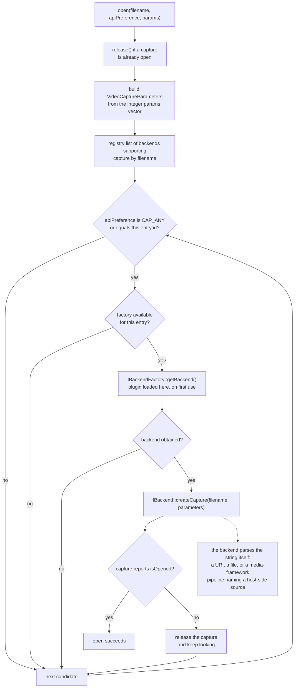
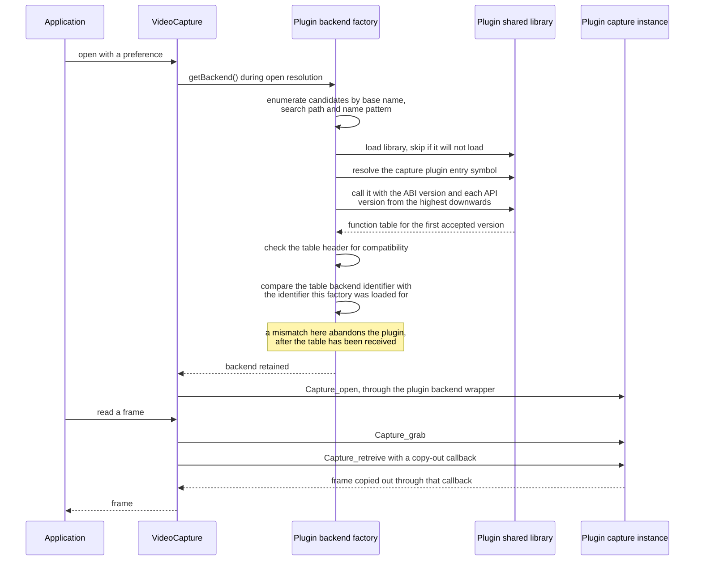

# 1. Video/Image Capture Primitives

VideoIO is the module a screen-capture-and-notetaking application would have to enter through, so
this section settles three questions: what contract `VideoCapture` and `VideoWriter` actually
expose, what set of backends that contract can resolve to, and whether any member of that set
targets screen content. Every locator in this document was read against branch `5.x` at commit
`0627765f01be7ea464846ea1e56bbf4e6d861bcf`, and each is checkable only against that revision.

The headline finding, stated before its evidence: **no backend in this tree targets a display,
screen, desktop, window or monitor** — the set is cameras, media frameworks, image sequences and
capture SDKs. That is not the same as saying screen frames cannot reach `VideoCapture`, and §1.5
sets out the two routes by which they can.

## 1.1 The capture contract

`VideoCapture` offers three open shapes across five overloads: by device index
[modules/videoio/include/opencv2/videoio.hpp:888,901], by filename or pipeline string
[modules/videoio/include/opencv2/videoio.hpp:864,877], and by a caller-supplied stream reader with
a typed integer parameter vector [modules/videoio/include/opencv2/videoio.hpp:914]. State is
queried with `isOpened` [modules/videoio/include/opencv2/videoio.hpp:921] and torn down with
`release` [modules/videoio/include/opencv2/videoio.hpp:930].

Frame acquisition is a two-step pull: `grab`
[modules/videoio/include/opencv2/videoio.hpp:951] then `retrieve`
[modules/videoio/include/opencv2/videoio.hpp:965], with `read`
[modules/videoio/include/opencv2/videoio.hpp:987] as the combined convenience. Nothing in this
surface delivers a frame to the application unasked; the application drives the loop.

Configuration is untyped, by integer property identifier
[modules/videoio/include/opencv2/videoio.hpp:131-211]. The knobs a capture-rate and resolution
tradeoff would be expressed against are declared there — frame width and height
[modules/videoio/include/opencv2/videoio.hpp:136-137], frame rate
[modules/videoio/include/opencv2/videoio.hpp:138] and buffer size
[modules/videoio/include/opencv2/videoio.hpp:172] — and the header assigns each a meaning, not a
value. Which of them a given backend honours is the backend's business; the enumeration establishes
only that the identifiers exist.

## 1.2 The writer contract

`class VideoWriter` is declared at
[modules/videoio/include/opencv2/videoio.hpp:1076] and its contract spans
[modules/videoio/include/opencv2/videoio.hpp:1072-1236]: constructors at
[modules/videoio/include/opencv2/videoio.hpp:1086,1114,1121,1128,1133], `open` at
[modules/videoio/include/opencv2/videoio.hpp:1150], `write` at
[modules/videoio/include/opencv2/videoio.hpp:1201], `release` at
[modules/videoio/include/opencv2/videoio.hpp:1177] and the four-character-code helper at
[modules/videoio/include/opencv2/videoio.hpp:1230]. Writer properties are a separate enumeration
[modules/videoio/include/opencv2/videoio.hpp:216-235].

For a notetaking application the writer is the retention path for a captured session as video.
Capture and writing share one VideoIO registry but not one backend set. Writer availability is
declared per registry entry as a capability bit, `MODE_WRITER`
[modules/videoio/src/videoio_registry.hpp:18], one of the four mode bits that mask defines
[modules/videoio/src/videoio_registry.hpp:15-20], and `VideoWriter` is available only through the
subset of entries that declares it — which is exactly the subset `getWriterBackends`
[modules/videoio/include/opencv2/videoio/registry.hpp:42] returns. In the built-in table the writer
bit is carried by, among others, the FFmpeg, GStreamer, Intel Media SDK, AVFoundation, Media
Foundation, image-sequence and MotionJPEG entries, while the DirectShow and Video4Linux entries
declare capture modes without it [modules/videoio/src/videoio_registry.cpp:66-193], so a backend
that can open a capture is not thereby a backend that can write one.

One writer property bears on correlation and is easy to misread: `VIDEOWRITER_PROP_PTS`
[modules/videoio/include/opencv2/videoio.hpp:230] is presentation metadata the caller supplies **to**
the writer when encapsulating externally encoded video. It is an input to encoding, not an
observation of when anything was captured.

## 1.3 The backend enumeration, and what it does not contain

`enum VideoCaptureAPIs` [modules/videoio/include/opencv2/videoio.hpp:91-122] declares 30
enumerators. Six of them are aliases of another value — `CAP_V4L2`, `CAP_FIREWARE`, `CAP_IEEE1394`,
`CAP_DC1394`, `CAP_CMU1394` and `CAP_REALSENSE`
[modules/videoio/include/opencv2/videoio.hpp:91-122] — leaving 24 distinct numeric values, of which
`CAP_ANY = 0` [modules/videoio/include/opencv2/videoio.hpp:92] is an auto-detection sentinel rather
than a backend. This tree therefore exposes **23 concrete backend API identifiers**.

Read one by one, each of the 23 names a camera family, a media framework, an image-sequence reader
or a capture SDK: operating-system camera stacks such as `CAP_V4L`
[modules/videoio/include/opencv2/videoio.hpp:93], `CAP_DSHOW`
[modules/videoio/include/opencv2/videoio.hpp:100], `CAP_MSMF`
[modules/videoio/include/opencv2/videoio.hpp:105] and `CAP_AVFOUNDATION`
[modules/videoio/include/opencv2/videoio.hpp:104]; media frameworks `CAP_GSTREAMER`
[modules/videoio/include/opencv2/videoio.hpp:113] and `CAP_FFMPEG`
[modules/videoio/include/opencv2/videoio.hpp:114]; file-based readers `CAP_IMAGES`
[modules/videoio/include/opencv2/videoio.hpp:115] and `CAP_OPENCV_MJPEG`
[modules/videoio/include/opencv2/videoio.hpp:117]; and machine-vision, depth and camera-vendor SDKs
through to `CAP_OBSENSOR` [modules/videoio/include/opencv2/videoio.hpp:121].

**Verdict: none of the 23 names a display, screen, desktop, window or monitor.** This rests on an
exhaustive reading of the enumeration itself — the structure that would have to carry such an
identifier for a screen backend to be selectable — and not on a keyword search, which could only
ever report the absence of the names it happened to look for.

## 1.4 Three structures that corroborate the reading

The registry table [modules/videoio/src/videoio_registry.cpp:66-193] gives every built-in entry a
capability mode composed from four bits — capture by index, capture by filename, capture by stream,
and writer — with `MODE_CAPTURE_ALL` as the declared shorthand for the first two
[modules/videoio/src/videoio_registry.hpp:20]. No entry carries anything else, because there is
nothing else to carry: the bitmask defines bits 0, 1, 2 and 4 and leaves bit 3 unused
[modules/videoio/src/videoio_registry.hpp:15-20], so no screen-oriented capability is reserved. That
is the shape of the contract; the code records no reason for it and none is inferred here.

The public registry declares five list queries — all backends, camera backends, stream backends,
stream-buffered backends and writer backends
[modules/videoio/include/opencv2/videoio/registry.hpp:30,33,36,39,42] — alongside a name lookup
[modules/videoio/include/opencv2/videoio/registry.hpp:27] and an availability test
[modules/videoio/include/opencv2/videoio/registry.hpp:45]. None of the five is screen-oriented. The
presence of an all-backends query strengthens the finding rather than weakening it: an application
can ask this tree for everything it has, and nothing in the answer is a screen source.

One search artefact must be discarded before it corrupts the Windows reading. The DXGI references in
this module are Direct3D 11 device-manager plumbing for hardware-accelerated **decode** — a
dynamically resolved DXGI device-manager symbol and its enable path
[modules/videoio/src/cap_msmf.cpp:54-70,1002-1013], and an adapter-description query against a
Direct3D 11 hardware device context [modules/videoio/src/cap_ffmpeg_hw.hpp:230-243]. Neither
duplicates a display output, and reading the token as evidence of a Windows screen-capture
capability would report a capability this tree does not have.

## 1.5 Two generic ingestion routes, and their conditions

The absence of a screen backend does not mean screen content cannot reach `VideoCapture`. Two
documented routes admit an externally produced frame source. This section is their single owner in
this dossier; each carries a condition without which the route does not work, and a route stated
without its condition would be a fabrication rather than a simplification.

### GStreamer, through a manual pipeline string

The `filename` parameter is documented to accept a "GStreamer pipeline string in gst-launch tool
format in case if GStreamer is used as backend"
[modules/videoio/include/opencv2/videoio.hpp:799-805], so this is part of the public parameter
contract rather than an incidental behaviour. When the argument is neither a valid URI nor an
existing file, the backend hands it to `gst_parse_launch` and marks the capture as a manual pipeline
[modules/videoio/src/cap_gstreamer.cpp:1409-1438].

**Condition: the pipeline is not arbitrary.** It must terminate in an appsink OpenCV can attach to,
named either `appsink0` — the default — or `opencvsink`
[modules/videoio/src/cap_gstreamer.cpp:1343]. The manual-pipeline branch searches the pipeline's
elements for such a name [modules/videoio/src/cap_gstreamer.cpp:1502], and where it finds none it
warns "cannot find appsink in manual pipeline" and fails
[modules/videoio/src/cap_gstreamer.cpp:1534]. For live sources the documentation directs the caller
to add the appsink `drop` parameter [modules/videoio/src/cap_gstreamer.cpp:1346], the module's own
statement of what a source that outruns the grabbing interval requires.

Any pipeline satisfying that condition and negotiating caps the backend accepts is admitted —
including one whose source element acquires the screen.

### FFmpeg, through an externally selected input format

Capture options are read from the environment variable `OPENCV_FFMPEG_CAPTURE_OPTIONS`
[modules/videoio/src/cap_ffmpeg_impl.hpp:1184] and parsed with the key-value separator `";"` and the
pair separator `"|"` [modules/videoio/src/cap_ffmpeg_impl.hpp:1197], so the grammar is
`key;value|key;value`. An `input_format` key is resolved through `av_find_input_format`
[modules/videoio/src/cap_ffmpeg_impl.hpp:1206-1210], which is the mechanism by which a demuxer can
be named from outside the library.

**Condition: device-oriented opening is build-conditional, and the route reaches only a demuxer.**
Opening by device index is compiled behind the guard `HAVE_FFMPEG_LIBAVDEVICE`
[modules/videoio/src/cap_ffmpeg_impl.hpp:1213,1218], where an `"f"` key overrides the per-platform
default before the device list is enumerated
[modules/videoio/src/cap_ffmpeg_impl.hpp:1219-1237]. The alternative arm of that guard is what runs
without libavdevice: it logs that "OpenCV should be configured with libavdevice to open a camera
device" and returns false [modules/videoio/src/cap_ffmpeg_impl.hpp:1245-1247]. And because the key
resolves through `av_find_input_format`, the route reaches a demuxer and nothing else — not an
arbitrary component of that library.

That guard is a compile-time condition rather than a switch an application can set: a build carries
either the libavdevice arm or the failure arm, which is what the two locators above establish.
Whether a given build carries it therefore follows from how that build was configured, and no
configure step was run against this checkout, so it is not determinable here. Which build control
settles the guard is not established by the sources this dossier cites, and no claim is made
about it.

### The accurate joint statement

No OpenCV source change is required to ingest screen frames: a host that can produce them can feed
them through either route today. But neither route is discoverable through the registry, neither
makes the screen a first-class source, and the two are not equal — the GStreamer route is the
stronger, because it is a documented parameter contract, whereas the FFmpeg route is mediated by an
environment variable and bounded by what `av_find_input_format` can resolve.

## 1.6 How a backend is resolved on open

The resolution path is what makes the previous two findings consistent: the library selects a
backend, and the backend interprets the caller's string itself. Opening by filename releases any
current capture, builds the parameter object, and takes the registry's list of backends that support
capture by filename [modules/videoio/src/cap.cpp:117-127]. It then walks that list, filtering by
`apiPreference` [modules/videoio/src/cap.cpp:131], skipping entries whose factory is unavailable
[modules/videoio/src/cap.cpp:133-137], obtaining the backend from its factory
[modules/videoio/src/cap.cpp:142] — which is where a plugin is loaded, on first use — creating the
capture [modules/videoio/src/cap.cpp:147] and keeping it only if it reports itself open
[modules/videoio/src/cap.cpp:148-157]. Where nothing opens, a specific preference is checked against
the built-in set and reported [modules/videoio/src/cap.cpp:207-234].

The conclusion the diagram carries, in case it is read as fenced text rather than rendered: the only
screen-awareness anywhere on this path is inside whatever the chosen backend makes of the string it
is handed. OpenCV resolves an identifier and a factory; it does not interpret the source. That is
precisely why §1.5's routes work without a screen backend existing, and equally why the screen is
not a first-class source — nothing in the resolution path can be asked for one.

## 1.7 Readiness notification

`VideoCapture::waitAny` [modules/videoio/include/opencv2/videoio.hpp:1035-1053] is the one readiness
API in this surface, documented for multi-camera environments. Its implementation requires every
stream to share a backend and dispatches to one backend only
[modules/videoio/src/cap.cpp:630-652]: V4L2 is handled
[modules/videoio/src/cap.cpp:644-646] and everything else raises `StsNotImplemented` with
"VideoCapture::waitAny() is supported by V4L backend only"
[modules/videoio/src/cap.cpp:652].

The scoped consequence: on a non-V4L backend an application cannot be told that a frame is ready and
must pull. The claim belongs to those backends and to the plugin interface examined in §6 — it is
not a property of VideoIO as a whole, since V4L2 does provide the notification.

## 1.8 Time: four adjacent properties and one precise negative

A notetaking timeline has to order frames against events, and four properties look as though they
supply the instant a frame was acquired. None does, and the differences are the finding.

| Property | What it is | Scope |
|---|---|---|
| `CAP_PROP_POS_MSEC` [modules/videoio/include/opencv2/videoio.hpp:133] | Current position within the media timeline, in milliseconds | Position, not an instant |
| `CAP_PROP_PTS` [modules/videoio/include/opencv2/videoio.hpp:205] | Read-only presentation timestamp of the most recently read frame, in the frame-rate time base | Genuine per-frame metadata; a media timestamp, FFmpeg back-end only |
| `CAP_PROP_STREAM_OPEN_TIME_USEC` [modules/videoio/include/opencv2/videoio.hpp:189] | Read-only time in microseconds since the Unix epoch when the **stream was opened** | A civil-time anchor for the session, not the frame; FFmpeg back-end only |
| `VIDEOWRITER_PROP_PTS` [modules/videoio/include/opencv2/videoio.hpp:230] | Presentation timestamp supplied to the writer for externally encoded video | Encoder-side input, carrying no acquisition time |

**The precise negative: there is no backend-independent per-frame host-clock acquisition instant.**
The nearest per-frame value, `CAP_PROP_PTS`, is a media presentation timestamp expressed in the
frame-rate time base and is declared for one back-end only
[modules/videoio/include/opencv2/videoio.hpp:205]; it is supplementary metadata about the media, not
an observation of when the host received a frame.

Obtaining an acquisition instant is therefore application work: the application reads its own clock
at the moment it retrieves each frame. The facility it reads is not provided by the in-scope
modules, and no facility outside them is examined or named here.

## 1.9 Timeouts, and where their values live

Two timeout identifiers are declared, both documented open-only and both documented as applicable to
the FFmpeg and GStreamer back-ends only
[modules/videoio/include/opencv2/videoio.hpp:187-188]. Those lines establish that the identifiers
exist and what they apply to; they set no value.

The values are set independently in each back-end. FFmpeg defines a 30-second open timeout and a
30-second read timeout [modules/videoio/src/cap_ffmpeg_impl.hpp:261-262] and assigns them during
initialisation [modules/videoio/src/cap_ffmpeg_impl.hpp:665-666]. GStreamer defines its own
30-second open and read timeouts [modules/videoio/src/cap_gstreamer.cpp:83-84] and applies them in
its member initialiser list [modules/videoio/src/cap_gstreamer.cpp:422-423]. For an interactive
capture session that default is long enough to be user-visible as a stall, which is a reason to set
both explicitly through the integer parameter vector the open overloads accept
[modules/videoio/include/opencv2/videoio.hpp:877,901] rather than to inherit them.

# 2. Frame Processing & Diffing

A capture-and-notetaking application needs to decide, frame by frame, whether anything changed
enough to be worth keeping, and then to describe where the change was. This section states which of
those primitives exist here and which do not.

**Verdict, before the evidence: a frame-to-frame change gate is assemblable but not provided.** The
tree supplies accumulation, correlation, thresholding, morphology, connected-component labelling and
contour extraction — everything needed to interpret a difference image — but no gate, and not the
element-wise operators from which a difference image is built.

## 2.1 The motion group

`imgproc` declares a motion-analysis and object-tracking group
[modules/imgproc/include/opencv2/imgproc.hpp:189] whose members occupy
[modules/imgproc/include/opencv2/imgproc.hpp:2663-2819]:

| Entry point | Locator | What it contributes to change detection |
|---|---|---|
| `accumulate` | [modules/imgproc/include/opencv2/imgproc.hpp:2683] | Running sum of frames, the basis of a mean-image reference |
| `accumulateSquare` | [modules/imgproc/include/opencv2/imgproc.hpp:2702] | Running sum of squares, the second moment of that reference |
| `accumulateProduct` | [modules/imgproc/include/opencv2/imgproc.hpp:2721] | Running cross-product of two frames |
| `accumulateWeighted` | [modules/imgproc/include/opencv2/imgproc.hpp:2742] | Exponentially weighted running average — a recency-biased reference frame |
| `phaseCorrelate` | [modules/imgproc/include/opencv2/imgproc.hpp:2783] | Translational shift between two frames, in the frequency domain |
| `phaseCorrelateIterative` | [modules/imgproc/include/opencv2/imgproc.hpp:2800] | The iterative variant of the same measurement |
| `createHanningWindow` | [modules/imgproc/include/opencv2/imgproc.hpp:2817] | The window function phase correlation expects on its inputs |

Read against the use case: the accumulators can maintain a reference image cheaply, and phase
correlation measures whole-frame translation — which on screen content is what a scroll looks like.
Neither answers the gate's question, which is how much of this frame differs from the last.

## 2.2 Interpreting a difference image

Given a difference image, everything needed to turn it into regions is declared in this module's
installed public header, and each entry earns its place in the chain:

| Entry point | Locator | Role once a difference image exists |
|---|---|---|
| `GaussianBlur` | [modules/imgproc/include/opencv2/imgproc.hpp:1276] | Suppresses single-pixel noise before a retain-or-discard decision is taken |
| `threshold` | [modules/imgproc/include/opencv2/imgproc.hpp:2849] | Binarises the difference into changed and unchanged pixels |
| `thresholdWithMask` | [modules/imgproc/include/opencv2/imgproc.hpp:2869] | The same, restricted by a mask to a region of interest |
| `morphologyEx` | [modules/imgproc/include/opencv2/imgproc.hpp:2051] | Closes gaps inside a changed region and drops isolated specks |
| `connectedComponents` | [modules/imgproc/include/opencv2/imgproc.hpp:3704] | Labels each changed region |
| `connectedComponentsWithStats` | [modules/imgproc/include/opencv2/imgproc.hpp:3746] | Labels them and returns bounding boxes and areas — the geometry a segment record needs |
| `findContours` | [modules/imgproc/include/opencv2/imgproc.hpp:3782] | Returns region outlines where a box is too coarse |
| `Canny` | [modules/imgproc/include/opencv2/imgproc.hpp:1639] | Edge structure, where change is better described by edges than by area |
| `resize` | [modules/imgproc/include/opencv2/imgproc.hpp:2096] | Runs the chain at a reduced scale, trading per-frame cost against spatial precision |
| `cvtColor` | [modules/imgproc/include/opencv2/imgproc.hpp:3526] | Reaches a single-channel representation from a screen frame that may present three or four channels — nothing in this tree fixes the count, which follows from the source element or demuxer and the caps negotiated on open (§1.5) — so the conversion code is selected from the format actually observed rather than assuming an alpha channel [modules/imgproc/include/opencv2/imgproc.hpp:3518,3523] |
| `matchTemplate` | [modules/imgproc/include/opencv2/imgproc.hpp:3663] | Locates a known pattern rather than an arbitrary change |

## 2.3 Rendering annotations onto a frame

The drawing group [modules/imgproc/include/opencv2/imgproc.hpp:130] gathers its members at
[modules/imgproc/include/opencv2/imgproc.hpp:3866] and supplies what composites an annotation into
the frame before it is displayed or written — in the order named, `line`, `rectangle` in two
overloads, `circle`, `polylines`, `putText`, and `getTextSize` for laying that text out
[modules/imgproc/include/opencv2/imgproc.hpp:3888,3941,3950,3970,4104,4233,4283]. This is
composition into the frame buffer, not a document model; §3.9 and the functional specification
separate the two.

## 2.4 What is absent

Three things a change gate needs are **not provided by the in-scope modules**, and each is stated as
an absence rather than closed with a plausible mechanism:

- **Element-wise absolute difference, element-wise comparison and non-zero counting.** These are the
  three operations that turn two frames into a difference image, a binary mask and a scalar score.
  No declaration for any of them appears in the motion group
  [modules/imgproc/include/opencv2/imgproc.hpp:2663-2819] or elsewhere in this module's public
  header. Saying so is the point: a reader who assumes `imgproc` supplies them will not find them
  here.
- **Statistical background subtraction.** No background-model class or entry point is declared in
  this module's public header. The accumulators of §2.1 are arithmetic over frames, not a
  foreground-background model.
- **Optical flow.** No dense or sparse flow entry point is declared here. Phase correlation
  [modules/imgproc/include/opencv2/imgproc.hpp:2783] measures a single global translation between
  two frames and is not a per-pixel motion field.

## 2.5 Verdict

Change detection over captured frames is application code composed from library primitives. The
library contributes the expensive, well-tested second half — noise suppression, binarisation,
morphological cleanup, labelling and region statistics — and contributes neither the differencing
step at the front nor the retain-or-discard decision at the end. An application must therefore own
the score's definition and its threshold, because nothing in this tree defines either.

# 3. Windowing/Display Layer

**Verdict, stated first: HighGUI is viable as a review and playback surface for this use case, and
is not a substitute for a UI framework.** Continuous frame display, window management, a pointer
callback, region selection and trackbar controls are all public API, which is enough for preview,
scrubbing and simple parameter control. Multi-panel layout, docking, menus and text entry are absent
from that API. And every interaction claim below is conditional on the active backend, for the reason
in §3.5.

## 3.1 What the module says it is for

The module's own description states that while OpenCV can be used within functionally rich UI
frameworks or without any UI at all, sometimes it is required to try functionality quickly and
visualise the results, and that this is what HighGUI has been designed for
[modules/highgui/include/opencv2/highgui.hpp:55-66]. That is a statement of purpose, not a reason
for any design decision, and it is used here only for what it establishes: the boundary the module
claims for itself. It also enumerates what it provides — windows that display images and remember
their content, trackbars, simple mouse events and keyboard commands
[modules/highgui/include/opencv2/highgui.hpp:62-66].

## 3.2 Display, including at video rates

`imshow` [modules/highgui/include/opencv2/highgui.hpp:345] presents a frame in a named window
created by `namedWindow` [modules/highgui/include/opencv2/highgui.hpp:239] and destroyed by
`destroyWindow` [modules/highgui/include/opencv2/highgui.hpp:247]. Frame-by-frame video display is
explicitly supported by the documentation rather than merely possible: the header records that
"waitKey(25) will display a frame and wait approximately 25 ms for a key press (suitable for
displaying a video frame-by-frame)"
[modules/highgui/include/opencv2/highgui.hpp:332-333]. Live preview of a capture session is
therefore within the documented use of this API.

## 3.3 The public interaction surface

Every entry below is declared in the module's installed public header:

| Capability | Entry points | Locator |
|---|---|---|
| Window sizing | `resizeWindow`, two overloads | [modules/highgui/include/opencv2/highgui.hpp:356,362] |
| Window title | `setWindowTitle` | [modules/highgui/include/opencv2/highgui.hpp:390] |
| Window state | `getWindowProperty` | [modules/highgui/include/opencv2/highgui.hpp:403] |
| Keyboard input and event processing | `waitKeyEx`, `waitKey`, `pollKey` | [modules/highgui/include/opencv2/highgui.hpp:271,291,305] |
| Pointer events | `setMouseCallback` | [modules/highgui/include/opencv2/highgui.hpp:427] |
| Rectangle selection | `selectROI`, two overloads | [modules/highgui/include/opencv2/highgui.hpp:463,467] |
| Trackbar controls | `createTrackbar`, `getTrackbarPos`, `setTrackbarPos`, `setTrackbarMax`, `setTrackbarMin` | [modules/highgui/include/opencv2/highgui.hpp:517,532,545,558,571] |
| Buttons, Qt-only | `createButton` | [modules/highgui/include/opencv2/highgui.hpp:808-810] |
| Active backend probe | `currentUIFramework` | [modules/highgui/include/opencv2/highgui.hpp:261] |

Mapped onto the use case: `selectROI` is a ready-made drag-out-a-rectangle interaction for marking a
region of a captured frame; the trackbar family is what a timeline scrubber over a frame index would
be built from, using the minimum and maximum setters to bound it; and `currentUIFramework`
[modules/highgui/include/opencv2/highgui.hpp:261] is the public means of discovering, at runtime,
which of these will actually work.

## 3.4 Runtime backend membership

Runtime membership is a different thing from the public surface, and the list that defines it
[modules/highgui/src/registry.impl.hpp:27-66] is narrower than its name suggests: it is the
membership of the **backend-compatible** backends, the implementations reached through the module's
internal backend interface, registered either statically or as dynamic plugin entries. The
identifiers are `"GTK"`, `"GTK3"` and `"GTK2"` — statically registered where GTK is available
[modules/highgui/src/registry.impl.hpp:33,35,37] and otherwise declared as dynamic plugin entries
[modules/highgui/src/registry.impl.hpp:42-44]; `"FB"`, the framebuffer backend of §3.8
[modules/highgui/src/registry.impl.hpp:48]; `"QT"` [modules/highgui/src/registry.impl.hpp:53,55];
and `"WIN32"` on Windows [modules/highgui/src/registry.impl.hpp:61,63]. Neither Wayland nor Cocoa
appears in this list.

Two precisions about that list matter. First, the `"QT"` entry is disabled: both of its registration
forms sit behind `#if 0  // TODO` [modules/highgui/src/registry.impl.hpp:51]. The marker shows work
started or considered and left incomplete; **the code records no reason**, and none is inferred here.
Second, `currentUIFramework` returns the active backend's registry name where a backend is present
[modules/highgui/src/window.cpp:1096-1105], and otherwise falls through a fixed chain of
compile-time built-in names — returning `"QT"`, `"COCOA"` or `"WAYLAND"` according to what the build
has, and an empty string where none matches [modules/highgui/src/window.cpp:1108-1120]. So two of
the names this function can return are not members of the backend-compatible list, and an
application that treats its result as an index into that list will not always find a match. This is
a structural fact about the two mechanisms; the code states no intent about it.

What those two names are is worth stating precisely, because absence from the list is easily read as
absence from the build. They are **legacy compile-time built-ins**: real display implementations
that the module's build selects through a single if/elseif chain, each arm setting a build label and
adding the matching compile definition — Wayland [modules/highgui/CMakeLists.txt:55-57], Qt with its
major version [modules/highgui/CMakeLists.txt:80-82] and Cocoa
[modules/highgui/CMakeLists.txt:145-147]. The installed header states the same set from the
application side, describing the returned name as one that could be COCOA, GTK2/3, QT, WAYLAND or
WIN32, with an empty string where no backend is available
[modules/highgui/include/opencv2/highgui.hpp:256-261]. So absence from the backend-compatible list
means one narrow thing — that such a name cannot be selected through the internal backend interface
— and it does not mean the implementation is absent from a build that has it, nor that the public
probe cannot report it.

### The Wayland conditions

Wayland is the display backend whose conditions matter most to a Linux deployment target, and they
are heavier than any other display option's. `WITH_WAYLAND` is declared OFF, is visible only on
non-Apple, non-Android Unix, and carries a verification clause requiring `HAVE_WAYLAND`
[CMakeLists.txt:235-237], so requesting the option is not the same as having the capability.
Detection requires four separate components — wayland-client, wayland-cursor, xkbcommon, and
wayland-protocols at version 1.13 or newer — and locates `wayland-scanner` as a required host
program, with `HAVE_WAYLAND` set only where all four components are found
[modules/highgui/cmake/detect_wayland.cmake:12-34]. Where the capability is available the build
summary prints it as "(Experimental) YES" [CMakeLists.txt:1396]; that is the project's own statement
of status and it explains nothing about the capability boundary.

The backend is output-side by construction, and this is the finding a screen-capture reader must not
misread: the build branch that enables it generates exactly one protocol, `xdg-shell`, compiles the
window backend source, and links the client, cursor and keyboard-handling libraries, with a graphics
library added only where one was separately detected [modules/highgui/CMakeLists.txt:55-79]. No
screen-copy protocol, no image-capture protocol, no portal client and no media transport is
generated or linked there. What the branch builds is a display target for OpenCV's own windows, and
nothing in it reads a display.

The same build branch adds the `HAVE_WAYLAND` compile definition
[modules/highgui/CMakeLists.txt:57] that the probe's fallback arm tests
[modules/highgui/src/window.cpp:1116-1117], and that is the link which makes the runtime consequence
checkable: a build in which all four components were found reports `"WAYLAND"` from
`currentUIFramework` even though no such entry exists in the backend-compatible list.

## 3.5 A public declaration does not imply uniform backend support

This is the most consequential HighGUI finding for the use case. The framebuffer backend implements
display and keyboard handling, and for a set of other operations it logs that they are not supported
and does nothing: `setMouseCallback`
[modules/highgui/src/window_framebuffer.cpp:322-324], `createTrackbar`
[modules/highgui/src/window_framebuffer.cpp:327-333], `findTrackbar`
[modules/highgui/src/window_framebuffer.cpp:337-341], `getProperty` and `setProperty`
[modules/highgui/src/window_framebuffer.cpp:266-276] and `setTitle`
[modules/highgui/src/window_framebuffer.cpp:317-319]. The registration call succeeds; the callback
is never invoked, and the trackbar factory returns nothing.

**Every verdict in this section touching pointer input, trackbars, window properties or window
titles is therefore conditional on the active backend.** The condition is checkable at runtime
through the public `currentUIFramework`
[modules/highgui/include/opencv2/highgui.hpp:261], and an application that depends on any of these
must query it and degrade explicitly rather than assume the declaration implies the behaviour.

## 3.6 The event pump, and what the source says about threads

The event-processing requirement is the header's own: `waitKey` and `pollKey` "are the only methods
in HighGUI that can fetch and handle GUI events, so one of them needs to be called periodically for
normal event processing unless HighGUI is used within an environment that takes care of event
processing", and the function works only where at least one HighGUI window exists and is active
[modules/highgui/include/opencv2/highgui.hpp:282-287]. That is the portable requirement, and it
shapes any capture loop that also displays: the loop must return to the pump.

`startWindowThread` [modules/highgui/include/opencv2/highgui.hpp:264] looks like an escape from that
requirement and is not a portable one. On a GTK build it starts a GTK event thread
[modules/highgui/src/window_gtk.cpp:647-664]; on any build without GTK it returns 0 and does nothing
[modules/highgui/src/window.cpp:902-908]. It is a backend-specific facility.

Nothing in the public surface establishes a cross-platform thread-affinity rule — no declaration
states which thread owns a window or on which thread a callback runs. **This document therefore
records that no portable thread-affinity contract is exposed**, and states thread behaviour only
where a backend establishes it, naming that backend, as with the GTK event thread above. A reader
expecting a general rule should read its absence as an open question about this tree rather than as a
guarantee in either direction.

## 3.7 Input is window-scoped

The mouse event enumeration documents its first member as indicating that the pointer "has moved
over the window" [modules/highgui/include/opencv2/highgui.hpp:129], and `setMouseCallback` binds a
callback to a named window [modules/highgui/include/opencv2/highgui.hpp:427]. Delivery is scoped to
a window OpenCV owns. There is no system-wide or background input hook in this surface, so the
events a notetaking application most needs to correlate — those the user directs at other
applications — cannot be observed here at all.

## 3.8 The framebuffer backend reads a display surface, and what that is worth

This is the one place in the in-scope modules where OpenCV reads pixels **out of** a display
surface, and it is the easiest finding here to overstate, so it is stated at exactly the width the
code proves.

The backend has three modes, selected in its constructor from a mode string, with a physical
framebuffer as the member-initialised default
[modules/highgui/src/window_framebuffer.cpp:572-592]: a physical framebuffer mode, an emulation
mode, and a mode backed by a virtual framebuffer file in the X window-dump format
[modules/highgui/src/window_framebuffer.cpp:595-602]. Two of the three read a surface, by separate
paths that must not be conflated:

- The physical path opens the framebuffer device
  [modules/highgui/src/window_framebuffer.cpp:366] and maps it
  [modules/highgui/src/window_framebuffer.cpp:415].
- The virtual path opens the dump file for reading and writing
  [modules/highgui/src/window_framebuffer.cpp:426], parses its header for geometry and pixel layout
  [modules/highgui/src/window_framebuffer.cpp:442-502] and maps it
  [modules/highgui/src/window_framebuffer.cpp:499].

What bounds the finding is the purpose the code puts the read to. In either mode the backend copies
the mapped contents row by row into a four-channel 8-bit matrix
[modules/highgui/src/window_framebuffer.cpp:626-634] and its destructor copies them back
[modules/highgui/src/window_framebuffer.cpp:637-652] — it reads the surface once, at construction,
so that it can **restore** whatever occupied it before OpenCV drew a window over it, and once in
reverse at destruction. It is not a capture loop, it is not reachable through `VideoCapture`, and no
public API exposes it as a source of frames.

Both build gates are declared off by default: the framebuffer support option
[CMakeLists.txt:231] and the virtual-framebuffer option [CMakeLists.txt:233]. Neither path is
present in a default build.

One data point from it is genuinely useful to the feasibility question and is claimed no more widely
than that: the surface arrives as a four-channel 8-bit matrix
[modules/highgui/src/window_framebuffer.cpp:626], so a screen-shaped four-channel buffer converts
into the matrix type the rest of the library consumes without an intermediate representation. What
the code establishes about the content is only that the mapped region held display data at the
moment of the copy; whether such a file is continuously updated by anything is a property of the
producer, not of this code, and is not asserted here.

## 3.9 Verdict

For the use case's review and playback needs HighGUI is sufficient: continuous display of captured
frames is documented [modules/highgui/include/opencv2/highgui.hpp:332-333], a scrubber is
expressible over the trackbar family
[modules/highgui/include/opencv2/highgui.hpp:517,532,545,558,571], region marking is a single call
[modules/highgui/include/opencv2/highgui.hpp:463], and annotations are composited with the drawing
primitives of §2.3 before display. Each of those interaction claims holds only on a backend that
implements the operation, determined at runtime through `currentUIFramework`
[modules/highgui/include/opencv2/highgui.hpp:261].

For the rest of a notetaking interface it is not sufficient, and the module's stated purpose (§3.1)
is the frame for saying so rather than a reason to be quoted as one. Multi-panel layout, docking,
menus and free text entry have no declaration in this header; the only button facility is Qt-only
[modules/highgui/include/opencv2/highgui.hpp:808-810]; and persistent, editable annotation state has
no representation in the module at all, since the drawing primitives write pixels and keep no
model. A production notetaking interface needs a UI framework, with HighGUI serving preview and
simple controls.

One search artefact to discard here, as in §1.4: the two block-transfer call sites in the Windows
backend copy pixels OpenCV already owns. One copies a window's own contents into a memory device
context for the clipboard [modules/highgui/src/window_w32.cpp:1787] and the other blits OpenCV's
image onto the paint device context
[modules/highgui/src/window_w32.cpp:1920]. Both run in the output direction; neither reads the
desktop.

# 4. Existing Text/OCR Support

**Verdict, stated first: this build includes text-recognition machinery and no text-recognition
capability.** The detection and recognition wrappers are declared and complete as interfaces; the
model assets they require are absent from the in-scope source domain, and every verdict below holds
only where the caller supplies either a network or model and configuration paths, plus a vocabulary
for recognition. Reading text off a captured screen is therefore an external dependency, and §4.5
names it concretely rather than leaving it as a gesture.

## 4.1 What the text wrappers provide

Recognition is `TextRecognitionModel`
[modules/dnn/include/opencv2/dnn/dnn.hpp:1827], whose decode type is selected by a setter documented
for `"CTC-greedy"` and `"CTC-prefix-beam-search"`
[modules/dnn/include/opencv2/dnn/dnn.hpp:1857], with beam-search options
[modules/dnn/include/opencv2/dnn/dnn.hpp:1873], the character vocabulary
[modules/dnn/include/opencv2/dnn/dnn.hpp:1880], and inference either over a whole frame
[modules/dnn/include/opencv2/dnn/dnn.hpp:1895] or over a list of regions
[modules/dnn/include/opencv2/dnn/dnn.hpp:1904]. The documentation states that "For
TextRecognitionModel, CRNN-CTC is supported"
[modules/dnn/include/opencv2/dnn/dnn.hpp:1825], which fixes the model family the wrapper is written
for.

Detection is `TextDetectionModel` [modules/dnn/include/opencv2/dnn/dnn.hpp:1910], whose `detect`
returns quadrangles with confidences [modules/dnn/include/opencv2/dnn/dnn.hpp:1937] or geometry
alone [modules/dnn/include/opencv2/dnn/dnn.hpp:1945], alongside rotated-rectangle variants
[modules/dnn/include/opencv2/dnn/dnn.hpp:1963,1971]. Two concrete detector subclasses follow:

| Detector | Locator | Tuning knobs, in the order named |
|---|---|---|
| `TextDetectionModel_EAST` | [modules/dnn/include/opencv2/dnn/dnn.hpp:1983] | Confidence threshold and non-maximum-suppression threshold [modules/dnn/include/opencv2/dnn/dnn.hpp:2010,2023] |
| `TextDetectionModel_DB` | [modules/dnn/include/opencv2/dnn/dnn.hpp:2044] | Binary threshold, polygon threshold, unclip ratio, candidate cap [modules/dnn/include/opencv2/dnn/dnn.hpp:2066,2069,2072,2075] |

Mapped onto the use case, that is a complete two-stage pipeline shape — locate text regions in a
captured frame, then read each region — with the tuning knobs exposed as typed setters rather than
untyped properties.

## 4.2 Two precisions that decide the verdict

**Construction.** Each wrapper is constructible either from a caller-supplied network or from model
and configuration paths: recognition at
[modules/dnn/include/opencv2/dnn/dnn.hpp:1838] and
[modules/dnn/include/opencv2/dnn/dnn.hpp:1847], the EAST detector at
[modules/dnn/include/opencv2/dnn/dnn.hpp:1993] and
[modules/dnn/include/opencv2/dnn/dnn.hpp:2002], and the DB detector at
[modules/dnn/include/opencv2/dnn/dnn.hpp:2054] and
[modules/dnn/include/opencv2/dnn/dnn.hpp:2063]. Both forms require the caller to have obtained
weights. Recognition additionally requires a vocabulary through
[modules/dnn/include/opencv2/dnn/dnn.hpp:1880], so a recogniser with weights but no character set is
not usable.

**The confidence surfaces differ, and the asymmetry matters to a notetaking application.** Detection
yields geometry accompanied by detection confidences
[modules/dnn/include/opencv2/dnn/dnn.hpp:1933-1940]. Recognition returns strings and nothing else —
a single string for a frame [modules/dnn/include/opencv2/dnn/dnn.hpp:1895] or one string per region
[modules/dnn/include/opencv2/dnn/dnn.hpp:1904] — so there is no per-string recognition confidence
in this API. An application that wants to mark uncertain text as uncertain cannot get that signal
from this surface.

## 4.3 Deprecation, at its true scope

Four default constructors carry a deprecation marker: recognition at
[modules/dnn/include/opencv2/dnn/dnn.hpp:1830], the detection base at
[modules/dnn/include/opencv2/dnn/dnn.hpp:1913], the EAST detector at
[modules/dnn/include/opencv2/dnn/dnn.hpp:1986] and the DB detector at
[modules/dnn/include/opencv2/dnn/dnn.hpp:2047]. Each records a reason: the constructor is to be
avoided in C++ code and will be moved to protected, needing the language bindings fixed first. This
is the one kind of evidence in the surveyed set from which motive may be attributed, because the
motive is written down.

Two limits on the marker. It attaches to the default constructors alone — the classes themselves and
the constructors of §4.2 carry no such marker — so a reader must not extend it to the recognition or
detection surface. And it is not specific to the text models: markers of the same kind, citing the
same binding issue, sit on the default constructors of other high-level model classes in this header
[modules/dnn/include/opencv2/dnn/dnn.hpp:1544,1659,1789] — seven such declarations in all. The
recorded reason therefore concerns the language bindings and says nothing about the maturity of text
support in particular.

## 4.4 What is absent, and how widely the claim is made

No OCR asset exists in the in-scope source domain: no weights, no detector or recogniser
configuration, and no vocabulary file under the authorised modules. There is no text module
directory in this tree, no reference to a third-party OCR engine anywhere in the in-scope headers,
and no build option enabling one — a search for a Tesseract build option across every
`CMakeLists.txt` and `*.cmake` file in the repository returns nothing, and no such option appears in
the option block that declares the module's other dependencies [CMakeLists.txt:219-329].

The claim is deliberately bounded to the authorised modules and to build options. It is **not** a
claim that the repository contains no character-list file anywhere; files of that kind exist
elsewhere in the tree, outside this analysis domain, and are neither examined nor cited here. What
follows for the application is the same either way: the wrappers of §4.1 will not run until an asset
is supplied to them.

## 4.5 The external dependency, named

Two routes exist, and their identities are what "external dependency" means here.

**Route A — in-library, asset-supplied.** Three artefacts, no new library: a detector matching one of
the two declared subclasses, that is an EAST-family or DB-family model
[modules/dnn/include/opencv2/dnn/dnn.hpp:1983,2044]; a CRNN-CTC recogniser, which is the family the
recognition wrapper documents [modules/dnn/include/opencv2/dnn/dnn.hpp:1825]; and a character
vocabulary supplied through [modules/dnn/include/opencv2/dnn/dnn.hpp:1880] with a decode type of
`"CTC-greedy"` or `"CTC-prefix-beam-search"`
[modules/dnn/include/opencv2/dnn/dnn.hpp:1857]. Three consequences follow and belong in a build plan
rather than in this analysis: each artefact needs a provenance and licence record, since model
licences vary independently of the library's; packaging must place the files where the application
finds them at run time; and recognition accuracy is a property of the chosen weights, so it can only
be established against a labelled sample of the actual screen content.

**Route B — an external engine.** A dedicated OCR engine with the library supplying preprocessing
only; the canonical instance is `libtesseract` together with its per-language `tessdata` language
data, which is two artefacts of different kinds — a native library the application links or loads,
and language data that must be packaged and present at run time for each language to be recognised.
Nothing in this tree provides or gates either: no reference to such an engine appears in the
in-scope headers and there is no build option for a text-recognition engine anywhere in the build
configuration, as §4.4 establishes, so the engine and its data are wholly the application's to
obtain and integrate. The tradeoff against Route A is a larger licensing, packaging and
build-integration burden, with the provenance and licence of both engine and language data recorded
as Route A's artefacts require, offset by not having to source and validate model weights.

**The recorded decision: prefer Route A unless the task requires full-page layout analysis or a
breadth of languages a single-line CRNN-CTC model cannot cover.** The comparison axes are
recognition scope, asset licensing, packaging weight and validation cost. No artefact is selected,
downloaded or evaluated by this analysis.

## 4.6 Verdict

Restated with its condition attached: text recognition is available to this application only where
the caller supplies a detector and a recogniser — as a constructed network or as model and
configuration paths — plus a vocabulary for recognition; and no such asset exists in the in-scope
source domain. The machinery is present, the capability is not, and the external dependency is
named: either the three artefacts of Route A — a detector model, a CRNN-CTC recogniser model and a
character vocabulary — or, on Route B, `libtesseract` with its per-language `tessdata` data.

# 5. DNN/Inference Hooks

**Verdict, stated first: `dnn` could classify a captured region today, given a model.** The path
from a frame to a prediction is complete and public. Two claims about user *actions* have to be kept
apart, because collapsing them yields a false negative. Pixels cannot **directly observe** an
operating-system input event: a click is a click because the event stream says so, and a difference
image shows only that pixels changed near a location. A supplied model **can** infer a visual action
class from pixels — the classification wrapper [modules/dnn/include/opencv2/dnn/dnn.hpp:1656] and
its `classify` call [modules/dnn/include/opencv2/dnn/dnn.hpp:1697,1700] are declared and public —
but that is the optional learned route, and it requires an enumerated action taxonomy, a model
trained against it and labelled screen recordings, none of which exists in this tree. §5.4 keeps the
routes separate and records those prerequisites rather than assuming them away.

## 5.1 The inference contract

Execution targets are enumerated as backends
[modules/dnn/include/opencv2/dnn/dnn.hpp:71] and devices
[modules/dnn/include/opencv2/dnn/dnn.hpp:95], with the engine selection a third enumeration
[modules/dnn/include/opencv2/dnn/dnn.hpp:1104]. `class Net`
[modules/dnn/include/opencv2/dnn/dnn.hpp:566] is the unit of execution, taking input names
[modules/dnn/include/opencv2/dnn/dnn.hpp:714], an input shape
[modules/dnn/include/opencv2/dnn/dnn.hpp:718] and the input blob
[modules/dnn/include/opencv2/dnn/dnn.hpp:834], and running a forward pass
[modules/dnn/include/opencv2/dnn/dnn.hpp:725].

Four readers are assessed here, covering the formats an externally trained model is likely to arrive
in, each declared once for a path and once for an in-memory buffer:

| Format | Locator |
|---|---|
| TensorFlow | [modules/dnn/include/opencv2/dnn/dnn.hpp:1121,1134] |
| TensorFlow Lite | [modules/dnn/include/opencv2/dnn/dnn.hpp:1161,1169] |
| ONNX | [modules/dnn/include/opencv2/dnn/dnn.hpp:1261,1281] |
| Format-detecting reader | [modules/dnn/include/opencv2/dnn/dnn.hpp:1201,1217] |

Those four are the readers this survey assesses, and they are not the only route by which a model
enters the library: the same header additionally declares Intel Model-Optimizer readers in path,
vector-buffer and raw-pointer-buffer forms
[modules/dnn/include/opencv2/dnn/dnn.hpp:1229,1239,1251], and a network may instead be constructed
empty and populated layer by layer
[modules/dnn/include/opencv2/dnn/dnn.hpp:566,570,632-643]. Neither route alters the finding of §4.4
and §5.3: the routes are declared here, the model is not.

Preprocessing from an image to a blob is `blobFromImage`
[modules/dnn/include/opencv2/dnn/dnn.hpp:1308], `blobFromImages`
[modules/dnn/include/opencv2/dnn/dnn.hpp:1341] for a batch, and a parameterised form in two
overloads [modules/dnn/include/opencv2/dnn/dnn.hpp:1418,1421].

The buffer-taking overloads matter more here than they might elsewhere: a screen frame is produced
in memory, and a model can be loaded from memory too, so nothing on this path requires a file to be
written between capture and inference.

## 5.2 The high-level wrappers

Two wrappers turn that contract into a single call over a frame or a region:
`ClassificationModel` [modules/dnn/include/opencv2/dnn/dnn.hpp:1656], whose `classify` yields a
class identifier and a confidence [modules/dnn/include/opencv2/dnn/dnn.hpp:1697,1700]; and
`DetectionModel` [modules/dnn/include/opencv2/dnn/dnn.hpp:1772], whose `detect`
[modules/dnn/include/opencv2/dnn/dnn.hpp:1814-1816] yields class identifiers, confidences and boxes
with confidence and non-maximum-suppression thresholds as parameters. Both are the same shape of
facility as the text wrappers in §4 and carry the same construction condition — from model and
configuration paths or from a caller-supplied network
[modules/dnn/include/opencv2/dnn/dnn.hpp:1668,1674] — so in both cases the caller supplies the
model.

## 5.3 What this means for classifying captured content

A change-detected region from §2 is an ordinary matrix, and once it is in hand three of the four
steps that carry it to a prediction are within the public API cited above: preprocess it into a blob
[modules/dnn/include/opencv2/dnn/dnn.hpp:1308], bind that blob as the network's input
[modules/dnn/include/opencv2/dnn/dnn.hpp:834], and run the forward pass whose return value is the
prediction to be read [modules/dnn/include/opencv2/dnn/dnn.hpp:725] — or, collapsed into one call,
the classification wrapper of §5.2 [modules/dnn/include/opencv2/dnn/dnn.hpp:1656,1697,1700].

The remaining step, obtaining the region's pixels as the matrix those calls consume, is **caller
preprocessing**, and the negative here has to be stated at its true width. The cited preprocessing
entry points do crop, but only as a fixed centre crop about the resized frame's own geometry:
`blobFromImage` takes a `crop` flag documented to resize the input until one side matches the
requested spatial size and then crop from the centre
[modules/dnn/include/opencv2/dnn/dnn.hpp:1298-1302,1308], and the parameterised path exposes the
same choice as a padding mode, `DNN_PMODE_CROP_CENTER` alongside `DNN_PMODE_LETTERBOX`
[modules/dnn/include/opencv2/dnn/dnn.hpp:1360-1364], carried on `Image2BlobParams::paddingmode`
[modules/dnn/include/opencv2/dnn/dnn.hpp:1391] and consumed by `blobFromImageWithParams`
[modules/dnn/include/opencv2/dnn/dnn.hpp:1418,1421]. What none of them does is select an arbitrary
changed region and extract it: the crop they offer is positioned by the input frame's own centre,
not by a region a change gate identified. Within the in-scope modules the patch-extraction facility
is `getRectSubPix` [modules/imgproc/include/opencv2/imgproc.hpp:2517], which copies a patch of a
given size about a given centre and interpolates at non-integer coordinates; general
region-of-interest addressing on a matrix is not provided by the in-scope modules. What is a solved
integration problem in this tree is therefore the cited preprocess, bind-and-forward and read chain,
not the selection and extraction of the changed region that precedes it — and it is on that chain
that classifying what a captured region *is* (a dialog, a code editor, a video player, a particular
application window) rests.

What that classification requires beyond the tree is a model, and for that model a label set that
means something to the notetaking use case. Neither exists here: no bundled weights, and no taxonomy
of screen content or of user actions is declared anywhere in the in-scope modules. Inference
machinery is not inference capability, exactly as in §4.

## 5.4 Actions: three routes, kept separate

Inferring a click or a keystroke from visual change geometry cannot represent it. A click is an
event with a button, a position and an instant; a difference image shows only that pixels changed
near a location. The events themselves are what the application is required to capture and
correlate, so the primary route is not an inference route at all:

- **Directly observed actions.** These come from a correlated operating-system input-event stream: a
  click is a click because the event stream says so. This route requires no model. Its input is
  external event capture — not available from the in-scope modules, whose input delivery is scoped
  to a window OpenCV owns (§3.7) — and it depends entirely on the correlation contract the
  functional specification defines.
- **Deterministic aggregation.** Higher-level actions are composed from those events together with
  the segment geometry and duration that §2's primitives yield. This route requires no model and no
  training data, and its decisions are inspectable because they are rules.
- **Learned visual classification.** Optional and deferred. Its prerequisites are recorded rather
  than assumed away: an enumerated action taxonomy, a trained model for it, and labelled screen
  recordings to train and evaluate against. None of the three exists in this tree, and this document
  records that state rather than describing how the gap might be closed.

# 6. Plugin/HAL Extensibility

If a screen source is ever to become a first-class OpenCV capture source, the plugin ABI is the
mechanism through which it would be added. This section presents that ABI, the constraints the
loader imposes on top of it, what its discovery controls decide for a deployment that installs
plugins, and the resulting three-part verdict — which turns on distinguishing a first-class backend
from a host-side adapter, two things easily conflated.

## 6.1 The VideoIO capture plugin ABI

The capture ABI declares its API version as 2
[modules/videoio/src/plugin_capture_api.hpp:16] and its binary-interface version as 1
[modules/videoio/src/plugin_capture_api.hpp:22], with the header stating the compatibility rules
each governs [modules/videoio/src/plugin_capture_api.hpp:14-22]. It is private and non-installed:
the whole interface is declared in a module-internal header
[modules/videoio/src/plugin_capture_api.hpp:41] under the module's source tree rather than in its
installed include tree, so none of it is application API and none of it may be read as a supported
way for an application to add a capture source.

The function table is versioned in three increments. The base set
[modules/videoio/src/plugin_capture_api.hpp:41-104] carries the backend identifier
[modules/videoio/src/plugin_capture_api.hpp:43-44], opens a capture from a filename or a camera
index [modules/videoio/src/plugin_capture_api.hpp:56], releases it
[modules/videoio/src/plugin_capture_api.hpp:64], gets and sets properties by integer identifier
[modules/videoio/src/plugin_capture_api.hpp:74,84], and delivers frames through `Capture_grab`
[modules/videoio/src/plugin_capture_api.hpp:92] followed by `Capture_retreive`
[modules/videoio/src/plugin_capture_api.hpp:103], which hands the frame back through a copy-out
callback supplied by the caller rather than returning a buffer. The first increment adds opening
with the
integer parameter vector [modules/videoio/src/plugin_capture_api.hpp:106-122,118]; the second adds
opening over a caller-supplied read-and-seek pair
[modules/videoio/src/plugin_capture_api.hpp:124-145,139]. A plugin is entered through one exported
symbol [modules/videoio/src/plugin_capture_api.hpp:181], typed at
[modules/videoio/src/plugin_capture_api.hpp:185].

**Frame delivery is pull-only at this ABI.** There is no push, notification or event-driven entry
point in any of the three increments, so a plugin has no way to tell OpenCV that a frame is
available. Taken with the V4L-only restriction on the one readiness API (§1.7), the architectural
consequence for a change-driven capture design is that the change gate lives **above**
`VideoCapture` and cannot be signalled through it. The claim is scoped to this ABI and to the
backends of §1.7, not to VideoIO as a whole.

## 6.2 What the loader adds to the ABI

Discovery is organised around a registry-known identifier, and the controls that decide it are named
exactly here because they are what determines whether an installed application finds a plugin at
all — and, as the last part of this section shows, which shared library it loads. Candidates are
enumerated by base name [modules/videoio/src/backend_plugin.cpp:302] from a search path read from
the configuration parameter `OPENCV_VIDEOIO_PLUGIN_PATH`
[modules/videoio/src/backend_plugin.cpp:310]; where that parameter supplies no path, the search
falls back to the parent directory of the binary's own location
[modules/videoio/src/backend_plugin.cpp:318-329]. Candidates are matched against the default
file-name pattern `opencv_videoio_<name>*` — the lower-cased base name between the platform's
library prefix and suffix [modules/videoio/src/backend_plugin.cpp:331] — and that pattern is
overridable per backend through `OPENCV_VIDEOIO_PLUGIN_<NAME>`, with the base name upper-cased
[modules/videoio/src/backend_plugin.cpp:332]. On Windows
[modules/videoio/src/backend_plugin.cpp:334] one further control applies, to the FFmpeg base name
only and on a branch whose source comment reads `// backward compatibility`: a directory read from
`OPENCV_FFMPEG_DLL_DIR` [modules/videoio/src/backend_plugin.cpp:338] is joined with the unpatterned
module file name and the result added as a candidate
[modules/videoio/src/backend_plugin.cpp:336-343]. Candidate order is fixed by the code, and it is
that FFmpeg candidate which goes first [modules/videoio/src/backend_plugin.cpp:341] — ahead of the
pattern override [modules/videoio/src/backend_plugin.cpp:344-348], ahead of the module name under
each search path [modules/videoio/src/backend_plugin.cpp:349-352], and ahead of the bare module name
[modules/videoio/src/backend_plugin.cpp:353]; a debug build defining a debug postfix appends one
further FFmpeg-only candidate after those, the same module name with that postfix removed
[modules/videoio/src/backend_plugin.cpp:354-366]. On the other platforms the pattern and the number
of locations are logged [modules/videoio/src/backend_plugin.cpp:368], each search path is globbed
with the pattern [modules/videoio/src/backend_plugin.cpp:374], its matches are sorted in descending
order [modules/videoio/src/backend_plugin.cpp:377], and the total candidate count is logged
[modules/videoio/src/backend_plugin.cpp:382]. Those controls are the whole of what this candidate
enumeration reads [modules/videoio/src/backend_plugin.cpp:302-384]. Loading is lazy: the factory
initialises on first use [modules/videoio/src/backend_plugin.cpp:249,278-290] — the same step §1.6
reaches during open resolution — and walks its candidates in that order, constructing a dynamic
library over each path and skipping any that does not load
[modules/videoio/src/backend_plugin.cpp:386-392].

Initialisation and version negotiation happen next: the entry symbol is resolved
[modules/videoio/src/backend_plugin.cpp:46-47] and called with the ABI version and each API version
from the highest supported downwards until one returns a table
[modules/videoio/src/backend_plugin.cpp:51-56], after which the header fields are checked for
compatibility [modules/videoio/src/backend_plugin.cpp:62] against the declared rules
[modules/videoio/src/backend_plugin.cpp:146].

**Only then is the identifier checked**, and the loader rejects a plugin whose declared backend
identifier differs from the one it was loaded for. There are three such checks — against the capture
table's identifier [modules/videoio/src/backend_plugin.cpp:400], the writer table's
[modules/videoio/src/backend_plugin.cpp:410] and the combined table's capture identifier
[modules/videoio/src/backend_plugin.cpp:420] — each logging an unexpected-backend-identifier error
and abandoning the plugin [modules/videoio/src/backend_plugin.cpp:398-426]. This is the shape of the
loading contract; the code states no intent about it and none is attributed here.

The conclusion the diagram carries, in case it is read as fenced text rather than rendered: the
identifier check happens **after** the plugin has been loaded, initialised and has returned its
function table, and it is checked against that table. A plugin cannot therefore negotiate its way to
an identifier the registry does not already associate with it, and that single step is what §6.3's
first finding rests on.

### Every one of those controls selects a native library this process loads

The controls above are not settings that decide only which backend is offered. Each of them selects
a file: the search path parameter and its binary-location fallback select the directory, the default
pattern and its per-backend override select the file name looked for within that directory, and on
Windows the FFmpeg directory override selects a complete path of its own, first in the candidate
order. What happens to the selected file is not a read. The loader constructs a dynamic library over
that path and asks whether it loaded [modules/videoio/src/backend_plugin.cpp:390-391], resolves the
exported entry symbol inside it [modules/videoio/src/backend_plugin.cpp:46-47] and calls it
[modules/videoio/src/backend_plugin.cpp:51-56]. Code from the selected file therefore executes
inside the host process, which makes each of these controls an input deciding which code runs there.
Two properties of the mechanism follow, and both are the shape of the code, with no intent
attributed to anyone.

**Neither check in the loader is a pre-load gate.** The identifier comparison rejects a mismatch
[modules/videoio/src/backend_plugin.cpp:400,410,420] against the function table that the candidate
library's own initialisation call has already returned, and the compatibility check
[modules/videoio/src/backend_plugin.cpp:62,146] inspects the header carried inside that same table.
Both therefore decide which backend an already loaded, already initialised library may serve. Neither
decides whether that library's code runs, because the table both of them read exists only because it
ran.

**A candidate that fails to load does not fail the open.** The loop skips it and moves to the next
[modules/videoio/src/backend_plugin.cpp:386-392], so the backend retained is the first candidate that
loads and then satisfies those checks — and on Windows the order walked begins with the FFmpeg
directory override rather than with the configured search path.

The consequences fall on the consumer of this library, because each of these parameters takes its
value from the configuration the process runs under rather than from anything this repository
declares — the code supplies a fallback directory and a default pattern, and no more than that. A
value arriving from the surrounding environment is an unvalidated choice of which code to execute, so
a deployment sets each of these parameters explicitly, or clears it, rather
than inheriting whatever the process was started with. A search directory writable by an account
other than the one owning the deployment allows a correctly named library to be placed into the
candidate order, so plugins are loaded only from a fixed directory owned by the administrator or
deployment account and writable by no other account. The provenance and integrity of every plugin
binary are established before it is installed into that directory, since the loader's own checks run
after that binary's code has executed. And where a deployment needs no loadable backend, the
mechanism is better not built at all: the build gates that decide it are in §6.7, and they are the
one part of this picture the repository itself decides. None of this displaces §6.3's first finding,
which concerns what a plugin can be rather than which library is loaded — a first-class screen
capture backend still requires a change to this repository's own sources.

## 6.3 The extensibility verdict, in three parts

**A first-class screen backend requires a change to OpenCV's own sources.** Discovery and loading
are organised around registry-known identifiers (§6.2), and the loader rejects an identifier
mismatch [modules/videoio/src/backend_plugin.cpp:400]. So a screen backend cannot be introduced by
implementing this ABI alone, and it cannot be introduced by claiming an existing identifier either —
that would replace or masquerade as that backend rather than add one. It would need a new enumerator
in the public enumeration [modules/videoio/include/opencv2/videoio.hpp:91-122], an entry in the
registry table with an appropriate capability mode
[modules/videoio/src/videoio_registry.cpp:66-193], and build integration. Those are changes to this
repository, outside the scope of a read-only assessment.

**A host-side adapter needs no source change at all, and is a different thing.** Where the host
acquires screen frames itself and feeds them through one of §1.5's two routes, nothing in OpenCV
changes. It must not be called a backend: it has no entry in the registry table
[modules/videoio/src/videoio_registry.cpp:66-193], it is not selectable by any identifier in the
public enumeration [modules/videoio/include/opencv2/videoio.hpp:91-122], and it is invisible to
every registry query [modules/videoio/include/opencv2/videoio/registry.hpp:30,33,36,39,42].

**Screen-target addressing has no contract in this tree.** Three encodings are available to an
adapter, and all three are untyped with respect to screen targets: a camera index
[modules/videoio/include/opencv2/videoio.hpp:888], a pseudo-filename through the filename overload
[modules/videoio/include/opencv2/videoio.hpp:864], and integer key-value pairs in the
open-parameters vector [modules/videoio/include/opencv2/videoio.hpp:877,901]. Any meaning assigned
to them is adapter-private convention: two adapters would encode the same intent differently,
nothing validates the encoding, and no consumer can discover it. Interoperability would require a
defined filename grammar or a reserved property namespace, and neither exists in the header. These
encodings are presented here with that limitation, not as a conforming plugin design.

## 6.4 The HighGUI plugin ABI, and its incomplete discovery path

The interface plugin ABI declares both of its versions as zero and annotates each as preview:
`API_VERSION 0 // preview` [modules/highgui/src/plugin_api.hpp:18] and
`ABI_VERSION 0 // preview` [modules/highgui/src/plugin_api.hpp:24]. That is the repository's own
statement of the interface's maturity, quotable as such; it explains nothing about the capability
boundary, and it is not read here as a reason for anything. Its function table has a single entry
[modules/highgui/src/plugin_api.hpp:44] and its entry symbol is declared at
[modules/highgui/src/plugin_api.hpp:63]. Like the capture ABI of §6.1 it is private and
non-installed, declared in a module-internal header [modules/highgui/src/plugin_api.hpp:18,24,44,63]
under the module's source tree rather than in its installed include tree, so it is not application
API either.

Its discovery path is incomplete, and naming the controls exactly is what shows where the gap falls.
Candidate enumeration [modules/highgui/src/plugin_wrapper.impl.hpp:174] reads its search path from
`OPENCV_CORE_PLUGIN_PATH` [modules/highgui/src/plugin_wrapper.impl.hpp:183] — a configuration
parameter belonging to another component of the library, not to this interface — with the in-source
marker `// TODO OPENCV_PLUGIN_PATH` on the line immediately above that read
[modules/highgui/src/plugin_wrapper.impl.hpp:182]. That marker is a source comment and not an active
control: no configuration parameter of that name is read anywhere on this path. There is no
interface-specific search path either: `OPENCV_UI_PLUGIN_PATH` is **Not Found**, established by
enumerating every occurrence of the `OPENCV_UI_PLUGIN` prefix across the whole `modules/` tree of
this repository — the domain a user-interface plugin control would have to be declared in — which
returns exactly one, the per-backend override below, and no path variable at all. The two halves
that are complete are the default file-name pattern `opencv_highgui_<name>*`, the lower-cased base
name between the platform's library prefix and suffix
[modules/highgui/src/plugin_wrapper.impl.hpp:204], and the per-backend override of it through
`OPENCV_UI_PLUGIN_<NAME>` with the base name upper-cased
[modules/highgui/src/plugin_wrapper.impl.hpp:205]. What the marker shows is work started or
considered and left incomplete; **the code records no reason**, and none is inferred here.

The rest of the enumeration mirrors §6.2's. Where the parameter that is read supplies no path, this
side too falls back to the parent directory of the binary's own location
[modules/highgui/src/plugin_wrapper.impl.hpp:192-201]; on the platforms that glob, each search path
is globbed with the pattern [modules/highgui/src/plugin_wrapper.impl.hpp:220,226], its matches are
sorted in descending order [modules/highgui/src/plugin_wrapper.impl.hpp:229] and the candidate count
is logged [modules/highgui/src/plugin_wrapper.impl.hpp:234]. Those three controls — the search path
and its fallback, the default pattern, and the per-backend override — are the whole of what this
candidate enumeration reads [modules/highgui/src/plugin_wrapper.impl.hpp:174-236].

They are the same kind of thing as §6.2's, and the fact about the mechanism is the same one: each
selects a file that the factory loads and calls into, walking its candidates and skipping any that
does not load [modules/highgui/src/plugin_wrapper.impl.hpp:242-250]. Two differences are
worth recording, and neither narrows the boundary. There is no counterpart here to §6.2's identifier
check, because the table this ABI declares carries no backend identifier to check — it holds a
header and one entry point [modules/highgui/src/plugin_api.hpp:36-51] — so the only checks on this
path are on versions, and they too inspect a header the initialisation call has already returned
[modules/highgui/src/plugin_wrapper.impl.hpp:34,44]. And the search path this side reads is the
parameter of another component of the library, so a deployment that sets only an interface-specific
value has set nothing this path reads. The requirements at the end of §6.2 apply here unchanged: set
or clear each of these values explicitly rather than inheriting it, load only from a fixed directory
owned by the administrator or deployment account and writable by no other account, establish each
binary's provenance and integrity before installing it there, and where no loadable interface backend
is needed, do not build the mechanism — that gate is in §6.7.

## 6.5 The internal backend interface is private and non-installed

The interface a display backend implements lives in the module's source tree, not in its installed
headers, so none of it is application API. It declares a window base
[modules/highgui/src/backend.hpp:12] and a window
[modules/highgui/src/backend.hpp:29] with frame display
[modules/highgui/src/backend.hpp:34], properties
[modules/highgui/src/backend.hpp:36-37], geometry
[modules/highgui/src/backend.hpp:39-42], the title
[modules/highgui/src/backend.hpp:44], the pointer callback
[modules/highgui/src/backend.hpp:46] and trackbar creation and lookup
[modules/highgui/src/backend.hpp:51-58]; a trackbar
[modules/highgui/src/backend.hpp:81]; a backend
[modules/highgui/src/backend.hpp:94]; and the current-backend accessor and its two setters
[modules/highgui/src/backend.hpp:112-114]. The Qt-oriented overlay, status-bar and button entries
are themselves disabled, behind `#if 0  // QT only`
[modules/highgui/src/backend.hpp:60-66].

Two observations, both recorded rather than interpreted. This is where §3.5's finding comes from
structurally: the interface declares operations a backend may implement, and the framebuffer backend
implements some of them as a logged refusal. And a per-window input callback intended to handle both
keys and mouse events, with coordinates, sits commented out with an accompanying marker
[modules/highgui/src/backend.hpp:48-49]. It shows contemplated interface work not completed; the
code records no reason, and inferring a design decision from a commented-out declaration would be
exactly the inference this analysis is required to avoid.

## 6.6 There is no capture HAL and no display HAL

The hardware-abstraction layer present in the authorised modules is the image-processing compute
interface, declared as a documentation group at
[modules/imgproc/include/opencv2/imgproc.hpp:193-196] and realised as 77 distinct default entry
points spanning [modules/imgproc/src/hal_replacement.hpp:116-1628], each bound to a replaceable
macro that an accelerated implementation may override — 77 such bindings, one per default entry
point. It is a compute-acceleration surface, and nothing in it concerns frame acquisition or
display.

The negative covers both halves and was established by enumeration rather than by keyword search:
enumerating every file in the installed include trees of the video-I/O and interface modules
returns eleven headers and no hardware-abstraction header in either tree. So an application cannot
introduce a screen source by implementing a capture abstraction layer, and cannot introduce a
display target by implementing a display one, because neither layer exists to implement. The scope
of that statement is exactly the two include trees enumerated; it is not generalised from one
module.

## 6.7 Build gates, and what a declared default does not tell you

Whether the plugin mechanism is available at all is a build decision. VideoIO declares a plugin list
and an enable switch [modules/videoio/CMakeLists.txt:6-7], the switch defaulting on except on the
platforms excluded at [modules/videoio/CMakeLists.txt:1-4], and the list is ignored with a warning
where the switch is off [modules/videoio/CMakeLists.txt:12-16]. HighGUI declares the same pair
[modules/highgui/cmake/init.cmake:6-7] with the same ignored-when-disabled behaviour
[modules/highgui/cmake/init.cmake:12-14], and its switch is what gates whether plugin support is
compiled into the module at all [modules/highgui/CMakeLists.txt:272].

A declared default is not an availability statement, and this document does not treat it as one. No
configure step has been run against this checkout, and a request for an optional dependency is
further gated by platform visibility and by dependency detection that can leave the corresponding
build variable false. What the citations above establish is what the build files declare; what a
particular build actually contains is not determinable from this checkout.

## 6.8 Verdict

The plugin ABI is a real extension mechanism and it is the mechanism by which a screen capture
source would later be added — but only in company with a registry entry and an enumerator, which
are changes to this repository rather than to a plugin (§6.3). Without them, a host-side adapter
feeding §1.5's routes is the available path, and it is not a backend by any test this tree applies.
On the interface side the plugin ABI is preview-grade by the repository's own annotation and its
discovery path is incomplete (§6.4). And there is no abstraction layer for either capture or display
to extend (§6.6), so the plugin ABI and the two ingestion routes are the whole of the extension
surface relevant to this use case.
