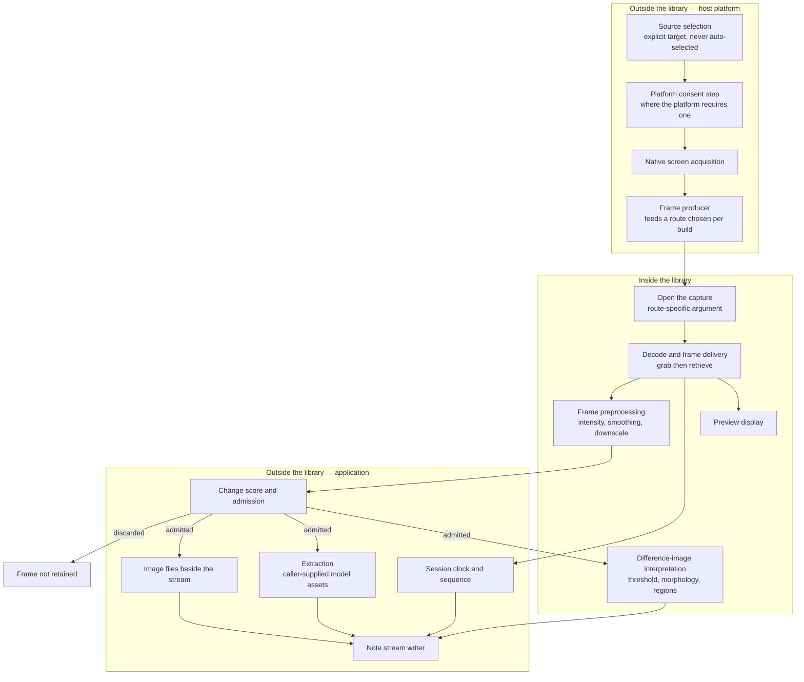
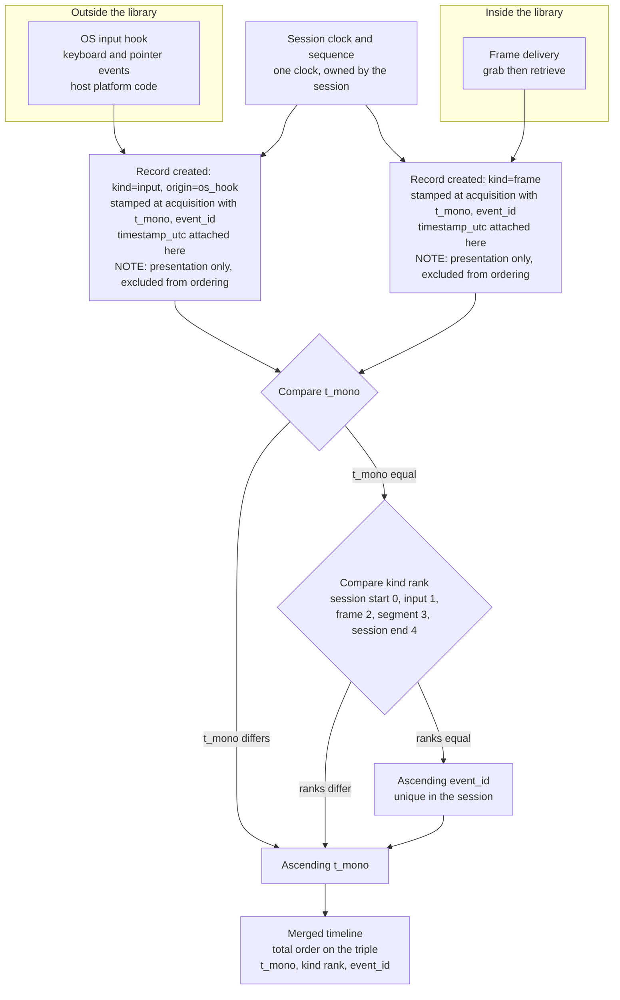

# 1. Capture Pipeline

This document specifies the functional requirements of a screen-capture-and-notetaking
application: a program that records a display region while a user works, notices when the recorded
content changes, correlates those changes with the input events that caused them, and writes the
result as reviewable notes. **That application has no code in this repository.** No source file
here implements any part of it, and nothing below reports existing behaviour of this tree as though
it were the application — every requirement in all six sections is a requirement for a system not
present here.

What this repository does contain is the vision library such an application would consume, and
that is what makes the requirements checkable rather than aspirational. Each requirement therefore
carries exactly one verdict stating whether an existing API satisfies it, with that API cited, or
whether it requires new work. Every repository locator in this document was read against branch
`5.x` at commit `0627765f01be7ea464846ea1e56bbf4e6d861bcf` and is checkable only against that
revision.

The four verdicts have fixed meanings, used identically in all six sections:

| Verdict | Meaning |
|---|---|
| `Supported` | An existing API satisfies the requirement as stated, and the block cites it. |
| `Conditional` | An existing API satisfies it only where a stated condition holds; the block names that condition and cites the API. |
| `Host work` | Nothing in the surveyed modules addresses it; the block names the owner that must build it. |
| `Not Found` | The capability asked for is absent, and the block carries the enumeration that establishes the absence. |

Two conventions apply throughout. A cross-reference of the form
[current-state-capability-map.md §1](./current-state-capability-map.md) points at where a finding
about this tree was established and never stands in for a citation: where a requirement asserts
something about the codebase, a `path:locator` appears with it. And no requirement promises a
number. This repository commits no latency, throughput, frame-rate or accuracy figure, so none is
attributed to it; where a value does appear it is a default this tree declares, cited to the line
that declares it.

## 1.1 What a session is

A session is the unit of work: one continuous recording of one source, from an explicit start to an
explicit stop, producing one note stream (§5). Its lifecycle is ordered in one direction and torn
down in the other. Start acquires the platform source first and opens the capture second, because a
capture opened against a source that has not been acquired has nothing to read. Stop releases the
capture first and the source second, for the same reason in reverse.

Stop is idempotent. The first successful stop writes exactly one session-end record and every later
call writes none — which is what makes a stop that can arrive twice safe without permitting two
ends in one stream. A start that fails releases whatever it had already acquired and leaves no
session at all, so a failed start is never distinguishable from no start by anything a consumer
reads.

## 1.2 Source selection, and the boundary where the library begins

The application selects an explicit source — a named display, monitor or window — and never
auto-selects one. Where the requested source is unavailable, start fails; it does not substitute a
different source, because a note stream silently recording the wrong surface is worse than a
session that did not begin.

The boundary matters more here than anywhere else in this specification. Acquiring screen pixels
from the platform, choosing the target surface and satisfying any consent step the platform imposes
are all outside the library: no backend in this tree targets a display, screen, desktop, window or
monitor, as [current-state-capability-map.md §1](./current-state-capability-map.md) establishes by
enumerating the complete set of concrete backend identifiers
[modules/videoio/include/opencv2/videoio.hpp:91-122]. What the library provides is everything from
ingestion onward. The application is a consumer of the library, and the platform-facing half is its
own code.

**Capture is authorised before it begins, by the application, on every platform.** This session
records a user's screen and — through the stream of §2 — the keys they press, so the decision to
start is not one an application may take on the user's behalf. Some platforms interpose their own
consent step and some interpose none; the requirement here is independent of that, because a
requirement that only applies where the operating system happens to ask would leave the platforms
that ask nothing with silent capture. The application therefore obtains its own authorisation
before it acquires a source, and it exposes a recording state that is observable for as long as
capture is active — observable in the interface (R6.15) and recorded in the stream, so that
"is this recording?" is answerable at any moment and after the fact. Where platform consent is also
required it is satisfied in addition, never instead (R1.14).

**The source is chosen from enumerated platform objects, never parsed from free text.** The
application enumerates what the platform offers — a monitor index, a window handle, a portal stream
serial — and the user picks one of those objects; the selection the session carries forward is the
object's own identifier. Nothing a user types, and nothing read from a window's title, becomes the
thing that identifies a source. That is a correctness requirement before it is a security one,
because a title is not unique and does not survive the window changing it; but it is also what
keeps an attacker-influenced string — a window title is chosen by whoever wrote the window's
contents — out of the route arguments of §1.3.

## 1.3 Route selection is decided per build, not fixed here

Two documented routes admit an externally produced frame source, and they are owned in full — with
the condition each carries — by [current-state-capability-map.md §1](./current-state-capability-map.md).
This specification deliberately does not restate the mechanism. A second description of a route is
exactly where its condition gets dropped, and a route stated without its condition is a fabrication
rather than a simplification.

What this specification fixes is the selection policy. The route is chosen from those verified
available in the target build, not declared in advance: the pipeline-string route where the
media-framework backend and the required source element are both present, or the
environment-mediated input-format route where the device-opening support and the required demuxer
are both present. Where neither is verified, start fails explicitly. This follows from preferring
the option that adds least to a given build rather than mandating one route whose dependencies may
be absent, and the flags that decide availability are inventoried in
[technical-inventory.md §5](./technical-inventory.md).

Fallback from one route to the other is permitted only where both resolve to the same normalised
source identity (§5). Absent an equivalence mapping between the two routes' own addressing, there
is no fallback — a stream whose recorded source changed meaning midway is not a timeline anyone can
review.

**Both routes take a string that something else parses, and that is what constrains how the
argument is built.** The pipeline-string route hands its argument to the media framework's own
parser when the argument is neither a valid URI nor an existing file
[modules/videoio/src/cap_gstreamer.cpp:1432,1438], so the string decides which elements exist and
what properties they carry. The environment-mediated route's options are parsed as a
delimiter-separated list, `";"` separating a key from its value and `"|"` separating one pair from
the next [modules/videoio/src/cap_ffmpeg_impl.hpp:1197], read from a single variable
[modules/videoio/src/cap_ffmpeg_impl.hpp:1184]. Three rules follow, and they are requirements
(R1.18 through R1.20):

- No untrusted value is interpolated into either argument. The source identity comes from the
  enumerated platform object of §1.2, so the value placed in a route argument is an index, a handle
  or a serial the platform issued — never a window title, a user-typed string or anything else
  whose content someone outside the application chose.
- A value that carries the route's own delimiters or metacharacters is **rejected**, not escaped.
  For the options grammar that means a value containing `;` or `|`; for the pipeline route it means
  a value carrying the parser's own separators or property syntax. Rejection rather than escaping,
  because an escaping rule is a second parser the application would have to keep in step with the
  one it is feeding, and start failing explicitly is a defined outcome here (R1.7).
- The elements and properties a route argument may name are drawn from an allowlist the application
  holds. A route argument is assembled from that allowlist and the enumerated source identifier and
  from nothing else, so the set of components a session can instantiate is fixed by the application
  rather than by its inputs.

## 1.4 Frame rate and resolution are expressed against knobs, not targets

A screen-capture session trades frame rate against resolution and against the cost of everything
downstream of acquisition: a large surface captured often produces more pixels per second for the
change gate (§3) to examine and more images to retain (§5). This specification expresses that
tradeoff against the configuration surface that exists and assigns it no figures.

Capture configuration is untyped, by integer property identifier
[modules/videoio/include/opencv2/videoio.hpp:131-211]. The four knobs the tradeoff is expressed
against are frame width and height [modules/videoio/include/opencv2/videoio.hpp:136,137], frame
rate [modules/videoio/include/opencv2/videoio.hpp:138] and buffer size
[modules/videoio/include/opencv2/videoio.hpp:172]. The enumeration assigns each identifier a
meaning and no value; which of them a given backend honours is the backend's business.

What follows is a requirement rather than advice, and it is stated at the width the library's own
documentation supports rather than one step further. **A read-back value is not proof of effect.**
The setter's own note says that even when it returns true this "doesn't ensure that the property
value has been accepted by the capture device"
[modules/videoio/include/opencv2/videoio.hpp:995-998], and the getter's note says the value it
returns "might be different from what really used by the device" and may be encoded by
device-dependent rules [modules/videoio/include/opencv2/videoio.hpp:1007-1017]. So there are three
different values here, they are named separately throughout this specification, and no requirement
treats one as another:

- **Requested** — the value the session asked for through the property setter or the open
  parameters. It is a request and nothing more.
- **Backend-reported** — the value the property getter returns
  [modules/videoio/include/opencv2/videoio.hpp:1000-1017]. It carries both caveats above: it is
  what the layers below report, not a guarantee of what the device is doing, and it may be encoded
  in the device's own units.
- **Observed** — what the delivered frames actually show: the dimensions of the frames the session
  receives, read from the frames themselves, and the delivery cadence measured over the frames as
  they arrive.

The session records all three, and where they disagree the observed values are what describe the
session. Only observed values may be presented to a user or a consumer as what was captured; a
backend-reported value is recorded as a report, never as the effective configuration.

Where a deployment needs a specific rate or resolution, that figure is a product decision this
specification does not supply, and the affected acceptance criterion is blocked pending that
decision rather than filled with a number this repository does not commit.

## 1.5 Open and read timeouts

Two timeout identifiers are declared, both documented open-only and both documented as applicable
to the FFmpeg and GStreamer back-ends only
[modules/videoio/include/opencv2/videoio.hpp:187-188]. Those lines establish that the identifiers
exist and what they apply to; they set no value. The values live in each back-end independently,
where both define a 30-second default —
[modules/videoio/src/cap_ffmpeg_impl.hpp:261-262] and
[modules/videoio/src/cap_gstreamer.cpp:83-84].

For an interactive capture session a stall of that length on open or read is a user-visible
failure, so the session sets both explicitly through the integer parameter vector the open
overloads accept [modules/videoio/include/opencv2/videoio.hpp:877,901] rather than inheriting
them. The narrow applicability is part of the requirement: on a back-end outside those two the
identifiers buy nothing, and the session's own supervision is what bounds a stalled open.

## 1.6 Delivery is pull-driven, and readiness notification is narrow

Nothing in the capture surface hands the application a frame unasked. Acquisition is a two-step
pull, `grab` [modules/videoio/include/opencv2/videoio.hpp:951] then `retrieve`
[modules/videoio/include/opencv2/videoio.hpp:965], with `read`
[modules/videoio/include/opencv2/videoio.hpp:987] as the combined call, and the plugin ABI carries
the same shape with no push or event-driven entry point
[modules/videoio/src/plugin_capture_api.hpp:92,103]. The claim is scoped deliberately: it is a
property of the plugin ABI and of back-ends other than V4L, not of the module as a whole.

One readiness API exists, `waitAny`
[modules/videoio/include/opencv2/videoio.hpp:1035-1053], documented for multi-camera environments.
Its implementation requires every capture in the call to share one backend and dispatches only to
V4L, raising an error outside it [modules/videoio/src/cap.cpp:629-652]. A screen-capture session on
any other back-end therefore polls, and that is the architectural fact §3 builds the change gate
on: the gate sits above the capture object, not inside it.

## 1.7 The pipeline, and where the boundary falls

The diagram's subject is the boundary itself rather than the sequence of stages: which parts of a
capture-to-notes pipeline the library performs, and which the application and the host platform
must perform around it.

Read unrendered, its conclusion is this: the library owns the middle of the pipeline — opening a
source, delivering frames, transforming them and displaying them — while both ends are the
application's and the platform's. Acquisition, target selection and consent precede it; the
admission decision, the session clock, extraction and the note artefact follow it. Two arrows carry
requirements rather than description: delivery reaches the preview directly, because the preview
shows captured frames and not admitted ones (§6.4), and it reaches the session clock directly,
because a frame is stamped when it is retrieved and not when it is written (§2.4).

## 1.8 Requirements

- **R1.1** Session start shall open a capture against an explicitly identified source.

  Verdict: Supported

  Basis: three open shapes across five overloads — by device index
  [modules/videoio/include/opencv2/videoio.hpp:888,901], by filename or pipeline string
  [modules/videoio/include/opencv2/videoio.hpp:864,877], and by a caller-supplied stream reader
  with a typed integer parameter vector [modules/videoio/include/opencv2/videoio.hpp:914] — with
  open state queryable [modules/videoio/include/opencv2/videoio.hpp:921]. The shapes and the way
  open resolves to a backend are established in
  [current-state-capability-map.md §1](./current-state-capability-map.md).

- **R1.2** The session shall acquire the platform source before opening the capture and release in
  the reverse order.

  Verdict: Host work

  Owner: host platform code acquires the surface, one implementation per target; the application's
  session controller owns the ordering. The library contributes the inner half of each step only —
  opening a capture [modules/videoio/include/opencv2/videoio.hpp:864] and releasing it
  [modules/videoio/include/opencv2/videoio.hpp:930].

- **R1.3** A failed start shall release everything it acquired and leave no session.

  Verdict: Host work

  Owner: the application's session controller. Failure to open is reported by the open overload's
  return value and by `isOpened` [modules/videoio/include/opencv2/videoio.hpp:921]; unwinding the
  platform source acquired before that call is the application's, and no library call knows the
  source exists.

- **R1.4** Stop shall be idempotent, the first successful stop writing exactly one session-end
  record and later calls writing none.

  Verdict: Host work

  Owner: the application's session controller, which owns session state; the record it writes and
  the guarantee that exactly one exists are specified in §5. Releasing the capture is a single
  documented call [modules/videoio/include/opencv2/videoio.hpp:930] and carries no session
  semantics.

- **R1.5** The application shall select an explicit source and shall never auto-select one; an
  unavailable source fails the start rather than being substituted.

  Verdict: Host work

  Owner: the application. The distinction to keep is that backend auto-detection is a separate
  matter with its own sentinel in the capture-API enumeration
  [modules/videoio/include/opencv2/videoio.hpp:92] — it selects who reads the source, never which
  source is read, and the surface being recorded has no such sentinel anywhere in the open
  contract.

- **R1.6** Screen frames shall reach the capture object through a route chosen from those verified
  available in the target build.

  Verdict: Conditional

  Condition: the pipeline-string route needs the media-framework backend present and a pipeline
  terminating in an appsink named `appsink0` or `opencvsink`
  [modules/videoio/src/cap_gstreamer.cpp:1343]; the environment-mediated route needs a build with
  device-opening support compiled in [modules/videoio/src/cap_ffmpeg_impl.hpp:1213] and reaches
  only a demuxer nameable through the capture-options variable
  [modules/videoio/src/cap_ffmpeg_impl.hpp:1184]. The pipeline string is part of the documented
  open contract [modules/videoio/include/opencv2/videoio.hpp:799-805]. Both routes are owned in
  full by [current-state-capability-map.md §1](./current-state-capability-map.md), and the build
  flags that decide availability by [technical-inventory.md §5](./technical-inventory.md).

- **R1.7** Where no route is verified available in the target build, start shall fail explicitly
  rather than degrade silently.

  Verdict: Host work

  Owner: the application's route-resolution step, which runs before the capture is opened. The
  library reports the outcome of an attempt [modules/videoio/include/opencv2/videoio.hpp:921];
  whether a route was available to attempt is a fact the application establishes for itself, and
  nothing in the registry surface answers it for a screen source.

- **R1.8** Fallback between routes shall be permitted only where both resolve to the same
  normalised source identity.

  Verdict: Host work

  Owner: the application, which holds the equivalence mapping between the two routes' own
  addressing; the normalised identity every record carries is specified in §5. Where no such
  mapping exists, there is no fallback.

- **R1.9** Capture rate and frame size shall be requested through the capture properties, and the
  requested, backend-reported and observed values shall all be recorded, with the observed values
  taken as the description of the session.

  Verdict: Conditional

  Condition: the property enumeration assigns each identifier a meaning and no value
  [modules/videoio/include/opencv2/videoio.hpp:131-211] — width and height
  [modules/videoio/include/opencv2/videoio.hpp:136,137], rate
  [modules/videoio/include/opencv2/videoio.hpp:138], buffer size
  [modules/videoio/include/opencv2/videoio.hpp:172] — and which of them a back-end honours is the
  back-end's business. The setter documents that a true return "doesn't ensure that the property
  value has been accepted by the capture device"
  [modules/videoio/include/opencv2/videoio.hpp:995-998] and the getter documents that its value
  "might be different from what really used by the device"
  [modules/videoio/include/opencv2/videoio.hpp:1007-1017], so read-back is a report and is never
  recorded as the effective configuration. The observed values — the dimensions of the frames the
  session receives and the cadence measured as they arrive — are the application's to derive from
  the delivered frames, and they are what §5.2's `session` record carries as what was captured. The
  inventory of these knobs is [technical-inventory.md §1](./technical-inventory.md).

- **R1.10** Open and read latency shall be bounded explicitly rather than inherited from the
  back-end default.

  Verdict: Conditional

  Condition: both identifiers are documented open-only and applicable to the FFmpeg and GStreamer
  back-ends only [modules/videoio/include/opencv2/videoio.hpp:187-188], and each of those two
  back-ends defines its own 30-second default
  [modules/videoio/src/cap_ffmpeg_impl.hpp:261-262],
  [modules/videoio/src/cap_gstreamer.cpp:83-84]. Values are supplied through the integer parameter
  vector the open overloads accept [modules/videoio/include/opencv2/videoio.hpp:877,901]. Outside
  those two back-ends the identifiers buy nothing and the session's own supervision bounds the
  attempt.

- **R1.11** Frame acquisition shall be driven by the application; no frame arrives unasked.

  Verdict: Supported

  Basis: the two-step pull `grab` [modules/videoio/include/opencv2/videoio.hpp:951] then
  `retrieve` [modules/videoio/include/opencv2/videoio.hpp:965], with `read`
  [modules/videoio/include/opencv2/videoio.hpp:987] as the combined call; the plugin ABI carries a
  grab entry point and a retrieve entry point with a copy-out callback and no push entry point
  [modules/videoio/src/plugin_capture_api.hpp:92,103]. Scoped to the plugin ABI and to back-ends
  other than V4L, per R1.12.

- **R1.12** The session shall be able to learn that a source has a frame ready without polling it.

  Verdict: Conditional

  Condition: the one readiness API [modules/videoio/include/opencv2/videoio.hpp:1035-1053] is
  documented for multi-camera environments, requires every capture in the call to share one
  backend, and dispatches only to V4L, raising an error for any other back-end
  [modules/videoio/src/cap.cpp:629-652]. A screen-capture session on any other back-end polls, and
  §3 places the change gate accordingly.

- **R1.13** Where a session is retained as encoded video alongside its notes, retention shall use
  the library's writer.

  Verdict: Supported

  Basis: `VideoWriter` [modules/videoio/include/opencv2/videoio.hpp:1076] with `open`
  [modules/videoio/include/opencv2/videoio.hpp:1150], `write`
  [modules/videoio/include/opencv2/videoio.hpp:1201], `release`
  [modules/videoio/include/opencv2/videoio.hpp:1177] and the four-character-code helper
  [modules/videoio/include/opencv2/videoio.hpp:1230], with its own property enumeration
  [modules/videoio/include/opencv2/videoio.hpp:216-235]. One of those properties is easy to
  misread: the writer's presentation-timestamp property
  [modules/videoio/include/opencv2/videoio.hpp:230] is metadata the caller supplies to the encoder
  and carries no observation of when anything was captured (§2).

- **R1.14** Native screen acquisition, target selection and any platform consent step shall sit
  outside the library.

  Verdict: Host work

  Owner: host platform code, one implementation per target, feeding a route from R1.6. The finding
  this rests on — that no concrete backend in this tree targets a display surface — is established
  by enumeration in [current-state-capability-map.md §1](./current-state-capability-map.md) over
  the capture-API enumeration [modules/videoio/include/opencv2/videoio.hpp:91-122].

- **R1.15** A screen source that is discoverable and selectable in the way a camera or a file is —
  queryable from the registry and addressable by a typed identifier.

  Verdict: Not Found

  Evidence: the capture-API enumeration declares 30 enumerators
  [modules/videoio/include/opencv2/videoio.hpp:91-122], of which six are aliases of another value
  and one is the auto-detect sentinel [modules/videoio/include/opencv2/videoio.hpp:92], leaving 23
  concrete backend identifiers; every one names a camera family, a media framework, an
  image-sequence reader or a capture SDK. The public registry exposes the full backend set and the
  camera, stream, buffered-stream and writer subsets
  [modules/videoio/include/opencv2/videoio/registry.hpp:30-42] and no display, screen or monitor
  subset. The enumeration is complete over the structure that would have to contain such a source
  and is recorded in [current-state-capability-map.md §1](./current-state-capability-map.md) and
  [technical-inventory.md §1](./technical-inventory.md). R1.6 is what makes the absence survivable:
  frames reach the capture object without the source being first-class.

- **R1.16** No capture shall begin without an application-level authorisation step, on every
  platform, including those on which the operating system requires nothing.

  Verdict: Host work

  Owner: the application's session controller, which runs the step before it acquires a source
  (§1.1), and host platform code where a platform imposes its own consent step in addition. The
  library contributes nothing to this and cannot: the call that starts reading frames
  [modules/videoio/include/opencv2/videoio.hpp:864] has no notion of a user or a permission, so an
  authorisation gate that is not in the application does not exist at all. Platform mediation is not
  a substitute, because it is absent on some targets and its presence is a deployment property
  rather than a contract (R1.14).

- **R1.17** While capture is active the session shall expose a recording state that is observable
  both in the interface and in the note stream.

  Verdict: Host work

  Owner: the application, which holds the state; the interface half is R6.15 and the stream half is
  the `session` lifecycle record of §5.2. The requirement is what makes unattended recording
  detectable by the person being recorded: a session whose only evidence is its output file is
  indistinguishable from no session while it runs.

- **R1.18** The captured source shall be selected from platform-enumerated objects, and no
  free-form string shall identify a source.

  Verdict: Host work

  Owner: the application, over the enumeration host platform code provides — a monitor index, a
  window handle, a portal stream serial (§1.2). The route argument then carries that identifier;
  what the platform reports as a window's title is display text for the user's choice and never the
  identity carried forward.

- **R1.19** No untrusted value shall be interpolated into a route argument, and a value carrying
  the route's own delimiters or metacharacters shall be rejected rather than escaped.

  Verdict: Host work

  Owner: the application's route-argument builder. The pipeline-string route's argument is parsed
  by the media framework itself when it is neither a valid URI nor an existing file
  [modules/videoio/src/cap_gstreamer.cpp:1432,1438], and the environment-mediated route's options
  are parsed as pairs separated by `";"` and `"|"`
  [modules/videoio/src/cap_ffmpeg_impl.hpp:1197] read from one variable
  [modules/videoio/src/cap_ffmpeg_impl.hpp:1184] — so in both cases the string decides what is
  instantiated. Rejection is specified in preference to escaping because an escaping rule
  duplicates the parser it feeds, and a rejected source fails the start explicitly (R1.7).

- **R1.20** The elements and properties a route argument may name shall be drawn from an allowlist
  the application holds.

  Verdict: Host work

  Owner: the application. A route argument is assembled from the allowlist plus the enumerated
  source identifier of R1.18 and from nothing else, which bounds the set of components a session
  can instantiate to a set the application chose. The pipeline route additionally has to satisfy
  the sink-naming condition of R1.6 [modules/videoio/src/cap_gstreamer.cpp:1343], so the allowlist
  is what a valid argument is built from rather than a filter applied to an arbitrary one.

# 2. Event Correlation Model

A note that says the screen changed is worth little; a note that says the screen changed *because
the user clicked here* is the application's entire value. That correlation is what this section
specifies, and it specifies it completely — the merge is a contract with an ordering key, a
tie-breaking rule and a stamping rule, not an intention to align two streams later.

## 2.1 Two streams, one of which the library does not carry

The timeline is a merge of two streams. The frame stream comes from §1 and is pulled by the
application. The input-event stream is a sequence of operating-system keyboard and pointer events,
and the library does not carry it: its input delivery is scoped to a window it owns itself.

The complete pointer-event enumeration is twelve types, and the first of them is documented as
movement "over the window" [modules/highgui/include/opencv2/highgui.hpp:128-141]; the callback that
receives them is registered against a window by name
[modules/highgui/include/opencv2/highgui.hpp:427]; and keyboard input arrives only as a key code
returned from the event-pump calls [modules/highgui/include/opencv2/highgui.hpp:271,291,305], which
are documented to work only while at least one window exists and is active
[modules/highgui/include/opencv2/highgui.hpp:282-287]. The window-scoped finding is established in
[current-state-capability-map.md §3](./current-state-capability-map.md).

Declaring the input stream external fixes its verdict; it does not reduce what this section owes.
An external component producing events nobody can align with frames is useless, so the contract
that makes such a stream consumable is specified here rather than deferred to whoever writes the
hook. That contract has three parts: what an event record carries, what coordinate space its
positions are in, and how an event is paired with a frame. The first two are below; pairing belongs
with the rules that consume it and is fixed in §4.4.

**One record kind, two origins.** The format carries the whole input side of the timeline under one
record kind, and an `input` record's required `origin` field says which half of it the record is
(§5.2). `origin` of `os_hook` is an operating-system keyboard or pointer event supplied by the
external capture component — the stream this section specifies. `origin` of `annotation` is one
revision of one user annotation, produced by the application rather than by the platform, and its
fields and semantics are fixed in §5.10. The two halves are mutually exclusive: whichever one
`origin` does not select is written `null` throughout. Everything below about payloads, coordinates
and correlation concerns the `os_hook` half, and so does the aggregation of §4.4, whose rules read
`input` records with `origin` of `os_hook` and no others. What the two halves share is exactly the
ordering contract — one clock, one sequence number and one kind rank (§2.2, §2.3) — which is why an
annotation revision belongs in this stream rather than in an artefact of its own.

**The payload, by event type.** An `input` record with `origin` of `os_hook` carries an
`event_type` of exactly one of six values, and each fixes the payload fields that follow it.
Positions obey the coordinate rules below; the minimisation and redaction rules of R2.11 and R2.12
apply to every payload before it is written, and are the reason this list is a maximum rather than
a mandate.

| `event_type` | Payload fields |
|---|---|
| `key_down` | `key_class`, the class of key pressed; `key`, the character or key identifier, subject to R2.11; `modifiers`, the set of modifier keys held; `repeat`, whether the platform reported this as an auto-repeat. |
| `key_up` | `key_class`, `key` subject to R2.11, and `modifiers`. |
| `pointer_down` | `button`, which button went down; `position` and `position_normalised`; `modifiers`. |
| `pointer_up` | `button`, `position`, `position_normalised`, `modifiers`. |
| `pointer_move` | `position`, `position_normalised`, and `buttons`, the set of buttons held during the move. |
| `scroll` | `axis`, `delta`, `position`, `position_normalised`, `modifiers`. |

**The coordinate space.** A pointer position is recorded in the captured surface's own pixel
coordinate space, **after the same crop and downscale transform that was applied to the frames**,
with its origin at the captured surface's top-left corner. The transform is one documented function
the application owns and applies to both streams — the frame it retains and the event position it
records — because a position computed under a different transform from the frame it is compared
against cannot be tested against that frame's changed regions at all. Where a deployment enables
the optional downscale of §3.3, that downscale is part of the transform for both streams.

Each position is recorded twice: as that integer pixel pair, and as `position_normalised`, a
fractional pair on the closed unit interval from zero to one relative to the captured surface's
width and height. The normalised form is what a consumer needs when it has no knowledge of the
display's scaling, the platform's device-pixel ratio or the crop that was in force, and it stays
meaningful when the same session is reviewed on another machine. Both forms are recorded because
each is lossy in the other's direction: the pixel pair is exact against the retained frame, and the
normalised pair is portable across resolutions.

Where the platform reports which surface an event occurred over, that identity is recorded on the
record and normalised as R2.10 requires, so a consumer can tell an event over the captured surface
from one elsewhere; positions from an event over another surface are recorded as the platform gave
them and are not projected into the captured surface's space.

**What the payload must not carry.** A stream of every key a user pressed is a stream of their
passwords, and this specification is the place that says so rather than the place that discovers it
later. Two rules bound the payload, and both are requirements (R2.11, R2.12).

Key content is excluded where the platform marks the field being typed into as secure or
password-bearing: the record is written, with its type, its timing and its `key_class`, and the
`key` field carries no character. Where the platform reports no such marking the default is still
not to record the character — the record carries the key's class, so that a timeline can say a user
typed rather than what they typed, and the character is recorded only where the user has explicitly
opted in for that session. Redaction is the default because a screen-capture session cannot know
which field a keystroke landed in on every platform, and a default that records everything is
irreversible once written: nothing downstream can recover a note stream that already contains a
password.

Pointer payloads are limited to what the correlation of this section actually consumes — the event
type, the button or axis, the position in both forms above, and the modifiers. A pointer event is
not an occasion to record the contents of the window under the cursor, the text near it, or any
other opportunistically available context, because none of that is an input to the merge, the
pairing rule of §4.4 or any requirement in this specification.

## 2.2 The session clock

Every record, of every kind the format defines (§5.2), carries two ordering values: a monotonic
time value read from a single clock owned by the session, and a monotonically increasing sequence
number unique within the session. One clock, not one per stream — two clocks would make the merge a
synchronisation problem instead of a sort.

Civil time is recorded alongside, as a presentation anchor only. It is what a reader sees when the
timeline says a session ran on a particular afternoon, and it is never an ordering key: wall-clock
time can move backward under adjustment, and a timeline that reorders itself under a clock
correction is worse than one whose resolution is coarse. The facility the application reads to
obtain either value is not provided by the in-scope modules, and none outside them is named here.

"Monotonic time" is a description rather than a representation, and a description is not something
two implementations can serialise the same way, so the representation is fixed here and repeated in
the field table of §5.3. The value is an **integer count of nanoseconds elapsed since the session
clock's zero point**, the zero point being the instant stamped on the session's `start` record — so
that record carries `t_mono` of `0` and no record carries less. It is a signed 64-bit
integer, and a signed 64-bit nanosecond count exhausts its range only after centuries of continuous
elapsed time, so no session can overflow it. Within a session the value is monotonically
non-decreasing: two records may share a value, which is exactly the case §2.3's ordering resolves,
and no record may carry a value smaller than one already stamped. The resolution of the underlying
clock is whatever the host provides and **this specification asserts no resolution**, because the
facility that supplies it is outside the surveyed modules and no figure for it could be sourced from
this tree. Values are meaningful only within one session and are not comparable across sessions,
because each session's zero point is its own.

## 2.3 The merge rule

Merged order is the ascending **lexicographic comparison of the triple (`t_mono`, kind rank,
`event_id`)** over the records of one session. Two records are compared on `t_mono` first; where
those are equal, on kind rank; where those are equal too, on `event_id`. Nothing else enters the
comparison, and in particular `timestamp_utc` never does (§2.2).

The kind rank is a total function over every record kind the format defines (§5.2), so no pair of
records can fall outside it:

| Rank | Record | Why the rank sits there |
|---|---|---|
| 0 | `session` with lifecycle `start` | A session's start precedes everything stamped at its instant; it is the record that fixes the clock's zero point. |
| 1 | `input` with `origin` `os_hook` | An operating-system input event precedes the frame that shows its effect, so cause is never read after effect. |
| 1 | `input` with `origin` `annotation` | An annotation revision takes the same rank as the other origin of its kind. That is a placement rather than a causal claim: a revision is not something that changed the captured surface, and it binds to its frame by `target` rather than by adjacency (§5.10). |
| 2 | `frame` | The frame is the observation an input event explains, and the thing segment boundaries and annotation revisions refer to. |
| 3 | `segment` | A segment boundary is derived from the admitted frames it delimits, so it follows them at equal time. |
| 4 | `session` with lifecycle `end` | A session's end follows everything stamped at its instant, which is what makes a stream's last record readable as its last event. |

Two properties of this definition are the reason it is stated as a triple rather than as a list of
special cases. It is **total**: the third component is unique within the session (R2.4), so no two
distinct records compare equal and every pair is ordered. And it is **transitive**, because
lexicographic comparison of a fixed-length tuple of totally ordered components is transitive by
construction. The alternative formulation that suggests itself — order by `event_id` at equal time,
except that an `input` record always precedes a `frame` record — is not transitive and must not be
implemented: an `input` record can precede a `frame` record by the override while that frame
precedes a `segment` record by `event_id` and that segment precedes the same input record by
`event_id`, which is a cycle rather than an order. Ranking every record variant removes the
possibility.

The rank function's domain is worth stating exactly, because an implementer has to reproduce it. It
is a deterministic total function of the record's `kind` and, for the two kinds that have variants,
of that kind's own discriminator: `lifecycle` for a `session` record, which is why a start and an
end sit at opposite ends of the scale, and `origin` for an `input` record, whose two origins are
placed together at rank 1. Written out, it is exactly the six rows of the table above and the five
rank values they carry, and nothing else. Consulting a second schema field costs the order nothing:
the rank remains a deterministic value computed from fields the record carries, so the comparison
remains a lexicographic one over a fixed-length tuple and stays total and transitive.

The placement of the two `input` origins together has one consequence this section states rather
than leaving an implementer to meet it in a stream. Because an annotation revision is an `input`
record (§5.10), at equal `t_mono` it orders against another `input` record of either origin by
`event_id`, and against a `frame` record by rank — which places it, like an `os_hook` record,
before that frame. So a revision stamped at the same instant as the frame it targets sorts before
that frame rather than after it. That is harmless: an annotation is bound to its frame by the
`target` field carrying that frame's `event_id`, so a consumer resolves the binding by reading a
field and never by inspecting which line sits beside which. A distinct rank for the `annotation`
origin was available and is declined — `origin` is a schema field and a rank derived from it would
be just as total and just as transitive — because the binding a consumer needs is already carried
by `target`, and a fourth rank boundary would add a rule to the ordering contract without adding
anything a reader could do with it.

## 2.4 Stamping, and what threads change

A record is stamped at the moment of acquisition, not at the moment of writing. The two differ by
whatever queueing, extraction (§4) or image encoding (§5) sits between them, and a timeline stamped
at write time records the pipeline's latency rather than the user's actions.

Because acquisition may happen on more than one thread — a capture loop pulling frames, a hook
delivering events — the ordering values are assigned where the record originates, and a single
writer serialises the records into one stream. This specification states no thread-affinity
expectation of the display module: as §6 records, no portable contract of that kind is exposed by
its public surface.

## 2.5 Four adjacent properties, and the precise negative

Four capture and writer properties look as though one of them supplies the instant a frame was
acquired. None does, and the distinctions decide this section's design rather than decorating it.
The full four-way comparison is owned by
[current-state-capability-map.md §1](./current-state-capability-map.md); what matters here is which
of them a record may carry and which it may not.

The current position within a media timeline
[modules/videoio/include/opencv2/videoio.hpp:133] is a position, not an instant. The presentation
timestamp of the most recently read frame [modules/videoio/include/opencv2/videoio.hpp:205] is
genuine per-frame metadata, but it is a media timestamp expressed in the frame-rate time base and
declared for one back-end only. The time the stream was opened
[modules/videoio/include/opencv2/videoio.hpp:189] is a civil-time anchor for the session rather
than for any frame, and is likewise declared for one back-end only. The writer's presentation
property [modules/videoio/include/opencv2/videoio.hpp:230] is input to an encoder and carries no
observation of acquisition at all.

**The precise negative: there is no backend-independent per-frame host-clock acquisition instant.**
Stated any wider it would be false — the presentation timestamp is real per-frame metadata — and
stated any narrower it would license substituting a media timestamp for the session clock. The
application reads its own clock at the moment it retrieves each frame (§2.2), and the media
timestamp is recorded beside that value as supplementary metadata where a back-end supplies it,
never in place of it.

## 2.6 The merge, drawn

The diagram carries one thing prose can only unfold serially: both streams draw their ordering
values from the same clock before either is ordered, and the equal-time case is a branch rather
than a footnote.

Read unrendered, its conclusion is this: the input stream originates outside the library and the
frame stream inside it, but both are stamped at acquisition from one session clock, so the merge is
a sort rather than a synchronisation; civil time is attached where each record is created, at the
same moment as the ordering values, and is excluded from the comparison rather than added at the
end of it; and ordering compares `t_mono` first, the complete four-kind rank of §2.3 second — not
an input-before-frame special case, which would leave equal-time pairs of other kinds unordered —
and the session-unique `event_id` third, which is what makes the result a total order. The `input`
records drawn here are the `os_hook` origin of §2.1; an annotation revision is an `input` record of
the other origin (§5.10), stamped from the same clock and ranked at the same 1, so it enters this
merge by exactly the path the diagram shows.

## 2.7 Requirements

- **R2.1** The session shall receive operating-system keyboard and pointer events regardless of
  which window has focus, including while the application's own window has none.

  Verdict: Host work

  Owner: host platform code — an operating-system input hook, one implementation per target —
  feeding the merge as a stream of records. What the library delivers instead is scoped to a window
  it owns: pointer events over that window
  [modules/highgui/include/opencv2/highgui.hpp:128-141] and key codes from the event pump
  [modules/highgui/include/opencv2/highgui.hpp:271,291,305].

- **R2.2** A system-wide or background input hook available from the surveyed modules.

  Verdict: Not Found

  Evidence: the pointer-event enumeration is complete at twelve types and the first is documented
  as movement over the window [modules/highgui/include/opencv2/highgui.hpp:128-141]; the callback
  is registered against a single window by name
  [modules/highgui/include/opencv2/highgui.hpp:427]; the only functions that fetch and handle
  events are documented to require at least one window created and active
  [modules/highgui/include/opencv2/highgui.hpp:282-287]; and the public interaction surface is
  enumerated in [current-state-capability-map.md §3](./current-state-capability-map.md) and
  [technical-inventory.md §3](./technical-inventory.md), where no global or background hook
  appears. The absence is of the in-scope modules and is stated at that width.

- **R2.3** Every record shall carry a monotonic time value read from one clock owned by the
  session, serialised as the signed 64-bit nanosecond count from the session clock's zero point
  defined in §2.2.

  Verdict: Host work

  Owner: the application's session, which owns the clock and hands it to both producers. The
  facility it reads is not provided by the in-scope modules, and none outside them is named here.
  One back-end-specific property anchors a session in civil time
  [modules/videoio/include/opencv2/videoio.hpp:189] but anchors no frame, so it cannot serve as
  this value. The representation is part of the requirement rather than an implementation detail:
  the zero point is the instant on the session's `start` record, the count is non-decreasing within
  a session and not comparable across sessions, and the clock's resolution is the host's and is not
  asserted anywhere in this specification.

- **R2.4** Every record shall carry a sequence number that increases monotonically within the
  session and is unique in it.

  Verdict: Host work

  Owner: the application's session, which allocates the number at acquisition; §5 fixes the field
  and its position in every record.

- **R2.5** Civil time shall be recorded on every record as a presentation anchor and shall never be
  an ordering key.

  Verdict: Host work

  Owner: the application. The requirement is a prohibition as much as a field: an implementation
  that sorts by civil time satisfies the field and violates the requirement, because that value can
  move backward under adjustment.

- **R2.6** The merged timeline shall be ordered by ascending lexicographic comparison of the triple
  (`t_mono`, kind rank, `event_id`), over the complete kind-rank function of §2.3.

  Verdict: Host work

  Owner: the application's timeline reader, and any consumer of the note stream. The triple and its
  rank function are specified in §2.3 and are a property of the format rather than of an
  implementation, so two consumers reading the same stream produce the same timeline. The order is
  total because `event_id` is unique in the session (R2.4) and transitive because the comparison is
  lexicographic over a fixed triple; an implementation that overrides the sequence number for one
  pair of kinds instead of ranking all of them does not satisfy this requirement, because that
  formulation admits cycles (§2.3).

- **R2.7** Records produced on different threads shall be stamped at acquisition and serialised
  into one stream by a single writer.

  Verdict: Host work

  Owner: the application. This specification makes no thread-affinity assumption about the display
  module, because its public surface exposes no portable contract of that kind (§6).

- **R2.8** A per-frame acquisition instant on the host clock, obtained from the capture API and
  independent of which back-end serves the route.

  Verdict: Not Found

  Evidence: the four adjacent properties, enumerated and compared in
  [current-state-capability-map.md §1](./current-state-capability-map.md), are a media-timeline
  position [modules/videoio/include/opencv2/videoio.hpp:133], a per-frame media presentation
  timestamp in the frame-rate time base declared for one back-end only
  [modules/videoio/include/opencv2/videoio.hpp:205], a civil-time anchor for the session rather
  than the frame and likewise for one back-end only
  [modules/videoio/include/opencv2/videoio.hpp:189], and an encoder-side input
  [modules/videoio/include/opencv2/videoio.hpp:230]. No other identifier in the capture-property
  enumeration [modules/videoio/include/opencv2/videoio.hpp:131-211] reports an acquisition
  instant. R2.3 is what closes the gap.

- **R2.9** Where a back-end supplies a media presentation timestamp, it shall be recorded beside
  the session clock as supplementary metadata.

  Verdict: Conditional

  Condition: the property is read-only, declared for one back-end only, and expressed in the
  frame-rate time base [modules/videoio/include/opencv2/videoio.hpp:205], so a record carries it
  only where that back-end serves the chosen route (R1.6), and its absence is normal rather than an
  error. It is never an ordering key and never substitutes for the session clock of R2.3.

- **R2.10** An `input` record with `origin` of `os_hook` shall carry the identity of the surface the
  event occurred over, where the platform makes it known.

  Verdict: Host work

  Owner: host platform code reports it and the application normalises it to the same source
  identity a frame record carries (§5), so a consumer can tell an event over the captured surface
  from one elsewhere. Where the platform does not report it, the `source` field carries JSON `null`
  (§5.5) and the record is still valid.

- **R2.11** Key content shall be excluded from an input record where the platform marks the field
  as secure or password-bearing, and redacted by default otherwise, the record carrying the key's
  class rather than the character unless the user has opted in for that session.

  Verdict: Host work

  Owner: host platform code reports the secure-field marking where the platform has one, and the
  application's writer applies the redaction before a record is serialised. The default is
  restrictive because the alternative is irreversible: a character written into the stream cannot be
  unwritten by any later policy, and no consumer can distinguish a password from any other word.
  The record itself is still written, so the timeline keeps the event and loses only its content.

- **R2.12** A pointer input record shall carry only the fields the correlation of §2 and the
  aggregation of §4.4 consume.

  Verdict: Host work

  Owner: the application's writer. The payload set is fixed in §2.1 — type, button or axis,
  position in both forms, modifiers — and nothing about the surroundings of the pointer is
  collected, because no requirement in this specification reads it and data collected without a
  consumer is exposure without a purpose.

# 3. Change Detection & Segmentation

A screen-capture session that retained every frame would produce a video file and no notes. The
gate specified here is what turns a frame stream into a set of moments worth keeping: it scores each
captured frame against the last one it retained, admits the frame where the score meets a
threshold, and groups admitted frames into segments of activity.

Two things make this section unusually easy to get wrong, so both are fixed rather than described.
The score is defined exactly, because a gate whose score is left to the implementer is a gate two
implementations disagree about; and the boundary between what the library supplies and what the
application must write is drawn at the operator level rather than at the feature level.

## 3.1 Where the gate sits

The gate sits above the capture object, in the application's own loop, and is not signalled through
it. That follows from §1.6: acquisition is a two-step pull
[modules/videoio/include/opencv2/videoio.hpp:951,965], the plugin ABI offers no push or
event-driven entry point [modules/videoio/src/plugin_capture_api.hpp:92,103], and the one readiness
API is unavailable outside one back-end [modules/videoio/src/cap.cpp:629-652]. There is nothing to
subscribe to, so the application pulls a frame, scores it, and decides.

## 3.2 The score contract

The change score of a captured frame is **the fraction of pixels whose absolute difference from the
previous retained frame exceeds a per-pixel sensitivity**, expressed on the closed unit interval
from zero to one, computed over the whole frame after the preprocessing of §3.3. Three rules
complete it:

- **The comparand is the previous *retained* frame, not the previous captured frame.** Comparing
  against the previous captured frame would let a slow change creep past the gate one imperceptible
  step at a time and never be recorded.
- **The first frame of a session has no predecessor and is always retained, with its score defined
  as one.** A session therefore always opens with a frame a reader can look at, and the score field
  is never absent or null on a frame record.
- **Equality with the threshold retains the frame.** The comparison is inclusive — score greater
  than or equal to threshold admits — stated explicitly so that two implementations agree at the
  boundary instead of differing on one frame in every quiet period.

Configurable: the per-pixel sensitivity, the admission threshold, and the number of consecutive
below-threshold frames that closes a segment (§3.5). Not configurable: the score's definition, its
range, its whole-frame domain, the first-frame rule and the inclusive comparison. Those five are
what a consumer reads the score against, and a consumer cannot be written against a definition that
varies per deployment.

The score is a whole-frame scalar by construction. Where changed *regions* are wanted — for
annotation geometry, or for action aggregation in §4 — they come from interpreting the difference
image (§3.4), not from the score.

## 3.3 Preprocessing, specified

Before comparison each frame is reduced to a single-channel intensity representation
[modules/imgproc/include/opencv2/imgproc.hpp:3526]. Two optional steps may precede it, and both are
part of the rate-and-resolution tradeoff of §1.4 rather than of the score's definition: smoothing
to suppress compression and rendering noise that would otherwise register as change
[modules/imgproc/include/opencv2/imgproc.hpp:1276], and downscaling to a smaller comparison size
[modules/imgproc/include/opencv2/imgproc.hpp:2096]. Whichever steps a deployment enables, they
apply identically to both frames of every comparison; a score computed between differently
preprocessed frames is meaningless.

## 3.4 What the library supplies, and the three operators it does not

For interpreting a difference image the library supplies the expensive, well-tested half:
binarisation [modules/imgproc/include/opencv2/imgproc.hpp:2849,2869], morphological cleanup
[modules/imgproc/include/opencv2/imgproc.hpp:2051], labelling with region statistics
[modules/imgproc/include/opencv2/imgproc.hpp:3704,3746] and contour extraction
[modules/imgproc/include/opencv2/imgproc.hpp:3782]. The motion group adds frame accumulation
[modules/imgproc/include/opencv2/imgproc.hpp:2683,2702,2721,2742] and phase correlation
[modules/imgproc/include/opencv2/imgproc.hpp:2783,2800,2817]. Region matching
[modules/imgproc/include/opencv2/imgproc.hpp:3663] and edge extraction
[modules/imgproc/include/opencv2/imgproc.hpp:1639,1657] are available for interpretation as well.

Three operations the score itself needs are **not provided by the in-scope modules**: element-wise
absolute difference, element-wise comparison against a per-pixel sensitivity, and counting the
non-zero entries of the resulting mask. That absence is stated as an absence and no provider is
named for it — the point of saying it is that a reader who assumes the image-processing module
supplies them will not find them there, which
[current-state-capability-map.md §2](./current-state-capability-map.md) establishes by enumerating
the motion group and the module's public header.

The consequence is the section's verdict rather than a complaint: **a frame-to-frame change gate is
application code composed from library primitives.** The library contributes everything after the
difference image and nothing before it.

## 3.5 Segmentation

A segment is a run of activity. It opens at the first admitted frame after a quiet period and
closes when a configurable number of consecutive frames have scored below the threshold; the frames
of a segment are the admitted frames between those boundaries. Both boundaries are written as
records (§5). A consumer reads them rather than re-deriving them, because re-deriving a boundary
requires the consumer to know the quiet-frame count and the threshold that were in force at the
time, and those are configurable.

## 3.6 No source-side facility displaces this work

One misreading is worth pre-empting, because it would delete this section's requirements. A capture
source element that uses platform damage information to avoid recopying unchanged pixels is
sometimes taken for a change signal. It is not one: such an optimisation still emits a buffer at
its configured frame rate and exposes no change notification, so it neither suppresses unchanged
frames nor feeds the gate. The platform mechanisms behind optimisations of that kind are assessed
elsewhere in this dossier and are deliberately not attributed here, since this document cites no
source outside the repository.

## 3.7 Requirements

- **R3.1** Every captured frame shall be scored against the previous retained frame by the score
  contract of §3.2, and admitted or discarded on that score.

  Verdict: Host work

  Owner: the application's gate, running above the capture object (§3.1). The score's definition,
  range, domain, first-frame rule and comparison sense are fixed by this specification and are not
  the implementer's to choose.

- **R3.2** Element-wise absolute difference, element-wise comparison against a per-pixel
  sensitivity, and non-zero counting — the three operations the score is computed from.

  Verdict: Not Found

  Evidence: no declaration for any of the three appears in the motion group
  [modules/imgproc/include/opencv2/imgproc.hpp:2663-2819] or elsewhere in the module's public
  header, whose relevant groups are enumerated in
  [current-state-capability-map.md §2](./current-state-capability-map.md) and inventoried in
  [technical-inventory.md §2](./technical-inventory.md). They are not provided by the in-scope
  modules, and no provider is named here.

- **R3.3** Each frame shall be reduced to a single-channel intensity representation before
  comparison, with optional smoothing and downscaling applied identically to both frames of a
  comparison.

  Verdict: Supported

  Basis: colour conversion [modules/imgproc/include/opencv2/imgproc.hpp:3526], smoothing
  [modules/imgproc/include/opencv2/imgproc.hpp:1276] and resizing
  [modules/imgproc/include/opencv2/imgproc.hpp:2096] are all declared public API. Which of the two
  optional steps a deployment enables is part of the tradeoff of §1.4, not of the score's
  definition.

- **R3.4** The difference image shall be interpretable into discrete changed regions with position
  and extent, for annotation geometry and for action aggregation.

  Verdict: Supported

  Basis: binarisation [modules/imgproc/include/opencv2/imgproc.hpp:2849,2869], morphological
  cleanup [modules/imgproc/include/opencv2/imgproc.hpp:2051], labelling with region statistics
  [modules/imgproc/include/opencv2/imgproc.hpp:3704,3746] and contour extraction
  [modules/imgproc/include/opencv2/imgproc.hpp:3782]. The regions are derived from the difference
  image, never from the whole-frame score.

- **R3.5** The first frame of a session shall always be retained, with its score recorded as one.

  Verdict: Host work

  Owner: the application's gate. The rule exists so that the score field is total — every frame
  record carries a number — and so that a session always opens with a reviewable frame.

- **R3.6** Admission shall be inclusive at the threshold: a score equal to the threshold retains
  the frame.

  Verdict: Host work

  Owner: the application's gate. Fixing the comparison sense here is what stops two conforming
  implementations from differing at the boundary.

- **R3.7** Segment boundaries shall be written as records rather than left for a consumer to
  re-derive.

  Verdict: Host work

  Owner: the application's writer; the record kind and its fields are fixed in §5. Re-derivation
  would require a consumer to know the threshold and quiet-frame count in force at the time, both
  of which are configurable.

- **R3.8** A segment shall close after a configurable number of consecutive below-threshold frames.

  Verdict: Host work

  Owner: the application's gate, which holds the counter; the count is one of the three
  configurable values named in §3.2.

- **R3.9** A source-driven change notification the session could subscribe to instead of scoring
  every frame.

  Verdict: Not Found

  Evidence: the capture plugin ABI declares a grab entry point and a retrieve entry point with a
  copy-out callback and no push or event-driven entry point
  [modules/videoio/src/plugin_capture_api.hpp:92,103]; the one readiness API raises an error
  outside a single back-end [modules/videoio/src/cap.cpp:629-652]; and the ABI's complete entry
  point set is enumerated in
  [current-state-capability-map.md §6](./current-state-capability-map.md). The gate therefore polls,
  which is why §3.1 places it above the capture object.

- **R3.10** A statistical background model, or a per-pixel motion field, as an alternative basis
  for detecting change.

  Verdict: Not Found

  Evidence: the motion group's complete membership is frame accumulation
  [modules/imgproc/include/opencv2/imgproc.hpp:2683,2702,2721,2742] and phase correlation with its
  window helper [modules/imgproc/include/opencv2/imgproc.hpp:2783,2800,2817]
  [modules/imgproc/include/opencv2/imgproc.hpp:2663-2819]; phase correlation measures a single
  global translation between two frames, not a per-pixel field, and no background-model class or
  entry point is declared in the module's public header. Both are enumerated as absent in
  [current-state-capability-map.md §2](./current-state-capability-map.md). Neither is provided by
  the in-scope modules and no provider is named here.

- **R3.11** Where a session maintains a temporally smoothed reference image for interpretation, the
  library shall supply the accumulation.

  Verdict: Supported

  Basis: the accumulators [modules/imgproc/include/opencv2/imgproc.hpp:2683,2702,2721,2742] are
  arithmetic over frames and serve exactly this. Such a reference is an interpretation aid only:
  the score's comparand remains the previous retained frame (§3.2), which no configuration
  changes.

# 4. Text/Action Extraction

Extraction is what makes a note searchable: the text visible in an admitted frame, and the action
the user was performing when it changed. The two halves have almost nothing in common. Text comes
out of the frame by inference and needs model assets. Actions come out of the event stream of §2 by
observation and need no model at all — and getting that direction wrong is the single most likely
design error in this section.

## 4.1 Text: detection and recognition are separate, and so are their confidences

Text extraction is two steps against two different networks. Detection locates text and returns
quadrangle geometry together with a detection confidence per detection
[modules/dnn/include/opencv2/dnn/dnn.hpp:1937-1941], and a second overload returns geometry alone
[modules/dnn/include/opencv2/dnn/dnn.hpp:1945]; a rotated-rectangle form is also declared
[modules/dnn/include/opencv2/dnn/dnn.hpp:1963,1971]. Two detector families are declared as
subclasses, each with its own thresholds
[modules/dnn/include/opencv2/dnn/dnn.hpp:1983,2010,2023] and
[modules/dnn/include/opencv2/dnn/dnn.hpp:2044,2066].

Recognition then reads the located regions. It returns a string
[modules/dnn/include/opencv2/dnn/dnn.hpp:1895], or a vector of strings for a batch of regions of
interest [modules/dnn/include/opencv2/dnn/dnn.hpp:1904], and **neither returns a recognition
confidence.** The confidence vector in this surface belongs to detection
[modules/dnn/include/opencv2/dnn/dnn.hpp:1940] and says how sure the detector was that there was
text at a location — not how sure the recogniser is about the characters it read there. A
specification that reported one as the other would be describing an API this repository does not
have.

So an extracted text span carries geometry and a detection confidence, and a per-string
recognition confidence has to come from somewhere else (R4.3).

## 4.2 The condition every text verdict carries

Each wrapper is constructible either from a caller-supplied network or from model and configuration
paths [modules/dnn/include/opencv2/dnn/dnn.hpp:1838,1993,2054], and recognition additionally
requires a character vocabulary [modules/dnn/include/opencv2/dnn/dnn.hpp:1880] together with a
decode type, the documented values being `"CTC-greedy"` and `"CTC-prefix-beam-search"`
[modules/dnn/include/opencv2/dnn/dnn.hpp:1857]; the recogniser family the wrapper documents is
CRNN-CTC [modules/dnn/include/opencv2/dnn/dnn.hpp:1825].

**No OCR asset exists in the in-scope source domain** — no weights, no detector or recogniser
configuration and no vocabulary under the authorised modules, as
[current-state-capability-map.md §4](./current-state-capability-map.md) establishes and
[technical-inventory.md §4](./technical-inventory.md) records. The claim is bounded exactly there.
It is not a claim that the repository contains no character-list file anywhere; files of that kind
exist elsewhere in the tree, outside this analysis domain, and are neither examined nor cited in
this document.

Every text verdict below therefore holds only where the caller supplies the assets, and the
identity of that dependency is named in
[current-state-capability-map.md §4](./current-state-capability-map.md) rather than restated here.

## 4.3 What inference supplies

The **inference plumbing** is complete: everything between a frame and a network's output exists as
public API and the application writes none of it. A network is constructed by one of the readers
[modules/dnn/include/opencv2/dnn/dnn.hpp:1121,1134,1161,1169,1201,1217,1261,1281], input names and
shapes are declarable [modules/dnn/include/opencv2/dnn/dnn.hpp:714,718], a frame becomes network
input through the blob helpers
[modules/dnn/include/opencv2/dnn/dnn.hpp:1308,1341,1418,1421], and the network is driven with
`setInput` and `forward` [modules/dnn/include/opencv2/dnn/dnn.hpp:834,725] on the network class
itself [modules/dnn/include/opencv2/dnn/dnn.hpp:566]. Two high-level wrappers cover whole-region
classification [modules/dnn/include/opencv2/dnn/dnn.hpp:1656,1697,1700] and object detection
[modules/dnn/include/opencv2/dnn/dnn.hpp:1772,1814].

Complete plumbing is not a complete extraction stage, and the difference is a list rather than a
caveat. Every one of the following is caller-supplied, and each is a separate thing to obtain,
license, package and validate:

- **Model weights**, for every network the session runs — a detector, a recogniser, and any
  classifier or object detector §4.6 adds.
- **A companion configuration file for the formats that take one.** The general reader accepts a
  model path and a configuration path [modules/dnn/include/opencv2/dnn/dnn.hpp:1201], and each
  wrapper's path constructor forwards both [modules/dnn/include/opencv2/dnn/dnn.hpp:1847,2063], so
  a deployment whose format needs a configuration file needs that file as well as the weights.
- **A character vocabulary and a decode type, for recognition.** The vocabulary is set on the
  recogniser [modules/dnn/include/opencv2/dnn/dnn.hpp:1880] and the decode type selects between the
  two documented decoding methods [modules/dnn/include/opencv2/dnn/dnn.hpp:1857]. Neither has a
  value until the caller supplies one, and recognition without both is not configured.
- **A label set or taxonomy that means something to this use case**, for classification and
  detection. Classification returns a class index and a score
  [modules/dnn/include/opencv2/dnn/dnn.hpp:1697,1700] and detection returns class indexes with
  their boxes and confidences [modules/dnn/include/opencv2/dnn/dnn.hpp:1814-1816]; what an index
  *means* is not in the API, so the mapping from index to a name a note can carry is the caller's,
  and for screen content no such taxonomy exists in this tree (§4.4, Route 3).
- **Detector thresholds where the subclass exposes them.** The two detector families each expose
  their own [modules/dnn/include/opencv2/dnn/dnn.hpp:2010,2023] and
  [modules/dnn/include/opencv2/dnn/dnn.hpp:2066,2069], and the detection call takes confidence and
  suppression thresholds as parameters
  [modules/dnn/include/opencv2/dnn/dnn.hpp:1814-1816]. Their values are a tuning decision against
  the chosen weights and the actual screen content, and this specification supplies none.

So the accurate statement is that no *code* is missing between a frame and a prediction, and that
several *inputs* are — and that the per-string recognition confidence of §4.1 is missing from the
API itself rather than from the caller's inputs, which is why it stays R4.3's work no matter what
assets are supplied.

## 4.4 Actions: three routes, kept strictly separate

**Route 1 — directly observed actions.** A click is a click because the operating-system half of
the input stream of §2 — its `input` records with `origin` of `os_hook` (§2.1) — says so. This is
the primary route, it requires no model, and its input is the external hook R2.1 assigns to host
platform code. Inferring a click or a keystroke from visual change geometry cannot represent it: a
click is an event with a button, a position and an instant, while a difference image shows only
that pixels near a location changed. The events are what the application is required to capture and
correlate, which is why this route is first and not a fallback.

**Route 2 — deterministic aggregation.** Higher-level actions are composed from those events plus
the segment geometry and duration of §3. Every rule below reads `input` records whose `origin` is
`os_hook` and no others: the annotation revisions that share that kind (§2.1, §5.10) are the
application's own editing history rather than something the user did to the captured surface, so
they neither produce an aggregated action nor suppress one. The taxonomy is enumerated, closed, and
rule-defined:

| Aggregated action | Rule |
|---|---|
| `click` | A `pointer_down` and a matching `pointer_up` at the same position, with no intervening `pointer_down`. |
| `drag` | A `pointer_down`, one or more `pointer_move` events, and a `pointer_up` at a different position. |
| `scroll` | One or more `scroll` events on one axis in a single direction, with no intervening button event. |
| `key_sequence` | A run of `key_down` and `key_up` events with no intervening pointer button event. |
| `caused_change` | An input event paired with an admitted frame by the rule below (required), that frame's changed regions containing the event's position (corroborating). |
| `unattended_change` | A segment containing admitted frames and no `os_hook` input event at all. |

**Pairing an event with a frame.** An `os_hook` input event pairs with **the first admitted frame
whose `t_mono` is greater than or equal to the event's**, and with no other; the pairing is
therefore deterministic where a segment holds many events and many frames, because each event
resolves independently and always forward in time. The search is bounded by a configurable **pairing
window** (§5.9): a frame beyond that window from the event is not a candidate. Where no admitted
frame falls in the window the event pairs with none, and the aggregation records that fact — the
event is retained with no `caused_change` derived from it, rather than being silently dropped or
attached to a distant frame. The window is configurable because it depends on the capture rate the
deployment chose (§1.4), and its value is a product decision this specification does not supply.

**Which clauses are required, and which corroborate.** Temporal pairing is **required**: without a
paired frame there is no `caused_change` to report. Spatial containment — the paired frame's
changed regions including the event's position, in the shared coordinate space of §2.1 — is
**corroborating**: it strengthens the inference where it can be evaluated and its absence does not
withdraw the pairing.

That division is what makes the confidence coherent. Its confidence is **a rule-satisfaction
indicator and not a probability**: `complete` where every clause of the rule held, including the
corroborating ones, and `partial` where every required clause held while a corroborating clause
could not be evaluated — a `caused_change` whose region overlap was never computed because the
deployment does not derive regions from the difference image (§3.4), for instance. A clause that
was evaluated and *failed* does not yield `partial`: a required clause failing means the action is
not reported at all, and a corroborating clause failing means the same, because a position outside
every changed region is evidence against the causal reading rather than a missing measurement. The
indicator carries no distribution, must not be thresholded as though it did, and is inspectable
precisely because it is a record of which clauses fired.

**Route 3 — learned visual classification.** Optional, and separate. Its three prerequisites are an
enumerated action taxonomy for the target domain, a model trained for it, and labelled screen
recordings to train and evaluate against. None of the three exists in this tree, and this
specification records that state rather than describing how the gap might be closed (R4.9).

## 4.5 Extraction failure is independent of capture

A frame whose extraction failed is still an admitted frame and still produces a record. Extraction
runs after admission, may run asynchronously, and may fail for reasons — a missing asset, a model
error, a region that recognition rejected — that say nothing about whether the frame was captured
correctly. §5 carries this as a four-state status rather than a boolean, so that "extraction did
not run" and "extraction ran and found nothing" remain different facts.

## 4.6 Requirements

- **R4.1** Text visible in an admitted frame shall be located as spans with geometry and a
  detection confidence.

  Verdict: Conditional

  Condition: the detection surface returns quadrangle geometry with a per-detection confidence
  [modules/dnn/include/opencv2/dnn/dnn.hpp:1937-1941] on a base class
  [modules/dnn/include/opencv2/dnn/dnn.hpp:1910] whose two declared subclasses are each constructed
  from a caller-supplied network or from model and configuration paths
  [modules/dnn/include/opencv2/dnn/dnn.hpp:1993,2054] — so the requirement is met only where such
  an asset is supplied, and none exists in the in-scope source domain (R4.4).

- **R4.2** The text content of a located span shall be recognised into a string.

  Verdict: Conditional

  Condition: recognition needs a recogniser constructed from a network or from model and
  configuration paths [modules/dnn/include/opencv2/dnn/dnn.hpp:1838], a character vocabulary
  [modules/dnn/include/opencv2/dnn/dnn.hpp:1880] and a decode type
  [modules/dnn/include/opencv2/dnn/dnn.hpp:1857]; the documented recogniser family is CRNN-CTC
  [modules/dnn/include/opencv2/dnn/dnn.hpp:1825]. The result is a string
  [modules/dnn/include/opencv2/dnn/dnn.hpp:1895] or a vector of strings for a batch of regions
  [modules/dnn/include/opencv2/dnn/dnn.hpp:1904].

- **R4.3** Each recognised string shall carry a recognition confidence, so that low-confidence text
  can be marked rather than silently trusted.

  Verdict: Host work

  Owner: either a custom decoder over the recogniser's raw output, or an external engine that
  reports one. The recognition calls return strings and nothing else
  [modules/dnn/include/opencv2/dnn/dnn.hpp:1895,1904], and the confidence vector in this surface
  belongs to detection [modules/dnn/include/opencv2/dnn/dnn.hpp:1940]. A detection confidence must
  not be recorded in a recognition-confidence field.

- **R4.4** Detector weights, recogniser weights, their configuration and a character vocabulary,
  available from the surveyed modules.

  Verdict: Not Found

  Evidence: no weights, no detector or recogniser configuration and no vocabulary file exist under
  the authorised modules, as established by enumeration in
  [current-state-capability-map.md §4](./current-state-capability-map.md) and recorded in
  [technical-inventory.md §4](./technical-inventory.md); the vocabulary is a caller-supplied input
  [modules/dnn/include/opencv2/dnn/dnn.hpp:1880]. The claim is bounded to that domain and is not a
  claim about the whole tree.

- **R4.5** An admitted frame shall be convertible into network input without the application
  writing tensor-layout code.

  Verdict: Supported

  Basis: the blob helpers [modules/dnn/include/opencv2/dnn/dnn.hpp:1308,1341,1418,1421], input
  naming and shape declaration [modules/dnn/include/opencv2/dnn/dnn.hpp:714,718], and the
  network's own input and forward calls
  [modules/dnn/include/opencv2/dnn/dnn.hpp:834,725,566]. Networks are read from any of the declared
  formats [modules/dnn/include/opencv2/dnn/dnn.hpp:1121,1161,1201,1261].

- **R4.6** A changed region shall be classifiable, or objects within it detectable, where a session
  wants that beyond text.

  Verdict: Conditional

  Condition: the wrappers exist — whole-region classification returning a class and a score
  [modules/dnn/include/opencv2/dnn/dnn.hpp:1656,1697,1700] and object detection
  [modules/dnn/include/opencv2/dnn/dnn.hpp:1772,1814] — and each needs a model asset and a label
  set for the target domain, neither of which this specification supplies; the inference contract is
  established in [current-state-capability-map.md §5](./current-state-capability-map.md).

- **R4.7** An action record shall be derived from the observed input event that produced it, not
  inferred from the pixels that changed.

  Verdict: Host work

  Owner: the input hook of R2.1 supplies the events and the application records them. The
  prohibition is the substance: visual change geometry cannot represent a button, a key or an
  instant, so a pixel-derived guess is not an action record. This route requires no model.

- **R4.8** Higher-level actions shall be aggregated deterministically from observed events, segment
  geometry and duration, over the closed taxonomy of §4.4.

  Verdict: Host work

  Owner: the application's aggregator. The events it reads are the `os_hook` origin of §2.1 and no
  others, so the annotation revisions sharing that record kind (§5.10) neither produce an
  aggregated action nor suppress one. The taxonomy, its six rules, the event-to-frame pairing rule
  with its configurable window, the division of each rule into required and corroborating clauses,
  and the two-valued rule-satisfaction indicator are all fixed by §4.4; the indicator is not a
  probability and is not to be thresholded as one. The event payload and the shared coordinate
  space the spatial clause is evaluated in are fixed by §2.1, and an aggregator that compared a
  position against a frame transformed differently would be comparing two coordinate spaces. No
  model and no training data are involved, and every decision is inspectable.

- **R4.9** Learned visual classification of user actions from frames alone.

  Verdict: Not Found

  Evidence: the three prerequisites are an enumerated action taxonomy, a model trained for it and
  labelled screen recordings; none exists in this tree, as recorded in
  [current-state-capability-map.md §5](./current-state-capability-map.md), and no action-taxonomy
  asset appears in [technical-inventory.md §4](./technical-inventory.md). The inference machinery
  itself is present [modules/dnn/include/opencv2/dnn/dnn.hpp:566] and is not the gap. Recorded as a
  later option with its prerequisites rather than assumed away.

- **R4.10** A frame whose extraction failed shall still produce a record, and the record shall
  distinguish extraction that did not run from extraction that ran and found nothing.

  Verdict: Host work

  Owner: the application's writer, which records the four-state status fixed in §5. Capture,
  correlation and extraction are independent failure domains: a failure in the last of them
  degrades a note's searchability and never its timeline.

# 5. Output/Notes Format

Nothing in this repository constrains what a note is. The surveyed modules read frames, transform
them, display them and run networks over them; none of them defines a record, a document or a
session artefact. That makes this section the specification rather than a description of one, and
an unsettled artefact contract is exactly what an implementer fills in by guessing — so the
contract below is stated with the reasoning that selects each part of it.

## 5.1 Serialisation: one JSON object per line

The note stream is JSON Lines: one object per record, one record per line, appended in the order
records are written. The format is chosen for the interrupted-session requirement. A capture session
is long-running and can terminate without warning — the machine sleeps, the process is killed, the
user pulls the power — and a line-delimited stream keeps every complete line already written valid
and parseable. A single enclosing JSON array would be unreadable until its closing bracket was
written, which is to say unreadable in exactly the case that matters.

## 5.2 The record taxonomy

One record shape cannot carry a session: frame-specific fields cannot represent a keystroke, and
neither can represent a session ending. Every record therefore carries a `kind` field taking one of
four values, and the fields following the common set depend on it.

| `kind` | What it records | Kind-specific fields |
|---|---|---|
| `frame` | An admitted frame (§3) | `change_score`, `screenshot_ref` with its integrity metadata where an image was retained (§5.6), `extraction`, and the media presentation timestamp where available |
| `input` | An event on the input side of the timeline, of one of the two origins of §2.1: an operating-system keyboard or pointer event supplied by the external capture component, or one revision of one user annotation produced by the application (§5.10) | `origin`, one of `os_hook` or `annotation`, which selects the rest. On `os_hook`: `event_type` and the payload that type defines (§2.1), the surface identity where the platform reports it, and a `null` `annotation` object. On `annotation`: the `annotation` object of §5.10, with `event_type`, its payload and the surface identity all `null` |
| `segment` | A segment boundary (§3.5) | `boundary`, one of `start` or `end` |
| `session` | Session lifecycle (§1.1) | `lifecycle`, one of `start` or `end`; on `start`, the source and the configuration in effect, including the requested, backend-reported and observed capture values of §1.4 |

The set is closed at four, and `schema_version` stays `1` because this is still the first published
schema. The annotation revisions of §5.10 are carried inside the `input` kind by its `origin`
discriminator rather than by a kind of their own, so the taxonomy names every record this
specification requires without being extended. The two halves of an `input` record are mutually
exclusive: whichever half `origin` does not select is written as `null` throughout, per the
unconditional-presence rule of §5.3. A consumer therefore switches on `kind`, and for `input` on
`origin`, and is never left guessing which fields a record carries.

Exactly one `session` record with lifecycle `end` is written per session, by the first successful
stop; later stops write none. That is what makes stop idempotent (R1.4) without permitting two ends
in one stream, and it is a property of the writer rather than of the reader.

## 5.3 Fields common to every record, in fixed order

All seven fields are present on **every** record of every kind. Where a record has no value for one
of them the field is still written, carrying JSON `null`; a field is never omitted, so a consumer
reads a fixed head on every line and never has to distinguish "absent" from "empty".

| Field | Type | Meaning |
|---|---|---|
| `schema_version` | integer | Value `1`. An integer because the only operations on it are equality and ordering tests. |
| `kind` | string | One of the four values of §5.2. |
| `event_id` | integer | The per-session sequence number of R2.4, monotonically increasing and unique in the session. |
| `session_id` | string | Stable for the session's lifetime, and restricted to the character set and length of R5.21 because it is also a path component. |
| `t_mono` | integer | The session-clock value of R2.3: nanoseconds elapsed since the session clock's zero point, signed 64-bit, non-decreasing within the session, not comparable across sessions, resolution as the host provides and not asserted here (§2.2). The first ordering key. |
| `timestamp_utc` | string | ISO 8601 with an explicit offset. Presentation only, and never an ordering key (R2.5). |
| `source` | string \| null | The normalised source identity of §5.5 where the record has one, and JSON `null` where it does not. |

The order is fixed rather than free so that records diff readably: two lines describing similar
events differ in their tails, not in the arrangement of their heads. Kind-specific fields follow
the common set, in the arrangement §5.2 fixes for each kind. One of them is itself a discriminator:
on a record of kind `input` the first kind-specific field is `origin`, one of `os_hook` or
`annotation`, and it selects which of that kind's two halves carries values and which is written
`null` (§5.2, §5.10).

## 5.4 Ordering, restated where it is enforced

Ordering is the ascending lexicographic comparison of the triple (`t_mono`, kind rank, `event_id`)
defined in §2.3, over that section's complete rank function — `session`/`start` 0, `input` 1,
`frame` 2, `segment` 3, `session`/`end` 4. The rank is a deterministic function of `kind` and, where
a kind has variants, of that kind's discriminator — `lifecycle` on a `session` record, `origin` on
an `input` record, whose two origins are placed together at rank 1. It is never by `timestamp_utc`. Records are stamped at
acquisition rather than at writing (§2.4), which is why the file's line order and the timeline's
order can differ and why a consumer sorts rather than trusting arrival order.

Where a back-end supplies a media presentation timestamp
[modules/videoio/include/opencv2/videoio.hpp:205] it is recorded on `frame` records as
supplementary media metadata. It is never an ordering key: it is expressed in the frame-rate time
base, it is declared for one back-end only, and it describes the media rather than the moment of
acquisition (§2.5).

## 5.5 Source identity is normalised

The `source` field holds a single normalised identity for the captured surface, independent of the
ingestion route that reached it. The routes of §1.3 address their sources in their own ways, and
those encodings are what the application maps *from*; what a record carries is the normalised form.
The reason is R1.8: a fallback that changed the recorded source identity would make one session
look like two surfaces to every consumer, which is worse than having no fallback at all.

The field is present on every record and nullable, per §5.3. A `frame` record always carries the
identity of the surface it was captured from. An `input` record's value follows its `origin`: with
`origin` of `os_hook` it carries the identity of the surface the event occurred over where the
platform reports it (R2.10) and JSON `null` where it does not, and with `origin` of `annotation` it
carries `null` always — an annotation revision is not an observation of a surface, and the surface
it concerns is the one named on the `frame` record its `target` points at (§5.10), so recording an
identity here would be a second place for the same fact to disagree with itself. And a record whose
subject is the session or the stream rather than a surface — a `session` lifecycle record, a
`segment` boundary — carries `null`. Writing `null` rather than omitting the field is what keeps a
consumer from having to treat a missing key and an unknown surface as two different states, when
they are one.

## 5.6 Screenshots: addressing and lifecycle

Retained images are stored as files beside the note stream, not embedded in it. Embedding encoded
bytes in a line-delimited record substantially enlarges every record that carries an image and
destroys the line readability that made the format worth choosing; how much larger depends on the
frame's dimensions, the encoding and the content, and this specification puts no figure on it
because none is derivable from anything it cites.

The name is `<session_id>/<event_id>.<ext>`, which makes the reference derivable from the record
itself and removes the need for a separate index — one fewer artefact to keep consistent with the
stream. Both components of that name are constrained rather than free: `session_id` is drawn from
the bounded character set of R5.21 and `event_id` is an integer, so the reference is a name and
never a path expression.

The lifecycle states are three, and the distinction between the second and the third is the one an
implementer is most likely to collapse:

- **`screenshot_ref` is `null`.** No image was retained for that frame — because retention was
  disabled, because the policy excluded it, or because the frame was admitted without an image
  being wanted. This is a positive statement of absence and not an error.
- **`screenshot_ref` is non-null and resolves.** The record additionally carries
  `screenshot_sha256`, the lower-case hexadecimal digest of the stored bytes, and
  `screenshot_bytes`, their integer length. A consumer that resolves the reference and finds a
  different digest or length has an image that is *not* the one the record describes — a
  resolving-but-altered image is detectable, which it is not from a reference alone.
- **`screenshot_ref` is non-null and does not resolve.** The image is **not available**, and the
  format establishes nothing about why. A failed write, an interrupted flush, an accidental
  deletion, a relocated or unmounted directory, a corrupted file and a deliberate deletion under
  the retention policy are indistinguishable from the stream, so a consumer must not read a
  dangling reference as a policy deletion. It reports the image as unavailable and stops there;
  neither this state nor the first is corruption of the stream.

Deletion under the retention policy is therefore **recorded, never inferred**: when the application
deletes a retained image it writes a retention audit record naming the reference it removed — the
`session_id` and `event_id` the name was built from — the policy that required the removal, and the
civil time it happened (R5.23). That record is the application's own artefact, written to its
retention audit log beside the note stream rather than into it, because deletion happens after the
session has ended and outside the clock and taxonomy this format defines: a record of this stream
carries a session-clock value from a session that is over, and the `kind` set is closed at four
(R5.3). What matters to a consumer is that the audit log is where a deliberate deletion is learned
from, and that the dangling-reference state carries no such meaning on its own.

Encoding an image and writing that file are host work. An image-encoding facility is not provided
by the in-scope modules, and none outside them is named here.

## 5.7 Extraction state: four values, not a boolean

The `extraction` object on a `frame` record carries a `status` of `not_attempted`, `succeeded`,
`failed` or `partial`, together with the payload of §4 where there is one. Four values rather than
two, because "extraction did not run" and "extraction ran and found nothing" are different facts: a
consumer that cannot distinguish them cannot re-run the failures, and a session with extraction
disabled would be indistinguishable from a session whose screen held no text.

`partial` is the state a long frame needs — some spans recognised, some regions rejected — and it
is reported rather than rounded to either neighbour.

## 5.8 The durability guarantee, and the assumptions it rests on

A line-delimited format alone does not bound loss. It guarantees only that a complete line is
independently parseable; a half-written object is not valid JSON regardless of how its fields are
ordered. The guarantee therefore rests on a mechanism this specification states: each record is
serialised in full, terminated with a newline, and written with a single append that is flushed
before the write is treated as complete.

Under those assumptions the guarantee is exactly this: every flushed record survives an abrupt
termination; at most the final unflushed record is lost; and no record depends on a later record or
on a session footer, so a stream that ends mid-session is a shorter valid stream rather than a
damaged one.

Where the host cannot provide append-and-flush durability, the guarantee narrows to what the format
supports on its own — complete lines are parseable — and this specification says so rather than
promising more than the mechanism delivers.

## 5.9 What is configurable, and what is not

Configurable: the change gate's per-pixel sensitivity and threshold, the quiet-frame count that
closes a segment (§3.2), the event-to-frame pairing window of §4.4, the retention policy for
images, whether extraction runs synchronously with admission, the storage root the stream and the
images are written under, and whether encryption at rest is enabled (§5.11).

Not configurable: the record taxonomy — the four kinds of §5.2 and the `origin` discriminator that
selects an `input` record's half — the common field set and its order, the clock and ordering rules,
and the file-naming scheme. A consumer cannot be written against a configurable schema, and a
format whose meaning depends on a deployment's settings is not a format.

## 5.10 Annotations are revisions in the same stream

A user's annotations — a box drawn round a region, a line of text against a frame — are part of the
note artefact, and they are editable, which means they need history. They get it from the format
rather than from a new subsystem, and from the four kinds of §5.2 rather than from a fifth.

Each annotation has a stable identifier and is recorded as **append-only revision records in the
same note stream**. Those records are `input` records whose `origin` is `annotation` (§5.2): the
application-produced half of the input side of the timeline, ordinary records of this stream rather
than a second format smuggled into the first. On such a record the `os_hook` half is absent —
`event_type`, its payload and the surface identity all carry `null` (§5.5) — and the revision
travels in an `annotation` object which, beyond the seven common fields of §5.3, carries exactly
four fields:

| Field | Type | Meaning |
|---|---|---|
| `annotation_id` | string | Stable for the annotation's lifetime and shared by all of its revisions. Restricted to the same character set and length as `session_id` (R5.21), so it is safe wherever an identifier is used to name something. |
| `revision` | string | One of `create`, `update`, `delete`. |
| `target` | integer | The `event_id` of the `frame` record the annotation is attached to, which is what binds an annotation to a moment in the timeline rather than to a wall-clock guess or to an adjacent line. |
| payload | object \| null | On `create`, the annotation's initial geometry and text. On `update`, only the fields that changed. On `delete`, `null` — the tombstone is the `delete` revision itself, and carries neither geometry nor text. |

The current state of an annotation is the **fold of its revisions in ascending `event_id` order** —
its revisions being the `input` records carrying its `annotation_id` with `origin` of `annotation`:
`create` establishes the initial value, each `update` overlays the fields it carries onto the
value so far, and `delete` marks the annotation removed from that revision onward. Ordering the fold
by `event_id` rather than by file position is what makes it deterministic, since `event_id` is
unique and increasing within the session (R2.4) while line order is a property of the writer
(§2.4).

Two capabilities fall out of that definition rather than being built. Undo is reading one revision
earlier — the fold stops short instead of a reverse operation being applied. Reopening a session
reconstructs every annotation deterministically, because the fold is a pure function of the stream.
History is therefore a property of the format, which is why it belongs in this section and not in
one of its own.

Embedding decides where these records sit and changes nothing about what they mean, and it leaves
the rest of the specification where it was. Ordering is unaffected, because the rank function of
§2.3 places both origins of the `input` kind at that kind's rank. Aggregation is
unaffected, because the rules of §4.4 read `input` records whose `origin` is `os_hook` and no
others, so an annotation revision is never read as something the user did to the captured surface.

## 5.11 Protecting the artefact this format produces

Everything above describes a readable, appendable, plain-text record of what a user's screen showed
and what they typed, with images beside it. That is the point of the format and it is also its
hazard: the artefact is more sensitive than anything the surveyed modules handle, and a
specification that fixed the schema while leaving the storage unstated would be specifying the
readable half of a leak. Five constraints therefore belong to the format rather than to a
deployment's discretion.

**Permissions are set when the file is created, not afterwards.** The note stream and the image
directory are created accessible to the account that owns the session and to no other, and the
permissions are applied at creation. Creating a file with default permissions and tightening them
afterwards leaves a window in which the artefact was readable, and a window is all that is needed.

**The storage root is configuration, and paths are built under it and checked against it.** The
root is a configured value (§5.9); it is never derived from the content of a record. Because the
image name of §5.6 embeds `session_id` as a directory component, that identifier is
application-generated and restricted to `[A-Za-z0-9_-]{8,64}` — a bounded length over a character
set that contains no path separator, no `.` and nothing a platform treats specially. An identifier
that is merely "opaque" is not enough: a separator, a `..` component, an absolute prefix or a name
a platform reserves would each turn a name into a path expression, and the format would be handing
an attacker a write outside the storage root. Two further steps make that structural rather than
hopeful: every path is built by a canonical join, and every path is checked **after resolution** to
be inside the storage root, with anything failing that check refused rather than repaired. The same
character constraint applies to `annotation_id` (§5.10), for the same reason.

**Retention deletes explicitly and records what it deleted.** A retention policy that removes
images leaves the stream referencing files that are gone, and §5.6 has already established that a
dangling reference proves nothing. So the deletion is written: a retention audit record naming the
reference removed, the policy that required it and the civil time of the removal, kept in the
application's retention audit log beside the note stream rather than in it, for the reasons §5.6
gives. This is the only way a consumer learns that an absence was intended.

**Encryption at rest is a supported option, not an assumption.** The format is defined over
plaintext lines and stays so; where a deployment requires encryption at rest the stream and the
image directory are stored encrypted, and the schema is unchanged because a consumer reads the
decrypted stream. Stating it as an option rather than a requirement is deliberate: this
specification does not know its deployment's threat model, and it will not claim a protection it
cannot verify is in force.

**Integrity metadata travels with every retained image**, as §5.6 requires, so that an image which
resolves but does not match its record is detectable rather than trusted.

## 5.12 Requirements

- **R5.1** The note stream shall be line-delimited, one complete JSON object per record, appended
  in write order.

  Verdict: Host work

  Owner: the application's writer. The choice is driven by the interrupted-session case (§5.1): an
  enclosing array would be unparseable until closed, which is precisely the failure mode the format
  has to survive.

- **R5.2** A session-record, note or document format provided by the surveyed modules.

  Verdict: Not Found

  Evidence: the four surveyed modules declare capture, image transformation, display and inference
  APIs and nothing else; their public surfaces are inventoried in
  [technical-inventory.md §1](./technical-inventory.md) through
  [technical-inventory.md §4](./technical-inventory.md), where no record, document or note format
  appears. The one serialisation surface among them writes encoded video frames
  [modules/videoio/include/opencv2/videoio.hpp:1076,1150,1201], which is a media container rather
  than a note artefact. This specification is therefore the whole contract.

- **R5.3** Every record shall declare its kind, drawn from the closed set of four in §5.2 —
  `frame`, `input`, `segment`, `session` — and every record of kind `input` shall additionally
  declare its `origin`, one of `os_hook` or `annotation`.

  Verdict: Host work

  Owner: the application's writer. The set is closed so a consumer can exhaustively switch on it;
  extending it is a schema change, not a configuration option. The annotation revisions of §5.10
  are records of this stream and are named without extending it: they are the `annotation` origin
  of the `input` kind, which is why the taxonomy can express its own requirements (R5.15 through
  R5.19) while remaining closed at four.

- **R5.4** Every record of every kind shall carry all seven common fields of §5.3, in that order,
  before any kind-specific field, writing JSON `null` for a field it has no value for rather than
  omitting it.

  Verdict: Host work

  Owner: the application's writer. Fixed order is a readability guarantee for diffing and review,
  and the field set is what makes any record orderable without knowing its kind. Unconditional
  presence is the part an implementer is most likely to shade: `source` is the field that will
  often be `null` (§5.5), and an implementation that omits it there forces every consumer to treat
  a missing key and a known-absent surface as two cases when the format defines one.

- **R5.5** Exactly one session-end record shall be written per session, by the first successful
  stop.

  Verdict: Host work

  Owner: the application's session controller, which owns the state that makes stop idempotent
  (R1.4). A second stop writing a second end record would leave a stream with two ends and no way
  for a consumer to choose between them.

- **R5.6** Where a back-end supplies a media presentation timestamp, it shall appear on `frame`
  records as supplementary metadata and never as an ordering key.

  Verdict: Conditional

  Condition: the property is read-only, declared for one back-end only and expressed in the
  frame-rate time base [modules/videoio/include/opencv2/videoio.hpp:205], so the field is present
  only where that back-end serves the route chosen in R1.6. This is the format-side counterpart of
  the correlation policy in R2.9.

- **R5.7** Every record shall carry the `source` field, holding a single normalised identity
  independent of the ingestion route used to reach it where the record has a source, and JSON
  `null` where it has none.

  Verdict: Host work

  Owner: the application, which holds the mapping from each route's own addressing to the
  normalised form. Recording a route-specific encoding instead would make the same surface look
  like two sources across a fallback (R1.8). Which records carry a value and which carry `null` is
  fixed in §5.5, so nullability is a defined property of each kind — and, within the `input` kind,
  of each origin — rather than an implementation's choice.

- **R5.8** A retained image shall be addressable from its record without a separate index.

  Verdict: Host work

  Owner: the application's writer, using the `<session_id>/<event_id>.<ext>` scheme of §5.6. The
  scheme is not configurable, because a consumer that has to be told the naming convention cannot
  read an arbitrary stream.

- **R5.9** A frame that retained no image shall be distinguishable from one whose image is not
  available, a non-resolving reference shall not be read as evidence of any particular cause, and
  neither state shall be read as a damaged stream.

  Verdict: Host work

  Owner: the application's writer and its retention policy, over the three states of §5.6. A null
  reference states that no image was retained. A non-resolving reference states only that the image
  is unavailable: the format cannot distinguish a failed write from an accidental loss, a
  relocation, a corruption or a deliberate deletion, so no consumer may infer one. Deliberate
  deletion is learned from the retention audit record of R5.23 and from nothing else.

- **R5.10** Retained frames shall be encoded and written as image files beside the note stream.

  Verdict: Host work

  Owner: host or application code. An image-encoding facility is not provided by the in-scope
  modules, and none outside them is named here; the retention path this specification does cite for
  a whole session as video is the writer of R1.13, which is a different artefact from a
  per-frame image.

- **R5.11** A `frame` record shall report extraction state over the four values of §5.7.

  Verdict: Host work

  Owner: the application's writer. Four states rather than a boolean because a consumer must be
  able to tell extraction that never ran from extraction that ran and found nothing, and to re-run
  only the failures (R4.10).

- **R5.12** Each record shall be serialised in full, terminated with a newline, and written with a
  single append that is flushed before the write is treated as complete.

  Verdict: Host work

  Owner: the application's writer. This mechanism, not the format alone, is what bounds loss to the
  final unflushed record; where the host cannot provide it the guarantee narrows to complete lines
  being parseable, and §5.8 states that narrowing rather than promising more.

- **R5.13** No record shall depend on a later record or on a session footer.

  Verdict: Host work

  Owner: the application's writer. It is what makes a stream that ends mid-session a shorter valid
  stream, and it is why segment boundaries are records (R3.7) rather than something a consumer
  computes after seeing the whole file.

- **R5.14** The taxonomy, the common field set and its order, the clock and ordering rules and the
  image-naming scheme shall not be configurable.

  Verdict: Host work

  Owner: the application, as a design constraint on its own configuration surface. The
  configurable set is exactly the one enumerated in §5.9 and nothing beyond it.

- **R5.15** An annotation shall be created as an `input` record with `origin` of `annotation` and
  `revision` of `create`, carrying a stable `annotation_id`, the `target` frame's `event_id`, and
  its initial geometry and text.

  Verdict: Host work

  Owner: the application. The identifier is stable for the annotation's lifetime and is what every
  later revision refers to; the field set is fixed in §5.10 and the kind and its discriminator in
  §5.2, so an annotation revision is a record of this stream in its own right, carried by a kind the
  closed taxonomy already defines rather than by a kind added for it.

- **R5.16** An annotation shall be edited by appending an `input` record with `origin` of
  `annotation` and `revision` of `update`, carrying its `annotation_id` and the changed fields only.

  Verdict: Host work

  Owner: the application. Appending rather than rewriting is what keeps the stream append-only and
  keeps every earlier state readable; carrying only the changed fields is what makes the fold of
  §5.10 an overlay rather than a replacement.

- **R5.17** An annotation shall be removed by appending an `input` record with `origin` of
  `annotation` and `revision` of `delete`, carrying its `annotation_id` and a null payload as the
  tombstone.

  Verdict: Host work

  Owner: the application. A tombstone rather than an excision, so that a deletion is itself part of
  the history and a fold that stops before it still yields the annotation.

- **R5.18** Undo shall be available without a separate undo log.

  Verdict: Host work

  Owner: the application, by folding an annotation's revisions to one step short of the latest
  (§5.10). No inverse operation is defined for any revision, because none is needed.

- **R5.19** Reopening a session shall reconstruct every annotation deterministically from the
  stream alone, by folding each `annotation_id`'s revisions — the `input` records carrying that
  identifier with `origin` of `annotation` — in ascending `event_id` order.

  Verdict: Host work

  Owner: the application. The fold is a pure function of the stream and its order is fixed by
  `event_id` rather than by line position, so two readers of one stream reconstruct the same state
  even where the writer serialised records out of timeline order (§2.4).

- **R5.20** The note stream and the image directory shall be created accessible only to the account
  that owns the session, with those permissions applied at creation.

  Verdict: Host work

  Owner: the application's writer, at the point it creates each artefact. Applied at creation
  rather than corrected afterwards, because a file created with default permissions was readable
  for the interval before the correction, and the artefact this format produces is a record of a
  user's screen and keystrokes (§5.11).

- **R5.21** `session_id` and `annotation_id` shall be application-generated and restricted to
  `[A-Za-z0-9_-]{8,64}`; every path shall be built by a canonical join and verified after
  resolution to lie inside the configured storage root, and a name the platform reserves shall be
  refused.

  Verdict: Host work

  Owner: the application's writer. `session_id` is a directory component of the image name (§5.6),
  so an unconstrained identifier is a path expression: a separator, a `..` component, an absolute
  prefix or a reserved name would place a write outside the storage root. The character set
  excludes every one of those by construction, and the post-resolution containment check is what
  makes the guarantee structural instead of dependent on the identifier's generator being correct.
  A path failing the check is refused rather than rewritten.

- **R5.22** The storage root shall be a configured value and shall never be derived from the
  content of a record.

  Verdict: Host work

  Owner: the application. It is one of the configurable values of §5.9; deriving a root from record
  content would make the destination of a write depend on data the session recorded rather than on
  the deployment's decision.

- **R5.23** Deletion of a retained image under the retention policy shall be recorded in a
  retention audit record, and shall never be inferred from a reference that does not resolve.

  Verdict: Host work

  Owner: the application's retention component, which writes the record — the removed reference's
  `session_id` and `event_id`, the policy that required the removal, and the civil time of it — to
  its retention audit log beside the note stream. It is not a record of this stream because
  deletion happens after the session's clock has stopped and the `kind` set is closed (R5.3, §5.6).
  This is what closes the gap §5.6 opens: the format cannot distinguish a deliberate deletion from
  a failure, so the deliberate case states itself elsewhere.

- **R5.24** A `frame` record with a non-null `screenshot_ref` shall carry `screenshot_sha256`, the
  digest of the stored bytes, and `screenshot_bytes`, their length.

  Verdict: Host work

  Owner: the application's writer, which computes both as it writes the file. Without them a
  consumer can establish only that a file exists at the reference, not that it is the image the
  record describes; with them, an image that was replaced, truncated or rewritten is detectable
  (§5.6).

- **R5.25** Encryption at rest of the note stream and the image directory shall be a supported
  configuration option.

  Verdict: Host work

  Owner: the application or the platform storage it is deployed on. The schema is unaffected — a
  consumer reads the decrypted stream and sees the format of §5.3 — which is why this is an option
  the deployment selects rather than a change to the record contract. This specification does not
  assert that any deployment has it in force.

# 6. UI Component Requirements

The interface has four jobs: show the user what is being captured, show them that it is being
captured, let them mark it up, and let them control the session. This section specifies those as
requirements and reaches a verdict on each against the display module's public surface. It names no
interface toolkit or component library, because none is specified for this application and naming
one would be an invention rather than a requirement.

## 6.1 "Annotation support" is three different questions

The phrase conflates three capabilities the display module answers very differently, and keeping
them apart is most of the work of this section:

- **Window-local input** — pointer and keyboard events arriving over the preview window, so the
  user can point at something. Available, with two conditions (§6.2).
- **Visual rendering of annotations** — drawing marks, boxes and text onto the frame before it is
  displayed. Available unconditionally through the image-processing drawing primitives (§6.3).
- **Persistent, editable annotation state** — a document model with identity, editing and history.
  Not in the module at all: the drawing primitives write pixels and keep no model. Its semantics
  are specified in §5.10 and it is the application's to build (§6.4).

A specification that answered all three with one verdict would be wrong twice.

## 6.2 Window-local input, and the two conditions on it

Pointer events are delivered to a callback registered against a window by name
[modules/highgui/include/opencv2/highgui.hpp:427], and keyboard input arrives as a key code from
the event-pump calls [modules/highgui/include/opencv2/highgui.hpp:271,291,305]. Region selection by
dragging is a single call in two overloads
[modules/highgui/include/opencv2/highgui.hpp:463,467].

**Condition one: the event pump is mandatory.** The header states that those calls are the only
methods in the module that fetch and handle events, that one of them must be called periodically
for normal event processing unless the surrounding environment takes care of it, and that they work
only while at least one window exists and is active
[modules/highgui/include/opencv2/highgui.hpp:282-287]. An interface that stops calling them stops
receiving input, and that is a portable requirement rather than a backend quirk.

**Condition two: input is backend-conditional.** A public declaration does not imply uniform
support. The framebuffer backend accepts a mouse-callback registration, logs that it is not
supported, and does nothing with it
[modules/highgui/src/window_framebuffer.cpp:322-324]; it does the same for trackbars
[modules/highgui/src/window_framebuffer.cpp:327-333], window titles and window properties
[modules/highgui/src/window_framebuffer.cpp:319,268,274]. So an application that relies on pointer
input determines the active backend at runtime through `currentUIFramework`
[modules/highgui/include/opencv2/highgui.hpp:261] and degrades explicitly — which is a design
requirement (R6.14), not a defensive habit. The backend-by-backend picture is established in
[current-state-capability-map.md §3](./current-state-capability-map.md) and inventoried in
[technical-inventory.md §3](./technical-inventory.md).

## 6.3 Rendering annotations into the frame

Marks, boxes and text are composited into the frame before display, using the drawing group
[modules/imgproc/include/opencv2/imgproc.hpp:130,3866]: lines
[modules/imgproc/include/opencv2/imgproc.hpp:3888], rectangles
[modules/imgproc/include/opencv2/imgproc.hpp:3941], circles
[modules/imgproc/include/opencv2/imgproc.hpp:3970], polylines
[modules/imgproc/include/opencv2/imgproc.hpp:4104] and text with its layout helper
[modules/imgproc/include/opencv2/imgproc.hpp:4233,4283]. This is composition into the image the
display call presents [modules/highgui/include/opencv2/highgui.hpp:345] and it is unconditional
across backends, because it happens before the frame reaches one.

## 6.4 Preview shows captured frames, not admitted ones

The preview presents every captured frame, continuously. The admission gate of §3 governs what is
*retained* — what becomes a note record and a stored image — and applying it to the display would
freeze the preview during every quiet period, which is exactly when a user checks that capture is
still running. Any throttling of the preview is therefore a separate requirement with its own
justification (R6.2), and it is never the admission threshold reused.

A live preview is not by itself an answer to "is this recording?", and the interface owes that
answer explicitly. The recording state R1.17 requires the session to hold is displayed for as long
as capture is active, and it is displayed as its own indicator rather than inferred from frames
moving in a window — frames move while a session is paused between segments, a preview window can
be occluded or minimised, and on a backend that discards titles and properties (§6.2) the
conventional place to put such a state conveys nothing. The requirement is R6.15, and it is the
interface half of the authorisation posture §1.2 sets: a user who authorised a recording can see at
any moment that it is still running.

## 6.5 What the module does not offer, and how that is framed

Multi-panel layout, docking, menus and free text entry have no declaration in the module's public
header. The honest frame for saying so is the module's own statement of purpose
[modules/highgui/include/opencv2/highgui.hpp:55-66], which describes a facility for trying
functionality out quickly and visualising results, with windows, trackbars and simple mouse and
keyboard handling. A purpose statement bounds what a module claims to be — which is a different
thing from explaining a decision, and the code records no decision here.

The verdict that follows is a scoping one: a production notetaking interface needs an interface
toolkit, with this module serving preview and simple controls. This specification does not name the
toolkit, and no requirement below depends on any particular one.

## 6.6 Thread affinity: what the source establishes, and what it does not

The public surface exposes no portable thread-affinity contract. What it requires is an active
window and periodic event-pump calls
[modules/highgui/include/opencv2/highgui.hpp:282-287]; it says nothing about which thread owns a
window or which thread runs a callback. The only dedicated event thread in the module belongs to
one backend, started by a dedicated entry point
[modules/highgui/src/window_gtk.cpp:647-664], and the same entry point returns zero without effect
on builds without that backend [modules/highgui/src/window.cpp:902-908].

This specification therefore states thread behaviour only where a backend establishes it and names
that backend when it does, and records the general case as unexposed (R6.13). It does not assert
that callbacks run on the active backend's interface thread, because nothing in the surveyed source
establishes that.

## 6.7 Requirements

- **R6.1** The interface shall present captured frames continuously as a live preview.

  Verdict: Supported

  Basis: a named window [modules/highgui/include/opencv2/highgui.hpp:239] and a display call
  [modules/highgui/include/opencv2/highgui.hpp:345], with the frame-by-frame idiom documented in
  the header itself — a short pump delay displays a frame and waits briefly for a key, which the
  header notes as suitable for displaying a video frame by frame
  [modules/highgui/include/opencv2/highgui.hpp:332-333]. Teardown is a single call
  [modules/highgui/include/opencv2/highgui.hpp:247].

- **R6.2** The admission gate shall not govern what the preview displays.

  Verdict: Host work

  Owner: the application's preview loop, which is separate from its retention path. Reusing the
  §3 threshold for display would freeze the preview through every quiet period; any deliberate
  preview throttling is a distinct requirement with its own justification and its own value, not
  the admission threshold under another name.

- **R6.3** The interface shall process window events periodically for as long as a window is open.

  Verdict: Conditional

  Condition: the pump calls are documented as the only methods in the module that fetch and handle
  events, one of them must be called periodically unless the surrounding environment handles event
  processing, and they function only while at least one window exists and is active
  [modules/highgui/include/opencv2/highgui.hpp:282-287,271,291,305]. A dedicated event thread
  exists for one backend only [modules/highgui/src/window_gtk.cpp:647-664] and has no effect
  elsewhere [modules/highgui/src/window.cpp:902-908], so it is not a portable substitute for the
  pump.

- **R6.4** The user shall be able to point at something in the preview and have the application
  receive the position.

  Verdict: Conditional

  Condition: the callback is registered per window
  [modules/highgui/include/opencv2/highgui.hpp:427] and delivery depends on the active backend —
  the framebuffer backend accepts the registration, logs that it is not supported and does nothing
  [modules/highgui/src/window_framebuffer.cpp:322-324]. The application resolves the backend at
  runtime through `currentUIFramework`
  [modules/highgui/include/opencv2/highgui.hpp:261] and degrades explicitly (R6.14).

- **R6.5** The user shall be able to drive the session from the keyboard while the preview has
  focus.

  Verdict: Conditional

  Condition: key codes are returned by the pump calls
  [modules/highgui/include/opencv2/highgui.hpp:291,271,305], which require at least one window
  active [modules/highgui/include/opencv2/highgui.hpp:282-287]. Delivery is scoped to a window the
  application owns, so this satisfies no part of R2.1, which needs events while the application has
  no focus at all.

- **R6.6** The user shall be able to drag out a rectangular region over the preview, for annotation
  geometry or for a region of interest.

  Verdict: Conditional

  Condition: region selection is declared in two overloads
  [modules/highgui/include/opencv2/highgui.hpp:463,467] and is driven by pointer input, so it
  inherits the backend condition of R6.4 in full: on a backend that discards mouse callbacks
  [modules/highgui/src/window_framebuffer.cpp:322-324] it cannot complete.

- **R6.7** Annotations shall be rendered onto the frame before it is displayed or retained.

  Verdict: Supported

  Basis: the drawing group [modules/imgproc/include/opencv2/imgproc.hpp:130,3866] supplies lines,
  rectangles, circles, polylines and text with a layout helper
  [modules/imgproc/include/opencv2/imgproc.hpp:3888,3941,3970,4104,4233,4283]. Rendering happens
  before the frame reaches a backend, so unlike every other requirement in this section it carries
  no backend condition.

- **R6.8** Annotations shall persist, be editable and be reconstructible after a session is
  reopened.

  Verdict: Host work

  Owner: the application, over the note stream: identity, revisions, undo and reopening are
  specified in §5.10 and required by R5.15 through R5.19. The drawing primitives of R6.7 write
  pixels and keep no model, so nothing in the surveyed modules holds annotation state.

- **R6.9** The interface shall offer controls for starting and stopping a session and for adjusting
  the change threshold.

  Verdict: Conditional

  Condition: the trackbar family [modules/highgui/include/opencv2/highgui.hpp:517,532,545,558,571]
  is the portable control surface and is rejected outright by the framebuffer backend
  [modules/highgui/src/window_framebuffer.cpp:327-333]; the only button facility is declared for
  one toolkit [modules/highgui/include/opencv2/highgui.hpp:808-810] whose build option defaults to
  off [CMakeLists.txt:299], so a button-based control surface cannot be assumed present in any
  given build. Keyboard control (R6.5) is the fallback that carries fewest conditions.

- **R6.10** The interface shall offer a timeline scrubber over a session's admitted frames.

  Verdict: Conditional

  Condition: a scrubber is expressible as a trackbar over a frame index, with bounds and position
  both settable and readable
  [modules/highgui/include/opencv2/highgui.hpp:517,558,571,532,545], and is therefore available
  only on a backend that implements trackbars
  [modules/highgui/src/window_framebuffer.cpp:327-333], determined at runtime
  [modules/highgui/include/opencv2/highgui.hpp:261].

- **R6.11** The window shall reflect session state in its title and be sizable to the captured
  surface.

  Verdict: Conditional

  Condition: title, resize and property access are public API
  [modules/highgui/include/opencv2/highgui.hpp:390,356,362,403], and the framebuffer backend logs
  that titles and window properties are not supported and does nothing
  [modules/highgui/src/window_framebuffer.cpp:319,268,274]. A session whose state is conveyed only
  by the title conveys nothing on that backend.

- **R6.12** A multi-panel layout with docking, menus and free text entry — a notes pane beside the
  preview, edited in place.

  Verdict: Not Found

  Evidence: no declaration for panel layout, docking, a menu or a text-entry control appears in the
  module's public header, whose complete public surface is enumerated in
  [current-state-capability-map.md §3](./current-state-capability-map.md) and inventoried in
  [technical-inventory.md §3](./technical-inventory.md); the module's own statement of purpose
  describes windows, trackbars and simple mouse and keyboard handling
  [modules/highgui/include/opencv2/highgui.hpp:55-66]. The consequence is a scoping decision: this
  part of the interface needs an interface toolkit, which this specification does not name, while
  the module serves preview and simple controls.

- **R6.13** A portable guarantee about which thread owns a window or runs a callback.

  Verdict: Not Found

  Evidence: the public header's requirement is an active window and periodic pump calls and it
  states nothing about thread ownership
  [modules/highgui/include/opencv2/highgui.hpp:282-287]; the one dedicated event thread belongs to
  a single backend [modules/highgui/src/window_gtk.cpp:647-664] and the same entry point returns
  zero without effect on builds without it
  [modules/highgui/src/window.cpp:902-908]; and the thread-related surface is enumerated in
  [current-state-capability-map.md §3](./current-state-capability-map.md). Thread behaviour is
  stated per backend or not at all (§6.6).

- **R6.14** The application shall determine the active display backend at runtime and degrade
  explicitly where it does not implement an operation the interface uses.

  Verdict: Supported

  Basis: the active backend is queryable through `currentUIFramework`
  [modules/highgui/include/opencv2/highgui.hpp:261], and the runtime backend set is enumerated in
  [current-state-capability-map.md §3](./current-state-capability-map.md). This is what makes every
  condition in this section actionable rather than a caveat: an interface that queries once at
  startup can disable a control instead of registering a callback nothing will ever call.

- **R6.15** The interface shall display a recording indicator for as long as capture is active.

  Verdict: Host work

  Owner: the application's interface, over the session state of R1.17. The indicator is drawn into
  the presented frame with the drawing primitives of R6.7, because that route carries no backend
  condition — the window title would be the obvious alternative and it conveys nothing on a backend
  that discards titles [modules/highgui/src/window_framebuffer.cpp:319]. It is a distinct element
  rather than an inference from the preview updating (§6.4): a paused or occluded preview must not
  be readable as capture having stopped, and capture that is running must never be invisible to the
  person being recorded.
