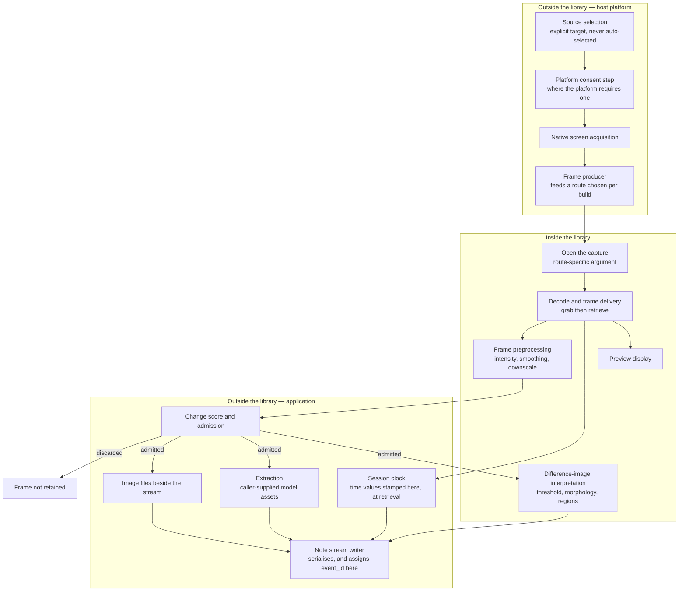
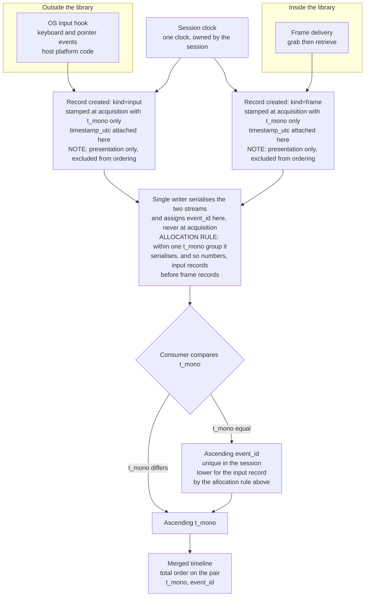

# 1. Capture Pipeline

This document specifies the functional requirements of a screen-capture-and-notetaking
application: a program that records a display region while a user works, notices when the recorded
content changes, correlates those changes with the input events that caused them, and writes the
result as reviewable notes. **That application has no code in this repository.** No source file
here implements any part of it, and nothing below reports existing behaviour of this tree as though
it were the application — every requirement in all six sections is a requirement for a system not
present here.

What this repository does contain is the vision library such an application would consume, and
that is what makes the requirements checkable rather than aspirational. Each requirement therefore
carries exactly one verdict stating whether an existing API satisfies it, with that API cited, or
whether it requires new work. Every repository locator in this document was read against branch
`5.x` at commit `0627765f01be7ea464846ea1e56bbf4e6d861bcf` and is checkable only against that
revision.

The four verdicts have fixed meanings, used identically in all six sections:

| Verdict | Meaning |
|---|---|
| `Supported` | An existing API satisfies the requirement as stated, and the block cites it. |
| `Conditional` | An existing API satisfies it only where a stated condition holds; the block names that condition and cites the API. |
| `Host work` | Nothing in the surveyed modules addresses it; the block names the owner that must build it. |
| `Not Found` | The capability asked for is absent, and the block carries the enumeration that establishes the absence. |

Two conventions apply throughout. A cross-reference of the form
[current-state-capability-map.md §1](./current-state-capability-map.md) points at where a finding
about this tree was established and never stands in for a citation: where a requirement asserts
something about the codebase, a `path:locator` appears with it. And no requirement promises a
number. This repository commits no latency, throughput, frame-rate or accuracy figure, so none is
attributed to it; where a value does appear it is a default this tree declares, cited to the line
that declares it.

## 1.1 What a session is

A session is the unit of work: one continuous recording of one source, from an explicit start to an
explicit stop, producing one note stream (§5). Its lifecycle is ordered in one direction and torn
down in the other. Start acquires the platform source first and opens the capture second, because a
capture opened against a source that has not been acquired has nothing to read. Stop releases the
capture first and the source second, for the same reason in reverse.

Stop is idempotent. The first successful stop writes exactly one session-end record and every later
call writes none — which is what makes a stop that can arrive twice safe without permitting two
ends in one stream. A start that fails releases whatever it had already acquired and leaves no
session at all, so a failed start is never distinguishable from no start by anything a consumer
reads.

## 1.2 Source selection, and the boundary where the library begins

The application selects an explicit source — a named display, monitor or window — and never
auto-selects one. Where the requested source is unavailable, start fails; it does not substitute a
different source, because a note stream silently recording the wrong surface is worse than a
session that did not begin.

The boundary matters more here than anywhere else in this specification. Acquiring screen pixels
from the platform, choosing the target surface and satisfying any consent step the platform imposes
are all outside the library: no backend in this tree targets a display, screen, desktop, window or
monitor, as [current-state-capability-map.md §1](./current-state-capability-map.md) establishes by
enumerating the complete set of concrete backend identifiers
[modules/videoio/include/opencv2/videoio.hpp:91-122].

**The OpenCV-facing boundary begins at ingestion**, and what it supplies from there is a specific
set of primitives rather than the whole of the pipeline. Those primitives are the capture object's
open, grab and retrieve surface
[modules/videoio/include/opencv2/videoio.hpp:864,951,965]; the image-transformation primitives the
change gate is composed from and the difference image is interpreted with (§3.3, §3.4); display,
and input scoped to a window the library owns
[modules/highgui/include/opencv2/highgui.hpp:345,427]; the inference entry points a network is
driven through [modules/dnn/include/opencv2/dnn/dnn.hpp:834,725]; and the writer, where a session is
also retained as encoded video [modules/videoio/include/opencv2/videoio.hpp:1076]. Everything that
orchestrates them is the application's, and this specification assigns it there explicitly: the
admission decision (§3), the session clock and the merge (§2), serialisation and persistence of the
note stream (§5), the orchestration of extraction and the assets it needs (§4), the annotation model
(§5.10) and most of the interface behaviour (§6). So the application is a consumer of the library on
one side and its orchestrator on the other, and the platform-facing half is its own code as well.

**Capture is authorised before it begins, by the application, on every platform.** This session
records a user's screen and — through the stream of §2 — the keys they press, so the decision to
start is not one an application may take on the user's behalf. Some platforms interpose their own
consent step and some interpose none; the requirement here is independent of that, because a
requirement that only applies where the operating system happens to ask would leave the platforms
that ask nothing with silent capture. The application therefore obtains its own authorisation
before it acquires a source, and it exposes a recording state that is observable for as long as
capture is active — observable in the interface (R6.15) and recorded in the stream, so that
"is this recording?" is answerable at any moment and after the fact. Where platform consent is also
required it is satisfied in addition, never instead (R1.14).

**The source is a platform object the session carries forward, never a string someone typed.** How
that object is obtained differs by mechanism, and the difference is structural rather than
incidental — on some mechanisms the target can be listed before anything is chosen, and on others
its identity does not exist until the platform has granted it. This specification therefore fixes
two selection shapes rather than one:

- **Enumerated selection**, where the platform exposes addressable targets and the application can
  list them before the choice is made: a drawable or the root window on the unmediated Linux path,
  a monitor index, a window handle on the oldest of the Windows mechanisms. The application
  enumerates what the platform offers, the user picks one, and the session carries that object's own
  identifier forward.
- **Grant-based selection**, where the target's identity does not exist until the platform grants
  it. The application configures the request — the kinds of source it will accept, and whether it
  asks for persistence — the platform mediates the choice, and the identity of the granted target
  is what that mediation returns. The modern Windows mechanism normally returns its capture item
  from a system picker, and the mediated Linux path returns its granted streams and their serial
  from the operation that starts them, so in neither case is there an object to enumerate
  beforehand. The session normalises what the platform returned into its source identity (§5.5)
  **after** the grant, which is the only point at which there is anything to normalise.

The platform mechanisms and the order each imposes on selection are established in
[platform-capture-gap-assessment.md §1](./platform-capture-gap-assessment.md) and
[platform-capture-gap-assessment.md §3](./platform-capture-gap-assessment.md) and are not
re-derived here. What both shapes hold in common is the ban: what the session carries forward is a
platform object's own identity, or the normalisation of the object the platform granted, and never
anything a user typed or anything read from a window's title. That is a correctness requirement
before it is a security one, because a title is not unique and does not survive the window changing
it; but it is also what keeps an attacker-influenced string — a window title is chosen by whoever
wrote the window's contents — out of the route arguments of §1.3.

**Enumerating the platform's objects and authorising the session do not make the collection
minimal.** An authorisation decides *whether* a session may record; it does not decide *how much*
it records, and the two are separate decisions that a single gate silently merges. A session that
takes a whole monitor when its purpose needs one window has collected everything else on that
monitor — another application's window, a notification as it appears, a credential manager left
open, a document belonging to someone who never agreed to any of it — and every one of those pixels
then flows into the change gate of §3, the extraction of §4 and the retained artefact of §5. So the
authorised scope is the narrowest the purpose allows: one window in preference to a monitor where
the platform can target a window at all, one monitor in preference to every monitor, and a region
within the chosen surface where the purpose needs only that region. What each platform can address
is not uniform, and the width of each is established in
[platform-capture-gap-assessment.md §1](./platform-capture-gap-assessment.md),
[platform-capture-gap-assessment.md §2](./platform-capture-gap-assessment.md) and
[platform-capture-gap-assessment.md §3](./platform-capture-gap-assessment.md) rather than assumed
here.

The scope is enforced upstream of everything, which is the part an implementation is most likely to
defer. The reduction of the acquired surface to the authorised region happens as the first operation
performed on a frame: before the frame is retained, before it is encoded, before the change gate
examines it, before any network of §4 receives it and before it reaches the preview of §6. A crop
applied at presentation time is not minimisation — the wider frame existed, was scored, was possibly
retained and possibly inferred over — so the requirement is an ordering requirement (R1.21).
Regions excluded *inside* the authorised surface are handled on the same terms and by the same
ordering, and their masking is R4.11.

**A scope does not widen without being authorised again.** An authorisation covers the scope it was
granted for, so any expansion is a new decision: a second monitor, an additional window, a wider
region, a smaller region replaced by a larger one, or a target whose identity changed underneath the
session. Where the platform's own mediation can return a session bound to a surface other than the
one a user previously chose — the restored-session case recorded in
[platform-capture-gap-assessment.md §3](./platform-capture-gap-assessment.md) — the session
compares what it was granted against what it asked for and stops rather than recording a surface
nobody selected in this session (R1.22).

**Authorisation is revocable, and the session is interruptible, while it runs.** A user who
authorised a recording must be able to suspend it without ending it and to withdraw the
authorisation outright, and neither can require the user to find the process and kill it. Pause
suspends acquisition, so nothing is captured, scored, extracted or retained while it is in force.
Revocation ends the session: the capture and then the source are released in the order R1.2 fixes,
and the stream gets its single end record (R5.5). Both are reachable from the session controls of
R6.9 and both are recorded (R1.23).

**The decision itself is recorded, and it is recorded outside the note stream.** The purpose the
session was authorised for, the scope granted, the exclusions in force, the subject who authorised
it and the civil time of the decision are written to an **authorisation audit log** beside the note
stream — an artefact of the inventory in §5.11 with every obligation that inventory carries, kept
outside the note stream for the reasons this paragraph gives rather than because the format needs a
second place to state something. Each later change to the
authorisation — a reauthorisation under R1.22, a pause, a resume, a revocation — is appended to it.
It is not a record of the note stream for two reasons: the `kind` set of §5.2 is closed at four
(R5.3), and a revocation is one of the events that can *end* a stream, so the evidence that it
happened cannot live only inside the thing it ended. What the recorded purpose binds is every class
of data the session derives from the authorised scope — the pixels retained, the source identity
recorded, the text extracted from those pixels and the actions derived from them — each collected
for that purpose and for no other (R1.24, R4.12).

## 1.3 Route selection is decided per build, not fixed here

Two documented routes admit an externally produced frame source, and they are owned in full — with
the condition each carries — by [current-state-capability-map.md §1](./current-state-capability-map.md).
This specification deliberately does not restate the mechanism. A second description of a route is
exactly where its condition gets dropped, and a route stated without its condition is a fabrication
rather than a simplification.

What this specification fixes is the selection policy. The route is chosen from those verified
available in the target build, not declared in advance: the pipeline-string route where the
media-framework backend and the required source element are both present, or the
environment-mediated input-format route where the device-opening support and the required demuxer
are both present. Where neither is verified, start fails explicitly. This follows from preferring
the option that adds least to a given build rather than mandating one route whose dependencies may
be absent, and the flags that decide availability are inventoried in
[technical-inventory.md §5](./technical-inventory.md).

Fallback from one route to the other is permitted only where both resolve to the same normalised
source identity (§5). Absent an equivalence mapping between the two routes' own addressing, there
is no fallback — a stream whose recorded source changed meaning midway is not a timeline anyone can
review.

**Both routes take a string that something else parses, and that is what constrains how the
argument is built.** The pipeline-string route hands its argument to the media framework's own
parser when the argument is neither a valid URI nor an existing file
[modules/videoio/src/cap_gstreamer.cpp:1432,1438], so the string decides which elements exist and
what properties they carry. The environment-mediated route's options are parsed as a
delimiter-separated list, `";"` separating a key from its value and `"|"` separating one pair from
the next [modules/videoio/src/cap_ffmpeg_impl.hpp:1197], read from a single variable
[modules/videoio/src/cap_ffmpeg_impl.hpp:1184]. Three rules follow, and they are requirements
(R1.18 through R1.20):

- No untrusted value is interpolated into either argument. The source identity comes from the
  enumerated or granted platform object of §1.2, so the value placed in a route argument is an
  index, a handle or a serial the platform issued — never a window title, a user-typed string or
  anything else whose content someone outside the application chose.
- A value that carries the route's own delimiters or metacharacters is **rejected**, not escaped.
  For the options grammar that means a value containing `;` or `|`; for the pipeline route it means
  a value carrying the parser's own separators or property syntax. Rejection rather than escaping,
  because an escaping rule is a second parser the application would have to keep in step with the
  one it is feeding, and start failing explicitly is a defined outcome here (R1.7).
- The elements and properties a route argument may name are drawn from an allowlist the application
  holds. A route argument is assembled from that allowlist and the enumerated source identifier and
  from nothing else, so the set of components a session can instantiate is fixed by the application
  rather than by its inputs.

**The argument is one half of a route's input; the channel that carries it is the other half, and
the two routes differ there.** The pipeline-string route takes its argument as a parameter of the
open call [modules/videoio/include/opencv2/videoio.hpp:864], so the value the parser receives is the
value the application passed. The environment-mediated route does not work that way: the options it
applies are read at open time from a single named variable in the process's own environment
[modules/videoio/src/cap_ffmpeg_impl.hpp:1184], and nothing at that read distinguishes a value this
application wrote from a value the process was already carrying. Whatever arrives is what gets
parsed into the open's option dictionary [modules/videoio/src/cap_ffmpeg_impl.hpp:1197]. A route
builder that assembles a faultless option string and then opens a capture over a channel it has not
taken charge of has validated the argument and left the input open, and the rules above buy nothing
there. Four rules close it, and they are requirements (R1.25 through R1.27).

- **The variable is untrusted input, not configuration, and it is overwritten rather than
  inspected.** Immediately before opening a capture on that route the session writes the value it
  assembled from its own allowlist, and writes an empty value where it needs no options; it never
  leaves in place, and never merges with, whatever the variable held. Inspecting an inherited value
  and deciding it looks acceptable is a parser the application would be writing against a grammar
  the library owns [modules/videoio/src/cap_ffmpeg_impl.hpp:1197], which is the same mistake as
  escaping instead of rejecting.
- **The channel is process-wide while the argument is per-session, so the process is part of the
  contract.** A session that opens on this route runs in a process whose environment the application
  controls, and no other capture in that process opens while the value is in force — two captures
  opening concurrently on that route read one variable and the second reader sees whatever the first
  writer left. Where the application cannot establish that control, the route is not available to it
  and start fails explicitly (R1.7) rather than opening a capture whose options nobody in the
  application wrote (R1.25).
- **No secret and no control character goes into a route argument or an option value.** A
  credential, a token or a header carrying either is rejected outright rather than carried in a
  value that will be copied into a diagnostic; a control character is rejected for the reason the
  delimiter rule already gives, and a line break most of all, because a line break in a value that
  reaches a log turns one log line into two and lets the content of a recorded string impersonate a
  record the application never wrote (R1.26).
- **The library keeps a copy of this value, and the specification accounts for it rather than
  discovering it later.** When the variable is non-empty the full option string is written to the
  diagnostic log at debug level [modules/videoio/src/cap_ffmpeg_impl.hpp:1195]. A deployment running
  at that level therefore has the option string in its logs, which is why the value is built so that
  its presence there discloses nothing (R1.26), why that log is one of the artefacts inventoried in
  §5.11, and why a deployment that cannot keep a sensitive value out of the string disables that
  diagnostic instead of accepting the copy. The same neutralisation applies to the application's own
  logs: any value that originated outside the application has its line breaks and control characters
  removed before it is written to one (R1.27).

## 1.4 Frame rate and resolution are expressed against knobs, not targets

A screen-capture session trades frame rate against resolution and against the cost of everything
downstream of acquisition: a large surface captured often produces more pixels per second for the
change gate (§3) to examine and more images to retain (§5). This specification expresses that
tradeoff against the configuration surface that exists and assigns it no figures.

Capture configuration is untyped, by integer property identifier
[modules/videoio/include/opencv2/videoio.hpp:131-211]. The four knobs the tradeoff is expressed
against are frame width and height [modules/videoio/include/opencv2/videoio.hpp:136,137], frame
rate [modules/videoio/include/opencv2/videoio.hpp:138] and buffer size
[modules/videoio/include/opencv2/videoio.hpp:172]. The enumeration assigns each identifier a
meaning and no value; which of them a given backend honours is the backend's business.

What follows is a requirement rather than advice, and it is stated at the width the library's own
documentation supports rather than one step further. **A read-back value is not proof of effect.**
The setter's own note says that even when it returns true this "doesn't ensure that the property
value has been accepted by the capture device"
[modules/videoio/include/opencv2/videoio.hpp:995-998], and the getter's note says the value it
returns "might be different from what really used by the device" and may be encoded by
device-dependent rules [modules/videoio/include/opencv2/videoio.hpp:1007-1017]. So there are three
different values here, they are named separately throughout this specification, and no requirement
treats one as another:

- **Requested** — the value the session asked for through the property setter or the open
  parameters. It is a request and nothing more.
- **Backend-reported** — the value the property getter returns
  [modules/videoio/include/opencv2/videoio.hpp:1000-1017]. It carries both caveats above: it is
  what the layers below report, not a guarantee of what the device is doing, and it may be encoded
  in the device's own units.
- **Observed** — what the delivered frames actually show: the dimensions of the frames the session
  receives, read from the frames themselves, and the delivery cadence measured over the frames as
  they arrive.

The session records all three, and where they disagree the observed values are what describe the
session. Only observed values may be presented to a user or a consumer as what was captured; a
backend-reported value is recorded as a report, never as the effective configuration.

Where a deployment needs a specific rate or resolution, that figure is a product decision this
specification does not supply, and the affected acceptance criterion is blocked pending that
decision rather than filled with a number this repository does not commit.

## 1.5 Open and read timeouts

Two timeout identifiers are declared, both documented open-only and both documented as applicable
to the FFmpeg and GStreamer back-ends only
[modules/videoio/include/opencv2/videoio.hpp:187-188]. Those lines establish that the identifiers
exist and what they apply to; they set no value. The values live in each back-end independently,
where both define a 30-second default —
[modules/videoio/src/cap_ffmpeg_impl.hpp:261-262] and
[modules/videoio/src/cap_gstreamer.cpp:83-84].

For an interactive capture session a stall of that length on open or read is a user-visible
failure, so the session sets both explicitly through the integer parameter vector the open
overloads accept [modules/videoio/include/opencv2/videoio.hpp:877,901] rather than inheriting
them. The narrow applicability is part of the requirement: on a back-end outside those two the
identifiers buy nothing, and the session's own supervision is what bounds a stalled open.

## 1.6 Delivery is pull-driven, and readiness notification is narrow

Nothing in the capture surface hands the application a frame unasked. Acquisition is a two-step
pull, `grab` [modules/videoio/include/opencv2/videoio.hpp:951] then `retrieve`
[modules/videoio/include/opencv2/videoio.hpp:965], with `read`
[modules/videoio/include/opencv2/videoio.hpp:987] as the combined call, and the plugin ABI carries
the same shape with no push or event-driven entry point
[modules/videoio/src/plugin_capture_api.hpp:92,103]. The claim is scoped deliberately: it is a
property of the plugin ABI and of back-ends other than V4L, not of the module as a whole.

One readiness API exists, `waitAny`
[modules/videoio/include/opencv2/videoio.hpp:1035-1053], documented for multi-camera environments.
Its implementation requires every capture in the call to share one backend and dispatches only to
V4L, raising an error outside it [modules/videoio/src/cap.cpp:629-652]. A screen-capture session on
any other back-end therefore polls, and that is the architectural fact §3 builds the change gate
on: the gate sits above the capture object, not inside it.

## 1.7 The pipeline, and where the boundary falls

The diagram's subject is the boundary itself rather than the sequence of stages: which parts of a
capture-to-notes pipeline the library performs, and which the application and the host platform
must perform around it.

Read unrendered, its conclusion is this: the library owns the middle of the pipeline — opening a
source, delivering frames, transforming them and displaying them — while both ends are the
application's and the platform's. Acquisition, target selection and consent precede it; the
admission decision, the session clock, extraction and the note artefact follow it. Two arrows carry
requirements rather than description: delivery reaches the preview directly, because the preview
shows captured frames and not admitted ones (§6.4), and it reaches the session clock directly,
because a frame's time values are read at the moment it is retrieved and not at the moment it is
written (§2.4). The clock stage supplies those time values and nothing else — the sequence number
is issued later, by the writer stage, as it serialises each record — so a record leaves the clock
stage stamped and unnumbered (§2.4, R2.4).

## 1.8 Requirements

- **R1.1** Session start shall open a capture against an explicitly identified source.

  Verdict: Supported

  Basis: three open shapes across five overloads — by device index
  [modules/videoio/include/opencv2/videoio.hpp:888,901], by filename or pipeline string
  [modules/videoio/include/opencv2/videoio.hpp:864,877], and by a caller-supplied stream reader
  with a typed integer parameter vector [modules/videoio/include/opencv2/videoio.hpp:914] — with
  open state queryable [modules/videoio/include/opencv2/videoio.hpp:921]. The shapes and the way
  open resolves to a backend are established in
  [current-state-capability-map.md §1](./current-state-capability-map.md).

- **R1.2** The session shall acquire the platform source before opening the capture and release in
  the reverse order.

  Verdict: Host work

  Owner: host platform code acquires the surface, one implementation per target; the application's
  session controller owns the ordering. The library contributes the inner half of each step only —
  opening a capture [modules/videoio/include/opencv2/videoio.hpp:864] and releasing it
  [modules/videoio/include/opencv2/videoio.hpp:930].

- **R1.3** A failed start shall release everything it acquired and leave no session.

  Verdict: Host work

  Owner: the application's session controller. Failure to open is reported by the open overload's
  return value and by `isOpened` [modules/videoio/include/opencv2/videoio.hpp:921]; unwinding the
  platform source acquired before that call is the application's, and no library call knows the
  source exists.

- **R1.4** Stop shall be idempotent, the first successful stop writing exactly one session-end
  record and later calls writing none.

  Verdict: Host work

  Owner: the application's session controller, which owns session state; the record it writes and
  the guarantee that exactly one exists are specified in §5. Releasing the capture is a single
  documented call [modules/videoio/include/opencv2/videoio.hpp:930] and carries no session
  semantics.

- **R1.5** The application shall select an explicit source and shall never auto-select one; an
  unavailable source fails the start rather than being substituted.

  Verdict: Host work

  Owner: the application. The distinction to keep is that backend auto-detection is a separate
  matter with its own sentinel in the capture-API enumeration
  [modules/videoio/include/opencv2/videoio.hpp:92] — it selects who reads the source, never which
  source is read, and the surface being recorded has no such sentinel anywhere in the open
  contract.

- **R1.6** Screen frames shall reach the capture object through a route chosen from those verified
  available in the target build.

  Verdict: Conditional

  Condition: the pipeline-string route needs the media-framework backend present and a pipeline
  terminating in an appsink named `appsink0` or `opencvsink`
  [modules/videoio/src/cap_gstreamer.cpp:1343]; the environment-mediated route needs a build with
  device-opening support compiled in [modules/videoio/src/cap_ffmpeg_impl.hpp:1213] and reaches
  only a demuxer nameable through the capture-options variable
  [modules/videoio/src/cap_ffmpeg_impl.hpp:1184]. The pipeline string is part of the documented
  open contract [modules/videoio/include/opencv2/videoio.hpp:799-805]. Both routes are owned in
  full by [current-state-capability-map.md §1](./current-state-capability-map.md), and the build
  flags that decide availability by [technical-inventory.md §5](./technical-inventory.md).

- **R1.7** Where no route is verified available in the target build, start shall fail explicitly
  rather than degrade silently.

  Verdict: Host work

  Owner: the application's route-resolution step, which runs before the capture is opened. The
  library reports the outcome of an attempt [modules/videoio/include/opencv2/videoio.hpp:921];
  whether a route was available to attempt is a fact the application establishes for itself, and
  nothing in the registry surface answers it for a screen source.

- **R1.8** Fallback between routes shall be permitted only where both resolve to the same
  normalised source identity.

  Verdict: Host work

  Owner: the application, which holds the equivalence mapping between the two routes' own
  addressing; the normalised identity every record carries is specified in §5. Where no such
  mapping exists, there is no fallback.

- **R1.9** Capture rate and frame size shall be requested through the capture properties, and the
  requested, backend-reported and observed values shall all be recorded, with the observed values
  taken as the description of the session.

  Verdict: Conditional

  Condition: the property enumeration assigns each identifier a meaning and no value
  [modules/videoio/include/opencv2/videoio.hpp:131-211] — width and height
  [modules/videoio/include/opencv2/videoio.hpp:136,137], rate
  [modules/videoio/include/opencv2/videoio.hpp:138], buffer size
  [modules/videoio/include/opencv2/videoio.hpp:172] — and which of them a back-end honours is the
  back-end's business. The setter documents that a true return "doesn't ensure that the property
  value has been accepted by the capture device"
  [modules/videoio/include/opencv2/videoio.hpp:995-998] and the getter documents that its value
  "might be different from what really used by the device"
  [modules/videoio/include/opencv2/videoio.hpp:1007-1017], so read-back is a report and is never
  recorded as the effective configuration. The observed values — the dimensions of the frames the
  session receives and the cadence measured as they arrive — are the application's to derive from
  the delivered frames, and they are what §5.2's `session` record carries as what was captured. The
  inventory of these knobs is [technical-inventory.md §1](./technical-inventory.md).

- **R1.10** Open and read latency shall be bounded explicitly rather than inherited from the
  back-end default.

  Verdict: Conditional

  Condition: both identifiers are documented open-only and applicable to the FFmpeg and GStreamer
  back-ends only [modules/videoio/include/opencv2/videoio.hpp:187-188], and each of those two
  back-ends defines its own 30-second default
  [modules/videoio/src/cap_ffmpeg_impl.hpp:261-262],
  [modules/videoio/src/cap_gstreamer.cpp:83-84]. Values are supplied through the integer parameter
  vector the open overloads accept [modules/videoio/include/opencv2/videoio.hpp:877,901]. Outside
  those two back-ends the identifiers buy nothing and the session's own supervision bounds the
  attempt.

- **R1.11** Frame acquisition shall be driven by the application; no frame arrives unasked.

  Verdict: Supported

  Basis: the two-step pull `grab` [modules/videoio/include/opencv2/videoio.hpp:951] then
  `retrieve` [modules/videoio/include/opencv2/videoio.hpp:965], with `read`
  [modules/videoio/include/opencv2/videoio.hpp:987] as the combined call; the plugin ABI carries a
  grab entry point and a retrieve entry point with a copy-out callback and no push entry point
  [modules/videoio/src/plugin_capture_api.hpp:92,103]. Scoped to the plugin ABI and to back-ends
  other than V4L: readiness notification reaches V4L alone (R1.12), so on every route a screen
  source arrives by, nothing arrives unasked.

- **R1.12** The session shall be able to learn that a source has a frame ready without polling it.

  Verdict: Not Found

  Evidence: two enumerations meet here and their intersection is empty. The readiness facilities
  the capture surface offers are one, `waitAny`
  [modules/videoio/include/opencv2/videoio.hpp:1035-1053], documented for multi-camera
  environments; its implementation requires every capture in the call to share one backend and
  dispatches to V4L alone, raising an error for every other back-end
  [modules/videoio/src/cap.cpp:629-652]. The routes by which a screen source reaches the capture
  object are two, and both are served by back-ends that dispatch does not admit — the pipeline
  route by GStreamer [modules/videoio/src/cap_gstreamer.cpp:1343] and the environment-mediated
  route by FFmpeg [modules/videoio/src/cap_ffmpeg_impl.hpp:1184] (R1.6). No capture-property
  identifier reports readiness either
  [modules/videoio/include/opencv2/videoio.hpp:131-211]. Both enumerations are recorded in
  [current-state-capability-map.md §1](./current-state-capability-map.md) and
  [technical-inventory.md §1](./technical-inventory.md). The consequence is the one §3 is built on:
  a screen route polls, and the change gate sits above the capture object rather than being
  signalled through it.

- **R1.13** Where a session is retained as encoded video alongside its notes, retention shall use
  the library's writer.

  Verdict: Supported

  Basis: `VideoWriter` [modules/videoio/include/opencv2/videoio.hpp:1076] with `open`
  [modules/videoio/include/opencv2/videoio.hpp:1150], `write`
  [modules/videoio/include/opencv2/videoio.hpp:1201], `release`
  [modules/videoio/include/opencv2/videoio.hpp:1177] and the four-character-code helper
  [modules/videoio/include/opencv2/videoio.hpp:1230], with its own property enumeration
  [modules/videoio/include/opencv2/videoio.hpp:216-235]. One of those properties is easy to
  misread: the writer's presentation-timestamp property
  [modules/videoio/include/opencv2/videoio.hpp:230] is metadata the caller supplies to the encoder
  and carries no observation of when anything was captured (§2). An encoded session is a second
  complete copy of everything the authorised surface displayed, denser than the retained images and
  independent of them, so it is one of the artefacts inventoried in §5.11 and carries every
  obligation that inventory places on a copy — access applied at creation, a retention deadline,
  the erasure limits stated honestly, and protection in transit if it ever leaves the machine
  (R5.36 through R5.40). The writer opens a file and writes frames into it
  [modules/videoio/include/opencv2/videoio.hpp:1150,1201]; it applies none of those, and nothing in
  the surveyed modules does.

- **R1.14** Native screen acquisition, target selection and any platform consent step shall sit
  outside the library.

  Verdict: Host work

  Owner: host platform code, one implementation per target, feeding a route from R1.6. The finding
  this rests on — that no concrete backend in this tree targets a display surface — is established
  by enumeration in [current-state-capability-map.md §1](./current-state-capability-map.md) over
  the capture-API enumeration [modules/videoio/include/opencv2/videoio.hpp:91-122].

- **R1.15** A screen source that is discoverable and selectable in the way a camera or a file is —
  queryable from the registry and addressable by a typed identifier.

  Verdict: Not Found

  Evidence: the capture-API enumeration declares 30 enumerators
  [modules/videoio/include/opencv2/videoio.hpp:91-122], of which six are aliases of another value
  and one is the auto-detect sentinel [modules/videoio/include/opencv2/videoio.hpp:92], leaving 23
  concrete backend identifiers; every one names a camera family, a media framework, an
  image-sequence reader or a capture SDK. The public registry exposes the full backend set and the
  camera, stream, buffered-stream and writer subsets
  [modules/videoio/include/opencv2/videoio/registry.hpp:30-42] and no display, screen or monitor
  subset. The enumeration is complete over the structure that would have to contain such a source
  and is recorded in [current-state-capability-map.md §1](./current-state-capability-map.md) and
  [technical-inventory.md §1](./technical-inventory.md). R1.6 is what makes the absence survivable:
  frames reach the capture object without the source being first-class.

- **R1.16** No capture shall begin without an application-level authorisation step, on every
  platform, including those on which the operating system requires nothing.

  Verdict: Host work

  Owner: the application's session controller, which runs the step before it acquires a source
  (§1.1), and host platform code where a platform imposes its own consent step in addition. The
  library contributes nothing to this and cannot: the call that starts reading frames
  [modules/videoio/include/opencv2/videoio.hpp:864] has no notion of a user or a permission, so an
  authorisation gate that is not in the application does not exist at all. Platform mediation is not
  a substitute, because it is absent on some targets and its presence is a deployment property
  rather than a contract (R1.14).

- **R1.17** While capture is active the session shall expose a recording state that is observable
  both in the interface and in the note stream.

  Verdict: Host work

  Owner: the application, which holds the state; the interface half is R6.15 and the stream half is
  the `session` lifecycle record of §5.2. The requirement is what makes unattended recording
  detectable by the person being recorded: a session whose only evidence is its output file is
  indistinguishable from no session while it runs.

- **R1.18** The captured source shall be identified by a platform object — enumerated where the
  mechanism exposes its targets directly, and normalised from the platform's grant where the
  identity does not exist until it is granted — no free-form string shall identify a source, and the
  object identified shall be the narrowest of those the platform offers for the purpose the session
  was authorised for.

  Verdict: Host work

  Owner: the application, over what host platform code provides in each of the two selection shapes
  of §1.2: an enumeration where the mechanism has one, such as a monitor index or a window handle,
  and the object a system picker or a mediated session returns where it does not, such as a portal
  stream serial. In the second shape the normalisation into the session's source identity happens
  after the grant, because there is nothing to normalise before it — a stream serial or a capture
  item is issued by the act of granting, not listed in advance. The route argument then carries that
  identifier; what the platform reports as a window's title is display text for the user's choice and
  never the identity carried forward. The narrowness clause is the minimisation half of the same
  choice and is not satisfied by identification alone: enumerating three monitors and taking all
  three identifies platform objects and is also the widest possible collection. Which mechanism falls
  in which shape, and which granularities a platform actually offers, differ per target and are
  established in [platform-capture-gap-assessment.md §1](./platform-capture-gap-assessment.md),
  [platform-capture-gap-assessment.md §2](./platform-capture-gap-assessment.md) and
  [platform-capture-gap-assessment.md §3](./platform-capture-gap-assessment.md); the region-level
  reduction that follows the platform's own granularity is R1.21.

- **R1.19** No untrusted value shall be interpolated into a route argument, and a value carrying
  the route's own delimiters, its metacharacters or any control character shall be rejected rather
  than escaped.

  Verdict: Host work

  Owner: the application's route-argument builder. The pipeline-string route's argument is parsed
  by the media framework itself when it is neither a valid URI nor an existing file
  [modules/videoio/src/cap_gstreamer.cpp:1432,1438], and the environment-mediated route's options
  are parsed as pairs separated by `";"` and `"|"`
  [modules/videoio/src/cap_ffmpeg_impl.hpp:1197] read from one variable
  [modules/videoio/src/cap_ffmpeg_impl.hpp:1184] — so in both cases the string decides what is
  instantiated. Rejection is specified in preference to escaping because an escaping rule
  duplicates the parser it feeds, and a rejected source fails the start explicitly (R1.7). Control
  characters are rejected on the same reasoning and for a second reason as well: the library copies
  the whole option string into its diagnostic log [modules/videoio/src/cap_ffmpeg_impl.hpp:1195], so
  a line break admitted into a value is a line break admitted into a log (R1.26, R1.27).

- **R1.20** The elements and properties a route argument may name shall be drawn from an allowlist
  the application holds.

  Verdict: Host work

  Owner: the application. A route argument is assembled from the allowlist plus the
  platform-issued source identifier of R1.18 and from nothing else, which bounds the set of
  components a session can instantiate to a set the application chose. The pipeline route additionally has to satisfy
  the sink-naming condition of R1.6 [modules/videoio/src/cap_gstreamer.cpp:1343], so the allowlist
  is what a valid argument is built from rather than a filter applied to an arbitrary one.

- **R1.21** The captured scope shall be reduced to the authorised region before a frame is
  retained, encoded, scored by the change gate, passed to a model or presented, and a pixel outside
  that region shall reach none of those stages.

  Verdict: Host work

  Owner: the application, as an ordering constraint on its own pipeline, with host platform code
  selecting the narrowest target the platform offers (R1.18). The library has no notion of an
  authorised region: the open call takes a source and the read calls return whatever that source
  delivers [modules/videoio/include/opencv2/videoio.hpp:864,987], so a session handed a surface
  wider than its authorisation is holding those pixels until its own first operation removes them.
  The requirement is therefore about position in the pipeline and not about the existence of a
  reduction operation: a reduction applied before presentation, after scoring or after retention
  leaves a wider frame that was scored, possibly written and possibly inferred over, and no later
  step can unwrite it. The exclusion of regions inside the authorised surface is the same ordering
  with a different operation (R4.11), and the transform this reduction constitutes is the one both
  streams of §2.1 share, so a pointer position recorded against it stays comparable with the frame
  it is evaluated against.

- **R1.22** An authorised scope shall not widen without a new authorisation, and a session whose
  granted scope differs from the scope it requested shall stop rather than capture under it.

  Verdict: Host work

  Owner: the application's session controller, which holds the granted scope and compares it against
  every subsequent grant. Expansion covers a second monitor, an additional window, a wider region
  and a target whose identity changed underneath the session. The comparison matters most where the
  platform's mediation can return a session bound to a surface the user did not choose in this
  session — the restored-session case established in
  [platform-capture-gap-assessment.md §3](./platform-capture-gap-assessment.md) — and the library
  cannot help: the open call reports whether a capture opened
  [modules/videoio/include/opencv2/videoio.hpp:921] and knows nothing about which surface a
  platform decided to hand over. Stopping is the specified outcome for a mismatch, on the same
  reasoning as R1.5: a stream recording a surface nobody selected is worse than a session that
  ended.

- **R1.23** The session shall be pausable, and its authorisation revocable, while it runs; a pause
  shall suspend acquisition and a revocation shall stop the session.

  Verdict: Host work

  Owner: the application's session controller, exposing both through the session controls of R6.9.
  While a pause is in force nothing is captured, scored, extracted or retained — a pause that only
  suppressed writing would still be reading the user's screen. A revocation releases the capture and
  then the source in the order R1.2 fixes and produces the single end record of R5.5. Neither is
  something the library can offer: releasing a capture is one call
  [modules/videoio/include/opencv2/videoio.hpp:930] and carries no session, authorisation or user
  semantics whatever. Both transitions are recorded (R1.24) and both are visible while they hold
  (R1.17, R6.15), because a recording a user believes is paused and is not is the failure this
  requirement exists to prevent.

- **R1.24** The purpose, the authorised scope, the exclusions in force and the authorising subject
  shall be recorded in an authorisation audit log beside the note stream, and every reauthorisation,
  pause, resume and revocation shall be appended to it.

  Verdict: Host work

  Owner: the application's session controller, which writes the log; the log is an artefact of the
  inventory in §5.11 and carries that inventory's obligations (R5.36 through R5.40). It sits beside
  the note stream rather than inside it for two reasons, both structural: the `kind` set of §5.2 is
  closed at four (R5.3), and a revocation is one of the events that can end a stream, so evidence
  that an authorisation changed cannot live only inside the artefact the change terminated. The
  recorded purpose is what bounds every derived class of data — retained pixels, source identity,
  extracted text and derived actions — to the collection it was authorised for (R4.12), which is
  what makes "authorised" a decision with a scope rather than a single yes.

- **R1.25** Where a route's options are carried by the process environment, the session shall
  overwrite that value from its own allowlist immediately before open, shall run in a process whose
  environment it controls with no other capture opening on that route concurrently, and shall treat
  the route as unavailable where it cannot establish that control.

  Verdict: Host work

  Owner: the application. The value is read at open time from one named variable
  [modules/videoio/src/cap_ffmpeg_impl.hpp:1184] and parsed straight into the open's option
  dictionary [modules/videoio/src/cap_ffmpeg_impl.hpp:1197], and nothing at that site tells the
  library who wrote it — so an inherited value is an input to the open that the route-argument rules
  of R1.19 and R1.20 never see. Overwriting rather than inspecting is specified because inspecting
  would mean re-implementing the library's own grammar in the application, which is the escaping
  mistake under another name; writing an empty value is the correct overwrite where the session
  needs no options. The concurrency clause follows from the channel being process-wide while the
  argument is per-session: two captures opening on that route in one process read one variable, and
  the second reader gets whatever the first writer left. Failing closed is the specified outcome
  (R1.7), because a capture opened with options nobody in the application wrote is a capture whose
  behaviour the application cannot describe.

- **R1.26** No credential, token or other secret, and no control character, shall appear in a route
  argument or an option value; a value carrying one shall be rejected.

  Verdict: Host work

  Owner: the application's route-argument builder, applying the rule before the value is written to
  the channel of R1.25 or passed to the open call
  [modules/videoio/include/opencv2/videoio.hpp:864]. Rejection rather than transformation, per
  R1.19. The secret clause is not hypothetical for an options grammar that can carry transport
  headers: a secret placed in that string is a secret in every copy of it, including the diagnostic
  copy the library writes [modules/videoio/src/cap_ffmpeg_impl.hpp:1195]. The control-character
  clause covers line breaks first, because a line break is what lets one recorded value appear as
  two log records.

- **R1.27** The diagnostic copy of the option string shall be accounted for, and any value
  originating outside the application shall have its line breaks and control characters removed
  before it is written to a log.

  Verdict: Host work

  Owner: the application, for its own logs and for the deployment's log configuration. The library
  writes the whole option string to its diagnostic log at debug level when the variable is non-empty
  [modules/videoio/src/cap_ffmpeg_impl.hpp:1195], so a deployment running at that level holds a copy
  of every option a session opened with; that log is therefore one of the inventoried artefacts of
  §5.11 (R5.36) and a deployment that cannot keep a sensitive value out of the string disables the
  diagnostic rather than accepting the copy. The neutralisation clause is separate and wider: window
  titles, platform-reported identities, recognised text and any other value the application did not
  author are all values a log may end up carrying, and a log line has to be one record of one event
  for a log to be evidence of anything.

# 2. Event Correlation Model

A note that says the screen changed is worth little; a note that says the screen changed *because
the user clicked here* is the application's entire value. That correlation is what this section
specifies, and it specifies it completely — the merge is a contract with an ordering key, a
tie-breaking rule and a stamping rule, not an intention to align two streams later.

## 2.1 Two streams, one of which the library does not carry

The timeline is a merge of two streams. The frame stream comes from §1 and is pulled by the
application. The input-event stream is a sequence of operating-system keyboard and pointer events,
and the library does not carry it: its input delivery is scoped to a window it owns itself.

The complete pointer-event enumeration is twelve types, and the first of them is documented as
movement "over the window" [modules/highgui/include/opencv2/highgui.hpp:128-141]; the callback that
receives them is registered against a window by name
[modules/highgui/include/opencv2/highgui.hpp:427]; and keyboard input arrives only as a key code
returned from the event-pump calls [modules/highgui/include/opencv2/highgui.hpp:271,291,305], which
are documented to work only while at least one window exists and is active
[modules/highgui/include/opencv2/highgui.hpp:282-287]. The window-scoped finding is established in
[current-state-capability-map.md §3](./current-state-capability-map.md).

Declaring the input stream external fixes its verdict; it does not reduce what this section owes.
An external component producing events nobody can align with frames is useless, so the contract
that makes such a stream consumable is specified here rather than deferred to whoever writes the
hook. That contract has four parts: which events are retained at all, what an event record carries,
what coordinate space its positions are in, and how an event is paired with a frame. The first
three are below; pairing belongs with the rules that consume it and is fixed in §4.4.

**What an `input` record is.** An `input` record is one operating-system keyboard or pointer event
supplied by the external capture component — the stream this section specifies — and nothing else.
It carries the event's type, the payload that type defines, and the identity of the surface the
event occurred over where the platform reports it (R2.10). That definition and the four-value
taxonomy it belongs to are fixed by §5.2, and the taxonomy and the common field set are fixed as
not configurable (§5.9), so this kind is not a place to carry anything the platform did not
deliver. The consequence for the user's own annotations, whose revisions need a record of some
kind, is a constraint rather than a redefinition here: §5.10 specifies everything about a revision
that does not depend on which record carries it and records the carrier itself as an open
specification decision.

**The hook is desktop-wide, and the filter is what makes that acceptable.** An
operating-system-level hook does not receive the events that landed on the captured surface; it
receives the events, and which surface each one landed on is a separate question the platform
answers only where it can (R2.10). That is the hazard of this stream stated plainly: a hook
installed to correlate a user's work with a recording of one window also observes what they type
into their credential manager, their messages and every other window they touch while the session
runs. Receiving an event and retaining one are therefore two decisions in this specification, and
the second is restrictive. An event is serialised only where **both** hold — the platform reports it
as having occurred over the surface the session was authorised for (§1.2), and it is an input to the
correlation of this section or to the aggregation of §4.4. An event the platform attributes to
another surface, and an event whose surface the platform does not report at all, are discarded
before serialisation: not written and flagged, because a record in the stream is a copy no later
policy can revoke, and not sorted out by a consumer, because every consumer is downstream of the
write (R2.13).

**Two questions, asked in one order, and never merged.** The subsection below bounds what a
retained event's payload may carry, and the two rules are about different things: surface
attribution decides **whether an `input` record exists at all**, and the character rules decide
**what the payload of a record that already exists may hold**. They are asked in that order and the
first one is unconditional. No rule in this specification — including the narrowly authorised
character exception of R2.15 — admits an event that failed attribution, because none of them is a
statement about surfaces: an exception permitting character content cannot establish that an event
of unknown surface occurred over the authorised one, and an exception granted for one surface says
nothing about an event that landed on another. So an event the platform attributes elsewhere, and an
event the platform does not attribute at all, have no record in any circumstance and under any
setting, and the only thing an exception can ever change is a field inside a record that passed the
gate (R2.13, R2.17).

The filter costs the timeline something, and the cost is stated rather than hidden. A user typing
into another window is doing something this stream will not contain, so a segment covering it can
look quiet. Absence of retained input events is therefore never read as absence of user activity:
the `unattended_change` rule of §4.4 is defined over retained events and means exactly that no
event attributed to the authorised surface was retained in that segment (R2.16). The alternative —
retaining unattributable events so that the timeline looks complete — produces a desktop-wide
keystroke record with a note-taking feature attached, and no rule in this specification can consume
those events anyway.

**The payload, by event type.** An `input` record carries an `event_type` of exactly one of seven
values, and each fixes the payload fields that follow it.
Positions obey the coordinate rules below; the minimisation and redaction rules of R2.11, R2.12,
R2.14 and R2.15 apply to every payload before it is written, and are the reason this list is a
maximum rather than a mandate. This table names what each type *carries*; the record's shape does
not vary with its type, because a field a type does not carry is written `null` rather than omitted.
Each field's exact type, its closed member set where it has one and its bound are fixed once, in the
schema of §5.13, which is also where the sets this specification declares as its own — key classes,
modifiers, buttons, scroll axes — are enumerated.

| `event_type` | Payload fields |
|---|---|
| `key_down` | `key_class`, the class of key pressed; `key`, the character or key identifier, subject to R2.11 and R2.15; `modifiers`, the set of modifier keys held; `repeat`, whether the platform reported this as an auto-repeat. |
| `key_up` | `key_class`, `key` subject to R2.11 and R2.15, and `modifiers`. |
| `secure_input` | None: `key_class`, `key`, `modifiers` and `repeat` all carry `null`. One such record replaces a contiguous run of key events the platform marked as secure or password-bearing, and carries no character, class, modifier set, count or duration (R2.14). |
| `pointer_down` | `button`, which button went down; `position` and `position_normalised`; `modifiers`. |
| `pointer_up` | `button`, `position`, `position_normalised`, `modifiers`. |
| `pointer_move` | `position`, `position_normalised`, and `buttons`, the set of buttons held during the move. |
| `scroll` | `axis`, `delta`, `position`, `position_normalised`, `modifiers`. |

**The coordinate space, and the events that are not in it.** A pointer position is recorded in the
captured surface's own pixel coordinate space, **after the same crop and downscale transform that
was applied to the frames**, with its origin at the captured surface's top-left corner — and it is
recorded that way **only where the event occurred over the captured surface**. The transform is one
documented function the application owns and applies to both streams — the frame it retains and the
event position it records — because a position computed under a different transform from the frame
it is compared against cannot be tested against that frame's changed regions at all. Where a
deployment enables the optional downscale of §3.3, that downscale is part of the transform for both
streams.

Each retained position is recorded twice: as that integer pixel pair, and as
`position_normalised`, a fractional pair on the closed unit interval from zero to one relative to
the captured surface's width and height. The normalised form is what a consumer needs when it has no
knowledge of the display's scaling, the platform's device-pixel ratio or the crop that was in force,
and it stays meaningful when the same session is reviewed on another machine. Both forms are
recorded because each is lossy in the other's direction: the pixel pair is exact against the
retained frame, and the normalised pair is portable across resolutions.

The platform's report of which surface an event occurred over is consumed by the filter above before
anything is written: it is what decides whether the event is retained at all, and an event the
platform attributes elsewhere or does not attribute is discarded (R2.13). The identity the retained
record then carries is the session's own normalised source identity, the same value its `frame`
records carry, because an event only becomes a record by having been attributed to that one surface
(R2.10, §5.5). One consequence is worth stating because it removes a case an implementer would
otherwise have to handle: every position in this stream belongs to the captured surface, so every
position is projected through the transform above and none is ever recorded in a foreign coordinate
space. A position that could not be projected would be a position from a surface whose events are
not in the stream.

The conservative half of that rule is worth stating on its own, because it is the case an optimistic
implementation gets wrong: an event whose surface the platform declined to report produces no record
at all, rather than a record a later rule has to be careful with. Pairing an event whose surface the
platform would not state is precisely how an unrelated action gets attributed to the captured
surface, so §4.4 has no such event to pair, and the source-identity equality it requires is a check
on the records that do exist rather than a repair for the ones that do not.

**What the payload must not carry.** A stream of every key a user pressed is a stream of their
passwords, and this specification is the place that says so rather than the place that discovers it
later. Four rules bound the payload, and each is a requirement (R2.11, R2.12, R2.14, R2.15).

*Where the platform marks the field being typed into as secure or password-bearing, no per-key
record is written at all.* Keeping the record and emptying its `key` field is not enough, and the
reason is in the fields that would remain: the record's `t_mono` is an exact instant, so a run of
such records is the timing of a password being typed, and `key_class` separates a key that produced
text from an editing key from a modifier. Length, rhythm and shape are properties of the secret,
not of the session. The individual events are therefore suppressed and one marker takes their
place — a single `input` record with `event_type` of `secure_input`, written once for a contiguous
run of secure-marked key events, stamped at the run's first event, carrying no character, no class,
no modifier set, no count and no duration. What survives is that the user typed into a protected
field around that point in the timeline, which is what a reviewer legitimately needs; what does not
survive is anything about what they typed, how long it was or how quickly it went in (R2.14).

*Where the platform reports no such marking, the character is still not recorded.* The record
carries the key's class, so a timeline can say that a user typed rather than what they typed. This
is the default because a screen-capture session cannot know which field a keystroke landed in on
every platform — a custom control the platform does not mark as secure is still a password field to
the person using it — and because a default that records everything is irreversible once written:
nothing downstream can recover a note stream that already contains a password (R2.11).

*A session-wide opt-in to raw character capture is prohibited.* A switch that turns character
recording on for everything a user types for as long as the session runs is precisely the artefact
this subsection exists to prevent, and consent to a recording is not consent to that. Character
content may be recorded only under an exception with four properties, all four required, and the
exception never reaches a secure-marked field: it is **scoped** to one authorised surface, one
stated purpose and an interval that ends by itself rather than lasting the session; it is
**authorised separately** from the session's own authorisation, as its own decision taken by the
person being recorded rather than as a setting a deployment can preset; it is **visibly indicated**
for as long as it holds and distinctly from the recording state, so that it is never in force
invisibly; and it is **audited**, appended to the authorisation audit log of R1.24 with its scope,
its purpose and its interval. Suppression under a secure-field marking is not overridable by any
exception (R2.15).

What the exception operates on is a `key` field, and that is the whole of its reach. It applies to
the payload of a key event that has already been attributed to the authorised surface and admitted
by R2.13, and it can turn that record's `key` from `null` into the character the platform reported.
It cannot cause a record to exist, cannot widen the set of events that reach the stream, and cannot
supply the attribution an event lacked — its being scoped to one authorised surface is a limit on
where it may be granted and not a claim about where an unattributed event occurred. An
implementation that reads it as a retention switch has built the desktop-wide keystroke recorder the
paragraph above refuses, out of a rule about a single field (R2.17).

Pointer payloads are limited to what the correlation of this section actually consumes — the event
type, the button or axis, the position in both forms above, and the modifiers. A pointer event is
not an occasion to record the contents of the window under the cursor, the text near it, or any
other opportunistically available context, because none of that is an input to the merge, the
pairing rule of §4.4 or any requirement in this specification.

## 2.2 The session clock

Every record, of every kind the format defines (§5.2), carries two ordering values: a monotonic
time value read from a single clock owned by the session, and a monotonically increasing sequence
number unique within the session. One clock, not one per stream — two clocks would make the merge a
synchronisation problem instead of a sort. The two values are not assigned at the same moment, and
§2.4 fixes which moment belongs to each.

Civil time is recorded alongside, as a presentation anchor only. It is what a reader sees when the
timeline says a session ran on a particular afternoon, and it is never an ordering key: wall-clock
time can move backward under adjustment, and a timeline that reorders itself under a clock
correction is worse than one whose resolution is coarse. The facility the application reads to
obtain either value is not provided by the in-scope modules, and none outside them is named here.

"Monotonic time" is a description rather than a representation, and a description is not something
two implementations can serialise the same way, so the representation is fixed here and repeated in
the field table of §5.3. The value is an **integer count of nanoseconds elapsed since the session
clock's zero point**, the zero point being the instant stamped on the session's `start` record — so
that record carries `t_mono` of `0` and no record carries less. It is a signed 64-bit
integer, and a signed 64-bit nanosecond count exhausts its range only after centuries of continuous
elapsed time, so no session can overflow it. Within a session the value is monotonically
non-decreasing: two records may share a value, which is exactly the case §2.3's ordering resolves,
and no record may carry a value smaller than one already stamped. The resolution of the underlying
clock is whatever the host provides and **this specification asserts no resolution**, because the
facility that supplies it is outside the surveyed modules and no figure for it could be sourced from
this tree. Values are meaningful only within one session and are not comparable across sessions,
because each session's zero point is its own.

## 2.3 The merge rule

Merged order is the ascending **lexicographic comparison of the pair (`t_mono`, `event_id`)** over
the records of one session. Two records are compared on `t_mono` first; where those are equal, on
`event_id`. Nothing else enters the comparison: `timestamp_utc` never does (§2.2), and neither does
a record's kind.

The equal-time property the timeline needs — **an input event precedes the frame that shows its
effect** — is delivered by how the sequence number is allocated rather than by an exception inside
the comparison. `event_id` increases in the order the session's single writer serialises records
(§2.4), and within a group of records sharing one `t_mono` value that writer serialises, and
therefore numbers, `input` records before `frame` records. At equal `t_mono` an input event's
`event_id` is accordingly lower than that of the frame stamped at the same instant, and the two-key
comparison reproduces the rule with no override in the comparator at all. The rule is therefore a
producer obligation on the writer, and the consumer's side of it is one sort on two integers.

That this is well-formed is worth stating, because it is the first objection a reader raises.
`event_id` is unique and increasing within the session (R2.4), so the pair (`t_mono`, `event_id`) is
distinct for every record of that session and the comparison is a **total** order; and
lexicographic comparison over two totally ordered components is **transitive** by construction. The
cycle that threatens an input-before-frame rule needs the comparison itself to override the second
key for one pair of kinds while leaving it in force for every other pair — an input record placed
before a frame by the override, that frame before a segment by sequence, and that segment before
the same input record by sequence. No such override exists here: the property holds because of
where the numbers came from, not because of how they are compared, so no part of the comparison is
conditional on a record's kind and no pair of records can escape it.

Two consequences fall on producers rather than consumers, and both belong to the single writer of
§2.4. A record is numbered as it is serialised and never at acquisition (§2.4), so the property
survives only while the writer still holds the equal-`t_mono` group: a producer that delivers an
input event to the writer after an equal-time `frame` record has already been serialised has
changed the order the timeline reads, because the number that would have ordered it first was
issued to the frame. The allocation rule is the mechanism, and outrunning it defeats the property.
And an annotation revision
record (§5.10) carries the same ordering values as any other record of this stream and orders
against a record of any kind at equal `t_mono` by `event_id` alone; its binding to a frame is
carried by its `target` field rather than by which line sits beside which, so nothing about the
ordering has to know what a revision is.

## 2.4 Stamping and numbering happen at two different moments

A record's **time** values — `t_mono` and the civil-time anchor beside it — are stamped at the
moment of acquisition, not at the moment of writing. The two moments differ by whatever queueing,
extraction (§4) or image encoding (§5) sits between them, and a timeline stamped at write time
records the pipeline's latency rather than the user's actions.

A record's **sequence number** is assigned at the other moment: the single writer allocates
`event_id` as it serialises each record, in serialisation order. The two moments are stated
separately because they cannot be collapsed, and this specification fixes one allocation point
rather than leaving an implementer to reconcile two. Acquisition may happen on more than one thread
— a capture loop pulling frames, a hook delivering events — and threads numbering independently at
origin could not guarantee the equal-time property of §2.3: whichever thread reached a shared
counter first would take the lower number, so an input event and the frame that shows its effect
would be ordered by a race rather than by cause. The writer is the one place that sees an
equal-`t_mono` group whole, so it is the only place the rule can be delivered from. Accordingly:
every producer stamps its record's acquisition-time values where the record originates and carries
no sequence number; the writer drains an equal-`t_mono` group with `input` records before `frame`
records and assigns `event_id` in that order; and `event_id` is therefore unique and increasing in
the session (R2.4) by construction rather than by coordination between threads.

Two things follow that a consumer should not be surprised by. A record's position in the file agrees
with its `event_id`, both being serialisation order — but neither agrees with the timeline, because
a record acquired earlier can be serialised later, which is exactly why a consumer sorts on the pair
of §2.3 rather than trusting arrival order. And this specification states no thread-affinity
expectation of the display module: as §6 records, no portable contract of that kind is exposed by
its public surface.

## 2.5 Four adjacent properties, and the precise negative

Four capture and writer properties look as though one of them supplies the instant a frame was
acquired. None does, and the distinctions decide this section's design rather than decorating it.
The full four-way comparison is owned by
[current-state-capability-map.md §1](./current-state-capability-map.md); what matters here is which
of them a record may carry and which it may not.

The current position within a media timeline
[modules/videoio/include/opencv2/videoio.hpp:133] is a position, not an instant. The presentation
timestamp of the most recently read frame [modules/videoio/include/opencv2/videoio.hpp:205] is
genuine per-frame metadata, but it is a media timestamp expressed in the frame-rate time base and
declared for one back-end only. The time the stream was opened
[modules/videoio/include/opencv2/videoio.hpp:189] is a civil-time anchor for the session rather
than for any frame, and is likewise declared for one back-end only. The writer's presentation
property [modules/videoio/include/opencv2/videoio.hpp:230] is input to an encoder and carries no
observation of acquisition at all.

**The precise negative: there is no backend-independent per-frame host-clock acquisition instant.**
Stated any wider it would be false — the presentation timestamp is real per-frame metadata — and
stated any narrower it would license substituting a media timestamp for the session clock. The
application reads its own clock at the moment it retrieves each frame (§2.2), and the media
timestamp is recorded beside that value as supplementary metadata where a back-end supplies it,
never in place of it.

## 2.6 The merge, drawn

The diagram carries one thing prose can only unfold serially: both streams take `t_mono` from the
same session clock before either is ordered, the writer supplies the `event_id` that completes each
record's ordering pair, and the equal-time case is a branch rather than a footnote.

Read unrendered, its conclusion is this: the input stream originates outside the library and the
frame stream inside it, but both take their `t_mono` at acquisition from one session clock, so the
merge is a sort rather than a synchronisation; civil time is attached where each record is created,
at the same moment as that time value, and is excluded from the comparison rather than added at the
end of it; and ordering compares `t_mono` first and the session-unique `event_id` second, which is
the whole of the comparison and is what makes the result a total order. The writer node is where
the diagram carries the rule that matters, and it carries it as an allocation rather than as a
comparison: the sequence number is issued there and nowhere else (§2.4), and within one `t_mono`
group the writer numbers an `input` record before a `frame` record, so the consumer's sort on the
pair places cause before effect without the comparator ever consulting a record's kind (§2.3).
Records of every kind the format defines enter this merge by exactly the path the diagram shows, an
annotation revision record (§5.10) among them.

## 2.7 Requirements

- **R2.1** The session shall receive operating-system keyboard and pointer events regardless of
  which window has focus, including while the application's own window has none, and shall filter
  them to the authorised surface and purpose before any of them is serialised.

  Verdict: Host work

  Owner: host platform code — an operating-system input hook, one implementation per target —
  feeding the merge as a stream of records, with the application's writer applying the filter of
  R2.13 between the hook and the stream. What the library delivers instead is scoped to a window it
  owns: pointer events over that window
  [modules/highgui/include/opencv2/highgui.hpp:128-141] and key codes from the event pump
  [modules/highgui/include/opencv2/highgui.hpp:271,291,305]. The filter clause is part of this
  requirement rather than a separate concern because the two halves are inseparable in practice: a
  hook broad enough to see events while the application has no focus is broad enough to see every
  other window's, so a requirement for the first without the second specifies a desktop-wide
  keystroke and pointer recorder. Which events reach the stream is decided by R2.13 alone; what a
  record admitted by it may carry is then bounded by R2.14, R2.15 and R2.17. The breadth of the hook
  is a delivery mechanism rather than a retention decision.

- **R2.2** A system-wide or background input hook available from the surveyed modules.

  Verdict: Not Found

  Evidence: the pointer-event enumeration is complete at twelve types and the first is documented
  as movement over the window [modules/highgui/include/opencv2/highgui.hpp:128-141]; the callback
  is registered against a single window by name
  [modules/highgui/include/opencv2/highgui.hpp:427]; the only functions that fetch and handle
  events are documented to require at least one window created and active
  [modules/highgui/include/opencv2/highgui.hpp:282-287]; and the public interaction surface is
  enumerated in [current-state-capability-map.md §3](./current-state-capability-map.md) and
  [technical-inventory.md §3](./technical-inventory.md), where no global or background hook
  appears. The absence is of the in-scope modules and is stated at that width.

- **R2.3** Every record shall carry a monotonic time value read from one clock owned by the
  session, serialised as the signed 64-bit nanosecond count from the session clock's zero point
  defined in §2.2.

  Verdict: Host work

  Owner: the application's session, which owns the clock and hands it to both producers. The
  facility it reads is not provided by the in-scope modules, and none outside them is named here.
  One back-end-specific property anchors a session in civil time
  [modules/videoio/include/opencv2/videoio.hpp:189] but anchors no frame, so it cannot serve as
  this value. The representation is part of the requirement rather than an implementation detail:
  the zero point is the instant on the session's `start` record, the count is non-decreasing within
  a session and not comparable across sessions, and the clock's resolution is the host's and is not
  asserted anywhere in this specification.

- **R2.4** Every record shall carry a sequence number that increases monotonically within the
  session and is unique in it, assigned by the session's single writer as it serialises the record
  and not at acquisition.

  Verdict: Host work

  Owner: the application's writer, which is the only allocator of this field. One allocation point
  is what makes the number's uniqueness and monotonicity properties of construction rather than of
  coordination between the acquiring threads, and it is what makes the equal-time rule of R2.6
  deliverable at all, since only the writer sees a group of records sharing one `t_mono` value
  whole (§2.4). A record therefore reaches the writer carrying its acquisition-stamped time values
  and no sequence number. §5 fixes the field and its position in every record.

- **R2.5** Civil time shall be recorded on every record as a presentation anchor and shall never be
  an ordering key.

  Verdict: Host work

  Owner: the application. The requirement is a prohibition as much as a field: an implementation
  that sorts by civil time satisfies the field and violates the requirement, because that value can
  move backward under adjustment.

- **R2.6** The merged timeline shall be ordered by ascending lexicographic comparison of the pair
  (`t_mono`, `event_id`) and by nothing else, and `event_id` shall be allocated so that at equal
  `t_mono` an `input` record precedes a `frame` record.

  Verdict: Host work

  Owner: the application's writer allocates the sequence number and so owns the equal-time
  property; the application's timeline reader, and any consumer of the note stream, performs the
  comparison. Both halves are specified in §2.3 and are properties of the format rather than of an
  implementation, so two consumers reading one stream produce one timeline. The order is total
  because `event_id` is unique in the session (R2.4) and transitive because the comparison is
  lexicographic over two totally ordered components. An implementation that instead consults a
  record's kind inside the comparison does not satisfy this requirement: the ordering key is the
  pair, the cause-before-effect property is delivered by numbering the input record first (§2.4),
  and a comparator that reads the kind is a second and divergent ordering contract over the same
  stream.

- **R2.7** Records produced on different threads shall carry time values stamped at acquisition and
  shall be serialised into one stream by a single writer, which assigns each record's sequence
  number as it does so.

  Verdict: Host work

  Owner: the application, across the two moments §2.4 separates: each acquiring thread stamps the
  time values where the record originates, and the one writer numbers and serialises. Neither half
  is optional — time stamped at write time would record the pipeline's latency, and a number issued
  at acquisition could not order an equal-time pair by cause. This specification makes no
  thread-affinity assumption about the display module, because its public surface exposes no
  portable contract of that kind (§6).

- **R2.8** A per-frame acquisition instant on the host clock, obtained from the capture API and
  independent of which back-end serves the route.

  Verdict: Not Found

  Evidence: the four adjacent properties, enumerated and compared in
  [current-state-capability-map.md §1](./current-state-capability-map.md), are a media-timeline
  position [modules/videoio/include/opencv2/videoio.hpp:133], a per-frame media presentation
  timestamp in the frame-rate time base declared for one back-end only
  [modules/videoio/include/opencv2/videoio.hpp:205], a civil-time anchor for the session rather
  than the frame and likewise for one back-end only
  [modules/videoio/include/opencv2/videoio.hpp:189], and an encoder-side input
  [modules/videoio/include/opencv2/videoio.hpp:230]. No other identifier in the capture-property
  enumeration [modules/videoio/include/opencv2/videoio.hpp:131-211] reports an acquisition
  instant. R2.3 is what closes the gap.

- **R2.9** Where a back-end supplies a media presentation timestamp, it shall be recorded beside
  the session clock as supplementary metadata.

  Verdict: Conditional

  Condition: the property is read-only, declared for one back-end only, and expressed in the
  frame-rate time base [modules/videoio/include/opencv2/videoio.hpp:205], so a record carries it
  only where that back-end serves the chosen route (R1.6), and its absence is normal rather than an
  error. It is never an ordering key and never substitutes for the session clock of R2.3.

- **R2.10** An `input` record shall carry the session's normalised source
  identity in its `source` field, and shall never carry JSON `null` there.

  Verdict: Host work

  Owner: host platform code reports which surface an event occurred over, and the application's
  writer consumes that report in the filter of R2.13 before it writes anything. The requirement is
  stated as an unconditional non-null value because of what admission already established: a record
  of this kind exists only where the platform attributed the event to the authorised surface, and
  a session records one source (§1.1) whose normalised identity a route fallback may not change
  (R1.8) and whose replacement by another target stops the session rather than continuing under it
  (R1.22). So the identity is known for every record that exists, it is the same value the session's
  `frame` records carry, and there is no admitted event whose surface is an open question. An event
  the platform attributes to another surface is discarded, and so is an event the platform cannot
  attribute at all, because an unattributable event cannot be shown to belong to the authorised
  scope and the format has no state for "possibly the user's password". `source` remains a nullable
  field of the format for the records that genuinely have no surface — a session lifecycle record, a
  segment boundary, and an annotation revision under whichever carrier §5.10's open decision settles
  on — and §5.5 fixes which those are; an operating-system event record is not among them.

- **R2.11** Key content shall be redacted by default, an input record carrying the key's class
  rather than the character, and character content shall never be recorded merely because a session
  is running.

  Verdict: Host work

  Owner: the application's writer, which applies the redaction before a record is serialised. The
  default is restrictive because the alternative is irreversible: a character written into the
  stream cannot be unwritten by any later policy, and no consumer can distinguish a password from
  any other word. The record itself is still written under this rule, so the timeline keeps the
  event and loses only its content — which is the treatment for an unmarked field. A field the
  platform marks as secure is handled more strictly still and produces no per-key record at all
  (R2.14), and the only route to character content is the four-part exception of R2.15, which a
  session-level setting cannot satisfy.

- **R2.12** A pointer input record shall carry only the fields the correlation of §2 and the
  aggregation of §4.4 consume.

  Verdict: Host work

  Owner: the application's writer. The payload set is fixed in §2.1 — type, button or axis, position
  in both forms where the event type carries one, and modifiers — and nothing about the surroundings
  of the pointer is collected, because no requirement in this specification reads it and data
  collected without a consumer is exposure without a purpose. Every position a record carries is in
  the captured surface's transformed space and needs no discriminator to say so, because a record
  exists only for an event the platform attributed to that surface (R2.13, R2.17).

- **R2.13** An input event shall be serialised only where the platform attributes it to the
  authorised surface and it is consumed by the correlation of §2 or the aggregation of §4.4; every
  other event, including one the platform cannot attribute, shall be discarded before serialisation,
  and no exception, setting or authorisation elsewhere in this specification shall admit an event
  this filter excludes.

  Verdict: Host work

  Owner: the application's writer, applying the filter between the hook of R2.1 and the stream of
  §5. The filter runs before serialisation and not after, because the decision is about whether a
  copy exists: a record written and then marked for exclusion is already a copy of somebody's
  keystroke in a plain-text artefact, and no consumer's policy can revoke it. Both clauses are
  necessary — surface attribution keeps another window's activity out, and purpose limitation keeps
  the payload down to what §2.1 fixes (R2.12) — and an event that fails either is not retained in
  any form, not in a counter and not in an aggregate. The final clause makes this requirement the
  only gate on admission, so that a rule about a payload cannot be read as a route around it: the
  character exception of R2.15 governs one field of a record this filter already admitted, and
  R2.17 states that separation as its own requirement. The library cannot participate: its own
  delivery is window-scoped (R2.2), so nothing in the surveyed modules ever sees an event this
  filter would have to reject.

- **R2.14** Where the platform marks the field being typed into as secure or password-bearing, no
  per-key record shall be written; a contiguous run of such events shall produce exactly one
  `secure_input` record carrying no character, class, modifier set, count or duration.

  Verdict: Host work

  Owner: host platform code reports the marking where the platform has one, and the application's
  writer performs the suppression. The stronger treatment is deliberate. Emptying the character
  field would leave an exact instant per key and a class per key, and those two together are the
  length, rhythm and rough composition of the secret — a derived record of the password rather than
  a redacted record of an event. One marker per run keeps the timeline honest about the fact of
  protected typing while carrying nothing that describes it, and stamping it at the run's first
  event rather than recording the run's bounds is the coarsening that keeps duration out. The
  marker takes no part in the aggregation of §4.4: it satisfies no clause of `key_sequence` and
  produces no aggregated action, because a rule fed by an event that carries no payload would be
  inventing its input.

- **R2.15** Character content shall be recorded only under an exception that is scoped to one
  surface, one purpose and a self-terminating interval, separately authorised, visibly indicated
  while in force and appended to the authorisation audit log; a session-wide opt-in shall not be a
  permitted form of it, no exception shall override R2.14, and the exception shall govern only the
  `key` field of a record already admitted by R2.13 and shall never cause a record to be retained.

  Verdict: Host work

  Owner: the application's session controller for the authorisation and the indication, its writer
  for the enforcement, and the authorisation audit log of R1.24 for the record. Each property closes
  a specific hole rather than adding ceremony: scope keeps the exception off surfaces it was not
  granted for and stops it outliving the task; separate authorisation prevents a deployment
  configuring in advance what only the person being recorded can decide; visible indication removes
  the state in which characters are being recorded and nobody present knows it, and it is distinct
  from the recording indicator of R6.15 because the two facts are different; and the audit entry is
  what makes the exception reviewable afterwards. The prohibition on a session-wide form is the
  substance of the requirement: a switch covering everything typed for as long as a session runs is
  the collection this specification refuses, whatever it is called in a settings dialogue. The final
  clause bounds the exception's reach to a single field, because the two things it is easily read as
  are not the same thing: it decides whether an admitted key event's `key` field holds the character
  the platform reported instead of holding `null`, and it decides nothing about which events become
  records. Being granted for one surface does not let it speak for an event whose surface the
  platform never reported, so it can neither admit an unattributable event nor an event that landed
  elsewhere (R2.13, R2.17).

- **R2.16** Absence of retained input events shall not be presented as evidence that no user
  activity occurred.

  Verdict: Host work

  Owner: the application's aggregator and every consumer of the stream. The filter of R2.13 and the
  suppression of R2.14 both remove events by design, so a quiet interval in this stream means only
  that nothing was retained under those rules. The rule bites hardest on the one aggregation that
  reads absence: `unattended_change` in §4.4 is defined over retained events and asserts exactly
  that no event attributed to the authorised surface was retained in the segment, which is a
  statement about the record and not about the room. Presenting it as unattended activity would turn
  a minimisation decision into a false factual claim about a person.

- **R2.17** Attribution of an event to the authorised surface shall be an unconditional prerequisite
  for an `input` record, and every payload rule shall apply only to a record that prerequisite
  already admitted.

  Verdict: Host work

  Owner: the application's writer, which evaluates the two rules in that fixed order — R2.13's
  admission first over the whole event, then R2.11, R2.12, R2.14 and R2.15 over the payload of what
  R2.13 admitted. The requirement exists because the two decisions answer different questions and
  merging them produces exactly the artefact §2.1 refuses: attribution answers whether an event may
  be serialised at all, and the payload rules answer what a serialised record may hold. Neither
  substitutes for the other in either direction. A payload rule cannot supply an attribution, since
  nothing about a character field establishes which surface a keystroke landed on; and an
  attribution does not relax a payload rule, since an event over the authorised surface is still
  redacted by default (R2.11) and still suppressed where the platform marks the field as secure
  (R2.14). Three consequences follow and are the testable content of this requirement: no `input`
  record exists for an event the platform attributed to another surface; no `input` record exists
  for an event the platform did not attribute; and no `input` record carries JSON `null` in
  `source` (R2.10, §5.5), so the reader that meets one rejects it (R5.26, R5.46) instead of
  reconstructing a timeline around an event nobody can place.

# 3. Change Detection & Segmentation

A screen-capture session that retained every frame would produce a video file and no notes. The
gate specified here is what turns a frame stream into a set of moments worth keeping: it scores each
captured frame against the last one it retained, admits the frame where the score meets a
threshold, and groups admitted frames into segments of activity.

Two things make this section unusually easy to get wrong, so both are fixed rather than described.
The score is defined exactly, because a gate whose score is left to the implementer is a gate two
implementations disagree about; and the boundary between what the library supplies and what the
application must write is drawn at the operator level rather than at the feature level.

## 3.1 Where the gate sits

The gate sits above the capture object, in the application's own loop, and is not signalled through
it. That follows from §1.6: acquisition is a two-step pull
[modules/videoio/include/opencv2/videoio.hpp:951,965], the plugin ABI offers no push or
event-driven entry point [modules/videoio/src/plugin_capture_api.hpp:92,103], and the one readiness
API is unavailable outside one back-end [modules/videoio/src/cap.cpp:629-652]. There is nothing to
subscribe to, so the application pulls a frame, scores it, and decides.

## 3.2 The score contract

The change score of a captured frame is **the fraction of pixels whose absolute difference from the
previous retained frame exceeds a per-pixel sensitivity**, expressed on the closed unit interval
from zero to one, computed over the whole frame after the preprocessing of §3.3. Three rules
complete it:

- **The comparand is the previous *retained* frame, not the previous captured frame.** Comparing
  against the previous captured frame would let a slow change creep past the gate one imperceptible
  step at a time and never be recorded.
- **The first frame of a session has no predecessor and is always retained, with its score defined
  as one.** A session therefore always opens with a frame a reader can look at, and the score field
  is never absent or null on a frame record.
- **Equality with the threshold retains the frame.** The comparison is inclusive — score greater
  than or equal to threshold admits — stated explicitly so that two implementations agree at the
  boundary instead of differing on one frame in every quiet period.

Configurable: the per-pixel sensitivity, the admission threshold, and the number of consecutive
below-threshold frames that closes a segment (§3.5). Not configurable: the score's definition, its
range, its whole-frame domain, the first-frame rule and the inclusive comparison. Those five are
what a consumer reads the score against, and a consumer cannot be written against a definition that
varies per deployment.

The score is a whole-frame scalar by construction. Where changed *regions* are wanted — for
annotation geometry, or for action aggregation in §4 — they come from interpreting the difference
image (§3.4), not from the score.

## 3.3 Preprocessing, specified

Before comparison each frame is reduced to a single-channel intensity representation
[modules/imgproc/include/opencv2/imgproc.hpp:3526]. Two optional steps may precede it, and both are
part of the rate-and-resolution tradeoff of §1.4 rather than of the score's definition: smoothing
to suppress compression and rendering noise that would otherwise register as change
[modules/imgproc/include/opencv2/imgproc.hpp:1276], and downscaling to a smaller comparison size
[modules/imgproc/include/opencv2/imgproc.hpp:2096]. Whichever steps a deployment enables, they
apply identically to both frames of every comparison; a score computed between differently
preprocessed frames is meaningless.

## 3.4 What the library supplies, and the three operators it does not

For interpreting a difference image the library supplies the expensive, well-tested half:
binarisation [modules/imgproc/include/opencv2/imgproc.hpp:2849,2869], morphological cleanup
[modules/imgproc/include/opencv2/imgproc.hpp:2051], labelling with region statistics
[modules/imgproc/include/opencv2/imgproc.hpp:3704,3746] and contour extraction
[modules/imgproc/include/opencv2/imgproc.hpp:3782]. The motion group adds frame accumulation
[modules/imgproc/include/opencv2/imgproc.hpp:2683,2702,2721,2742] and phase correlation
[modules/imgproc/include/opencv2/imgproc.hpp:2783,2800,2817]. Region matching
[modules/imgproc/include/opencv2/imgproc.hpp:3663] and edge extraction
[modules/imgproc/include/opencv2/imgproc.hpp:1639,1657] are available for interpretation as well.

Three operations the score itself needs are **not provided by the in-scope modules**: element-wise
absolute difference, element-wise comparison against a per-pixel sensitivity, and counting the
non-zero entries of the resulting mask. That absence is stated as an absence and no provider is
named for it — the point of saying it is that a reader who assumes the image-processing module
supplies them will not find them there, which
[current-state-capability-map.md §2](./current-state-capability-map.md) establishes by enumerating
the motion group and the module's public header.

The consequence is the section's verdict rather than a complaint: **a frame-to-frame change gate is
application code composed from library primitives.** The library contributes everything after the
difference image and nothing before it.

## 3.5 Segmentation

A segment is a run of activity. It opens at the first admitted frame after a quiet period and
closes when a configurable number of consecutive frames have scored below the threshold; the frames
of a segment are the admitted frames between those boundaries. Both boundaries are written as
records (§5). A consumer reads them rather than re-deriving them, because re-deriving a boundary
requires the consumer to know the quiet-frame count and the threshold that were in force at the
time, and those are configurable.

## 3.6 No source-side facility displaces this work

One misreading is worth pre-empting, because it would delete this section's requirements. A capture
source element that uses platform damage information to avoid recopying unchanged pixels is
sometimes taken for a change signal. It is not one: such an optimisation still emits a buffer at
its configured frame rate and exposes no change notification, so it neither suppresses unchanged
frames nor feeds the gate. The platform mechanisms behind optimisations of that kind are assessed
elsewhere in this dossier and are deliberately not attributed here, since this document cites no
source outside the repository.

## 3.7 Requirements

- **R3.1** Every captured frame shall be scored against the previous retained frame by the score
  contract of §3.2, and admitted or discarded on that score.

  Verdict: Host work

  Owner: the application's gate, running above the capture object (§3.1). The score's definition,
  range, domain, first-frame rule and comparison sense are fixed by this specification and are not
  the implementer's to choose.

- **R3.2** Element-wise absolute difference, element-wise comparison against a per-pixel
  sensitivity, and non-zero counting — the three operations the score is computed from.

  Verdict: Not Found

  Evidence: no declaration for any of the three appears in the motion group
  [modules/imgproc/include/opencv2/imgproc.hpp:2663-2819] or elsewhere in the module's public
  header, whose relevant groups are enumerated in
  [current-state-capability-map.md §2](./current-state-capability-map.md) and inventoried in
  [technical-inventory.md §2](./technical-inventory.md). They are not provided by the in-scope
  modules, and no provider is named here.

- **R3.3** Each frame shall be reduced to a single-channel intensity representation before
  comparison, with optional smoothing and downscaling applied identically to both frames of a
  comparison.

  Verdict: Supported

  Basis: colour conversion [modules/imgproc/include/opencv2/imgproc.hpp:3526], smoothing
  [modules/imgproc/include/opencv2/imgproc.hpp:1276] and resizing
  [modules/imgproc/include/opencv2/imgproc.hpp:2096] are all declared public API. Which of the two
  optional steps a deployment enables is part of the tradeoff of §1.4, not of the score's
  definition.

- **R3.4** The difference image shall be interpretable into discrete changed regions with position
  and extent, for annotation geometry and for action aggregation.

  Verdict: Supported

  Basis: binarisation [modules/imgproc/include/opencv2/imgproc.hpp:2849,2869], morphological
  cleanup [modules/imgproc/include/opencv2/imgproc.hpp:2051], labelling with region statistics
  [modules/imgproc/include/opencv2/imgproc.hpp:3704,3746] and contour extraction
  [modules/imgproc/include/opencv2/imgproc.hpp:3782]. The regions are derived from the difference
  image, never from the whole-frame score.

- **R3.5** The first frame of a session shall always be retained, with its score recorded as one.

  Verdict: Host work

  Owner: the application's gate. The rule exists so that the score field is total — every frame
  record carries a number — and so that a session always opens with a reviewable frame.

- **R3.6** Admission shall be inclusive at the threshold: a score equal to the threshold retains
  the frame.

  Verdict: Host work

  Owner: the application's gate. Fixing the comparison sense here is what stops two conforming
  implementations from differing at the boundary.

- **R3.7** Segment boundaries shall be written as records rather than left for a consumer to
  re-derive.

  Verdict: Host work

  Owner: the application's writer; the record kind and its fields are fixed in §5. Re-derivation
  would require a consumer to know the threshold and quiet-frame count in force at the time, both
  of which are configurable.

- **R3.8** A segment shall close after a configurable number of consecutive below-threshold frames.

  Verdict: Host work

  Owner: the application's gate, which holds the counter; the count is one of the three
  configurable values named in §3.2.

- **R3.9** A source-driven change notification the session could subscribe to instead of scoring
  every frame.

  Verdict: Not Found

  Evidence: the capture plugin ABI declares a grab entry point and a retrieve entry point with a
  copy-out callback and no push or event-driven entry point
  [modules/videoio/src/plugin_capture_api.hpp:92,103]; the one readiness API raises an error
  outside a single back-end [modules/videoio/src/cap.cpp:629-652]; and the ABI's complete entry
  point set is enumerated in
  [current-state-capability-map.md §6](./current-state-capability-map.md). The gate therefore polls,
  which is why §3.1 places it above the capture object.

- **R3.10** A statistical background model, or a per-pixel motion field, as an alternative basis
  for detecting change.

  Verdict: Not Found

  Evidence: the motion group's complete membership is frame accumulation
  [modules/imgproc/include/opencv2/imgproc.hpp:2683,2702,2721,2742] and phase correlation with its
  window helper [modules/imgproc/include/opencv2/imgproc.hpp:2783,2800,2817]
  [modules/imgproc/include/opencv2/imgproc.hpp:2663-2819]; phase correlation measures a single
  global translation between two frames, not a per-pixel field, and no background-model class or
  entry point is declared in the module's public header. Both are enumerated as absent in
  [current-state-capability-map.md §2](./current-state-capability-map.md). Neither is provided by
  the in-scope modules and no provider is named here.

- **R3.11** Where a session maintains a temporally smoothed reference image for interpretation, the
  library shall supply the accumulation.

  Verdict: Supported

  Basis: the accumulators [modules/imgproc/include/opencv2/imgproc.hpp:2683,2702,2721,2742] are
  arithmetic over frames and serve exactly this. Such a reference is an interpretation aid only:
  the score's comparand remains the previous retained frame (§3.2), which no configuration
  changes.

# 4. Text/Action Extraction

Extraction is what makes a note searchable: the text visible in an admitted frame, and the action
the user was performing when it changed. The two halves have almost nothing in common. Text comes
out of the frame by inference and needs model assets. Actions come out of the event stream of §2 by
observation and need no model at all — and getting that direction wrong is the single most likely
design error in this section.

## 4.1 Text: detection and recognition are separate, and so are their confidences

Text extraction is two steps against two different networks. Detection locates text and returns
quadrangle geometry together with a detection confidence per detection
[modules/dnn/include/opencv2/dnn/dnn.hpp:1937-1941], and a second overload returns geometry alone
[modules/dnn/include/opencv2/dnn/dnn.hpp:1945]; a rotated-rectangle form is also declared
[modules/dnn/include/opencv2/dnn/dnn.hpp:1963,1971]. Two detector families are declared as
subclasses, each with its own thresholds
[modules/dnn/include/opencv2/dnn/dnn.hpp:1983,2010,2023] and
[modules/dnn/include/opencv2/dnn/dnn.hpp:2044,2066].

Recognition then reads the located regions. It returns a string
[modules/dnn/include/opencv2/dnn/dnn.hpp:1895], or a vector of strings for a batch of regions of
interest [modules/dnn/include/opencv2/dnn/dnn.hpp:1904], and **neither returns a recognition
confidence.** The confidence vector in this surface belongs to detection
[modules/dnn/include/opencv2/dnn/dnn.hpp:1940] and says how sure the detector was that there was
text at a location — not how sure the recogniser is about the characters it read there. A
specification that reported one as the other would be describing an API this repository does not
have.

So an extracted text span carries geometry and a detection confidence, and a per-string
recognition confidence has to come from somewhere else (R4.3).

## 4.2 The condition every text verdict carries

Each wrapper is constructible either from a caller-supplied network or from model and configuration
paths [modules/dnn/include/opencv2/dnn/dnn.hpp:1838,1993,2054], and recognition additionally
requires a character vocabulary [modules/dnn/include/opencv2/dnn/dnn.hpp:1880] together with a
decode type, the documented values being `"CTC-greedy"` and `"CTC-prefix-beam-search"`
[modules/dnn/include/opencv2/dnn/dnn.hpp:1857]; the recogniser family the wrapper documents is
CRNN-CTC [modules/dnn/include/opencv2/dnn/dnn.hpp:1825].

**No OCR asset exists in the in-scope source domain** — no weights, no detector or recogniser
configuration and no vocabulary under the authorised modules, as
[current-state-capability-map.md §4](./current-state-capability-map.md) establishes and
[technical-inventory.md §4](./technical-inventory.md) records. The claim is bounded exactly there.
It is not a claim that the repository contains no character-list file anywhere; files of that kind
exist elsewhere in the tree, outside this analysis domain, and are neither examined nor cited in
this document.

Every text verdict below therefore holds only where the caller supplies the assets, and the
identity of that dependency is named in
[current-state-capability-map.md §4](./current-state-capability-map.md) rather than restated here.

## 4.3 What inference supplies

The **inference plumbing** is complete: everything between a frame and a network's output exists as
public API and the application writes none of it. A network is constructed by one of the readers
[modules/dnn/include/opencv2/dnn/dnn.hpp:1121,1134,1161,1169,1201,1217,1261,1281], input names and
shapes are declarable [modules/dnn/include/opencv2/dnn/dnn.hpp:714,718], a frame becomes network
input through the blob helpers
[modules/dnn/include/opencv2/dnn/dnn.hpp:1308,1341,1418,1421], and the network is driven with
`setInput` and `forward` [modules/dnn/include/opencv2/dnn/dnn.hpp:834,725] on the network class
itself [modules/dnn/include/opencv2/dnn/dnn.hpp:566]. Two high-level wrappers cover whole-region
classification [modules/dnn/include/opencv2/dnn/dnn.hpp:1656,1697,1700] and object detection
[modules/dnn/include/opencv2/dnn/dnn.hpp:1772,1814].

Complete plumbing is not a complete extraction stage, and the difference is a list rather than a
caveat. Every one of the following is caller-supplied, and each is a separate thing to obtain,
license, package and validate:

- **Model weights**, for every network the session runs — a detector, a recogniser, and any
  classifier or object detector §4.7 adds.
- **A companion configuration file for the formats that take one.** The general reader accepts a
  model path and a configuration path [modules/dnn/include/opencv2/dnn/dnn.hpp:1201], and each
  wrapper's path constructor forwards both [modules/dnn/include/opencv2/dnn/dnn.hpp:1847,2063], so
  a deployment whose format needs a configuration file needs that file as well as the weights.
- **A character vocabulary and a decode type, for recognition.** The vocabulary is set on the
  recogniser [modules/dnn/include/opencv2/dnn/dnn.hpp:1880] and the decode type selects between the
  two documented decoding methods [modules/dnn/include/opencv2/dnn/dnn.hpp:1857]. Neither has a
  value until the caller supplies one, and recognition without both is not configured.
- **A label set or taxonomy that means something to this use case**, for classification and
  detection. Classification returns a class index and a score
  [modules/dnn/include/opencv2/dnn/dnn.hpp:1697,1700] and detection returns class indexes with
  their boxes and confidences [modules/dnn/include/opencv2/dnn/dnn.hpp:1814-1816]; what an index
  *means* is not in the API, so the mapping from index to a name a note can carry is the caller's,
  and for screen content no such taxonomy exists in this tree (§4.4, Route 3).
- **Detector thresholds where the subclass exposes them.** The two detector families each expose
  their own [modules/dnn/include/opencv2/dnn/dnn.hpp:2010,2023] and
  [modules/dnn/include/opencv2/dnn/dnn.hpp:2066,2069], and the detection call takes confidence and
  suppression thresholds as parameters
  [modules/dnn/include/opencv2/dnn/dnn.hpp:1814-1816]. Their values are a tuning decision against
  the chosen weights and the actual screen content, and this specification supplies none.

So the accurate statement is that no *code* is missing between a frame and a prediction, and that
several *inputs* are — and that the per-string recognition confidence of §4.1 is missing from the
API itself rather than from the caller's inputs, which is why it stays R4.3's work no matter what
assets are supplied.

## 4.4 Actions: three routes, kept strictly separate

**Route 1 — directly observed actions.** A click is a click because the input stream of §2 — its
`input` records, which are operating-system keyboard and pointer events and nothing else (§2.1) —
says so. This is the primary route, it requires no model, and its input is the external hook R2.1
assigns to host platform code. Inferring a click or a keystroke from visual change geometry cannot represent it: a
click is an event with a button, a position and an instant, while a difference image shows only
that pixels near a location changed. The events are what the application is required to capture and
correlate, which is why this route is first and not a fallback.

**Route 2 — deterministic aggregation.** Higher-level actions are composed from those events plus
the segment geometry and duration of §3. Every rule below reads `input` records — operating-system
events (§2.1) — and no other record kind, so nothing the application itself produced is ever read
as something the user did to the captured surface. The taxonomy is enumerated, closed, and
rule-defined:

| Aggregated action | Rule |
|---|---|
| `click` | A `pointer_down` and a matching `pointer_up` at the same position, with no intervening `pointer_down`. |
| `drag` | A `pointer_down`, one or more `pointer_move` events, and a `pointer_up` at a different position. |
| `scroll` | One or more `scroll` events on one axis in a single direction, with no intervening button event. |
| `key_sequence` | A run of `key_down` and `key_up` events with no intervening pointer button event. |
| `caused_change` | An input event paired with an admitted frame by the rule below (required), that frame's changed regions containing the event's position (corroborating). |
| `unattended_change` | A segment containing admitted frames and no retained `input` event at all. "Retained" is the whole of its meaning: the filter of R2.13 and the suppression of R2.14 remove events by design, so this action reports that no event attributed to the authorised surface was retained in the segment and never that nobody was there (R2.16). |

**Pairing an event with a frame.** Two conditions have to hold, and the first is a precondition
rather than a tie-break.

**Source identity must be equal.** An `input` record pairs with a `frame` record **only where the
normalised source identity it carries (§5.5) is the identity that frame carries**, and the same
equality is a precondition of every aggregation rule in the taxonomy above, not of `caused_change`
alone. An event the platform reported over another surface, and an event whose surface the platform
did not report at all, never reach the stream: the filter of R2.13 discards both before
serialisation, so there is no such record to pair with a frame, to contribute to an aggregated
action, or to be spatially tested against any frame's changed regions. Stating the precondition here
rather than relying on that filter alone is deliberate: the hook of R2.1 is global by requirement,
and a rule that paired on time alone would pair an unrelated click in another application with the
captured surface's next frame and report it as having caused that frame's change — so the equality
is checked on the records that do exist, and every position it compares is in the one transformed
space §2.1 defines.

**The temporal rule then selects the frame.** Among the frames whose source identity matches, an
`input` event pairs with **the first admitted frame whose `t_mono` is greater than or equal to the
event's**, and with no other; the pairing is therefore deterministic where a segment holds many
events and many frames, because each event resolves independently and always forward in time. The
search is bounded by a configurable **pairing window** (§5.9): a frame beyond that window from the
event is not a candidate. Where no admitted frame falls in the window the event pairs with none,
and the aggregation records that fact — the event is retained with no `caused_change` derived from
it, rather than being silently dropped or attached to a distant frame. The window is configurable
because it depends on the capture rate the deployment chose (§1.4), and its value is a product
decision this specification does not supply.

**Which clauses are required, and which corroborate.** Temporal pairing is **required**: without a
paired frame there is no `caused_change` to report. Spatial containment — the paired frame's
changed regions including the event's position, in the shared coordinate space of §2.1 — is
**corroborating**: it strengthens the inference where it can be evaluated and its absence does not
withdraw the pairing.

That division is what makes the confidence coherent. Its confidence is **a rule-satisfaction
indicator and not a probability**: `complete` where every clause of the rule held, including the
corroborating ones, and `partial` where every required clause held while a corroborating clause
could not be evaluated — a `caused_change` whose region overlap was never computed because the
deployment does not derive regions from the difference image (§3.4), for instance. A clause that
was evaluated and *failed* does not yield `partial`: a required clause failing means the action is
not reported at all, and a corroborating clause failing means the same, because a position outside
every changed region is evidence against the causal reading rather than a missing measurement. The
indicator carries no distribution, must not be thresholded as though it did, and is inspectable
precisely because it is a record of which clauses fired.

**Where a derived action is written.** An action is not a record of its own. The taxonomy is closed
at the four kinds of §5.2 and none of them is an action, so an action is written **inside the
`frame` record it is anchored to**: the `extraction` object that record already carries holds a
status and the payload of this section where there is one (§5.7), and a derived action is an entry
in an `actions` array inside that object. That is the location this specification fixes, and it
adds nothing to the taxonomy.

The anchor is deterministic, so two implementations reading one event stream write an action in the
same place. An action anchors to **the first admitted `frame` whose `t_mono` is greater than or
equal to the action's completion** — the `t_mono` of its last contributing event — within the same
segment and within the pairing window above. Where the segment closes before such a frame is
admitted, the anchor is that segment's **last admitted `frame`**, which always exists because a
segment is opened by an admitted frame (§3.5). Both branches resolve to exactly one frame, and the
frame the anchor resolves to satisfies the source-identity precondition above by construction,
because every contributing event had to match a frame of that identity to be aggregated at all.

Each entry in the array carries exactly these fields:

| Field | Meaning |
|---|---|
| `action_id` | Identifies the action within the session, so a consumer can refer to one without repeating its contents. |
| `type` | One of the aggregated actions in the closed taxonomy above, and nothing else. |
| `t_start`, `t_end` | Session-clock values taken from the contributing events — the first event's and the last event's `t_mono` — and never read from a clock at the moment the action was derived, since derivation may run long after the events (§4.5). |
| `input_event_ids` | The `event_id` values of the contributing `input` records, in ascending order. This is the source linkage: every action resolves back to the events it was composed from, which is what makes the derivation inspectable rather than asserted. |
| `frame_event_id` | The anchor frame's own `event_id`, written explicitly so an entry read out of its record — lifted into an index, or carried into another artefact — still resolves to the frame it belongs to. |
| `source` | The normalised source identity (§5.5). It equals the anchor frame's by the pairing precondition above, and it is written rather than implied so a consumer never has to reconstruct it from the enclosing record. |
| `confidence` | The two-valued rule-satisfaction indicator above, `complete` or `partial`. Not a probability, and not to be thresholded as one. |
| `geometry` | The changed-region geometry the rule produced where it produced one (§3.4), and `null` where the rule is not geometric or the deployment derives no regions. |

**How this reads against `extraction.status`.** The four status values of §5.7 are unchanged by it.
`status` reports the extraction *attempt* on that frame as a whole, while the `actions` array is
populated from the event stream and is independent of whether text extraction ran or succeeded:
where the two halves disagree — actions anchored on a frame whose text extraction failed, or text
recognised on a frame no action anchored to — the status is `partial`, which is exactly the mixed
case §5.7 defines it for. `not_attempted` means neither half ran. An empty `actions` array on a
frame whose status is `succeeded` means no action anchored there, not that aggregation was skipped.
And a frame whose extraction failed still produces a record (§4.5), so an action already anchored
to it is not lost by the failure of something else on the same frame.

**Route 3 — learned visual classification.** Optional, and separate. Its three prerequisites are an
enumerated action taxonomy for the target domain, a model trained for it, and labelled screen
recordings to train and evaluate against. None of the three exists in this tree, and this
specification records that state rather than describing how the gap might be closed (R4.9).

## 4.5 Extraction failure is independent of capture

A frame whose extraction failed is still an admitted frame and still produces a record. Extraction
runs after admission, may run asynchronously, and may fail for reasons — a missing asset, a model
error, a region that recognition rejected — that say nothing about whether the frame was captured
correctly. §5 carries this as a four-state status rather than a boolean, so that "extraction did
not run" and "extraction ran and found nothing" remain different facts.

## 4.6 What extraction may see, and what it may keep

Extraction is the stage at which a screen recording becomes searchable text, which makes it also
the stage at which a password visible on screen becomes a string in a note file and, on one route, a
string in a component the application does not own. Two constraints therefore sit between admission
and extraction, and both are ordering constraints of the kind §1.2 sets for the capture scope: a
control applied after the pixels have been retained or inferred over is not a control.

**Excluded regions are masked before the frame goes anywhere.** The authorised scope of R1.21 bounds
what was captured; exclusions bound what is retained and inferred over *inside* that scope — a
region a user marked as never-to-be-recorded, the corner where notifications appear, a panel showing
other people's names. Each excluded region is overwritten in the frame with an opaque fill before
the frame is retained, before it is encoded, before it reaches any network of this section and
before it is presented, so an excluded pixel exists in no artefact and reaches no model. The
operation itself is in the library: the drawing primitive that renders annotations composites a
filled rectangle when its thickness is negative
[modules/imgproc/include/opencv2/imgproc.hpp:3936,3941], and the constant that selects that
behaviour is declared in the same header
[modules/imgproc/include/opencv2/imgproc.hpp:876]. What the library does not supply is the geometry
or the ordering, and the ordering is the requirement: masking after scoring or after retention
leaves the excluded content in a stored image and in a difference computation, which is the same
error as cropping at presentation time. The mask is destructive on purpose — blurring or pixelating
a region leaves a trace of what was there, and this specification does not describe either as a
redaction (R4.11).

**Extraction inherits the session's purpose and not merely its scope.** Text is recognised only from
the authorised, masked region of an admitted frame, and its output is retained only where the
purpose recorded under R1.24 requires it; a string outside that purpose is discarded at the point of
extraction rather than written and filtered afterwards, on the same reasoning that puts R2.13's
filter before serialisation. Recognised text is the most sensitive field this format carries. It is
a transcript of whatever the surface displayed, and neither detector nor recogniser can tell a
credential from a heading — the detection confidence of §4.1 says how sure the detector was that
characters were present, and nothing in this surface says what they were *for*. So recognised text
carries the artefact protections of §5.11 in full, and every consumer treats it as untrusted content
when rendering it (§5.12). The same applies to the actions derived from it and from the event
stream: they are inferences about a person's behaviour, they are bounded by the same recorded
purpose, and they are inventoried with everything else the session produces.

**An extraction engine the application does not own is a processor boundary, not an implementation
detail.** Where recognition runs outside the session's own process — a separate engine, a service,
anything that receives the pixels or the recognised text rather than being driven in-process through
the API of §4.3 — that component receives the most sensitive artefact the session produces, and what
it retains, where, for how long, under whose control and with what erasure obligation becomes part
of this specification's data estate rather than that component's private business. The boundary is
therefore recorded before it is used, it gets an inventory entry of its own like every other copy
(§5.11), and using it is part of the purpose R1.24 records rather than a deployment convenience
(R4.12). This is a boundary and not a prohibition: which routes exist and what each depends on is
established in [current-state-capability-map.md §4](./current-state-capability-map.md) and is not
restated here.

## 4.7 Requirements

- **R4.1** Text visible in an admitted frame shall be located as spans with geometry and a
  detection confidence.

  Verdict: Conditional

  Condition: the detection surface returns quadrangle geometry with a per-detection confidence
  [modules/dnn/include/opencv2/dnn/dnn.hpp:1937-1941] on a base class
  [modules/dnn/include/opencv2/dnn/dnn.hpp:1910] whose two declared subclasses are each constructed
  from a caller-supplied network or from model and configuration paths
  [modules/dnn/include/opencv2/dnn/dnn.hpp:1993,2054] — so the requirement is met only where such
  an asset is supplied, and none exists in the in-scope source domain (R4.4). The frame the
  detector runs over is the authorised, masked region of R4.11 and never the wider surface: a
  detector pointed at an unmasked frame locates text in the regions the session was required not to
  keep, and the locations alone are already a description of that content.

- **R4.2** The text content of a located span shall be recognised into a string.

  Verdict: Conditional

  Condition: recognition needs a recogniser constructed from a network or from model and
  configuration paths [modules/dnn/include/opencv2/dnn/dnn.hpp:1838], a character vocabulary
  [modules/dnn/include/opencv2/dnn/dnn.hpp:1880] and a decode type
  [modules/dnn/include/opencv2/dnn/dnn.hpp:1857]; the documented recogniser family is CRNN-CTC
  [modules/dnn/include/opencv2/dnn/dnn.hpp:1825]. The result is a string
  [modules/dnn/include/opencv2/dnn/dnn.hpp:1895] or a vector of strings for a batch of regions
  [modules/dnn/include/opencv2/dnn/dnn.hpp:1904]. Recognition reads only spans located within the
  authorised, masked region (R4.11), and what it returns is retained only for the purpose R1.24
  records (R4.12) — the returned string is a transcript of screen content and the API attaches no
  judgement about its sensitivity, so the constraint has to come from the specification.

- **R4.3** Each recognised string shall carry a recognition confidence, so that low-confidence text
  can be marked rather than silently trusted.

  Verdict: Host work

  Owner: either a custom decoder over the recogniser's raw output, or an external engine that
  reports one. The recognition calls return strings and nothing else
  [modules/dnn/include/opencv2/dnn/dnn.hpp:1895,1904], and the confidence vector in this surface
  belongs to detection [modules/dnn/include/opencv2/dnn/dnn.hpp:1940]. A detection confidence must
  not be recorded in a recognition-confidence field.

- **R4.4** Detector weights, recogniser weights, their configuration and a character vocabulary,
  available from the surveyed modules.

  Verdict: Not Found

  Evidence: no weights, no detector or recogniser configuration and no vocabulary file exist under
  the authorised modules, as established by enumeration in
  [current-state-capability-map.md §4](./current-state-capability-map.md) and recorded in
  [technical-inventory.md §4](./technical-inventory.md); the vocabulary is a caller-supplied input
  [modules/dnn/include/opencv2/dnn/dnn.hpp:1880]. The claim is bounded to that domain and is not a
  claim about the whole tree.

- **R4.5** An admitted frame shall be convertible into network input without the application
  writing tensor-layout code.

  Verdict: Supported

  Basis: the blob helpers [modules/dnn/include/opencv2/dnn/dnn.hpp:1308,1341,1418,1421], input
  naming and shape declaration [modules/dnn/include/opencv2/dnn/dnn.hpp:714,718], and the
  network's own input and forward calls
  [modules/dnn/include/opencv2/dnn/dnn.hpp:834,725,566]. Networks are read from any of the declared
  formats [modules/dnn/include/opencv2/dnn/dnn.hpp:1121,1161,1201,1261].

- **R4.6** A changed region shall be classifiable, or objects within it detectable, where a session
  wants that beyond text.

  Verdict: Conditional

  Condition: the wrappers exist — whole-region classification returning a class and a score
  [modules/dnn/include/opencv2/dnn/dnn.hpp:1656,1697,1700] and object detection
  [modules/dnn/include/opencv2/dnn/dnn.hpp:1772,1814] — and each needs a model asset and a label
  set for the target domain, neither of which this specification supplies; the inference contract is
  established in [current-state-capability-map.md §5](./current-state-capability-map.md).

- **R4.7** An action record shall be derived from the observed input event that produced it, not
  inferred from the pixels that changed.

  Verdict: Host work

  Owner: the input hook of R2.1 supplies the events and the application records them, as an entry
  in the `actions` array inside the anchor `frame` record's `extraction` object — the location §4.4
  fixes — carrying that entry's `input_event_ids`, which are the `event_id` values of the very
  events the action was derived from, and its `frame_event_id`, `source`, `t_start` and `t_end`. The
  prohibition is the substance: visual change geometry cannot represent a button, a key or an
  instant, so a pixel-derived guess is not an action record, and the linkage field is what lets a
  reader check that it was not one. This route requires no model.

- **R4.8** Higher-level actions shall be aggregated deterministically from observed events, segment
  geometry and duration, over the closed taxonomy of §4.4.

  Verdict: Host work

  Owner: the application's aggregator, which writes each aggregated action into the `actions` array
  of the anchor `frame` record's `extraction` object, with the anchor resolved by the deterministic
  rule of §4.4 and the entry carrying `action_id`, `type`, `t_start`, `t_end`, `input_event_ids`,
  `frame_event_id`, `source`, `confidence` and `geometry` — the members §5.13.7 fixes. The events it
  reads are the `input` records of §2.1 — operating-system events and no other record kind — so
  nothing the application itself produced can produce an aggregated action or suppress one. The
  taxonomy, its six rules, the event-to-frame pairing rule with its source-identity precondition and
  its configurable window, the division of each rule into required and corroborating clauses, and
  the two-valued rule-satisfaction indicator are all fixed by §4.4; the indicator is not a
  probability and is not to be thresholded as one. Five of the six rules are frame-bound and are
  written as members of the `actions` array on the frame they bound to, each naming the `event_id`
  values its rule fired over, while `unattended_change` is a statement about a segment and is
  therefore evaluated over the boundaries, admitted frames and retained events the stream already
  carries rather than written as a member of that array — which is also why reading it demands
  R2.16's care. Every event the aggregator reads was attributed to the captured surface before it was
  written (R2.13), so no aggregation can test an off-surface coordinate against a captured frame, and
  an aggregator that compared a position against a frame transformed differently would be comparing
  two coordinate spaces. No model and no training data are involved, and every decision is
  inspectable.

- **R4.9** Learned visual classification of user actions from frames alone.

  Verdict: Not Found

  Evidence: the three prerequisites are an enumerated action taxonomy, a model trained for it and
  labelled screen recordings; none exists in this tree, as recorded in
  [current-state-capability-map.md §5](./current-state-capability-map.md), and no action-taxonomy
  asset appears in [technical-inventory.md §4](./technical-inventory.md). The inference machinery
  itself is present [modules/dnn/include/opencv2/dnn/dnn.hpp:566] and is not the gap. Recorded as a
  later option with its prerequisites rather than assumed away.

- **R4.10** A frame whose extraction failed shall still produce a record, and the record shall
  distinguish extraction that did not run from extraction that ran and found nothing.

  Verdict: Host work

  Owner: the application's writer, which records the four-state status fixed in §5. Capture,
  correlation and extraction are independent failure domains: a failure in the last of them
  degrades a note's searchability and never its timeline.

- **R4.11** Regions excluded inside the authorised surface shall be overwritten with an opaque fill
  before the frame is scored, retained, encoded, passed to any network or presented.

  Verdict: Conditional

  Condition: the composition itself is a library operation — the drawing primitive fills its
  rectangle when thickness is negative
  [modules/imgproc/include/opencv2/imgproc.hpp:3936,3941] using the constant declared in the same
  header [modules/imgproc/include/opencv2/imgproc.hpp:876] — while the exclusion geometry and the
  position of the operation in the pipeline are the application's, and the position is what the
  requirement is about. A mask applied after scoring leaves the excluded content inside the
  difference computation; applied after retention it leaves it inside a stored image and, where a
  session is kept as video, inside that too (R1.13); applied at presentation it protects nothing at
  all. The fill is destructive by design: this requirement is not satisfied by blurring or
  pixelating a region, because both leave a trace of the content and neither is described here as a
  redaction. Where the exclusion geometry cannot be established for a target, no mask exists and the
  session's scope has to be narrowed instead (R1.21) rather than a partial mask being treated as
  one.

- **R4.12** Extracted text and derived actions shall be retained only for the purpose recorded
  under R1.24, and an extraction component the application does not own shall be recorded as a
  processor boundary before it is used.

  Verdict: Host work

  Owner: the application for the purpose limitation, and whoever integrates the external component
  for the boundary record, which is an entry in the inventory of §5.11 (R5.36, R5.41). The
  limitation is enforced at the point of extraction and not by a later filter, on the same reasoning
  as R2.13: an out-of-purpose string that was written is a copy, and a copy is what this
  specification is trying not to make. The boundary clause exists because an external engine
  receives either the pixels of an admitted frame or the transcript of them — the two most sensitive
  things the session holds — and the API surface of §4.3 gives no indication of where a caller's
  network or engine executes, so nothing in the library can record the boundary for the application.
  Which routes exist, and what each one depends on, is established in
  [current-state-capability-map.md §4](./current-state-capability-map.md).

# 5. Output/Notes Format

Nothing in this repository constrains what a note is. The surveyed modules read frames, transform
them, display them and run networks over them; none of them defines a record, a document or a
session artefact. That makes this section the specification rather than a description of one, and
an unsettled artefact contract is exactly what an implementer fills in by guessing — so the
contract below is stated with the reasoning that selects each part of it.

## 5.1 Serialisation: one JSON object per line

The note stream is JSON Lines: one object per record, one record per line, appended in the order
records are written. The format is chosen for the interrupted-session requirement. A capture session
is long-running and can terminate without warning — the machine sleeps, the process is killed, the
user pulls the power — and a line-delimited stream keeps every complete line already written valid
and parseable. A single enclosing JSON array would be unreadable until its closing bracket was
written, which is to say unreadable in exactly the case that matters.

## 5.2 The record taxonomy

One record shape cannot carry a session: frame-specific fields cannot represent a keystroke, and
neither can represent a session ending. Every record therefore carries a `kind` field taking one of
four values, and the fields following the common set depend on it.

| `kind` | What it records | Kind-specific fields |
|---|---|---|
| `frame` | An admitted frame (§3) | `change_score`, `screenshot_ref` with its integrity metadata `screenshot_sha256` and `screenshot_bytes` where an image was retained (§5.6), `extraction` — the status of §5.7 together with the text payload of §4.1 and the `actions` array of §4.4, which is where a derived action is written — and `media_pts`, the media presentation timestamp, where available. §5.13.2 fixes the six |
| `input` | One operating-system keyboard or pointer event, supplied by the external capture component (§2.1) | `event_type` and the payload that type defines (§2.1), and the session's normalised source identity in the common `source` field — always present, since attribution to the authorised surface is what admitted the record (R2.13, R2.17). §5.13.3 and §5.13.4 fix the set |
| `segment` | A segment boundary (§3.5) | `boundary`, one of `start` or `end` (§5.13.6) |
| `session` | Session lifecycle (§1.1) | `lifecycle`, one of `start` or `end`; on `start`, `authorised_source` — the normalised identity of the surface the session was authorised for — and `configuration`, the configuration in effect, including the requested, backend-reported and observed capture values of §1.4. §5.13.6 and §5.13.9 fix both |

The set is closed at four, and `schema_version` stays `1` because this is still the first published
schema. Each of the four kinds records one thing and a consumer switches exhaustively on `kind`,
never guessing which fields a record carries. What each of those fields is — its presence in each
context, its exact type, its closed member set where it has one and its bound — is fixed
exhaustively, at every nesting level, in §5.13, which is the schema a reader validates against
(R5.26). The set is also the reason §5.10 records the carrier of an annotation revision as an open
specification decision rather than settling it: none of the four definitions above admits a
revision, and the taxonomy is fixed as not configurable (§5.9), so neither a fifth kind nor a
widened `input` is something this section may introduce quietly.

Exactly one `session` record with lifecycle `end` is written per session, by the first successful
stop; later stops write none. That is what makes stop idempotent (R1.4) without permitting two ends
in one stream, and it is a property of the writer rather than of the reader.

## 5.3 Fields common to every record, in fixed order

All seven fields are present on **every** record of every kind. Where a record has no value for one
of them the field is still written, carrying JSON `null`; a field is never omitted, so a consumer
reads a fixed head on every line and never has to distinguish "absent" from "empty".

| Field | Type | Meaning |
|---|---|---|
| `schema_version` | integer | Value `1`. An integer because the only operations on it are equality and ordering tests. |
| `kind` | string | One of the four values of §5.2. |
| `event_id` | integer | The per-session sequence number of R2.4, monotonically increasing and unique in the session. |
| `session_id` | string | Stable for the session's lifetime, and restricted to the character set and length of R5.21 because it is also a path component. |
| `t_mono` | integer | The session-clock value of R2.3: nanoseconds elapsed since the session clock's zero point, signed 64-bit, non-decreasing within the session, not comparable across sessions, resolution as the host provides and not asserted here (§2.2). The first ordering key. |
| `timestamp_utc` | string | ISO 8601 with an explicit offset. Presentation only, and never an ordering key (R2.5). |
| `source` | string \| null | The normalised source identity of §5.5 where the record has one, and JSON `null` where it does not. |

The order is fixed rather than free so that records diff readably: two lines describing similar
events differ in their tails, not in the arrangement of their heads. Kind-specific fields follow
the common set, in the arrangement §5.2 fixes for each kind, and the unconditional-presence rule
above applies to them as well: a kind-specific field a record has no value for is written `null`
rather than omitted.

## 5.4 Ordering, restated where it is enforced

Ordering is the ascending lexicographic comparison of the pair (`t_mono`, `event_id`) defined in
§2.3, and of nothing else: not `timestamp_utc`, and not a record's kind. The equal-time property —
an `input` record before a `frame` record stamped at the same `t_mono` — is carried by the writer's
allocation of `event_id` rather than by a rule inside the comparison, so a consumer implements one
sort on two integers and gets that property for free. A record's time values are stamped at
acquisition while its sequence number is assigned by the writer as it serialises (§2.4), which is
why the file's line order and the timeline's order can differ — a record acquired earlier can be
serialised later — and why a consumer sorts rather than trusting arrival order.

Where a back-end supplies a media presentation timestamp
[modules/videoio/include/opencv2/videoio.hpp:205] it is recorded on `frame` records as
supplementary media metadata. It is never an ordering key: it is expressed in the frame-rate time
base, it is declared for one back-end only, and it describes the media rather than the moment of
acquisition (§2.5).

## 5.5 Source identity is normalised

The `source` field holds a single normalised identity for the captured surface, independent of the
ingestion route that reached it. The routes of §1.3 address their sources in their own ways, and
those encodings are what the application maps *from*; what a record carries is the normalised form.
The reason is R1.8: a fallback that changed the recorded source identity would make one session
look like two surfaces to every consumer, which is worse than having no fallback at all.

The field is present on every record and nullable, per §5.3, and **which records carry a value is
fixed here rather than left to a writer** — there is one answer per kind, and no record of a given
kind is sometimes one and sometimes the other:

| Record | `source` | Why |
|---|---|---|
| `frame` | Required, non-null | It is an observation of the captured surface, so it carries that surface's normalised identity. |
| `input` | Required, non-null | The record exists only because the platform attributed the event to the authorised surface (R2.13, R2.17), so the identity is known for every record of this kind and is the same value the session's `frame` records carry (R2.10). An event attributed elsewhere, and an event the platform did not attribute, are discarded before serialisation and have no record at all — under any setting, any authorisation and any exception. |
| `segment` | Required, always `null` | Its subject is the stream's own structure rather than a surface. |
| `session` | Required, always `null` | Its subject is the session. The authorised surface is carried by the `start` record's own `authorised_source` field (§5.13), which is the value every non-null `source` in the stream equals. |

"Required, always `null`" is this table's way of saying that the key is present on the line carrying
JSON `null`, which is the presence state §5.13 names `null`; the first two rows are the state it
names `required`. The two statements are the same matrix in two vocabularies and not two rules.

So a `null` in this field never means "an event whose surface is unknown". It means the record has
no surface as a matter of its kind, and the two rows above that carry it are the complete set of
such records — to which an annotation revision belongs on the same reasoning, under whichever
carrier §5.10's open decision settles on, since the surface a revision concerns is the one named on
the `frame` record its `target` points at. There is no admitted event with an open question about
where it happened: the question was answered before the record existed, and an event that failed to
answer it produced nothing (R2.17). Writing `null` rather than omitting the field is what keeps a
consumer from having to treat a missing key and a defined absence as two different states, when they
are one.

## 5.6 Screenshots: addressing and lifecycle

Retained images are stored as files beside the note stream, not embedded in it. Embedding encoded
bytes in a line-delimited record substantially enlarges every record that carries an image and
destroys the line readability that made the format worth choosing; how much larger depends on the
frame's dimensions, the encoding and the content, and this specification puts no figure on it
because none is derivable from anything it cites.

The name is `<session_id>/<event_id>.<ext>`, which makes the reference derivable from the record
itself and removes the need for a separate index — one fewer artefact to keep consistent with the
stream. All three components of that name are constrained rather than free: `session_id` is drawn
from the bounded character set of R5.21, `event_id` is an integer, and **`<ext>` is the extension
fixed by the session's `image_encoding`, one member of the closed version-`1` encoding set of
§5.13.13**, chosen by the application from the subset its deployment configured when it encodes the
image and never taken from a record, from a platform-reported name or from anything else outside the
application. An unconstrained extension is the third path component pretending not to be one: it is
what decides the file's type to every other program that opens the directory, and a value carrying a
separator, a second dot, a trailing space or a name a platform treats specially turns a name back
into a path expression after the other two components were carefully bounded (R5.32).

The identifier has to be unique as well as well-formed, and those are different properties. A
`session_id` that satisfies R5.21's character set can still be one an earlier session already used,
and reusing it means a new session writing images into an existing session's directory: names
collide at `<event_id>.<ext>`, one session's frames overwrite another's, and the two streams'
records point at each other's images with matching digests for neither. So the identifier is
generated to be collision-free and the session directory is **created exclusively** — the creation
fails if anything already exists at that name, and that failure fails the start (R1.3) rather than
being read as "the directory is already there, carry on" (R5.33).

The lifecycle states are three, and the distinction between the second and the third is the one an
implementer is most likely to collapse:

- **`screenshot_ref` is `null`.** No image was retained for that frame — because retention was
  disabled, because the policy excluded it, or because the frame was admitted without an image
  being wanted. This is a positive statement of absence and not an error.
- **`screenshot_ref` is non-null and resolves.** The record additionally carries
  `screenshot_sha256`, the lower-case hexadecimal digest of the stored bytes, and
  `screenshot_bytes`, their integer length. A consumer that resolves the reference and finds a
  different digest or length has an image that is *not* the one the record described when the record
  was written, which a reference alone could not have told it. What that establishes is bounded and
  the bound is part of the format: the digest is unkeyed and it lives in the same stream as the
  reference, so it detects a corrupted, truncated, partially written or replaced *image* — a change
  on one side of a pair — and it does not detect a change made to both. Anything that can rewrite
  the image can rewrite the line that describes it and recompute the digest from the bytes it just
  wrote, and the result verifies. So a matching digest is evidence that image and record are
  consistent, never evidence that either is the one this session produced (R5.24, R5.35).
- **`screenshot_ref` is non-null and does not resolve.** The image was **deleted**. That is what
  the format defines this state to mean: the record is immutable and append-only, so the reference
  stays where it was written and the image it names is gone. A consumer reads this state and the
  first one alike as **image not available** — the two differ in what the session intended, not in
  what the consumer can do — and reads neither as corruption of the stream, because in both cases
  the record is complete, parseable and unaffected in everything except the image it points at.

Deletion is therefore **stated by the stream itself** rather than by a second artefact. The
retention policy removes the image file and leaves the record and its reference in place, and that
pair — a reference that no longer resolves, in a record that still describes the frame — is the
format's record of the deletion (R5.23). No parallel log is part of this format and none is needed
for a consumer to read the state, which is the point of fixing the meaning here: a consumer that
had to consult a second artefact to interpret a reference could not read an arbitrary stream at
all. Where the integrity metadata of the state above was written, it also remains in the record
after the image is gone, so what was deleted stays described even though it is no longer
retrievable.

Encoding an image and writing that file are host work. An image-encoding facility is not provided
by the in-scope modules, and none outside them is named here.

## 5.7 Extraction state: four values, not a boolean

The `extraction` object on a `frame` record carries a `status` of `not_attempted`, `succeeded`,
`failed` or `partial`, together with the payload of §4 where there is one. Four values rather than
two, because "extraction did not run" and "extraction ran and found nothing" are different facts: a
consumer that cannot distinguish them cannot re-run the failures, and a session with extraction
disabled would be indistinguishable from a session whose screen held no text.

`partial` is the state a long frame needs — some spans recognised, some regions rejected — and it
is reported rather than rounded to either neighbour. It is also the state the mixed case takes when
the object's two payloads disagree, which is the second thing this object carries: the text spans of
§4.1 where recognition ran, and the `actions` array of §4.4 where an action anchored to this frame.
The array is the serialised location of a derived action, with its own fields and its linkage back
to the `input` records it was composed from, and it is written as an empty array rather than omitted
where nothing anchored — for the same reason the common fields are never omitted (§5.3). One status
therefore describes the attempt and two payloads describe what it produced.

The object's exact shape is fixed in §5.13.7: a `status` from that closed set, a `spans` array whose
members are the text spans of §4.1 with their geometry and confidences, and an `actions` array whose
members are the aggregated actions of §4.4. Two properties of that shape matter here. An **empty**
`spans` array under `succeeded` is the "ran and found nothing" case, which is the fact this
four-state status exists to separate from `not_attempted` (R4.10). And `actions` is independent of
`status`, because the deterministic aggregation of §4.4 needs no model or asset and therefore cannot
fail in the way a missing recogniser does — `status` reports the text attempt, and an aggregation
that did not run is an absent `actions` array rather than a failed extraction.

## 5.8 The durability guarantee, and the assumptions it rests on

A line-delimited format alone does not bound loss. It guarantees only that a complete line is
independently parseable; a half-written object is not valid JSON regardless of how its fields are
ordered. The guarantee therefore rests on a mechanism this specification states: each record is
serialised in full, terminated with a newline, and written with a single append whose result is
checked before the write is treated as complete.

**"Abrupt termination" is three different events and the guarantee differs across them**, so the
failure model is named rather than left to the word "flushed" — which is exactly the word that hides
the difference.

- **Process-level interruption**: the application is killed, crashes, or is stopped by the operating
  system. A record whose append the operating system has accepted survives this, because the file
  it went into does not belong to the process. What does not survive is anything the application was
  still holding in a buffer of its own, which is why the writer performs one append per record and
  keeps no record in a userspace buffer between records: a buffered writer flushed every few records
  loses whichever ones were in the buffer, and that number is a property of a buffer size rather
  than of this specification.
- **System-level interruption**: the machine loses power, the kernel stops, the host is destroyed
  mid-session. An append the operating system accepted may not have reached the storage device, so
  survival here is not implied by the append returning. It requires the platform's durable-sync
  primitive to have completed for the file, and — for a file whose *name* has to be findable
  afterwards, which is every artefact §5.6 creates — the containing directory's metadata to have
  been synchronised as well, since a synchronised file under an unsynchronised directory entry can
  survive as content nothing can find. Where a deployment intends this mode it performs both and
  checks both, per record, and accepts the cost that carries; where it does not, it does not claim
  the mode.
- **Media and filesystem failure**: the device fails, or the filesystem is corrupted. No write
  ordering promises anything here, and this specification claims nothing. What answers it is a
  second copy, which is an artefact of the inventory in §5.11 with every obligation that carries
  (R5.36, R5.40).

**Which mode is in force is a deployment declaration, and the guarantee stated to a user matches
it.** In the process-level mode the guarantee is: every record whose append was accepted survives
the process ending; at most the record being written is lost; and no record depends on a later
record or on a session footer, so a stream that ends mid-session is a shorter valid stream rather
than a damaged one. In the system-durability mode the same sentence holds for power loss and a
stopped kernel, at the cost of a durable sync per record. Where the host provides neither — an
append whose result the platform cannot report, or storage that acknowledges writes it has not
taken — the guarantee narrows to what the format supports on its own, which is that complete lines
are parseable, and the deployment says that rather than promising more than its mechanism delivers
(R5.43).

**Every append, flush and sync result is checked, and a failure is not a diagnostic.** An unchecked
write is a record silently absent from the artefact, and the reader cannot detect the absence
because the format has no gaps to notice — one fewer line looks exactly like one fewer event. So
the result of every operation is examined, a failure is reported through the session's own error
path, and the record is treated as not written. A short append is the case that needs its own rule:
it leaves a partial line, and a partial line is recoverable only as the *last* line of the stream
(§5.12). The writer therefore appends nothing further to that stream after a failed or short
append — the partial line stays the final line, which the reader discards — and the session's
recording path ends there and reports why, rather than continuing over a file whose next line would
turn a discardable tail into a corrupt middle (R5.44, R5.45).

## 5.9 What is configurable, and what is not

Configurable: the change gate's per-pixel sensitivity and threshold, the quiet-frame count that
closes a segment (§3.2), the event-to-frame pairing window of §4.4, the retention policy for
images, whether extraction runs synchronously with admission, the storage root the stream and the
images are written under, and whether encryption at rest is enabled (§5.11). The protective
constraints added by §5.11, §5.12 and R5.43 bring their own configurable values and they are
deployment settings of the same kind: the excluded regions of R4.11, the encoding subset of
R5.32, each artefact's retention deadline (R5.38), the reader's resource limits (R5.27) and which
durability mode is in force (R5.43). Each of those has a value a deployment chooses and a rule it
cannot choose — that exclusions are masked upstream, that the encoding subset is drawn from the
closed version-`1` set of §5.13.13 and never extends it, that a deadline exists, that every limit is
finite and enforced, and that no guarantee outruns the declared mode.

Not configurable: the record taxonomy — the four kinds of §5.2 — the common field set and its
order, the clock and ordering rules, the file-naming scheme, and the whole of the version-`1` schema
of §5.13, down to every nested object, every member set and every bound it states. A consumer cannot
be written against a configurable schema, and a format whose meaning depends on a deployment's
settings is not a format. The configurable values listed above are values *the schema records*, on
the session-start record (§5.13.9), which is the distinction that keeps both statements true: a
deployment chooses the threshold, and the schema fixes that the threshold is a number on the unit
interval written in a field of that name. Two of the protections above are on this side of the line
as well, and for the same reason: the reader contract of §5.12 is what a stream *means* to any
consumer, so a deployment cannot relax a check and still be reading this format, and the retention
filter of R2.13 and the suppression of R2.14 decide what the stream contains rather than how it is
stored — a setting that turned either off would define a different artefact.

## 5.10 Annotations are revisions in the same stream

A user's annotations — a box drawn round a region, a line of text against a frame — are part of the
note artefact, and they are editable, which means they need history. They get it from the format
rather than from a new subsystem: each annotation has a stable identifier and is recorded as
**append-only revision records in the same note stream**, and its current state is read by folding
those records rather than by consulting a document store.

Everything about a revision that does not depend on which record carries it is fixed here. Beyond
the seven common fields of §5.3 a revision record carries exactly four fields:

| Field | Type | Meaning |
|---|---|---|
| `annotation_id` | string | Stable for the annotation's lifetime and shared by all of its revisions. Restricted to the same character set and length as `session_id` (R5.21), so it is safe wherever an identifier is used to name something. |
| `revision` | string | One of `create`, `update`, `delete`. |
| `target` | integer | The `event_id` of the `frame` record the annotation is attached to, which is what binds an annotation to a moment in the timeline rather than to a wall-clock guess or to an adjacent line. |
| `payload` | object \| null | On `create`, the annotation's initial geometry and text. On `update`, only the fields that changed. On `delete`, `null` — the tombstone is the `delete` revision itself, and carries neither geometry nor text. |

Each payload's exact shape is fixed in §5.13.8: a `create` carries both a `geometry` object and a
`text` string; an `update` carries at least one of those two and nothing else, which is the one place
in this schema where a named field may be absent, since an overlay of unchanged fields is not an
overlay; a `delete` carries `null`. The geometry itself is one of two shapes the schema declares —
a rectangle or a point, in the frame's own transformed coordinate space (§2.1) — and the text is
open by design, bounded by the reader's string limit and encoded at every sink it reaches (§5.13.11,
R5.27, R5.31).

The current state of an annotation is the **fold of its revisions in ascending `event_id` order** —
its revisions being the records of this stream carrying its `annotation_id`: `create` establishes
the initial value, each `update` overlays the fields it carries onto the value so far, and `delete`
marks the annotation removed from that revision onward. The fold is ordered by the `event_id` each
revision carries, read from the record rather than inferred from where the record sits, which is
what makes it deterministic: `event_id` is unique and increasing within the session (R2.4). A
conforming writer's line order agrees with it, both being serialisation order (§2.4), so the
distinction matters for a stream that has been truncated, concatenated or copied rather than for
one being read as written — and it is a fold over one annotation's own revisions by sequence alone,
not the timeline merge of §2.3, which orders records of every kind on the pair.

Two capabilities fall out of that definition rather than being built. Undo is reading one revision
earlier — the fold stops short instead of a reverse operation being applied. Reopening a session
reconstructs every annotation deterministically, because the fold is a pure function of the stream.
History is therefore a property of the format, which is why it belongs in this section and not in
one of its own.

**Which record carries a revision is an open specification decision, and this section does not take
it.** The reason is a constraint in the contract rather than an omission in the analysis, and
stating it is the alternative to changing a fixed part of the format without saying so. None of the
four `kind` values of §5.2 has a definition that admits an annotation revision: `frame` records an
admitted frame, `segment` a segment boundary, `session` a lifecycle transition, and `input` is one
operating-system keyboard or pointer event supplied by the external capture component (§2.1) —
which a revision is not, being produced by the application when a user edits a note rather than
observed from the platform. The four values and the common field set are themselves fixed as not
configurable (§5.9), so neither the set of kinds nor the fields every record carries can absorb the
revision without changing something the format holds fixed.

Two carriers are available, and each changes one of those fixed things:

- **A fifth `kind` value**, carrying the four fields above. Every existing kind keeps its
  definition, and a consumer's switch on `kind` stays exhaustive once it is extended — and the set
  of kinds, which §5.9 fixes at four, is what has changed.
- **A widened `input` definition**, admitting an application-produced revision beside an
  operating-system event and discriminated by a field the record carries. The set of kinds stays at
  four — and what `input` means, and what that kind's field set contains, is what has changed,
  along with every rule that reads `input` records: the aggregation of §4.4 would have to exclude
  the new half explicitly, and each exclusion is a place a later reader can miss.

Either way the change belongs to the owner of this format's fixed contract, so the choice is
recorded as open and is taken neither here nor in any requirement below. What the choice does not
reach is anything above it: the identifier, the three revisions, the `target` binding, the fold and
its ordering, undo and reopening are all defined independently of the carrier, which is why R5.15
through R5.19 are stated against the revision record and become implementable the moment the
carrier is settled, and why §5.13.5 fixes the fields a revision carries while leaving the carrier to
this decision. Until then, no revision record is written, work that depends on the carrier is
blocked pending that decision, and work that depends only on the fold is not.

## 5.11 Protecting the artefact this format produces

Everything above describes a readable, appendable, plain-text record of what a user's screen showed
and what they typed, with images beside it. That is the point of the format and it is also its
hazard: the artefact is more sensitive than anything the surveyed modules handle, and a
specification that fixed the schema while leaving the storage unstated would be specifying the
readable half of a leak. The constraints below therefore belong to the format rather than to a
deployment's discretion, and they begin with the question that has to be answered before any of
them means anything: what does a session actually leave behind?

**The complete inventory, with an accountable owner for each entry.** A session produces more than
the two artefacts the schema describes, and the ones it produces incidentally are the ones nobody
protects. Every entry below is in scope for the obligations that follow it, every entry has a named
owner, and **a session shall produce no artefact that is not in this inventory** (R5.36) — an
artefact nobody listed is an artefact nobody is responsible for.

| Artefact | What it holds, and where it comes from | Accountable owner | What needs saying beyond the common obligations |
|---|---|---|---|
| The note stream | Every record of §5.2: change scores, input events, recognised text, annotations, source identity and exact timestamps | The application's writer | Append-only, so erasing one record means rebuilding the whole artefact (R5.39) |
| The image directory and its files | Retained frames as encoded images (§5.6) — pixels of whatever the authorised surface displayed | The application's writer, with its retention component for removals | Deletion is recorded rather than inferred (R5.23), and a deleted image may still exist wherever a backup took a copy |
| The encoded session video | A whole session as encoded video where R1.13 retains one | The application's writer | The densest copy of the same content, retained independently of the images and easily forgotten because it is not part of this format |
| An operational log of removals, where a deployment keeps one | Which image references its retention policy removed, under which policy, when — an operational record, not the format's: §5.6 and R5.23 already fix a non-resolving reference as the deletion itself, so no consumer needs this log to read the stream | The application's retention component | It records which frames a session held and when they were removed, which is information about a person even though it carries no record content. A deployment that keeps one inventories it here; one that does not loses nothing a reader of this format depends on |
| The authorisation audit log | Purpose, authorised scope, exclusions, authorising subject, and every reauthorisation, pause, resume and revocation (R1.24) | The application's session controller | It is evidence about a person's decisions and outlives the session it describes |
| Exported copies | Any copy of the stream, the images or a derived report that a user or a process takes out of the storage root | Whoever performs the export, named at the point the export is offered | Leaving the root leaves the access control that came with it, so the destination inherits every obligation here (R5.40) |
| Working copies made on reopen | Anything a reader materialises to reconstruct a session — expanded, decrypted or cached content | The application's reader | Created under R5.34 inside the protected location, or not created at all |
| Temporary and cache files | Partially written records, encoder scratch, staged images, thumbnails | The application's writer | Created under R5.34 and removed when the session ends, including when it ends by failure (R1.3) |
| Backups and filesystem snapshots | Whatever a backup or snapshot mechanism copied, at whatever moment it ran | The operator or platform that configured it, named in the inventory | Outside the application's control: it cannot apply access to them and cannot erase them, so it names the holder instead of claiming it did (R5.39) |
| An external extraction component's own stores | Pixels or transcripts held by a component the application does not own, plus that component's caches and logs (R4.12) | The operator of that component, recorded before it is used | A processor boundary with its own retention and erasure obligation, accepted in writing before any frame reaches it (R5.41) |
| Application and diagnostic logs | Route option strings the library copies at debug level (R1.27), errors, and any value from the stream that reached a log | The application, and the deployment for its log configuration | Carries no record content and no character content; every value from outside the application is neutralised first (R1.27) |

**Permissions are set when the file is created, not afterwards, and for every artefact above.** The
note stream and the image directory are created accessible to the account that owns the session and
to no other, with the permissions applied at creation; so is every other entry in the inventory
that the application creates — the video, both audit logs, every temporary file, every export the
application writes itself (R5.20, R5.37). Creating a file with default permissions and tightening
them afterwards leaves a window in which the artefact was readable, and a window is all that is
needed. Two entries cannot be covered this way and are called out rather than assumed: a backup the
application did not make, and an external component's store, which is why both carry a named holder
instead.

**The storage root is configuration, and paths are built under it and checked against it.** The
root is a configured value (§5.9); it is never derived from the content of a record. Because the
image name of §5.6 embeds `session_id` as a directory component, that identifier is
application-generated and restricted to `[A-Za-z0-9_-]{8,64}` — a bounded length over a character
set that contains no path separator, no `.` and nothing a platform treats specially. An identifier
that is merely "opaque" is not enough: a separator, a `..` component, an absolute prefix or a name
a platform reserves would each turn a name into a path expression, and the format would be handing
an attacker a write outside the storage root. The same character constraint applies to
`annotation_id` (§5.10), and the extension is fixed by a member of the closed encoding set of
§5.13.13 for the same reason (R5.32).

**Containment is established by how the file is opened, not by checking a pathname first.** Building
every path by a canonical join and checking the result resolves inside the storage root is retained
and it is not the guarantee: between the moment a pathname is resolved and checked and the moment it
is opened, a component of it can be replaced — a directory swapped for a link elsewhere, a name
turned into a reparse point, a file replaced by a link to one outside the root — and the check then
describes a path the open no longer takes. That gap is not closable by checking more carefully,
because the check and the open are two operations on a name rather than one operation on an object.
So the guarantee comes from the operations themselves. The storage root is opened once, at session
start, and retained as an open handle; every directory and file the session creates or opens is
created or opened **relative to that handle**, with no component re-traversed by name from the
filesystem root. Every one of those opens **refuses to follow a link** at any component and at the
leaf, and refuses a reparse point on a platform that has them, so a substituted component fails the
open instead of redirecting it. Every file is created **exclusively**: the note stream, each image
and each log fail to be created if anything already exists at that name, so the session never writes
through a name it did not create and never appends to a file it did not open from nothing. A leaf
whose link count shows a second name is refused as well, because a hard link inside the root is a
second door onto the same bytes with permissions of its own. And where any artefact has to be
*replaced* rather than appended to, the replacement is written to a new exclusively created name in
the same directory and moved into place atomically, so no reader ever sees a half-written
replacement and no window exists in which the name exists but its contents do not (R5.34).

**Retention deletes explicitly, and covers every entry in the inventory.** A retention policy that
removes images leaves the stream referencing files that are gone, and §5.6 has already established
what that state means: the image was deleted. The deletion is therefore stated by the format itself,
in the record that already names the image, and no second artefact is required to interpret the
stream; the policy neither rewrites that record nor removes it (R5.23) — rewriting it would destroy
the only statement the format makes about the deletion and would make the frame indistinguishable
from one that never retained an image. Where a deployment keeps an operational log of its own
removals it is an entry of the inventory above and carries every obligation the inventory carries,
but a consumer reads the deletion from the stream either way. The images are not the only artefact
with a lifetime, though, and every other entry needs the same treatment: each has a **retention
deadline** past which it is not kept, including the video, the authorisation audit log, any
operational removal log, the caches, the temporary files and the exports. How long each is a product
decision this specification does not supply, so it names no period and any acceptance criterion that
needs one is blocked pending that decision; what it does fix is that no artefact is retained without
a deadline, because an artefact with no deadline is retained for ever by default (R5.38).

**Erasure is described exactly, because this artefact cannot always deliver it.** Three limits, each
stated where the natural reading is the opposite of the truth.

- *A tombstone is not an erasure.* A `delete` revision marks an annotation removed from that
  revision onward (R5.17); the `create` and `update` revisions it supersedes are still in the
  stream, with their geometry and their text intact, and the fold of §5.10 stops short of them only
  because it was asked to. Anyone reading the file reads the deleted text. Erasing an annotation's
  content is therefore a different operation from deleting the annotation.
- *Removing a record from an append-only stream is a rewrite of the artefact, not an edit of it.*
  The stream is rebuilt without those records under a newly created name and moved into place
  atomically (R5.34). Two consequences come with the rebuild and are part of the requirement:
  `event_id` values are **not** renumbered, so the sequence has gaps afterwards and a reader has to
  accept them — which R5.28 does, since it requires uniqueness and non-decreasing order and not
  contiguity — and any authentication computed over the old stream (R5.35) no longer applies, so it
  is recomputed over the rebuilt one. A deployment that cannot rebuild cannot erase, and says so.
- *A copy the application does not hold cannot be erased by the application.* A backup, a filesystem
  snapshot, a synchronised folder, an external processor's store: for each of these, erasure is a
  request to a holder rather than an operation, which is why the inventory names the holder. The
  honest statement is that the request was made to a named party, never that the content is gone
  (R5.39).

**A copy that leaves the machine carries its obligations with it.** Export, backup and any transfer
to an external processor all move the most sensitive artefact this system produces onto a path and a
destination the storage permissions of R5.20 do not reach. So each transfer is protected in transit,
and the destination accepts the same access, retention, erasure and audit obligations before it
receives anything — recorded in the inventory entry, at the point the export or the transfer is
offered rather than after it happened (R5.40). An external extraction component is the case that
looks least like a transfer and is one: sending it an admitted frame is sending it the pixels, and
sending it a region is sending it the text (R4.12, R5.41).

**Integrity metadata travels with every retained image**, as §5.6 requires, so that an image which
resolves but does not match its record is detectable rather than trusted — and the boundary of that
detection is stated with it rather than left to be assumed. The digest is unkeyed and it is stored
in the same mutable stream as the reference it describes, which makes it a consistency check between
two artefacts and not an authentication of either: it catches corruption, truncation, a partially
written file and substitution of the image on its own, and it is silent about an alteration that
changes the image and the record together, because recomputing a digest over bytes you have just
written costs nothing. Where a deployment needs integrity to hold against someone who can write to
the storage root, the mechanism has to be authentication with key material that is not in the
artefact's reach, or an anchor the artefact cannot rewrite; this specification names the requirement
and the owner and prescribes no algorithm, because an algorithm asserted here would be an invention
rather than a citation (R5.35).

**Encryption at rest is a supported option, and not having it is a gate rather than a shrug.** The
format is defined over plaintext lines and stays so; where a deployment requires encryption at rest
the stream, the images, the video and both audit logs are stored encrypted, and the schema is
unchanged because a consumer reads the decrypted stream. Stating it as an option rather than a
requirement is deliberate and remains so: this specification does not know its deployment's threat
model, and it will not claim a protection it cannot verify is in force. What it will not do either
is leave the consequence unstated. Where the deployment's threat model requires encryption at rest,
a deployment that has not enabled it — with a named owner for the key material and a key lifecycle
covering generation, storage away from the artefacts it protects, rotation and destruction — is
**blocked from production use**, and "the platform supports it" is not the same fact as "this
deployment has it switched on" (R5.25, R5.42).

**The controls are a gate on production use.** A deployment reaches production only where every
artefact in the inventory exists with access applied at creation (R5.37) and a retention deadline
(R5.38); the erasure limits above are written down for whoever will be asked to honour a deletion
request (R5.39); every copy that leaves the machine is protected in transit with a destination that
has accepted the same obligations (R5.40); every external processor is recorded and covered by the
session's authorised purpose (R5.41); both audit logs exist and are themselves inventoried (R1.24,
R5.23); and encryption at rest and authenticated integrity are in force wherever the threat model
requires them (R5.25, R5.35). Where any one of those is missing the deployment is a **blocked
state** — production use waits, rather than proceeding with a documented risk that nobody accepted
on the record (R5.42). This specification cannot verify a single one of them, which is exactly why
it states the gate instead of an assurance, and states it as numbered requirements so that a phase
exit elsewhere can cite them by identifier and be checked against them.

## 5.12 The reader contract

Everything above this subsection is a writer's contract. A reader that assumes those rules held is
not reading this format; it is reading its own expectations. A note stream is an ordinary file: it
can be truncated, edited, appended to or authored from scratch by anything that can write where it
lives, it can arrive from a machine that is not the one that wrote it, and its richest fields —
recognised text, annotation text, source identity — carry content that came off a screen whose
contents somebody else may have chosen. So the format has a reader contract too, and reopening
(R5.19), exporting and rendering a session all sit inside it.

**Nothing is trusted because it parsed.** Validation here is a gate and not a diagnostic: a record
that fails any check below is not folded into reconstructed state, not rendered, not exported, not
counted in any aggregate and not used to name a file. The reader reports the rejection and
continues with the records that passed; where a check is global rather than per-record it refuses
the stream instead (R5.30).

**Version.** A reader accepts `schema_version` equal to `1` and refuses any other value. It does not
attempt a best-effort read of a version it does not implement, because the fields it would be
guessing at — `kind`, `event_type`, `event_id`, `t_mono` — are the ones identity and ordering depend
on,
and a wrong guess about those is a wrong timeline rather than a missing field.

**Line and object shape.** One complete JSON object per line, and a line that is not one is
rejected. The format defines exactly one exception, and §5.8 predicts it: a partial line at the very
end of a stream is the interrupted-write case and is discarded without failing the stream. A partial
line anywhere else means the file was not produced by the mechanism of R5.12 at all, so it is a
rejection and not a discard. A duplicate key anywhere in an object rejects the record: parsers
disagree about which occurrence wins, so a record containing one has no single meaning, and
last-wins is precisely how one value is shown to a validator and another to a consumer. An
unrecognised field rejects the record on the same reasoning — the schema is closed at version `1`,
and a field one reader ignores is a field another reader may act on.

**Types, enumerations and ranges.** Every field is checked against the presence state, type, closed
set and bound the schema of §5.13 gives it **in the context its record's `kind`, `event_type` and
`revision` place it in**, and the check reaches every nesting level rather than the record's head
alone (R5.26). That is what makes the enumerations checkable at all: `kind`,
`event_type`, `boundary`, `lifecycle`, `revision` and `extraction.status` are closed in §5.2, §2.1,
§3.5, §5.7 and §5.10 and are collected with the rest in §5.13, alongside the member sets §5.13.10
declares as this specification's own. An unknown member of a closed set is a rejection
and never an "other" bucket, because a consumer that buckets unknown kinds is a consumer whose
behaviour a stream author chooses. Numeric fields carry bounds and they are checked: `event_id` and
`t_mono` are non-negative and inside the signed 64-bit range R2.3 fixes — a negative `t_mono` cannot
exist, since the zero point is the session's own start (§2.2) — `change_score` lies on the closed
unit interval of §3.2, each component of `position_normalised` on the closed unit interval of §2.1,
`screenshot_bytes` is greater than zero, and `target` is a non-negative integer inside that same
signed 64-bit range. Those are instances of a rule that holds across the schema: **every** numeric
field carries two bounds and both are checked — a semantic floor that follows from what the field
means, and the representability ceiling §5.13.14 fixes — so a negative dimension, a negative rate
and a number no conforming reader can hold exactly are each a rejection at whatever nesting level
they occur (R5.48). `session_id` and
`annotation_id` are matched against the character set and length of R5.21 **before** either is used
to build or resolve anything. `timestamp_utc` is matched against the form §5.3 fixes and, being
presentation-only, orders nothing even when it is present and valid (R2.5).

**Resource bounds belong to the reader contract, because the reader is the resource.** A stream is
read one line at a time, holding no more state than the fold of §5.10 needs, and the reader enforces
a finite maximum for line length, string length, array length, object nesting depth, distinct
annotation identifiers and total records read. Each of those values is a deployment decision this
specification does not supply; what it does fix is that every limit exists, is finite, and is
enforced *before* the thing it bounds is materialised — line length before the line is parsed, depth
as parsing descends, string length as the string is read. A limit checked after allocation has
already permitted the allocation, which is the whole of the exhaustion case. A stream that exceeds
a limit is refused, and refusal is a defined outcome here rather than a crash (R5.27).

**Whole-stream invariants.** Four of them, and each is checkable in one pass with bounded state.
`event_id` is unique across the stream, and a repeat is a global failure rather than a record
failure: which of the two records is the impostor cannot be decided from the stream, so neither is
used. `t_mono` is non-decreasing in `event_id` order — not in line order, which the writer is
permitted to depart from (§2.4) — because both values are taken at the same acquisition instant
(§2.2). Exactly one `session` record with lifecycle `start` exists, it carries `t_mono` of `0`, and
at most one with lifecycle `end` exists (R5.5); where an end record is present no record carries a
larger `event_id`, since nothing is stamped after the stop that wrote it. And one `session_id`
covers the whole stream: a record carrying a different one belongs to another session and is
rejected, which is what stops two sessions' records being folded into one timeline. Referential
checks are part of the same pass: an annotation revision's `target` names the `event_id` of a
`frame` record present in the stream; an `update` or a `delete` for an `annotation_id` with no
preceding `create` in `event_id` order is rejected; and a second `create` for an identifier that
already has one is rejected, because the fold of §5.10 has no defined meaning over two of them.

Two invariants of the same pass concern identity rather than order, and they are the reader's half
of the input-attribution gate (R5.46). **Every non-null `source` in a stream equals the
session-start record's `authorised_source`**, since a session records one source (§1.1) and neither
a route fallback (R1.8) nor a platform substituting a target (R1.22) may change it — so a second
identity is either two sessions folded into one timeline or a fabricated record. And **an `input`
record whose `source` is `null` is rejected**, because a record of that kind
exists only where the platform attributed the event to the authorised surface (R2.13,
R2.17): a writer of this format never produces one, and a reader that accepted one would be
reconstructing a timeline around an event nobody can place. An aggregated action's named input
events resolve in the same pass, for the reason §5.13.7 gives, and §5.13.12 lists all six
cross-record constraints together.

**A screenshot reference is derived, not followed.** A reader that opens the path a record handed it
has taken a filesystem instruction from data, which is the one thing §5.6's naming scheme exists to
avoid. So the reader **computes** the name from the validated `session_id`, the validated `event_id`
and the extension the validated `image_encoding` fixes (§5.13.13), opens it under the storage root
by the descriptor-relative rules of R5.34, and compares the record's `screenshot_ref` against the
name it derived; a mismatch rejects the record and no open is attempted at all. Only then does
integrity apply — the digest and length of R5.24, read with the boundary R5.35 states rather than as
proof of authorship.

**Everything read back is untrusted at every sink, and escaping is per sink.** A value that came out
of the stream is encoded for the exact sink it is going into and is never interpreted as markup, as
a spreadsheet formula, as a terminal control sequence, as a path or as a command: markup escaping
where it is rendered into a markup document, quoting and formula neutralisation where it is written
to a delimited export something else will open, control-character removal where it reaches a log or
a terminal (R1.27), and the derived-name rule above where it would otherwise name a file.
Recognised text and annotation text carry the most risk, because their content came from a display
whose contents the session did not author, and `session_id` carries a different risk because it is
also a path component. One escaping pass at a single choke point does not satisfy this: a value
escaped for one sink and then delivered to another is a value escaped wrongly, which is why the
requirement puts the encoding at the sink (R5.31).

## 5.13 The closed version-1 schema

The reader contract above is only as strong as the schema it validates against, and "the closed
schema of version `1`" has to be a document rather than an intention: a schema stated at the top
level and left open underneath is a schema two conforming readers disagree about, and they disagree
in exactly the nested places a crafted stream aims at — an enumeration with no members listed, a
payload described by its purpose, an object called free-form. So every field of every record, at
every nesting level, is fixed here. This is one subsection rather than a note beside each taxonomy
because a shape written down twice drifts, and a reader validating against the copy that drifted is
the failure this subsection exists to remove. The taxonomies themselves stay where they are
explained — the record kinds in §5.2, the event types in §2.1, the annotation revisions in §5.10,
the extraction states in §5.7 — and each of them is exactly what this subsection formalises.

The schema is version `1` in its entirety. It is not configurable (§5.9): a deployment cannot
relax a member set, widen a bound or add a field and still be writing this format, and a future
shape is a new `schema_version` that a version-`1` reader refuses (R5.26) rather than a field a
version-`1` reader tolerates. Where a deployment does narrow what it *writes* — the image-encoding
subset of R5.32 is the one instance — that is a choice made inside a member set this schema fixes
and enumerates (§5.13.13), and the reader's set is unchanged by it; a narrowing of that kind is not
a variation of the schema, and no other kind is admitted.

**Presence, in three states, and a fourth outcome for anything else.** Every field the schema names
in a given context is **present as a key on the line**; the states differ only in what the value may
be.

- **required** — the key is present and its value is not `null`.
- **null** — the key is present and its value is always JSON `null` in this context. This is the
  state that keeps a record's shape fixed for its kind (§5.2, §5.3): a field another variant of the
  same kind uses is written `null` here rather than omitted.
- **nullable** — the key is present and may be `null`, under the condition the row states. Every
  nullable field's condition is stated; "nullable" alone is never the whole rule.
- A key the schema does **not** name in that context, and a key the schema names but that is absent
  from the line, both reject the record (§5.12). Presence is therefore checkable in both directions:
  a missing field is not defaulted and an extra field is not ignored. One context departs from the
  second half of that rule and is named where it arises: an annotation `update` payload carries only
  the fields that changed (§5.13.8), because an overlay of unchanged fields is not an overlay. That
  is the single exception in this schema, it is stated rather than left implicit, and it still fixes
  which keys may appear and how many must.

**Types.** `string` is a JSON string; `integer` is a JSON number with no fractional part and no
exponent; `number` is a finite JSON number; `boolean`, `object` and `array` are the JSON kinds of
those names. `number` is written "finite" deliberately: JSON has no literal for a non-finite value,
so a writer cannot emit one and a reader that accepts an extension permitting one has left the
format.

**Two rules govern the values the schema cannot enumerate**, and both are stated so that "closed"
means closed all the way down.

- *A member set this dossier has no source for is the application's own.* Platform key taxonomies,
  button numbering and scroll units differ across the platforms this dossier assesses, and this
  document cites no source outside the repository (§3.6). Where a member set would otherwise have to
  be attributed to a platform, the set is instead **declared here as the application's own closed
  enumeration**, which is a decision this specification is entitled to make, and the application
  maps each platform's own representation onto it. A value outside the declared set is a rejection
  and never an "other" bucket (R5.26). The sets are listed together below.
- *A value that is genuinely open is declared open and bounded.* Recognised text and annotation text
  cannot have their content constrained — they are what a screen showed and what a user wrote — so
  the schema says so explicitly and states what does bound them. An openness stated deliberately,
  with its bound and its handling, is part of a closed schema; an undefined field is not.

### 5.13.1 The common head

All seven fields are present on every record of every kind, in the order of §5.3, whose meanings are
not restated here.

| Field | Presence | Type | Closed set, bound or condition |
|---|---|---|---|
| `schema_version` | required | integer | Exactly `1`. Any other value refuses the record (R5.26). |
| `kind` | required | string | Exactly one of `frame`, `input`, `segment`, `session` (§5.2). |
| `event_id` | required | integer | Not negative and within the signed 64-bit range; unique across the stream (R5.28). |
| `session_id` | required | string | Matches `[A-Za-z0-9_-]{8,64}` (R5.21), validated before anything is built from it. |
| `t_mono` | required | integer | Not negative and within the signed 64-bit range; nanoseconds since the session clock's zero point (§2.2). |
| `timestamp_utc` | required | string | ISO 8601 with an explicit offset (§5.3). Presentation only, never an ordering key (R2.5). |
| `source` | required or null by kind | string \| null | The normalised identity of §5.5, whose per-kind matrix decides which records carry a value; where non-null it equals the `authorised_source` of the session-start record (R5.46). |

### 5.13.2 `frame` records

Six kind-specific fields follow the common head. A `frame` record has these and the common seven and
no other key.

| Field | Presence | Type | Closed set, bound or condition |
|---|---|---|---|
| `change_score` | required | number | On the closed unit interval of §3.2; the first frame of a session carries `1`. Never `null` and never absent. |
| `screenshot_ref` | nullable | string \| null | `null` exactly where no image was retained (§5.6). Where non-null it equals the name derived from the validated `session_id`, the validated `event_id` and the extension the session's `image_encoding` member fixes (§5.13.13), and a reader compares it against that derived name rather than opening it (R5.29). |
| `screenshot_sha256` | nullable | string \| null | Non-null exactly where `screenshot_ref` is non-null, and `null` exactly where it is `null`. The lower-case hexadecimal encoding of a SHA-256 digest of the stored bytes, whose length the algorithm fixes. What it establishes is bounded by R5.35. |
| `screenshot_bytes` | nullable | integer \| null | Non-null exactly where `screenshot_ref` is non-null. Greater than zero and bounded above, with the bound pair of §5.13.14. |
| `media_pts` | nullable | number \| null | The media presentation timestamp of §2.5 [modules/videoio/include/opencv2/videoio.hpp:205] in the frame-rate time base, or `null` where the back-end supplied none — which is normal rather than an error (R5.6). Its magnitude is bounded as §5.13.14 states, and no floor is asserted for it there. Never an ordering key. |
| `extraction` | required | object | The `extraction` object of §5.13.7. Present on every `frame` record, including one where nothing ran (R4.10). |

### 5.13.3 `input` records

An `input` record is one operating-system keyboard or pointer event (§5.2). It carries a fixed set of
eleven kind-specific fields, and its `event_type` decides which of them hold values: a field that
type does not carry is written `null` throughout rather than omitted.

| Field | Presence | Type | Closed set, bound or condition |
|---|---|---|---|
| `event_type` | required | string | Exactly one of the seven values of §2.1: `key_down`, `key_up`, `secure_input`, `pointer_down`, `pointer_up`, `pointer_move`, `scroll`. |
| `key_class`, `key`, `modifiers`, `repeat`, `button`, `buttons`, `axis`, `delta`, `position`, `position_normalised` | by `event_type` | see below | The matrix of §5.13.4 fixes each field's state for each event type, and the field table after it fixes each field's type and bound. |

The `source` field of the common head is **required and not `null`** on every record of this kind.
That is not a convenience: a record of this kind exists only where the platform attributed the
event to the authorised surface (R2.13, R2.17), so its surface is known before the record is
written, and a `null` there would describe an event this format does not contain (R2.10, §5.5). A
reader that meets one rejects the record (R5.46).

### 5.13.4 The `input` payload, by event type

Every cell is one of the three presence states. Read a row as the complete shape of that event
type's payload: a field marked `null` on a row is present on the line carrying JSON `null`, so the
record's key set does not vary with its type.

| `event_type` | `key_class` | `key` | `modifiers` | `repeat` | `button` | `buttons` | `axis` | `delta` | `position` | `position_normalised` |
|---|---|---|---|---|---|---|---|---|---|---|
| `key_down` | required | nullable | required | required | null | null | null | null | null | null |
| `key_up` | required | nullable | required | null | null | null | null | null | null | null |
| `secure_input` | null | null | null | null | null | null | null | null | null | null |
| `pointer_down` | null | null | required | null | required | null | null | null | required | required |
| `pointer_up` | null | null | required | null | required | null | null | null | required | required |
| `pointer_move` | null | null | null | null | null | required | null | null | required | required |
| `scroll` | null | null | required | null | null | null | required | required | required | required |

`secure_input` is the row an implementation is most likely to get wrong, and its all-`null` shape is
the requirement rather than an artefact of it having no payload: the marker exists to record that
protected typing happened, and a class, a modifier set, a count or a duration on it would describe
the secret it replaced (R2.14). One such record stands for a contiguous run of secure-marked events
and is stamped at the run's first event.

| Field | Type | Closed set, bound or condition |
|---|---|---|
| `key_class` | string \| null | A member of the application's own key-class set (§5.13.10). |
| `key` | string \| null | `null` by default, and a string only where the exception of R2.15 is in force for that record — the character content the platform reported, open by design and bounded as §5.13.11 states. The default is `null`, so a stream in which this field is populated throughout is a stream that failed R2.15. |
| `modifiers` | array \| null | An array of unique members of the application's own modifier set (§5.13.10), possibly empty, serialised in the order that set lists them so that two records of one shape diff cleanly. |
| `repeat` | boolean \| null | Whether the platform reported the event as an auto-repeat. |
| `button` | string \| null | A member of the application's own button set (§5.13.10). |
| `buttons` | array \| null | An array of unique members of that button set, possibly empty — an empty array is a move with no button held — with the same ordering rule as `modifiers`. |
| `axis` | string \| null | A member of the application's own scroll-axis set (§5.13.10). |
| `delta` | number \| null | Finite and signed, with the magnitude bound of §5.13.14. Its unit is the `scroll_unit` declared on the session-start record (§5.13.9), because scroll units differ per platform and this document sources none; a stream whose `delta` values are read without that declaration is being read in an unstated unit. |
| `position` | object \| null | A `point` object (§5.13.7), in the captured surface's transformed coordinate space (§2.1). |
| `position_normalised` | object \| null | A `unit_point` object (§5.13.7). |

### 5.13.5 Annotation revision records, whose carrier is an open decision

An annotation revision is the one record §5.10 specifies whose **carrier** the frozen taxonomy does
not settle, and this section closes the schema up to that decision rather than pre-empting it: the
fields a revision carries are fixed here, and which record kind carries them is the amendment §5.10
names. A writer produces no revision record until that decision is taken, and a reader that meets a
record whose `kind` is outside the four of §5.13.1 rejects it (R5.26) — the fail-closed outcome
applies to this gap as it does to any other deviation.

| Field | Presence | Type | Closed set, bound or condition |
|---|---|---|---|
| The common head | required | — | The seven fields of §5.13.1, unchanged. |
| `annotation` | required | object | The `annotation` object of §5.13.8, which fixes `annotation_id`, `revision`, `target` and `payload` exhaustively. |
| Every event-payload field | null | null | A revision carries no `event_type` and no keyboard or pointer payload, since it is not an operating-system event; whichever carrier §5.10 settles on, those fields are present carrying JSON `null`. |

`source` is `null` on every revision record, per the matrix of §5.5, and that `null` is a statement
about the record's subject rather than about an unknown surface: an annotation revision observes no
surface, and the one it concerns is named on the `frame` record its `target` points at.

### 5.13.6 `segment` and `session` records

| Kind | Field | Presence | Type | Closed set, bound or condition |
|---|---|---|---|---|
| `segment` | `boundary` | required | string | Exactly one of `start` or `end` (§3.5). |
| `session` | `lifecycle` | required | string | Exactly one of `start` or `end` (§5.2). |
| `session` | `authorised_source` | required on `start`, null on `end` | string \| null | On a `start` record, the normalised identity of the surface the session was authorised for (§1.2). It is the value every non-null `source` in the stream equals (R5.46), and it is carried here rather than in the common `source` field because a session lifecycle record's own subject is the session (§5.5). Open by design as a value, and bounded as §5.13.11 states. |
| `session` | `configuration` | required on `start`, null on `end` | object \| null | On a `start` record, the `configuration` object of §5.13.9. |

A `segment` record has one kind-specific field and a `session` record has three; neither carries any
other key. Exactly one `session` record with `lifecycle` of `start` exists, carrying `t_mono` of `0`,
and at most one with `lifecycle` of `end` (R5.5, R5.28).

### 5.13.7 Geometry, extraction, spans and actions

| Object | Field | Presence | Type | Closed set, bound or condition |
|---|---|---|---|---|
| `point` | `x`, `y` | required | integer | Not negative, and less than the `frame_space` width and height the session-start record carries (§5.13.9, §5.13.14) — the dimensions of the shared coordinate space of §2.1, which is the space both streams are transformed into and not the dimensions of the frames the source delivered. A position outside that space is a rejection, not a clamp. |
| `unit_point` | `x`, `y` | required | number | On the closed unit interval of §2.1. |
| `extraction` | `status` | required | string | Exactly one of `not_attempted`, `succeeded`, `failed`, `partial` (§5.7). It reports the text-extraction attempt of §4.1 through §4.3 — the stage that fails for a missing asset or a rejected region — and not the aggregation below, which runs without a model. |
| `extraction` | `spans` | nullable | array \| null | `null` where `status` is `not_attempted` or `failed`. An array of `span` objects where `status` is `succeeded` or `partial`, and an **empty** array where the attempt ran and located nothing — which is the distinction the four states exist for (R4.10). |
| `extraction` | `actions` | nullable | array \| null | An array of `action` objects, possibly empty, where the deterministic aggregation of §4.4 ran for this frame; `null` where the deployment runs no aggregation. It is independent of `status` because no model or asset is involved in it. |
| `span` | `quad` | required | array | Exactly four `point` objects, in the order the detector reported them, describing the quadrangle of §4.1. |
| `span` | `detection_confidence` | required | number | Finite, as the detector reported it [modules/dnn/include/opencv2/dnn/dnn.hpp:1940]. **The schema asserts no range**, because the surveyed surface declares none for this value, and a range asserted here would be an invention rather than a citation. Its magnitude is bounded as §5.13.14 states, which is a statement about what a reader can hold and not about what the detector reports. |
| `span` | `text` | nullable | string \| null | The recognised string, or `null` where recognition did not run for this span. Open by design and bounded as §5.13.11 states. |
| `span` | `recognition_confidence` | nullable | number \| null | Finite where present, with the magnitude bound of §5.13.14, and `null` where the route supplied none — which is the usual case, since the recognition surface returns strings alone (R4.3). A detection confidence never appears here. |
| `action` | `action` | required | string | Exactly one of `click`, `drag`, `scroll`, `key_sequence`, `caused_change`. These are the five members of §4.4's taxonomy that bind to a frame. `unattended_change` is not a member of this field and never appears in a record: it is a statement about a segment, which a consumer evaluates over the segment boundaries, admitted frames and retained events the stream already carries, and reads under R2.16. |
| `action` | `indicator` | required | string | Exactly one of `complete` or `partial` — the rule-satisfaction indicator of §4.4, which carries no distribution and is not to be thresholded as one. |
| `action` | `events` | required | array | A non-empty array of integers, each the `event_id` of an `input` record present in the stream (R5.46). This is what makes an aggregated action inspectable: the rule's inputs are named rather than summarised. |

### 5.13.8 The `annotation` object and its payloads

| Object | Field | Presence | Type | Closed set, bound or condition |
|---|---|---|---|---|
| `annotation` | `annotation_id` | required | string | Matches `[A-Za-z0-9_-]{8,64}` (R5.21), validated before anything is built from it. Shared by every revision of one annotation (§5.10). |
| `annotation` | `revision` | required | string | Exactly one of `create`, `update`, `delete`. |
| `annotation` | `target` | required | integer | Not negative and within the signed 64-bit range, as an `event_id` is (§5.13.14); the `event_id` of a `frame` record present in the stream (R5.28). |
| `annotation` | `payload` | by `revision` | object \| null | `create` and `update` carry the objects below; `delete` carries `null`, the tombstone being the revision itself (§5.10). |
| `create` payload | `geometry` | required | object | A `geometry` object below. |
| `create` payload | `text` | required | string | The annotation's initial text, possibly the empty string. Open by design and bounded as §5.13.11 states. |
| `update` payload | `geometry`, `text` | at least one present, at most both | object, string | An `update` carries only the fields that changed, so each is permitted to be absent here — the one context in this schema where a named field may be absent, and the reason the rule is stated per context rather than globally. An `update` payload carrying neither is a rejection, since it overlays nothing; a key other than these two is a rejection like any unrecognised key. |
| `delete` payload | — | null | null | A `delete` revision's `payload` is `null` and carries neither geometry nor text. |
| `geometry` | `shape` | required | string | Exactly one of `rect` or `point`. |
| `geometry` | `x`, `y` | required | integer | As `point`: not negative and inside the `frame_space` dimensions of §5.13.9, with the bound pair of §5.13.14. In the frame's own transformed coordinate space (§2.1), which is the space a position from the event stream is comparable in. |
| `geometry` | `width`, `height` | required on `rect`, null on `point` | integer \| null | Greater than zero and bounded above (§5.13.14), and `x` plus `width` and `y` plus `height` no greater than the `frame_space` width and height of §5.13.9. A rectangle leaving that space is a rejection. |

### 5.13.9 The session-start `configuration` object

The configuration in effect when the session started (§5.2), so that a stream says what produced it
rather than requiring a reader to know a deployment's settings. Every field is required unless the
row says otherwise; no value here is a figure this specification supplies, and each is the value the
deployment chose (§5.9).

| Field | Presence | Type | Closed set, bound or condition |
|---|---|---|---|
| `route` | required | string | Exactly one of `pipeline_string` or `input_format` — the two routes of §1.3, recorded because a route's conditions differ and a reader otherwise cannot tell which one produced the stream. |
| `capture` | required | object | Three sub-objects, `requested`, `backend_reported` and `observed`, which are the three distinct values of §1.4 and are never read as one another (R1.9). |
| `capture.requested` | required | object | `width`, `height` and `buffer_size`, each an integer greater than zero or `null`; `frame_rate`, a finite number greater than zero or `null`. Each carries the bound pair of §5.13.14. A `null` means the session requested no value for that knob, which is a different fact from any value it could have requested and is not a request for the smallest one. |
| `capture.backend_reported` | required | object | The same four names, each a finite number or `null`, bounded in magnitude and given no floor for the reason §5.13.14 states. It is what the layers below reported, not a statement about the device (§1.4). |
| `capture.observed` | required | object | `width` and `height`, integers greater than zero, read from the frames themselves; `frame_rate`, a finite number greater than zero or `null`, `null` where no cadence had yet been measured when the record was written. Each carries the bound pair of §5.13.14. These describe what the source delivered, which is not the space positions are recorded in — that is `frame_space` below. |
| `timeouts` | required | object | `open_ms` and `read_ms`, integers greater than zero and bounded above (§5.13.14) — the values the session set explicitly rather than inheriting (§1.5). |
| `gate` | required | object | `sensitivity`, a finite number that is not negative, in the units of the single-channel intensity representation the preprocessing of §3.3 produces; `threshold`, a number on the closed unit interval of §3.2; `quiet_frames`, an integer greater than zero (§3.5). Each carries the bound pair of §5.13.14. |
| `preprocessing` | required | object | `smoothing`, a boolean; `downscale`, either `null` where no downscale is in force or an object of `width` and `height`, integers greater than zero and bounded above (§3.3, §5.13.14). Both streams share whichever transform this describes (§2.1). |
| `frame_space` | required | object | `width` and `height`, integers greater than zero and bounded above (§5.13.14): the dimensions of the coordinate space both streams share (§2.1), after the reduction to the authorised region (R1.21) and any downscale (§3.3). Every `point` and every `geometry` in the stream is bounded by these, which is why they are recorded rather than left to be inferred from an image. |
| `pairing_window_ns` | required | integer | Greater than zero and bounded above (§5.13.14); the pairing window of §4.4 in the nanosecond unit of `t_mono`, so the two are comparable without a conversion nobody stated. |
| `excluded_regions` | required | array | `geometry` objects whose `shape` is `rect`, possibly empty — the exclusions masked before retention and inference (R4.11), which are areas and never points. Their presence here is what lets a reviewer see that a region was excluded rather than never displayed. |
| `extraction_synchronous` | required | boolean | Whether extraction ran synchronously with admission (§5.9). |
| `retain_images` | required | boolean | Whether image retention was enabled; where it is `false` every `screenshot_ref` in the stream is `null`. |
| `image_encoding` | required | string | The encoding in force: exactly one member of the closed version-`1` set of §5.13.13, which also fixes the `<ext>` component every image name in this session carries. A reader validates the field against the whole version-`1` set and refuses the stream otherwise; the deployment's configured subset of that set binds the writer and not the reader (R5.32). Deriving a name from it is therefore a closed-set lookup and not a path taken from data (R5.29). |
| `image_retention_policy` | required | string | The deployment's own identifier for the retention policy in force, so that a reader can tell which policy governed the images a session retained and removed (R5.23). Open by design and bounded as §5.13.11 states. |
| `encryption_at_rest` | required | boolean | Whether encryption at rest was in force for this session's artefacts — the fact R5.25 distinguishes from the platform merely offering it. |
| `durability_mode` | required | string | Exactly one of `process_level`, `system_level` or `none` — the three failure models of §5.8, declared so that no guarantee wider than the mode that produced the stream is stated to anyone (R5.43). |
| `scroll_unit` | required | string | Exactly one of `line`, `page` or `pixel` — the unit of every `delta` in this session. |

### 5.13.10 The closed member sets the application owns

Each set below is **this specification's own**, declared here in full. None is attributed to a
platform, because platform representations of these values differ and this document cites no source
outside the repository; the application maps each platform's representation onto the set, and a
value outside the set is a rejection rather than an "other" bucket (R5.26).

| Set | Members | Why the set is declared here |
|---|---|---|
| Key class | `text`, `whitespace`, `navigation`, `editing`, `modifier`, `function`, `other` | It deliberately does **not** separate letters from digits from punctuation. That separation would describe the composition of what a user typed, which is the property R2.14 removes from a protected field, and a class set fine enough to reconstruct a password's shape would reintroduce it on every unmarked field. |
| Modifier | `shift`, `control`, `alt`, `meta` | Four members covering what the correlation of §2 and the aggregation of §4.4 consume. A platform's own modifier naming is mapped onto these, and a modifier a platform reports outside them is dropped rather than passed through (R2.12). |
| Button | `primary`, `secondary`, `middle`, `back`, `forward` | Named by role rather than by a platform's numbering, which differs and which a left-handed or remapped configuration inverts. |
| Scroll axis | `vertical`, `horizontal` | The two axes the pointer payload of §2.1 carries. |
| Scroll unit | `line`, `page`, `pixel` | Declared once per session (§5.13.9) because the same numeric `delta` means different amounts under each. |
| Geometry shape | `rect`, `point` | The two shapes an annotation of §5.10 needs — a box round a region and a point against it. |
| Route | `pipeline_string`, `input_format` | The two routes of §1.3, by the property that distinguishes them rather than by a component's name. |
| Durability mode | `process_level`, `system_level`, `none` | The three failure models §5.8 names and R5.43 requires a deployment to declare. |
| Aggregated action | `click`, `drag`, `scroll`, `key_sequence`, `caused_change` | The frame-bound members of §4.4's taxonomy. `unattended_change` is deliberately outside this set, for the reason §5.13.7 gives. |
| Rule indicator | `complete`, `partial` | The two values of §4.4's rule-satisfaction indicator. |
| Image encoding | The two members of §5.13.13 | It is listed there rather than here because each member additionally fixes the file extension its images carry, which no other set on this list does, and that extension is what R5.29's derived name is built from. The set itself is this specification's own on the same terms as every set above. |

### 5.13.11 The values that are open by design, and what bounds them

Five values in this schema cannot have their content enumerated. Each is declared open here, which
is a decision rather than a gap: what bounds it, and what a reader may never do with it, is stated
in the same row.

| Value | Why it is open | What bounds it, and what may never be done with it |
|---|---|---|
| `span.text` | It is a transcript of whatever the authorised surface displayed, so its content is not the specification's to constrain. | A string, bounded by the finite string-length limit of R5.27, and rejected where it exceeds it. It is encoded for the exact sink it reaches and is never interpreted as markup, a formula, a control sequence, a path or a command (R5.31); it never names a file (R5.29); and it carries the artefact protections of §5.11 in full, being the most sensitive field this format holds (§4.6). |
| `annotation` `text` | It is what a user wrote, including the empty string. | The same string-length limit of R5.27 and the same per-sink encoding of R5.31. It is not markup, not a template and not a path, whatever it contains. |
| `key` under R2.15 | Where the exception is in force the field carries the character content the platform reported, and character content cannot be enumerated. | The same string-length limit of R5.27 and the same per-sink encoding of R5.31. It is `null` by default (R2.11), it is `null` on a `secure_input` record without exception (R2.14), and its being populated is evidence that a separately authorised, visibly indicated, audited exception was in force — which is what makes a stream where it is populated throughout a stream that failed R2.15. |
| `source` and `authorised_source` | The normalised identity is a value space the application defines over what each route's addressing gives it (§5.5), so its content is the application's rather than this schema's. | A non-empty string, bounded by the string-length limit of R5.27, compared only for equality — against the `authorised_source` of the session-start record (R5.46) — and **never** used as a path component, unlike `session_id`, whose character set exists for that purpose (R5.21). It is untrusted at every sink like any other value read back (R5.31). |
| `image_retention_policy` | It names a policy the deployment defined, and this specification supplies no policy. | A non-empty string, bounded by the string-length limit of R5.27, encoded per sink (R5.31), and used only to name the policy under which this session's images were retained and removed (R5.23). |

### 5.13.12 The constraints that span records

Six constraints cannot be evaluated against one line, and they are part of the schema rather than
advice about it. Each is checkable in one pass with bounded state, which is what keeps them
compatible with the streaming limits of R5.27.

- **One session identifier throughout**, and a record carrying another belongs to another session
  (R5.28).
- **`event_id` unique across the stream, and `t_mono` non-decreasing in `event_id` order** — not in
  line order, which the writer may depart from (§2.4) — with exactly one session-start record
  carrying `t_mono` of `0`, at most one session-end record, and nothing stamped after it (R5.5,
  R5.28).
- **Every non-null `source` equals the session-start record's `authorised_source`**, because a
  session records one source (§1.1), a route fallback may not change its normalised identity (R1.8)
  and a target whose identity changed stops the session rather than continuing under it (R1.22).
  A record of any kind carrying a different identity is rejected (R5.46).
- **Every `input` record carries a non-null `source`**, for the reason
  §5.13.3 states: attribution to the authorised surface is what admitted the record, so a `null`
  there describes an event this format does not contain, and the record is rejected rather than
  folded into a timeline (R2.17, R5.46).
- **Every `annotation` reference resolves**: `target` names a `frame` record present in the stream,
  an `update` or `delete` has a preceding `create` for its `annotation_id` in `event_id` order, and
  no identifier has two `create` revisions (R5.28).
- **Every `action` in an `extraction` object names its inputs**, each member of `events` being the
  `event_id` of an `input` record present in the stream (R5.46).

### 5.13.13 The image encodings version `1` admits, and the extension each member implies

Two different things sit easily under one phrase — "the encodings the application writes" — and
collapsing them would leave this schema with one member set a deployment could widen for itself.
They are separated here, because they answer different questions and different parties check them:

- **The set schema version `1` admits** is the closed set below. It is fixed exactly as every other
  member set of §5.13.10 is fixed, it is not a deployment setting (§5.9), and widening it is a new
  `schema_version` a version-`1` reader refuses (R5.26) rather than a locally longer list.
- **The subset a deployment writes** is the deployment's own decision, and it is a choice *inside*
  the set below rather than a set of its own (R5.32). A deployment may write fewer encodings than
  version `1` admits, and may never write one version `1` does not name.

**Which of the two each party uses is stated rather than left to inference.** A **reader** validates
`image_encoding` against the whole version-`1` set below and accepts any member of it, because a
stream it did not write is still a version-`1` stream; a narrower local subset is not a reader's
rule and a reader that enforced one would reject conforming streams. A **writer** emits only a
member of the subset its own deployment configured, because that subset is what that deployment
decided to produce. Both are bound by the same closed set; they differ only in whether the whole of
it or a configured part of it applies.

| Member | Extension its images carry | What the member is |
|---|---|---|
| `png` | `png` | The lossless member. The stored bytes decode to the pixels that were captured, so recognised text and fine detail survive retention exactly as the frame held them. |
| `jpeg` | `jpg` | The lossy member, for a deployment that accepts a smaller file in place of exact pixels. Its extension is **not** its member name, which is the reason this mapping is written down instead of being derived from the member's spelling. |

Two members and no more. The set exists to make one component of a name checkable rather than to
survey the encodings that exist, so an encoding a deployment wants and version `1` does not name is
a new `schema_version` (§5.9). Neither member is attributed to any platform or to any component of
this repository: an image-encoding facility is not provided by the in-scope modules and none outside
them is named here (R5.10), so these are names this specification declares for the encodings the
application performs, and the set is its own closed enumeration on the terms §5.13.10 states.

**Why the extension has to come from the member.** Exactly one encoding is in force for a session,
declared on its session-start record (§5.13.9), so every image name in that session carries one
extension. A reader that has validated `session_id`, `event_id` and `image_encoding` can therefore
compute `<session_id>/<event_id>.<ext>` with no value taken from the record it is checking, and two
readers compute the same name — which is what makes the comparison in R5.29 a check rather than an
agreement to differ. Had the member set stayed a local matter, two readers could hold different
extension sets, and a disagreement about the set would have been a disagreement about which
filenames are valid.

### 5.13.14 The two bounds every numeric field carries

Every numeric field in this schema carries **two** bounds, and one bound is not half a rule: a field
with a floor and no ceiling admits a number of any size, and a field with a ceiling and no floor
admits a negative dimension or a negative rate. Both are stated for every numeric field, here, in
one place, and both are checked at every nesting level (R5.48, R5.26).

**The semantic lower bound follows from what the field means**, which is why it is not a choice this
specification is making: a pixel dimension of zero describes no image and a negative one describes
nothing; a rate cannot run backwards; a count of frames cannot be negative; a length in bytes cannot
be negative. Where a field's meaning genuinely admits both signs — a media-timeline position, a
scroll delta, a confidence the surveyed surface declares no range for, a value a lower layer
*reported* rather than a value that is true — the floor is stated as the ceiling's negative
counterpart and the reason is given in the row, because a floor invented for such a field would
reject values the field exists to record.

**The upper bound is a representability bound and is nothing else.** JSON's grammar puts no limit on
how many digits a number may carry, and it names no representation for the value those digits
denote. So without a stated ceiling one stream can nominate a value that one reader holds exactly,
a second rounds silently and a third refuses — and the three disagree about what the stream says
rather than about whether it is valid. The schema therefore fixes the magnitude of every numeric
field at **`9007199254740991`**, which is two to the fifty-third power less one: the largest integer
every conforming implementation must represent exactly, being the largest whose value fits the
53-bit significand of the double-precision binary floating-point form a JSON number is most commonly
parsed into. A value of larger magnitude is a rejection and never a rounded acceptance, because
rounding is how two readers come to hold different timelines from one stream.

**Four fields are bounded wider, and that costs a reader something specific.** `event_id` and
`t_mono`, together with the two fields that carry an `event_id` — an annotation's `target` and each
member of an action's `events` array — are bounded by the signed 64-bit range R2.3 fixes, which is
not negative and at most `9223372036854775807`, because a nanosecond count from a session's zero
point needs that range and an identifier drawn from the same counter has to match it. For those four fields, and no others, a conforming reader parses the value
with an exact signed 64-bit integer representation and never through a floating one; a reader that
cannot hold them exactly refuses the stream rather than rounding an identifier or a clock value
(R5.30). Stating that here is what makes the wider ceiling safe: it is the only reason two readers
agree about values above the general ceiling.

| Field | Semantic lower bound, and what it follows from | Upper bound |
|---|---|---|
| `schema_version` | Exactly `1`, so no range arises (§5.13.1). | Fixed by that value. |
| `event_id`, `t_mono` | Not negative: a sequence number counts from the session's first record and `t_mono` from the clock's zero point, so neither has a value before its own origin (§2.2). | The signed 64-bit range R2.3 fixes, under the wide-field rule above. |
| `annotation` `target`; each member of `action` `events` | Not negative, each being an `event_id`. | The same signed 64-bit range, for the same reason. |
| `change_score`; `gate` `threshold` | The closed unit interval of §3.2 — a fraction of pixels, and a threshold compared against one. | `1`, from that interval. |
| `unit_point` `x`, `y` | The closed unit interval of §2.1. | `1`, from that interval. |
| `screenshot_bytes` | Greater than zero: the field is present exactly where an image was retained and written, and an encoded image is at least one byte, so a zero would describe a record claiming an image and no image. A truncated or replaced file is detected by comparison against this value rather than by admitting zero into it (R5.24). | `9007199254740991`. |
| `capture.requested` `width`, `height`; `capture.observed` `width`, `height`; `preprocessing.downscale` `width`, `height`; `frame_space` `width`, `height` | Greater than zero: a pixel dimension of zero describes no image and a negative one describes nothing. A knob no value was requested for is `null`, which is a different fact from a value (§5.13.9). | `9007199254740991`. |
| `capture.requested` `frame_rate`; `capture.observed` `frame_rate` | Greater than zero: a cadence of no frames in a second is not a cadence, and a negative rate has no meaning. Requesting nothing is `null`, and a cadence not yet measured is `null`. | `9007199254740991`. |
| `capture.requested` `buffer_size` | Greater than zero: a buffer holding no frames is not a buffer, and requesting no value for the knob is `null`. | `9007199254740991`. |
| `capture.backend_reported` `width`, `height`, `buffer_size`, `frame_rate` | No floor beyond the ceiling's negative counterpart, and this is the one configuration object where that is right: the four values record what the layers below **reported**, not a property of the device (§1.4), and a reporting layer may report a value that is not a valid dimension, rate or count — a zero for a property it does not carry, or a sentinel. A floor here would reject a stream for honestly recording what it was told. A consumer that needs a valid dimension reads `capture.observed`. | Magnitude `9007199254740991`. |
| `timeouts` `open_ms`, `read_ms` | Greater than zero: a timeout of zero is not a wait, and §1.5 requires the session to set both explicitly rather than inherit them. | `9007199254740991`. |
| `gate` `sensitivity` | Not negative: it is compared against an absolute difference, which is never negative, so a negative value would admit every pixel and state nothing. Zero is admissible and is the strictest setting — every pixel that changed at all counts (§3.2, §3.3). | `9007199254740991`. |
| `gate` `quiet_frames` | Greater than zero: a segment closed by zero consecutive below-threshold frames would close on every frame (§3.5). | `9007199254740991`. |
| `pairing_window_ns` | Greater than zero: a window of zero pairs nothing (§4.4). | `9007199254740991`. It is expressed in `t_mono`'s nanosecond unit but is not one of the four wide fields: a window is a duration a rule spans, not a clock value a session accumulates. |
| `point` `x`, `y`; `geometry` `x`, `y` | Not negative: a coordinate in the shared space of §2.1 is measured from that space's origin. | Less than the `frame_space` width and height, which are themselves bounded above by this table. |
| `geometry` `width`, `height` | Greater than zero: a rectangle with no extent is not a region. | `x` plus `width` and `y` plus `height` no greater than the `frame_space` dimensions (§5.13.8). Both operands pass their own bounds before the sum is formed, so the sum a reader computes is representable. |
| `media_pts` | No floor beyond the ceiling's negative counterpart: the value is a position in a media timeline and the surveyed property declares no range for it [modules/videoio/include/opencv2/videoio.hpp:205], so a floor asserted here would be an invention rather than a citation. | Magnitude `9007199254740991`. |
| `delta` | No floor beyond the ceiling's negative counterpart: a scroll runs in both directions, so the value is signed by meaning (§2.1). | Magnitude `9007199254740991`. |
| `span` `detection_confidence`, `recognition_confidence` | No floor beyond the ceiling's negative counterpart, for the reason §5.13.7 gives: the surveyed surface declares no range for either value. | Magnitude `9007199254740991`, which is a statement about what a reader can hold and not about what a detector or a decoder reports. |

**What these bounds are not.** They are not operating limits, and reading them as limits would put a
figure in this schema that nothing it cites derives (§1.4). A maximum capture resolution, a maximum
frame rate, a maximum buffer size, a maximum timeout, a maximum session length: each is a
deployment-specific product decision this specification does not supply, exactly as the limit values
of R5.27 are not supplied. A deployment sets them, and an acceptance criterion that needs a
particular figure is blocked pending that decision. The bounds above answer a different question —
which values every conforming implementation can hold, and therefore which values exist in this
format at all — and a stream inside them may still be far outside what a given deployment will
accept for reasons of its own.

## 5.14 Requirements

- **R5.1** The note stream shall be line-delimited, one complete JSON object per record, appended
  in write order.

  Verdict: Host work

  Owner: the application's writer. The choice is driven by the interrupted-session case (§5.1): an
  enclosing array would be unparseable until closed, which is precisely the failure mode the format
  has to survive.

- **R5.2** A session-record, note or document format provided by the surveyed modules.

  Verdict: Not Found

  Evidence: the four surveyed modules declare capture, image transformation, display and inference
  APIs and nothing else; their public surfaces are inventoried in
  [technical-inventory.md §1](./technical-inventory.md) through
  [technical-inventory.md §4](./technical-inventory.md), where no record, document or note format
  appears. The one serialisation surface among them writes encoded video frames
  [modules/videoio/include/opencv2/videoio.hpp:1076,1150,1201], which is a media container rather
  than a note artefact. This specification is therefore the whole contract.

- **R5.3** Every record shall declare its kind, drawn from the closed set of four in §5.2 —
  `frame`, `input`, `segment`, `session` — each kind carrying the fields §5.2 fixes for it and no
  others.

  Verdict: Host work

  Owner: the application's writer. The set is closed so a consumer can exhaustively switch on it;
  extending it is a schema change, not a configuration option, and neither is widening what one of
  the four means. That closure is exactly why the carrier of an annotation revision is recorded as
  an open decision in §5.10 instead of being accommodated here: R5.15 through R5.19 specify the
  revision record without naming the kind that carries it, and the choice of carrier changes this
  requirement's own set.

- **R5.4** Every record of every kind shall carry all seven common fields of §5.3, in that order,
  before any kind-specific field, writing JSON `null` for a field it has no value for rather than
  omitting it.

  Verdict: Host work

  Owner: the application's writer. Fixed order is a readability guarantee for diffing and review,
  and the field set is what makes any record orderable without knowing its kind. Unconditional
  presence is the part an implementer is most likely to shade: `source` is the field that will
  often be `null` (§5.5), and an implementation that omits it there forces every consumer to treat
  a missing key and a known-absent surface as two cases when the format defines one.

- **R5.5** Exactly one session-end record shall be written per session, by the first successful
  stop.

  Verdict: Host work

  Owner: the application's session controller, which owns the state that makes stop idempotent
  (R1.4). A second stop writing a second end record would leave a stream with two ends and no way
  for a consumer to choose between them.

- **R5.6** Where a back-end supplies a media presentation timestamp, it shall appear on `frame`
  records as supplementary metadata and never as an ordering key.

  Verdict: Conditional

  Condition: the property is read-only, declared for one back-end only and expressed in the
  frame-rate time base [modules/videoio/include/opencv2/videoio.hpp:205], so the field is present
  only where that back-end serves the route chosen in R1.6. This is the format-side counterpart of
  the correlation policy in R2.9.

- **R5.7** Every record shall carry the `source` field, holding a single normalised identity
  independent of the ingestion route used to reach it where the record has a source, and JSON
  `null` where it has none.

  Verdict: Host work

  Owner: the application, which holds the mapping from each route's own addressing to the
  normalised form. Recording a route-specific encoding instead would make the same surface look
  like two sources across a fallback (R1.8). Which records carry a value and which carry `null` is
  fixed in §5.5, so nullability is a defined property of each kind rather than an implementation's
  choice.

- **R5.8** A retained image shall be addressable from its record without a separate index.

  Verdict: Host work

  Owner: the application's writer, using the `<session_id>/<event_id>.<ext>` scheme of §5.6. The
  scheme is not configurable, because a consumer that has to be told the naming convention cannot
  read an arbitrary stream. Addressable is not the same as followable: all three components are
  bounded — the identifier by R5.21, the sequence number by its type, the extension by the closed
  version-`1` encoding set of §5.13.13 (R5.32) — so that a reader can *derive* the name rather than
  treat the stored reference as a path (R5.29), and the file is reached by the descriptor-relative
  open of R5.34 rather than by resolving that name from the filesystem root.

- **R5.9** A frame that retained no image shall be distinguishable from one whose image was
  deleted, and neither state shall be read as a damaged stream.

  Verdict: Host work

  Owner: the application's writer and its retention policy, over the three states of §5.6. A null
  reference states that no image was retained. A non-resolving reference states that the image was
  deleted: the reference stays in an immutable, append-only record and the image is gone, and that
  pair is what this format defines a deletion to be (R5.23). A consumer reads both states as the
  image being unavailable and neither as a damaged stream, so the distinction it must implement is
  between the field being `null` and the field naming a file that is no longer there.

- **R5.10** Retained frames shall be encoded and written as image files beside the note stream.

  Verdict: Host work

  Owner: host or application code. An image-encoding facility is not provided by the in-scope
  modules, and none outside them is named here; the retention path this specification does cite for
  a whole session as video is the writer of R1.13, which is a different artefact from a
  per-frame image.

- **R5.11** A `frame` record shall report extraction state over the four values of §5.7.

  Verdict: Host work

  Owner: the application's writer. Four states rather than a boolean because a consumer must be
  able to tell extraction that never ran from extraction that ran and found nothing, and to re-run
  only the failures (R4.10).

- **R5.12** Each record shall be serialised in full, terminated with a newline, and written with a
  single append, holding no record in a buffer of the application's own between records, and the
  write shall not be treated as complete until its result has been checked.

  Verdict: Host work

  Owner: the application's writer. This mechanism, not the format alone, is what bounds loss to the
  record being written; where the host cannot provide it the guarantee narrows to complete lines
  being parseable, and §5.8 states that narrowing rather than promising more. Two clauses are
  additions to the earlier form of this requirement and both matter more than they look. Keeping no
  record in a userspace buffer is what makes the bound one record rather than a buffer's worth,
  since a writer that flushes every few records loses however many were pending — a number set by a
  buffer size and not by this specification. And checking the result is what makes the word
  "complete" mean anything: an append whose return value nobody reads is a record that may simply
  not be in the file, which no reader can detect, because a stream one line short looks exactly like
  a session one event shorter. Which failure the mechanism actually survives is R5.43's declaration,
  and what happens when a write fails is R5.44's.

- **R5.13** No record shall depend on a later record or on a session footer.

  Verdict: Host work

  Owner: the application's writer. It is what makes a stream that ends mid-session a shorter valid
  stream, and it is why segment boundaries are records (R3.7) rather than something a consumer
  computes after seeing the whole file.

- **R5.14** The taxonomy, the common field set and its order, the clock and ordering rules, the
  image-naming scheme and the whole of the version-`1` schema of §5.13 shall not be configurable.

  Verdict: Host work

  Owner: the application, as a design constraint on its own configuration surface. The
  configurable set is exactly the one enumerated in §5.9 and nothing beyond it. The schema is named
  here explicitly because it is the part a deployment would most plausibly think it could relax — a
  member set widened to admit a platform's own value, a bound loosened for one field — and a reader
  validating against a relaxed schema is validating against a different format (R5.26).

- **R5.15** An annotation shall be created by appending a revision record to the note stream with
  `revision` of `create`, carrying a stable `annotation_id`, the `target` frame's `event_id`, and
  its initial geometry and text.

  Verdict: Host work

  Owner: the application. The identifier is stable for the annotation's lifetime and is what every
  later revision refers to, and the four fields a revision carries are fixed in §5.10. Which record
  kind carries the revision is the open decision that section records, so this requirement is
  stated against the revision record and its implementation is blocked pending that decision, while
  nothing about the identifier or the fields waits on it.

- **R5.16** An annotation shall be edited by appending a revision record with `revision` of
  `update`, carrying its `annotation_id` and the changed fields only.

  Verdict: Host work

  Owner: the application. Appending rather than rewriting is what keeps the stream append-only and
  keeps every earlier state readable; carrying only the changed fields is what makes the fold of
  §5.10 an overlay rather than a replacement. The carrier is §5.10's open decision and the overlay
  semantics do not depend on it.

- **R5.17** An annotation shall be removed by appending a revision record with `revision` of
  `delete`, carrying its `annotation_id` and a null payload as the tombstone.

  Verdict: Host work

  Owner: the application. A tombstone rather than an excision, so that a deletion is itself part of
  the history and a fold that stops before it still yields the annotation. The carrier is §5.10's
  open decision and the tombstone semantics do not depend on it.

- **R5.18** Undo shall be available without a separate undo log.

  Verdict: Host work

  Owner: the application, by folding an annotation's revisions to one step short of the latest
  (§5.10). No inverse operation is defined for any revision, because none is needed.

- **R5.19** Reopening a session shall reconstruct every annotation deterministically from the
  stream alone, by folding each `annotation_id`'s revision records in ascending `event_id` order,
  over records that satisfied the reader contract of §5.12 and over no others.

  Verdict: Host work

  Owner: the application. The fold is a pure function of the stream and its order is fixed by
  `event_id` rather than by line position, so two readers of one stream reconstruct the same state
  even where the writer serialised records out of timeline order (§2.4). Which record kind a
  reader collects the revisions from is §5.10's open decision; the fold that reconstructs them from
  those records is not.
  Determinism is a property of the fold and not a property of the file: a stream this application did
  not write is an ordinary file that anything with write access could have produced, so the fold's
  input is the validated subset defined in §5.12 and required by R5.26 through R5.31. A reader that
  folds whatever parses is deterministic over a hostile stream too — it reconstructs exactly the
  annotations that stream told it to.

- **R5.20** The note stream and the image directory shall be created accessible only to the account
  that owns the session, with those permissions applied at creation.

  Verdict: Host work

  Owner: the application's writer, at the point it creates each artefact. Applied at creation
  rather than corrected afterwards, because a file created with default permissions was readable
  for the interval before the correction, and the artefact this format produces is a record of a
  user's screen and keystrokes (§5.11). These two artefacts are named here because they are the two
  this format defines; they are not the whole estate, and the same rule over every other entry in
  the inventory of §5.11 — the video, both audit logs, temporary files, caches and exports the
  application writes — is R5.37.

- **R5.21** `session_id` and `annotation_id` shall be application-generated and restricted to
  `[A-Za-z0-9_-]{8,64}`; every path shall be built by a canonical join and verified after
  resolution to lie inside the configured storage root, and a name the platform reserves shall be
  refused.

  Verdict: Host work

  Owner: the application's writer. `session_id` is a directory component of the image name (§5.6),
  so an unconstrained identifier is a path expression: a separator, a `..` component, an absolute
  prefix or a reserved name would place a write outside the storage root. The character set excludes
  every one of those by construction, and a path failing the containment check is refused rather
  than rewritten. What this requirement does **not** establish is containment itself: a name that
  was resolved and checked and is then opened by name is a check on one operation and a write on
  another, and the component the check inspected can be a link by the time the open follows it. The
  check is kept because it rejects a malformed name cheaply and close to where it was built; the
  guarantee that a write lands inside the root comes from the descriptor-relative, no-follow,
  exclusive operations of R5.34, and from the collision-free exclusive directory creation of R5.33.

- **R5.22** The storage root shall be a configured value and shall never be derived from the
  content of a record.

  Verdict: Host work

  Owner: the application. It is one of the configurable values of §5.9; deriving a root from record
  content would make the destination of a write depend on data the session recorded rather than on
  the deployment's decision.

- **R5.23** Deletion of a retained image under the retention policy shall delete the image file
  and shall leave the record and its reference in the stream, so that the deletion is stated by
  this format's own reading of a reference that does not resolve.

  Verdict: Host work

  Owner: the application's retention component, which deletes the file and neither rewrites nor
  removes the record that names it. The stream is append-only (§5.1), so the record stays; §5.6
  fixes a non-resolving reference as meaning the image was deleted, and that is where the deletion
  is recorded. No second artefact carries it, and none may be required to interpret the stream. A
  retention component that excised the reference instead would leave the frame indistinguishable
  from one that never retained an image, which is the distinction R5.9 requires be readable. Where a
  deployment keeps an operational log of its own removals, that log is an artefact of the inventory
  in §5.11 and carries its obligations (R5.36 through R5.40) — it records which frames a session
  held and when they were removed, which is information about a person even though it carries no
  record content — and no consumer of this format depends on it.

- **R5.24** A `frame` record with a non-null `screenshot_ref` shall carry `screenshot_sha256`, the
  digest of the stored bytes, and `screenshot_bytes`, their length, and the pair shall be presented
  as a consistency check between record and image rather than as evidence of either's origin.

  Verdict: Host work

  Owner: the application's writer, which computes both as it writes the file, and every consumer
  that reads them, which owes the same reading. Without them a consumer can establish only that a
  file exists at the reference; with them, an image that was replaced, truncated or partially
  written is detectable (§5.6). The second clause is the part that has to be written down, because
  the natural reading of a digest beside a reference is stronger than what this arrangement
  supports: the digest is unkeyed and it is stored in the same stream as the reference, so whoever
  can rewrite the image can rewrite the record and recompute the digest, and the pair then agrees.
  It therefore detects a one-sided change — the accidental cases and the substituted image — and is
  silent about a matched change to both. Recording it is still worth the cost, and presenting it as
  authenticity would be the overclaim (R5.35).

- **R5.25** Encryption at rest of the note stream, the image directory, the encoded video and both
  audit logs shall be a configuration option; where the deployment's threat model requires it, a
  deployment without it in force and without a named key owner and key lifecycle shall be a blocked
  state under R5.42.

  Verdict: Host work

  Owner: the application or the platform storage it is deployed on, and the deployment for the key
  material — generation, storage away from the artefacts it protects, rotation and destruction, with
  a person or team accountable for each. The schema is unaffected — a consumer reads the decrypted
  stream and sees the format of §5.3 — which is why the mechanism is one the deployment selects
  rather than a change to the record contract. This specification does not assert that any
  deployment has it in force, and that honest statement is kept: it cannot verify a deployment's
  storage. What it adds is the consequence, because "the platform offers encryption" and "this
  deployment encrypts" are different facts and only the second protects anybody. The artefact list
  is widened for the same reason: encrypting the stream while the video, the audit logs and the
  caches sit in plaintext beside it protects the least dense copy of the content (§5.11).

- **R5.26** A reader shall validate every record against the closed version-`1` schema of §5.13
  before using it — the version itself, one complete object per line, no duplicate and no
  unrecognised key, and, **at every nesting level**, each field's presence, permitted nullability,
  exact type, closed member set and both of the numeric bounds §5.13.14 fixes, in the context its
  record's `kind`, `event_type` and `revision` place it in.

  Verdict: Host work

  Owner: the application's reader, and every consumer of a stream. The library contributes nothing
  and cannot: no record, document or note format exists in the surveyed modules (R5.2), so there is
  no parser here whose strictness could be inherited. The nesting clause is the substance of this
  requirement: a check applied only to a record's head accepts any payload underneath it, and a
  payload is where the interesting shapes are — an event type whose fields belong to another type,
  an `extraction` object whose `spans` are strings, an annotation `update` carrying a key nobody
  defined, a `configuration` object with an enumeration member the application never declared. §5.13
  exists so that this requirement is implementable identically twice: it fixes every field of every
  record kind, every `event_type` and every nested object, states which values are
  open by design and what bounds them, and declares as this specification's own the member sets no
  source in this dossier could supply. The specific checks are the ones a crafted stream needs: a
  duplicate key so that a validator and a consumer see different values, an unrecognised key so that
  a second consumer acts on a field this one ignored, an out-of-set `kind` or `event_type` so that a
  record escapes the switch it should have fallen into, a negative `t_mono` or a repeated `event_id`
  so that the order of §2.3 stops being an order, and an out-of-range `change_score` or
  `position_normalised` so that a value the interface will plot lands outside the interval every
  consumer assumed. Identifier fields are validated against R5.21's character set before anything is
  built from them, which is what keeps the reader's path handling (R5.29) from depending on the
  writer having been correct. A field the schema does not name in that context is rejected rather
  than ignored, and a field it names but the line omits is rejected rather than defaulted, so
  neither an addition nor an omission passes as a tolerated variation.

- **R5.27** A reader shall parse the stream one line at a time under finite, enforced limits on line
  length, string length, array length, nesting depth, distinct annotation identifiers and total
  records, each limit applied before the value it bounds is materialised.

  Verdict: Host work

  Owner: the application's reader, with the limit values a deployment decision this specification
  does not supply — the requirement is that each limit exists, is finite and is enforced, and any
  acceptance criterion that needs a particular value is blocked pending that decision. Streaming is
  part of the requirement and not an optimisation: a reader that loads a stream to reconstruct
  annotations has made file size the bound on its own memory, and the fold of §5.10 needs only the
  current state per identifier. Ordering matters as much as the limits: a length checked after the
  line is read, or a depth checked after the object is built, has already permitted the allocation
  it was meant to refuse. Refusal is the specified outcome, so an oversized stream ends as a
  refused read rather than an exhausted process. These limits and the schema of §5.13 divide the
  work between them and neither substitutes for the other, and the division is worth stating
  precisely because one part of it is easy to assume: **these limits bound length, count and depth
  and never the magnitude of a number**, which §5.13.14 bounds instead, so a line well inside every
  limit here can still carry a value no reader can hold and is rejected there rather than here. What
  these limits do carry is the schema's five deliberately open values — recognised text, annotation
  text, character content under an exception, a normalised identity and a policy name — which is why
  §5.13.11 states each open value's bound as this requirement's limit rather than leaving it
  unbounded, while every value the schema can enumerate or bound numerically is bounded by the
  schema. The nesting-depth limit applies to the schema's own nesting as
  well: §5.13's deepest defined object fixes what a conforming record needs, and a line nested
  deeper than the schema defines fails both this requirement and R5.26.

- **R5.28** A reader shall enforce the stream's global invariants — one session identifier
  throughout, unique `event_id`, `t_mono` non-decreasing in `event_id` order, exactly one
  session-start record with `t_mono` of `0` and at most one session-end record with nothing stamped
  after it — and shall resolve every reference before it is used.

  Verdict: Host work

  Owner: the application's reader. Each invariant is checkable in one pass with bounded state, which
  is what makes this compatible with R5.27. Monotonicity is stated against `event_id` rather than
  line order deliberately: the writer may serialise out of timeline order (§2.4), so a reader that
  required non-decreasing `t_mono` down the file would reject streams this format permits, while a
  reader that checked nothing would accept a stream whose clock runs backwards and whose merged
  order is meaningless. Referential resolution covers the annotation graph — `target` names a
  `frame` record present in the stream, an `update` or `delete` has a preceding `create`, and no
  identifier has two — because the fold of §5.10 is defined over exactly that shape and produces
  arbitrary state over any other. Two further cross-record constraints belong to the same pass and
  are required by R5.46 rather than restated here: the source-identity invariant, and the resolution
  of an aggregated action's named input events. §5.13.12 lists all six in one place, and each is
  checkable with the bounded state this requirement is defined over.

- **R5.29** A reader shall derive a screenshot's name from the validated `session_id`, the validated
  `event_id` and the extension the validated `image_encoding` member fixes (§5.13.13), and shall
  never use the stored `screenshot_ref` as a path; a reference that does not match the derived name
  shall reject the record.

  Verdict: Host work

  Owner: the application's reader, opening the derived name under the storage root by the
  descriptor-relative rules of R5.34. Deriving rather than following is the whole control: a
  reference read as a path is a filesystem instruction supplied by whoever wrote the line, and the
  naming scheme of §5.6 exists precisely so that the reference carries no information a reader needs
  beyond values it has already validated — the identifier, the sequence number and the session's
  encoding member (§5.13.13). The comparison is kept because it is free and because
  a mismatch means the record and the file disagree about which frame is which. Integrity follows
  the open and not the other way round: the digest and length of R5.24 are evaluated against the
  bytes actually read, with the boundary of R5.35 attached to what that establishes.

- **R5.30** A record that fails any check of §5.12 shall not be folded, rendered, exported or used
  to name a file, and a stream that fails a global invariant shall be refused rather than partially
  reconstructed.

  Verdict: Host work

  Owner: the application's reader and every consumer downstream of it. The per-record and
  per-stream halves are separate because the failures are: a malformed record can be excluded and
  the rest of the timeline still means something, whereas a repeated `event_id` or a second session
  identifier makes the whole order ambiguous and there is no record to exclude — the stream's
  meaning is what failed. Failing closed is the point in both halves: a reader that renders a record
  it rejected has performed the validation and skipped the consequence, which is the most common
  way a strict schema turns out to protect nothing.

- **R5.31** Every value taken from the stream shall be encoded for the exact sink it is delivered
  to, and shall never be interpreted as markup, a formula, a terminal control sequence, a path or a
  command.

  Verdict: Host work

  Owner: the application, at each sink it writes to. The encoding belongs at the sink because it
  differs by sink — markup escaping for a rendered document, quoting and formula neutralisation for
  a delimited export another program will open, control-character removal for a log or a terminal
  (R1.27), and the derived-name rule of R5.29 wherever a value would otherwise name a file — so a
  single escaping pass performed once on input is a value escaped for a sink it may never reach and
  unescaped for the one it does. Recognised text and annotation text are the fields this bites on
  hardest: their content came from a display the session did not author, so a session that captured
  a window displaying markup has that markup in its notes as data, and a consumer that renders it as
  markup has executed somebody else's screen.

- **R5.32** A deployment shall write images in a configured subset of the closed version-`1`
  encoding set of §5.13.13 — never in an encoding that set does not name — and the encoding shall be
  chosen by the application when it encodes the image, never taken from a record or from any
  platform-reported value; the extension shall be the one that member fixes.

  Verdict: Host work

  Owner: the application's writer, which selects the encoding when it encodes the image — an
  encoding facility that is not provided by the in-scope modules, and none outside them is named
  here (R5.10) — and the deployment, which configures the subset that writer may choose from. The
  two sets are not the same set and this requirement is about the narrower one: the writer obeys the
  deployment's subset, while a reader validates `image_encoding` against the whole version-`1` set
  and accepts any member of it (R5.47), so a stream from another deployment of this format is still
  read as conforming. Fewer is permitted and wider is not, which is what keeps this a deployment
  setting rather than a local schema. The extension matters more than it looks: it is the component
  of §5.6's name that carries the encoding, it is the one every other program uses to decide what
  the file is, and a value carrying a separator, a second dot, a trailing space or a
  platform-reserved name would reintroduce exactly the path expression R5.21 removed — which is why
  the member fixes it and a writer never spells it itself. A value that merely misdescribes the
  bytes makes every consumer of that directory wrong about their type.

- **R5.33** `session_id` shall be generated so that it cannot collide with an existing session, and
  the session directory shall be created exclusively, a collision failing the start rather than
  being reused.

  Verdict: Host work

  Owner: the application's session controller, which generates the identifier, and its writer, which
  creates the directory. Well-formed and unique are different properties and R5.21 supplies only the
  first: an identifier that satisfies the character set can still be one an earlier session used,
  and a second session writing into that session's directory produces colliding `<event_id>.<ext>`
  names, images overwritten by another session's frames, and records whose digests (R5.24) match
  nothing. Exclusive creation turns the collision into a failed start instead of a silent merge, and
  failing the start is the behaviour R1.3 already fixes. One thing this requirement deliberately does
  not claim: the identifier is a name that must be unique, not a secret and not a capability. Where a
  deployment needs it to be unpredictable as well — because the name is exposed somewhere an
  unauthorised party can enumerate — that is a property its threat model has to state and its
  generator has to provide, and the character set of R5.21 does not imply it.

- **R5.34** Every artefact shall be created and opened relative to an open handle on the storage
  root, exclusively, following no link or reparse point at any component or at the leaf, refusing a
  leaf carrying a second hard link, and any replacement shall be an atomic move of a newly created
  file within the same directory.

  Verdict: Host work

  Owner: the application's writer, which opens the storage root once at session start and holds that
  handle for the session's lifetime. This requirement, and not the containment check of R5.21, is
  what establishes that a write lands inside the root. A resolved-and-checked pathname describes the
  filesystem as it was at the moment of the check while the open acts on it as it is: a component
  replaced by a link in between makes the check's answer irrelevant, and no amount of further
  checking closes a gap whose cause is that the name is resolved twice. Operating on an already-open
  root without following links removes the second resolution; exclusive creation removes the case
  where the session writes through a name something else prepared; refusing a second hard link
  removes a door onto the same bytes carrying permissions the session did not set (R5.20); and
  atomic replacement removes the interval in which a name exists with contents nobody finished
  writing. The note stream is append-only and needs no replacement, so the last clause governs the
  artefacts that do get rebuilt — an exported copy, a rotated log, and anything erasure has to
  rewrite (R5.39).

- **R5.35** Where a deployment requires integrity against a party that can write to the storage
  root, the stream and the image metadata shall be authenticated with key material held outside the
  artefact's reach, or anchored in a store the artefact cannot rewrite; where that is required and
  absent, the deployment shall be a blocked state under R5.42.

  Verdict: Host work

  Owner: the deployment, for the requirement and the key or anchor lifecycle, and the application,
  for producing and verifying whatever that decision selects. The reasoning is R5.24's boundary
  read forwards: colocated unkeyed metadata cannot survive an adversary who holds write access to
  both artefacts, so integrity against that adversary needs something the adversary does not hold —
  key material kept where the account that can rewrite the artefacts cannot read it, or an
  append-only or signature-anchored store that records what the stream looked like independently of
  the stream. No algorithm, key length, key store or signature scheme is named here: this specification
  cites nothing that would support such a choice, and an unsourced mechanism written into a
  requirement is an invention that implementers would treat as a decision. Whether the requirement
  applies at all is a threat-model decision this specification does not supply, so an acceptance
  criterion that depends on it is blocked pending that decision rather than being satisfied by the
  digest of R5.24.

- **R5.36** Every artefact a session produces shall appear in the inventory of §5.11 with a named
  accountable owner, and a session shall produce no artefact absent from it.

  Verdict: Host work

  Owner: the application, which maintains the inventory as part of its design rather than as
  documentation, and a named person or team per entry. The requirement exists because the artefacts
  a session produces incidentally are the ones no control reaches: the encoded video of R1.13, both
  audit logs, the reader's working copies, the encoder's temporary files, an export a user took last
  month, a backup somebody configured and an external component's cache are all copies of the same
  content as the note stream, and a protection written for "the note stream and the image
  directory" covers none of them. Naming an owner per entry is the operative half — an obligation
  with no addressee is not one — and the closure clause is what keeps the inventory true over time,
  since a new artefact is a change to this list before it is code.

- **R5.37** Every artefact in the inventory that the application creates shall have its access
  restriction applied at creation, and an artefact the application does not create shall carry the
  name of the party that holds it.

  Verdict: Host work

  Owner: the application's writer for the artefacts it creates, and the inventory of §5.11 for the
  rest. This is R5.20 over the whole estate rather than over the two artefacts this format defines,
  and it is stated separately because the failure it prevents is a partial application of the same
  rule: a note stream created with owner-only access beside a video, a cache and two logs created
  with the platform's defaults is a protected index of unprotected content. The second clause is the
  honest half — a backup mechanism and an external processor create their own copies and the
  application cannot set permissions it never held, so the inventory records who can (R5.36).

- **R5.38** Every artefact in the inventory shall have a retention deadline, past which it is not
  kept.

  Verdict: Host work

  Owner: the deployment, which sets each deadline, and the application's retention component, which
  enforces them and records the deletions (R5.23). The periods are product decisions this
  specification does not supply, so it states none and any acceptance criterion that needs one is
  blocked pending that decision; what it fixes is that a deadline exists for every entry, because
  an artefact with no deadline is retained indefinitely by default and indefinite retention of
  screen content and keystroke timing is the outcome this section exists to prevent. Deadlines
  cover the entries that are easy to forget as much as the obvious ones: the video, the two audit
  logs, the caches, the temporary files and every export.

- **R5.39** The limits of erasure shall be stated: a tombstone shall not be described as erasing
  the revisions it supersedes, removal of a record shall be performed as a rebuild of the whole
  stream, and a copy the application does not hold shall be reported as a request to a named holder
  rather than as erased.

  Verdict: Host work

  Owner: the application, for the rebuild and for what it tells a user; the inventory of §5.11, for
  the holders. Each clause corrects a specific overstatement. A `delete` revision leaves the earlier
  revisions' geometry and text in the file (R5.17), so anybody reading the stream reads the deleted
  annotation — the tombstone changes the fold, not the bytes. Removing a record from an append-only
  artefact is a rebuild under a new name moved atomically into place (R5.34), which leaves gaps in
  the `event_id` sequence — accepted by R5.28, which requires uniqueness and non-decreasing order
  rather than contiguity — and invalidates any authentication over the old bytes (R5.35), which is
  recomputed. And a backup, a snapshot, a synchronised folder or an external processor's store is
  outside the application's reach, so the truthful report is that a named party was asked, never
  that the content is gone. A deployment that cannot perform the rebuild cannot honour a deletion
  request and states that rather than accepting one it cannot fulfil.

- **R5.40** Every copy that leaves the machine shall be protected in transit, and its destination
  shall accept the same access, retention, erasure and audit obligations before it receives
  anything.

  Verdict: Host work

  Owner: whoever performs the export, transfer or backup, named in the inventory entry (R5.36), with
  the application enforcing the precondition at the point it offers an export. A transfer moves the
  artefact beyond every control R5.20 and R5.37 established, because those are properties of a
  filesystem object and not of the content: a copy on another machine has that machine's
  permissions, that machine's backups and that machine's retention. Obtaining the destination's
  acceptance before the transfer rather than after it is the operative ordering, since a copy
  already delivered cannot be made conditional. The clause reads oddest for the external extraction
  component of R4.12 and applies most sharply there: handing it a frame is handing it the pixels,
  and handing it a region is handing it the text.

- **R5.41** An external processor of session content shall be recorded before it is used, with what
  it receives, what it retains, for how long and under whose control, and its use shall be inside
  the purpose the session was authorised for.

  Verdict: Host work

  Owner: whoever integrates the component, for the record; the operator of that component, for
  honouring it; and the application's session controller, for the purpose check (R1.24). "External"
  here means outside the application's own process and control — a recognition engine, a service, a
  model host — and it is a data-processing boundary rather than a dependency choice, because what
  crosses it is admitted frames and transcripts of a person's screen. Recording it before use is
  what makes the boundary reviewable; recording it afterwards documents a transfer that already
  happened. Nothing in the surveyed modules marks this boundary or could: the inference surface of
  §4.3 gives a caller no indication of where a network it supplied will execute, so the boundary
  exists in the deployment and only the deployment can record it.

- **R5.42** Production use shall be a blocked state until the controls of §5.11 are in force for
  every artefact in the inventory.

  Verdict: Host work

  Owner: whoever authorises the deployment, against the enumerated set: an inventory with an owner
  per entry (R5.36), access applied at creation (R5.20, R5.37), a retention deadline per entry
  (R5.38), the erasure limits written down for whoever answers a deletion request (R5.39), transit
  protection and an accepting destination for every copy that leaves (R5.40), a record of every
  external processor (R5.41), both audit logs present and inventoried (R1.24, R5.23), and encryption
  at rest and authenticated integrity where the threat model requires them (R5.25, R5.35). Blocked
  is the operative word: the outcome of a missing control is that production use waits, not that it
  proceeds with a note in a risk register that nobody accepted on the record. This specification can
  verify none of it — it describes a system with no code in this repository — which is why the gate
  is written as a requirement with an identifier rather than as advice, so that a phase exit
  elsewhere can cite it and be checked against it by whoever runs that phase.

- **R5.43** The deployment shall declare which failure mode its durability mechanism survives —
  process-level interruption, system-level interruption, or neither — and no guarantee wider than
  the declared mode shall be stated to a user or a consumer.

  Verdict: Host work

  Owner: the deployment, for the declaration, and the application, for recording it in the session's
  `start` configuration (§5.2) so that a stream says which mode produced it. The three modes and
  what each survives are §5.8's. The requirement exists because "flushed" reads as "safe" and covers
  two very different promises: a record the operating system has accepted survives the process
  ending and says nothing about power loss, while a record that has been durably synced survives
  both and costs a synchronisation per record. A deployment that claims the second while performing
  the first has told its users their notes survive a power cut, which is the kind of claim this
  specification refuses to make on a mechanism's behalf. Media and filesystem failure is outside
  every mode and is answered by a second copy rather than by write ordering (R5.36, R5.40).

- **R5.44** The result of every append, flush and synchronisation shall be checked; a failure shall
  be reported and the record treated as not written; and after a failed or short append the writer
  shall append nothing further to that stream.

  Verdict: Host work

  Owner: the application's writer, over its own error path. Checking is the substance: an unchecked
  append is a record that may be absent from a stream in which absence is undetectable, since the
  format has no sequence a reader could see a gap in — one line fewer is indistinguishable from one
  event fewer, which is the difference between a lost note and an event that never happened. The
  short-append clause protects the one recovery the format defines: a partial line is discardable
  only as the stream's last line (§5.12), so appending after one would bury a truncated record in
  the middle of the file and turn a tolerated tail into a rejected stream. Ending the recording path
  there and reporting why is the specified outcome, and it is consistent with the rest of this
  specification's preference for explicit failure over silent continuation (R1.7).

- **R5.45** Where the deployment declares system-level durability, each record shall be durably
  synchronised before it is treated as complete, and a newly created artefact's directory metadata
  shall be synchronised as well.

  Verdict: Host work

  Owner: the application's writer, using the platform's own durable-sync primitive — a facility that
  is not provided by the in-scope modules, and none outside them is named here. Both halves are
  needed and the second is the one that gets forgotten: a file's contents can be synchronised while
  the directory entry that names it has not been, which leaves the record present on the device and
  unreachable by name — and every artefact of §5.6 is reached by name. The cost is real and is a
  deployment's to accept: a synchronisation per record bounds the rate at which records can be
  written, and this specification puts no figure on either side of that trade because none is
  derivable from anything it cites. A deployment unwilling to pay it declares the process-level mode
  instead (R5.43) rather than performing the cheaper mechanism and describing the stronger one.

- **R5.46** A reader shall reject a record whose non-null `source` differs from the session-start
  record's `authorised_source`, shall reject an `input` record whose `source` is `null`, and shall
  resolve every `event_id` an aggregated action names before the action is used.

  Verdict: Host work

  Owner: the application's reader, evaluating all three in the single bounded pass R5.28 defines and
  refusing under R5.30. The first two are the reader's half of the input-attribution gate, and they
  exist because a writer's rule protects nobody against a stream a writer did not produce: R2.13
  keeps an off-target or unattributable event out of a stream this application wrote, and these
  checks keep such a record from being folded, rendered or exported out of a stream that arrived
  from somewhere else. The identity comparison is sound because a session records one source (§1.1),
  a route fallback may not change its normalised identity (R1.8) and a target whose identity changed
  stops the session (R1.22), so a second identity in one stream is either two sessions merged or a
  fabricated record, and neither is a timeline. The third check makes an aggregated action
  inspectable rather than assertable: an action naming an `event_id` no `input` record in the
  stream carries is an inference about a person with no evidence behind it, so it is rejected rather
  than displayed with its inputs missing (§5.13.7, §5.13.12).

- **R5.47** The image encodings schema version `1` admits shall be the closed set of §5.13.13, each
  member fixing the extension its images carry, and a reader shall validate `image_encoding` against
  that whole set before any name is derived from it.

  Verdict: Host work

  Owner: the application's reader, which validates the field, and this specification, which owns the
  set. Two things read easily as one, and that reading is what would make version-`1` conformance a
  local matter: an encoding set described only as the application's own list is a set each
  deployment settles for itself, so two deployments could accept different values of one field and
  both call their streams version `1`. Of every field in the schema this is the worst one for that,
  because the member supplies the `<ext>` component of §5.6's name — so the disagreement is not
  about a label but about which filenames exist, and the comparison R5.29 makes between a stored
  reference and a derived name stops being a check the moment the two parties derive from different
  sets. Fixing the set here removes the disagreement without removing the deployment's choice, which
  R5.32 keeps as a subset of this set. The set is this specification's own closed enumeration on the
  terms §5.13.10 states: an image-encoding facility is not provided by the in-scope modules and none
  outside them is named here (R5.10), so no platform and no component of this repository is the
  authority for it. A value outside the set fails the `configuration` object's validation (R5.26),
  and because that object is carried by the one session-start record R5.28 requires, the failure
  refuses the stream rather than leaving a reader to assume an extension (R5.30).

- **R5.48** Every numeric field of the schema shall carry both of the bounds §5.13.14 fixes — a
  semantic lower bound that follows from the field's meaning, and a finite representable upper bound
  — and a value outside either shall reject the record at whatever nesting level the field occurs.

  Verdict: Host work

  Owner: the application's writer, which emits no value outside them, and its reader, which checks
  both as part of the validation R5.26 defines. Two failures this closes are different from each
  other. The first is meaning: a field typed only as an integer or a finite number admits a negative
  width, a negative rate, a negative per-pixel sensitivity and a zero-byte image, none of which the
  specification can mean, and a reader that folded such a record would render a frame space with no
  extent or a gate that admits everything. The second is representation: JSON bounds neither the
  number of digits nor the value they denote, so an unbounded field lets one stream be held exactly
  by one reader, rounded silently by a second and refused by a third — a disagreement about what the
  stream *says*, which is worse than a disagreement about whether it is valid, because nothing
  surfaces it. The ceiling is therefore fixed at the largest integer every conforming implementation
  must represent exactly, with the four identifier and clock fields carried at the wider signed
  64-bit range R2.3 fixes and parsed with an exact integer representation for that reason
  (§5.13.14). The rejection is per field and at any depth, so a bound inside a `configuration`
  object, a `geometry`, a `span` or an `input` payload is enforced exactly as one in the record's
  head is (R5.26), and the outcome is the fail-closed one of R5.30. What this requirement is not is
  an operating limit: a deployment's own maximum resolution, frame rate, buffer size, timeout or
  session length is a product decision this specification does not supply, and an acceptance
  criterion needing one is blocked pending that decision, exactly as R5.27's limit values are. A
  bound that came from a performance target rather than from meaning or representability would be a
  figure asserted where this specification cites none (§1.4).

# 6. UI Component Requirements

The interface has four jobs: show the user what is being captured, show them that it is being
captured, let them mark it up, and let them control the session. This section specifies those as
requirements and reaches a verdict on each against the display module's public surface. It names no
interface toolkit or component library, because none is specified for this application and naming
one would be an invention rather than a requirement.

## 6.1 "Annotation support" is three different questions

The phrase conflates three capabilities the display module answers very differently, and keeping
them apart is most of the work of this section:

- **Window-local input** — pointer and keyboard events arriving over the preview window, so the
  user can point at something. Available, with two conditions (§6.2).
- **Visual rendering of annotations** — drawing marks, boxes and text onto the frame before it is
  displayed. Available unconditionally through the image-processing drawing primitives (§6.3).
- **Persistent, editable annotation state** — a document model with identity, editing and history.
  Not in the module at all: the drawing primitives write pixels and keep no model. Its semantics
  are specified in §5.10 and it is the application's to build (§6.4).

A specification that answered all three with one verdict would be wrong twice.

## 6.2 Window-local input, and the two conditions on it

Pointer events are delivered to a callback registered against a window by name
[modules/highgui/include/opencv2/highgui.hpp:427], and keyboard input arrives as a key code from
the event-pump calls [modules/highgui/include/opencv2/highgui.hpp:271,291,305]. Region selection by
dragging is a single call in two overloads
[modules/highgui/include/opencv2/highgui.hpp:463,467].

**Condition one: the event pump is mandatory.** The header states that those calls are the only
methods in the module that fetch and handle events, that one of them must be called periodically
for normal event processing unless the surrounding environment takes care of it, and that they work
only while at least one window exists and is active
[modules/highgui/include/opencv2/highgui.hpp:282-287]. An interface that stops calling them stops
receiving input, and that is a portable requirement rather than a backend quirk.

**Condition two: input is backend-conditional.** A public declaration does not imply uniform
support. The framebuffer backend accepts a mouse-callback registration, logs that it is not
supported, and does nothing with it
[modules/highgui/src/window_framebuffer.cpp:322-324]; it does the same for trackbars
[modules/highgui/src/window_framebuffer.cpp:327-333], window titles and window properties
[modules/highgui/src/window_framebuffer.cpp:319,268,274]. So an application that relies on pointer
input determines the active backend at runtime through `currentUIFramework`
[modules/highgui/include/opencv2/highgui.hpp:261] and degrades explicitly — which is a design
requirement (R6.14), not a defensive habit. The backend-by-backend picture is established in
[current-state-capability-map.md §3](./current-state-capability-map.md) and inventoried in
[technical-inventory.md §3](./technical-inventory.md).

## 6.3 Rendering annotations into the frame

Marks, boxes and text are composited into the frame before display, using the drawing group
[modules/imgproc/include/opencv2/imgproc.hpp:130,3866]: lines
[modules/imgproc/include/opencv2/imgproc.hpp:3888], rectangles
[modules/imgproc/include/opencv2/imgproc.hpp:3941], circles
[modules/imgproc/include/opencv2/imgproc.hpp:3970], polylines
[modules/imgproc/include/opencv2/imgproc.hpp:4104] and text with its layout helper
[modules/imgproc/include/opencv2/imgproc.hpp:4233,4283]. This is composition into the image the
display call presents [modules/highgui/include/opencv2/highgui.hpp:345] and it is unconditional
across backends, because it happens before the frame reaches one.

## 6.4 Preview shows captured frames, not admitted ones

The preview presents every captured frame, continuously. The admission gate of §3 governs what is
*retained* — what becomes a note record and a stored image — and applying it to the display would
freeze the preview during every quiet period, which is exactly when a user checks that capture is
still running. Any throttling of the preview is therefore a separate requirement with its own
justification (R6.2), and it is never the admission threshold reused.

A live preview is not by itself an answer to "is this recording?", and the interface owes that
answer explicitly. The recording state R1.17 requires the session to hold is displayed for as long
as capture is active, and it is displayed as its own indicator rather than inferred from frames
moving in a window — frames move while a session is paused between segments, a preview window can
be occluded or minimised, and on a backend that discards titles and properties (§6.2) the
conventional place to put such a state conveys nothing. The requirement is R6.15, and it is the
interface half of the authorisation posture §1.2 sets: a user who authorised a recording can see at
any moment that it is still running.

## 6.5 What the module does not offer, and how that is framed

Multi-panel layout, docking, menus and free text entry have no declaration in the module's public
header. The honest frame for saying so is the module's own statement of purpose
[modules/highgui/include/opencv2/highgui.hpp:55-66], which describes a facility for trying
functionality out quickly and visualising results, with windows, trackbars and simple mouse and
keyboard handling. A purpose statement bounds what a module claims to be — which is a different
thing from explaining a decision, and the code records no decision here.

The verdict that follows is a scoping one: a production notetaking interface needs an interface
toolkit, with this module serving preview and simple controls. This specification does not name the
toolkit, and no requirement below depends on any particular one.

## 6.6 Thread affinity: what the source establishes, and what it does not

The public surface exposes no portable thread-affinity contract. What it requires is an active
window and periodic event-pump calls
[modules/highgui/include/opencv2/highgui.hpp:282-287]; it says nothing about which thread owns a
window or which thread runs a callback. The only dedicated event thread in the module belongs to
one backend, started by a dedicated entry point
[modules/highgui/src/window_gtk.cpp:647-664], and the same entry point returns zero without effect
on builds without that backend [modules/highgui/src/window.cpp:902-908].

This specification therefore states thread behaviour only where a backend establishes it and names
that backend when it does, and records the general case as unexposed (R6.13). It does not assert
that callbacks run on the active backend's interface thread, because nothing in the surveyed source
establishes that.

## 6.7 Requirements

- **R6.1** The interface shall present captured frames continuously as a live preview.

  Verdict: Supported

  Basis: a named window [modules/highgui/include/opencv2/highgui.hpp:239] and a display call
  [modules/highgui/include/opencv2/highgui.hpp:345], with the frame-by-frame idiom documented in
  the header itself — a short pump delay displays a frame and waits briefly for a key, which the
  header notes as suitable for displaying a video frame by frame
  [modules/highgui/include/opencv2/highgui.hpp:332-333]. Teardown is a single call
  [modules/highgui/include/opencv2/highgui.hpp:247].

- **R6.2** The admission gate shall not govern what the preview displays.

  Verdict: Host work

  Owner: the application's preview loop, which is separate from its retention path. Reusing the
  §3 threshold for display would freeze the preview through every quiet period; any deliberate
  preview throttling is a distinct requirement with its own justification and its own value, not
  the admission threshold under another name.

- **R6.3** The interface shall process window events periodically for as long as a window is open.

  Verdict: Conditional

  Condition: the pump calls are documented as the only methods in the module that fetch and handle
  events, one of them must be called periodically unless the surrounding environment handles event
  processing, and they function only while at least one window exists and is active
  [modules/highgui/include/opencv2/highgui.hpp:282-287,271,291,305]. A dedicated event thread
  exists for one backend only [modules/highgui/src/window_gtk.cpp:647-664] and has no effect
  elsewhere [modules/highgui/src/window.cpp:902-908], so it is not a portable substitute for the
  pump.

- **R6.4** The user shall be able to point at something in the preview and have the application
  receive the position.

  Verdict: Conditional

  Condition: the callback is registered per window
  [modules/highgui/include/opencv2/highgui.hpp:427] and delivery depends on the active backend —
  the framebuffer backend accepts the registration, logs that it is not supported and does nothing
  [modules/highgui/src/window_framebuffer.cpp:322-324]. The application resolves the backend at
  runtime through `currentUIFramework`
  [modules/highgui/include/opencv2/highgui.hpp:261] and degrades explicitly (R6.14).

- **R6.5** The user shall be able to drive the session from the keyboard while the preview has
  focus.

  Verdict: Conditional

  Condition: key codes are returned by the pump calls
  [modules/highgui/include/opencv2/highgui.hpp:291,271,305], which require at least one window
  active [modules/highgui/include/opencv2/highgui.hpp:282-287]. Delivery is scoped to a window the
  application owns, so this satisfies no part of R2.1, which needs events while the application has
  no focus at all.

- **R6.6** The user shall be able to drag out a rectangular region over the preview, for annotation
  geometry or for a region of interest.

  Verdict: Conditional

  Condition: region selection is declared in two overloads
  [modules/highgui/include/opencv2/highgui.hpp:463,467] and is driven by pointer input, so it
  inherits the backend condition of R6.4 in full: on a backend that discards mouse callbacks
  [modules/highgui/src/window_framebuffer.cpp:322-324] it cannot complete.

- **R6.7** Annotations shall be rendered onto the frame before it is displayed or retained.

  Verdict: Supported

  Basis: the drawing group [modules/imgproc/include/opencv2/imgproc.hpp:130,3866] supplies lines,
  rectangles, circles, polylines and text with a layout helper
  [modules/imgproc/include/opencv2/imgproc.hpp:3888,3941,3970,4104,4233,4283]. Rendering happens
  before the frame reaches a backend, so unlike every other requirement in this section it carries
  no backend condition.

- **R6.8** Annotations shall persist, be editable and be reconstructible after a session is
  reopened.

  Verdict: Host work

  Owner: the application, over the note stream: identity, revisions, undo and reopening are
  specified in §5.10 and required by R5.15 through R5.19. The drawing primitives of R6.7 write
  pixels and keep no model, so nothing in the surveyed modules holds annotation state.

- **R6.9** The interface shall offer controls for starting a session, stopping it, pausing and
  resuming it, withdrawing its authorisation, and adjusting the change threshold.

  Verdict: Conditional

  Condition: the trackbar family [modules/highgui/include/opencv2/highgui.hpp:517,532,545,558,571]
  is the portable control surface and is rejected outright by the framebuffer backend
  [modules/highgui/src/window_framebuffer.cpp:327-333]; the only button facility is declared for
  one toolkit [modules/highgui/include/opencv2/highgui.hpp:808-810] whose build option defaults to
  off [CMakeLists.txt:299], so a button-based control surface cannot be assumed present in any
  given build. Keyboard control (R6.5) is the fallback that carries fewest conditions, and it is
  the one the pause and withdrawal controls of R1.23 fall back to: a user must be able to suspend or
  withdraw a recording on every backend, so those two controls cannot depend on a facility a given
  build may not have.

- **R6.10** The interface shall offer a timeline scrubber over a session's admitted frames.

  Verdict: Conditional

  Condition: a scrubber is expressible as a trackbar over a frame index, with bounds and position
  both settable and readable
  [modules/highgui/include/opencv2/highgui.hpp:517,558,571,532,545], and is therefore available
  only on a backend that implements trackbars
  [modules/highgui/src/window_framebuffer.cpp:327-333], determined at runtime
  [modules/highgui/include/opencv2/highgui.hpp:261].

- **R6.11** The window shall reflect session state in its title and be sizable to the captured
  surface.

  Verdict: Conditional

  Condition: title, resize and property access are public API
  [modules/highgui/include/opencv2/highgui.hpp:390,356,362,403], and the framebuffer backend logs
  that titles and window properties are not supported and does nothing
  [modules/highgui/src/window_framebuffer.cpp:319,268,274]. A session whose state is conveyed only
  by the title conveys nothing on that backend.

- **R6.12** A multi-panel layout with docking, menus and free text entry — a notes pane beside the
  preview, edited in place.

  Verdict: Not Found

  Evidence: no declaration for panel layout, docking, a menu or a text-entry control appears in the
  module's public header, whose complete public surface is enumerated in
  [current-state-capability-map.md §3](./current-state-capability-map.md) and inventoried in
  [technical-inventory.md §3](./technical-inventory.md); the module's own statement of purpose
  describes windows, trackbars and simple mouse and keyboard handling
  [modules/highgui/include/opencv2/highgui.hpp:55-66]. The consequence is a scoping decision: this
  part of the interface needs an interface toolkit, which this specification does not name, while
  the module serves preview and simple controls.

- **R6.13** A portable guarantee about which thread owns a window or runs a callback.

  Verdict: Not Found

  Evidence: the public header's requirement is an active window and periodic pump calls and it
  states nothing about thread ownership
  [modules/highgui/include/opencv2/highgui.hpp:282-287]; the one dedicated event thread belongs to
  a single backend [modules/highgui/src/window_gtk.cpp:647-664] and the same entry point returns
  zero without effect on builds without it
  [modules/highgui/src/window.cpp:902-908]; and the thread-related surface is enumerated in
  [current-state-capability-map.md §3](./current-state-capability-map.md). Thread behaviour is
  stated per backend or not at all (§6.6).

- **R6.14** The application shall determine the active display backend at runtime and degrade
  explicitly where it does not implement an operation the interface uses.

  Verdict: Host work

  Owner: the application, which owns both halves of this requirement's behaviour. The library
  supplies the probe and nothing beyond it: the active backend is queryable through
  `currentUIFramework` [modules/highgui/include/opencv2/highgui.hpp:261], and the runtime backend
  set that probe can name is enumerated in
  [current-state-capability-map.md §3](./current-state-capability-map.md). Interpreting that answer
  is the application's, and so is every consequence of it — no library call disables a control,
  reports a feature unavailable, or refuses a registration nothing will service; the framebuffer
  backend's own behaviour is the demonstration, since it accepts a mouse-callback registration and
  then does nothing with it beyond logging
  [modules/highgui/src/window_framebuffer.cpp:322-324]. The probe is what makes every condition in
  this section actionable rather than a caveat: an interface that queries once at startup can
  disable a control instead of registering a callback that will never be called.

- **R6.15** The interface shall display a recording indicator for as long as capture is active, and
  a distinct indicator for as long as a raw-character exception is in force.

  Verdict: Host work

  Owner: the application's interface, over the session state of R1.17. The indicator is drawn into
  the presented frame with the drawing primitives of R6.7, because that route carries no backend
  condition — the window title would be the obvious alternative and it conveys nothing on a backend
  that discards titles [modules/highgui/src/window_framebuffer.cpp:319]. It is a distinct element
  rather than an inference from the preview updating (§6.4): a paused or occluded preview must not
  be readable as capture having stopped, and capture that is running must never be invisible to the
  person being recorded. The second indicator is separate for the same reason the two facts are
  separate: a session recording the screen and a session also recording the characters a user types
  are different collections (R2.15), so one indicator covering both would leave the stronger one
  unannounced. Both are drawn the same way and neither may be conveyed only by the window title,
  which the framebuffer backend discards [modules/highgui/src/window_framebuffer.cpp:319].
