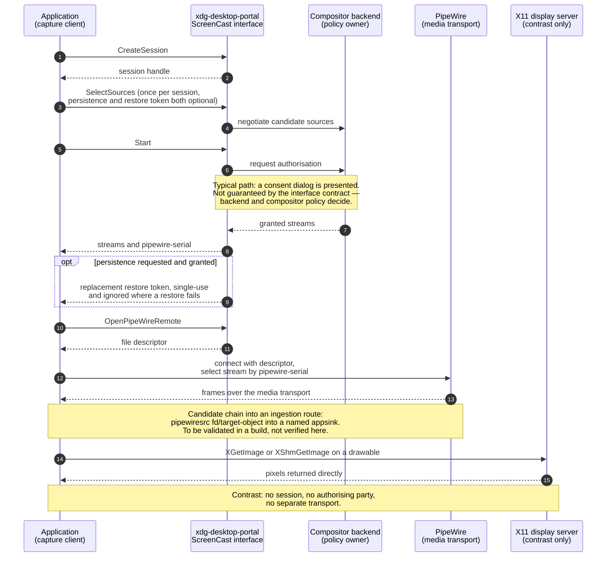

# 1. Windows Capture Path

## 1.1 What this tree supports on Windows today

Every repository locator in this document was read against branch `5.x`, commit
`0627765f01be7ea464846ea1e56bbf4e6d861bcf`; a line locator is checkable only against that revision.

The Windows acquisition surface in this repository is a media surface. `enum VideoCaptureAPIs`
[modules/videoio/include/opencv2/videoio.hpp:91-122] declares thirty enumerators, six of which are
aliases, leaving twenty-four distinct numeric values; `CAP_ANY = 0` is an auto-detection sentinel
rather than a backend, so twenty-three concrete backend API identifiers remain. The Windows-specific
identifiers among them name DirectShow, Microsoft Media Foundation and the Windows Runtime Media
Foundation variant [modules/videoio/include/opencv2/videoio.hpp:91-122] — one camera framework and
two media frameworks. The enumeration is examined in full, together with the registry table and the
capability mask that corroborate it, in
[current-state-capability-map.md §1](./current-state-capability-map.md) and
[technical-inventory.md §1](./technical-inventory.md), and the finding those sections reach is that
none of the twenty-three identifiers names a display, screen, desktop, window or monitor.

The build gates that decide what a Windows configuration actually contains are `WITH_DSHOW`,
declared ON [CMakeLists.txt:323]; `WITH_MSMF`, whose declared default is the conditional `NOT MINGW`
rather than a plain ON [CMakeLists.txt:326]; `WITH_MSMF_DXVA`, which defaults to whatever
`WITH_MSMF` resolves to [CMakeLists.txt:329]; and, on the display side, `WITH_WIN32UI`, declared ON
[CMakeLists.txt:302]. A declared default is not an availability statement: no configure step has
been run against this checkout, and a `WITH_*` request is further gated by platform visibility and
dependency detection, so the configured availability of each is unknown here.

## 1.2 Two symbols in this tree that a keyword search would misread

Both are worth stating before the deltas, because either one read at face value would produce a
report of a Windows capture capability that does not exist.

**`dxgi` in this tree is Direct3D 11 device-manager plumbing for hardware decode.** The Media
Foundation backend links the DXGI import library and dynamically resolves
`MFCreateDXGIDeviceManager` so that loading does not fail on systems lacking it
[modules/videoio/src/cap_msmf.cpp:54-70]; it holds an `IMFDXGIDeviceManager` beside a Direct3D 11
device on the capture object [modules/videoio/src/cap_msmf.cpp:808]; and it enumerates a DXGI
adapter when hardware acceleration is switched on [modules/videoio/src/cap_msmf.cpp:1002-1013]. The
FFmpeg hardware path queries an `IDXGIDevice` for its adapter for one purpose only — to read the
adapter description as a device name [modules/videoio/src/cap_ffmpeg_hw.hpp:232-243]. Neither
duplicates an output. The symbols a Desktop Duplication implementation would have to use —
`IDXGIOutputDuplication`, `DuplicateOutput` and `AcquireNextFrame` — return no match anywhere under
`modules/`, searched by token per name.

**`BitBlt` in this tree runs in the output direction.** Its only two call sites are both in the
Win32 display backend and both move pixels OpenCV already owns: one copies a window's contents into
a memory device context for the clipboard [modules/highgui/src/window_w32.cpp:1787], and the other
blits OpenCV's own image onto the paint device context under `WINDOW_AUTOSIZE`
[modules/highgui/src/window_w32.cpp:1920]. Neither reads the desktop.

## 1.3 What the platform provides, outside this repository

Windows exposes three screen-acquisition mechanisms, none of which appears in this repository. Each
is rendered below against the axes that decide whether it can serve the capture pipeline of
[functional-spec.md §1](./functional-spec.md): source selection, permission model, transport, cursor
handling, window and monitor scope, and added dependencies.

### Desktop Duplication API

`IDXGIOutputDuplication`, Microsoft DXGI documentation, learn.microsoft.com.

- Source selection: output-level. It duplicates a monitor.
- Permission model: no operating-system consent step, which makes it the strongest candidate for
  unattended operation.
- Transport: a Direct3D surface, carrying dirty-rectangle and move-rectangle metadata, so change
  information is available from the mechanism itself without a separate differencing pass.
- Cursor: position and shape arrive as metadata.
- Window and monitor scope: monitor only. It offers no window-scoped capture item.
- Added dependencies: a Direct3D device, which is a real added dependency. It cannot be used from a
  session without a desktop, and is unavailable across certain secure-desktop transitions.

### Windows.Graphics.Capture

WinRT `GraphicsCaptureItem`, Microsoft Windows App Development documentation, learn.microsoft.com.

- Source selection: normally initiated through a system picker, so the default posture is
  user-selected.
- Permission model: user-mediated by that picker in the normal case.
- Transport: a Direct3D surface. A capture border is composited unless suppressed on versions that
  permit suppression.
- Cursor: handled by the mechanism's own capture semantics.
- Window and monitor scope: a first-class capture item for either a window or a monitor, carrying
  its own occlusion and minimisation semantics — an item survives the window being obscured.
- Added dependencies: a Direct3D device, and availability is gated on the operating system version.

### GDI `BitBlt` from a device context

Microsoft Win32 GDI documentation, learn.microsoft.com.

- Source selection: a device context, which may be the screen's or a window's.
- Permission model: no operating-system consent step.
- Transport: a GDI bitmap. It is the slowest of the three routes and reports no changed regions.
- Cursor: not composited by the mechanism.
- Window and monitor scope: able to target a window handle, so window capture is possible here too,
  with documented limitations — it misses hardware-overlay and some accelerated content, can capture
  an obscuring window rather than the target's own contents, and interacts poorly with per-monitor
  DPI.
- Added dependencies: none beyond GDI itself; no Direct3D dependency.

The distinction between the last two is about the quality of the window abstraction, not about
whether window targeting exists at all. Both can name a window; only the modern mechanism defines
what happens when that window is obscured or minimised.

## 1.4 Whether an ingestion route bridges the gap

The two generic ingestion routes are owned by [current-state-capability-map.md
§1](./current-state-capability-map.md), which states their conditions; this section states only
which Windows mechanism each route can reach. The two do not have the same reach, and the difference
belongs to the route rather than to the mechanism. The manual-pipeline route accepts any pipeline
that can be assembled from available GStreamer elements and terminates in an appsink named
`appsink0` or `opencvsink` [modules/videoio/src/cap_gstreamer.cpp:1343]; the manual-pipeline branch
searches the parsed pipeline for an element so named [modules/videoio/src/cap_gstreamer.cpp:1502]
and fails with "cannot find appsink in manual pipeline" when there is none
[modules/videoio/src/cap_gstreamer.cpp:1534]. The environment-mediated route reaches only what
`av_find_input_format` resolves [modules/videoio/src/cap_ffmpeg_impl.hpp:1206-1210] — a demuxer, not
an arbitrary component of that library — and its device-oriented opening is compiled behind the
`HAVE_FFMPEG_LIBAVDEVICE` build guard [modules/videoio/src/cap_ffmpeg_impl.hpp:1213,1218], under
which device registration is also performed [modules/videoio/src/cap_ffmpeg_impl.hpp:629-634].
Without that guard the backend does not fall back: it logs that OpenCV should be configured with
libavdevice to open a camera device and returns false
[modules/videoio/src/cap_ffmpeg_impl.hpp:1245-1247].

**Desktop Duplication is reachable through the GStreamer route.** The `d3d11` plugin's
`d3d11screencapturesrc` is documented as a Desktop Duplication API based screen-capture element,
with a `capture-api` property selecting between the DXGI mode and a Windows Graphics Capture mode,
and produces BGRA in system or Direct3D 11 memory (GStreamer plugin reference,
gstreamer.freedesktop.org). One element therefore fronts both of the modern Windows mechanisms of
§1.3, and both are manual-pipeline candidates subject to the appsink condition above.

The FFmpeg position on that mechanism is different, and it is a limitation of that route alone
rather than of the mechanism. `ddagrab`, which fronts Desktop Duplication, is a libavfilter video
source rather than a demuxer (FFmpeg documentation, ffmpeg.org), so `av_find_input_format` cannot
resolve it and it does not reach `VideoCapture` by the environment-mediated route. A path from it
would require a filtergraph fronted by the `lavfi` virtual input device, which is not assessed
here. That statement bounds the FFmpeg route; it says nothing about whether the mechanism can reach
the library, which the GStreamer element settles.

**The GDI mechanism is reachable through either route.** FFmpeg exposes it as the `gdigrab`
demuxer, whose input URL is `desktop` or `title=<window title>` (FFmpeg device documentation,
ffmpeg.org); being a demuxer, it is resolvable by name through the environment-mediated route under
that route's conditions. GStreamer exposes it as `gdiscreencapsrc` in the `winscreencap` plugin, a
GDI desktop-or-region source producing `video/x-raw` BGR and carrying `cursor`, `monitor`, `x`, `y`,
`width` and `height` properties (GStreamer plugin reference, gstreamer.freedesktop.org); it is a
manual-pipeline candidate under the appsink condition. Neither route holds the GDI mechanism
exclusively.

The Windows bridge map is therefore complete in one direction and unchanged in the other: each of
the three mechanisms of §1.3 has at least one sourced ingestion route, in every case with the
element or demuxer performing the acquisition and the library consuming only its output. What no
route changes is the finding of §1.1 — the screen is still not an identifier in the enumeration, so
it remains undiscoverable through the library's own vocabulary, which is the subject of §4.

## 1.5 Deltas

- **D1.1** No Windows screen-acquisition mechanism exists in this tree, so the capture pipeline's
  requirement for frames of a screen surface is met by no in-repository facility on Windows: the
  application must acquire them from one of the three platform mechanisms in §1.3 and hand them to
  the library. The baseline is the exhaustive backend enumeration
  [modules/videoio/include/opencv2/videoio.hpp:91-122] as assessed in
  [current-state-capability-map.md §1](./current-state-capability-map.md) and
  [technical-inventory.md §1](./technical-inventory.md), not a keyword sweep; the requirement is
  [functional-spec.md §1](./functional-spec.md). The delta is the acquisition mechanism itself plus
  its dependencies — a Direct3D device for either modern route (learn.microsoft.com) — and the
  ingestion route that carries its output, which §1.4 supplies for all three mechanisms, in each
  case as an external element or demuxer the application selects rather than as anything the library
  offers.
- **D1.2** The DXGI symbols present in this tree are hardware-decode plumbing, not output
  duplication, so a reader who treats them as evidence of a Windows capture path would close this
  gap on a misreading. The baseline capability is decode acceleration
  [modules/videoio/src/cap_msmf.cpp:54-70,808,1002-1013] and adapter naming
  [modules/videoio/src/cap_ffmpeg_hw.hpp:232-243], as inventoried in
  [technical-inventory.md §1](./technical-inventory.md) and assessed in
  [current-state-capability-map.md §1](./current-state-capability-map.md); the requirement is the
  frame source of [functional-spec.md §1](./functional-spec.md). The delta is the whole of Desktop
  Duplication (learn.microsoft.com): its symbols appear nowhere under `modules/`, so nothing in this
  tree acquires a duplicated output, and the mechanism has to be reached from outside — which §1.4
  establishes it can be, through the GStreamer element that fronts it. The bridge closes the frame
  gap and not the metadata one: a manual pipeline delivers BGRA video buffers
  (gstreamer.freedesktop.org), so the mechanism's dirty-rectangle metadata — the one platform
  feature that would carry change information without a differencing pass — is carried into the
  library by no route assessed here, and the change gate of
  [functional-spec.md §3](./functional-spec.md) is not discharged by it.
- **D1.3** `BitBlt` appears in this tree only in the output direction, so its presence establishes
  nothing about reading the desktop. The baseline is the display backend's use of it for clipboard
  copy and for painting OpenCV's own image
  [modules/highgui/src/window_w32.cpp:1787,1920], within the display surface assessed in
  [current-state-capability-map.md §3](./current-state-capability-map.md) and inventoried in
  [technical-inventory.md §3](./technical-inventory.md); the requirement is the frame source of
  [functional-spec.md §1](./functional-spec.md). The delta is the GDI capture direction —
  `BitBlt` from a screen or window device context into a caller-owned bitmap
  (learn.microsoft.com) — which is host code with no counterpart in this repository, and which
  reaches the library through either of the two GDI bridges in §1.4, the `gdigrab` demuxer on the
  environment-mediated route or the `winscreencap` plugin's source element on the manual-pipeline
  route (ffmpeg.org; gstreamer.freedesktop.org).

# 2. Linux X11 Capture Path

## 2.1 What this tree supports on Linux today

The Linux acquisition surface is, as on Windows, a camera and media surface: the twenty-three
concrete backend identifiers of §1.1 include the Video4Linux family and the two media-framework
routes, and none names a display surface — the enumeration, the registry table and the capability
mask that establish this are assessed in
[current-state-capability-map.md §1](./current-state-capability-map.md) and inventoried in
[technical-inventory.md §1](./technical-inventory.md). `WITH_V4L` is declared ON
[CMakeLists.txt:320] and `WITH_GTK` is declared ON [CMakeLists.txt:225], which is what a default
Linux configuration requests for capture and for display respectively; as in §1.1, a declared
default is not an availability statement.

## 2.2 The one internal read of a display surface, at the width the code proves

The HighGUI framebuffer backend does read pixels out of a display surface, and it is the only thing
in the authorised modules that does. It must be stated precisely, because it is the easiest finding
here to overstate in either direction.

The backend selects one of three modes at construction — a physical framebuffer mode, an emulation
mode, and an Xvfb mode [modules/highgui/src/window_framebuffer.cpp:572-602]. In the physical mode it
opens the framebuffer device [modules/highgui/src/window_framebuffer.cpp:366] and maps it
[modules/highgui/src/window_framebuffer.cpp:415] through `fbOpenAndGetInfo()`. In the Xvfb mode it
calls `XvfbOpenAndGetInfo()` [modules/highgui/src/window_framebuffer.cpp:426], which opens the Xvfb
file read-write, parses its `XWDFileHeader` for geometry and pixel layout
[modules/highgui/src/window_framebuffer.cpp:442-502] and maps it
[modules/highgui/src/window_framebuffer.cpp:499]. These are two separate device paths and their
locators are not interchangeable.

In either mode the read serves one purpose, and the purpose is what bounds the finding: the backend
copies the mapped contents row by row into a `Mat`
[modules/highgui/src/window_framebuffer.cpp:626-634] so that the destructor can restore whatever
occupied the surface before OpenCV drew a window over it
[modules/highgui/src/window_framebuffer.cpp:637-651]. It runs once at construction and once in
reverse at destruction. It is not a capture loop, it is not exposed through `VideoCapture`, and it
is not reachable through any public API as a source of frames. Both build gates default off —
`WITH_FRAMEBUFFER` [CMakeLists.txt:231] and `WITH_FRAMEBUFFER_XVFB` [CMakeLists.txt:233] — so
neither path is present in a default build.

One narrow data point is genuine and worth carrying: the buffer it allocates for that copy is
`CV_8UC4` [modules/highgui/src/window_framebuffer.cpp:626], so a BGRA screen-shaped buffer converts
cleanly into the `Mat` type the rest of the library consumes. What the code establishes is that the
mapped region holds display data at the moment of the copy, and nothing more; whether an Xvfb
framebuffer file is continuously refreshed by a running virtual server is a property of that server
rather than of this code, and is not asserted here. Neither mode is the conventional physical
desktop reached through the X protocol. The same finding is assessed, with its verdict, in
[current-state-capability-map.md §3](./current-state-capability-map.md).

## 2.3 What X11 provides, outside this repository

`XGetImage` and the MIT-SHM extension — X.Org Xlib documentation and the MIT-SHM protocol
specification, x.org — on the same axes as §1.3:

- Source selection: the root window or any window drawable, named directly by the client.
- Permission model: no operating-system consent step. X11 places no consent gate on reading another
  client's pixels; any client with display access can read them. That is the property that makes X11
  the permissive case on the mediation axis of §7.2, and it is a security posture rather than a
  feature — it is also why the application-level authorisation of that section is the only
  authorisation on this platform.
- Transport: `XGetImage` round-trips pixels through the protocol stream and is slow at full-screen
  video rates; `XShmGetImage` places the image in shared memory and is the practical route,
  requiring server and client on the same host.
- Cursor: not composited. It must be drawn from `XFixesGetCursorImage` if wanted.
- Window and monitor scope: window capture without a picker, since a drawable is addressed directly.
  Under a compositing manager an obscured window's contents may still be readable.
- Added dependencies: Xlib, and the MIT-SHM extension for the shared-memory route.

## 2.4 Whether an ingestion route bridges the gap

FFmpeg exposes this as the `x11grab` demuxer, whose input is a display and offset such as
`:0.0+10,20`, with `framerate`, `video_size`, `draw_mouse`, `show_region` and `follow_mouse` options
(FFmpeg device documentation, ffmpeg.org). Being a demuxer, it is resolvable through the
environment-mediated input-format route, subject to that route's conditions — `av_find_input_format`
resolution [modules/videoio/src/cap_ffmpeg_impl.hpp:1206-1210], and a libavdevice-enabled build for
device-oriented opening, which is compiled behind the `HAVE_FFMPEG_LIBAVDEVICE` guard
[modules/videoio/src/cap_ffmpeg_impl.hpp:1213,1218] and registers input devices under the same
condition [modules/videoio/src/cap_ffmpeg_impl.hpp:629-634].

GStreamer exposes it as `ximagesrc`, which captures the whole display by default, targets a single
window given an `xid`, and offers `startx`, `starty`, `endx` and `endy` for a region, `show-pointer`
for cursor compositing, `display-name` for the target display, and `use-damage` (GStreamer plugin
reference, gstreamer.freedesktop.org). It reaches `VideoCapture` through the manual-pipeline route
only where the pipeline terminates in an appsink named `appsink0` or `opencvsink`
[modules/videoio/src/cap_gstreamer.cpp:1343].

This route carries a second condition, and it is one an application can only satisfy in its own
startup path. The element's documentation expects applications to call `XInitThreads()` before any
other threads are started, and notes that setting `GST_XINITTHREADS=1` causes the call only when the
plugin is loaded, which can be too late (gstreamer.freedesktop.org). The consequence for a consuming
application is a constraint on initialisation order rather than on configuration: the call has to
happen at the top of the process, before the library, the display backend or any worker thread the
application starts, and an environment variable set later is not equivalent to it.

`use-damage` must be described accurately, because it is easy to over-read. It is a source-side
pixel-copy optimisation: the element uses the XDamage extension to refresh only the damaged
rectangles of a retained image, and it still emits a buffer at its configured frame rate
(gstreamer.freedesktop.org). It exposes no change signal, does not suppress unchanged frames, and
neither replaces nor feeds the change gate, which remains downstream application work as specified
in [functional-spec.md §3](./functional-spec.md).

## 2.5 Deltas

- **D2.1** No X11 screen read is exposed as a frame source, so on X11 too the requirement for
  frames of a screen surface is met by no in-repository facility. The baseline is the same
  exhaustive enumeration and registry structure [modules/videoio/src/videoio_registry.hpp:15-20] as
  assessed in [current-state-capability-map.md §1](./current-state-capability-map.md) and
  [technical-inventory.md §1](./technical-inventory.md); the requirement is
  [functional-spec.md §1](./functional-spec.md). The delta is small in code and specific in shape: a
  host-side read of the root window or a drawable, by `XGetImage` or, for full-screen rates, by
  `XShmGetImage` with server and client on the same host (x.org), plus cursor compositing if the
  notes are to show a pointer, plus one of the two bridges in §2.4 with that bridge's own
  condition — the appsink naming on the pipeline route, and the initialisation-order requirement
  the X11 source element documents (gstreamer.freedesktop.org). No operating-system consent step
  has to be designed for on this platform, which is exactly what makes X11 the misleading platform
  to design a portable abstraction against; the application-level authorisation and recording state
  of §7.2 apply here as on every other route.
- **D2.2** The framebuffer backend's read of a display surface is restoration, not acquisition, so
  it closes none of the capture requirement despite being the one place in the authorised modules
  where screen pixels are read. The baseline is that read and its purpose
  [modules/highgui/src/window_framebuffer.cpp:626-634,637-651], gated off by default
  [CMakeLists.txt:231], as assessed in
  [current-state-capability-map.md §3](./current-state-capability-map.md) and inventoried in
  [technical-inventory.md §3](./technical-inventory.md); the requirement is the continuous frame
  stream of [functional-spec.md §1](./functional-spec.md). The delta is everything that separates a
  one-shot mapped-surface copy from a frame source: repetition under a clock, exposure through a
  capture interface, and a target that is a real display rather than a framebuffer device or an Xvfb
  file. The one transferable detail is the pixel layout — the copy targets a `CV_8UC4` buffer
  [modules/highgui/src/window_framebuffer.cpp:626], so a BGRA screen-shaped acquisition converts
  into the library's frame type without a conversion step.

# 3. Linux Wayland Capture Path

## 3.1 What this tree supports on Wayland today

Wayland appears in this repository on the output side only, and its own build system marks it
immature. `WITH_WAYLAND` defaults OFF [CMakeLists.txt:235], and where the option resolves to
available the build summary prints it as "(Experimental) YES" [CMakeLists.txt:1396]. That is the
project's own statement of the backend's maturity; it is a status, not a reason, and it explains
nothing about the capability boundary described below.

Availability is conditional on four dependencies and one host tool: the detection script requires
wayland-client, wayland-cursor, xkbcommon and wayland-protocols at 1.13 or later, and locates
`wayland-scanner` as a required host program [modules/highgui/cmake/detect_wayland.cmake:12-32].

The backend is output-only by construction. Where the option and the dependencies resolve, the
module sets its built-in backend to Wayland and generates exactly one protocol binding, the stable
`xdg-shell` protocol, before adding the Wayland window source to the module
[modules/highgui/CMakeLists.txt:55-79]. `xdg-shell` is a window-surface protocol. No screencopy
protocol, image-capture protocol, portal client or media-transport integration is generated or
linked anywhere in the module. This is the shape of the build contract; no motive is attributed to
it.

Two levels of backend identity have to be kept apart here, because Wayland sits on one and not the
other, and collapsing them produces a wrong verdict in either direction.

The first is backend-compatible registry membership: the list in `getBuiltinBackendsInfo()`
[modules/highgui/src/registry.impl.hpp:27-66], whose identifiers are `GTK`, `GTK3`, `GTK2`, `FB`,
`QT` — the last held behind a disabled `#if 0  // TODO` block
[modules/highgui/src/registry.impl.hpp:51], which shows work started and left incomplete with no
reason recorded in the code — and `WIN32` on Windows. Wayland is not in that list, so it is not
selectable through the registry path.

The second is compile-time built-in identity, which the public probe also reports. The same build
step that selects the Wayland built-in defines `HAVE_WAYLAND`
[modules/highgui/CMakeLists.txt:55-57], and the probe consults the backend-compatible backend first
and, finding none, falls through to a compile-time branch that returns `WAYLAND` for it
[modules/highgui/src/window.cpp:1116-1117] within that fall-through chain
[modules/highgui/src/window.cpp:1096-1121], and its own documentation names Wayland among the
framework names it can return [modules/highgui/include/opencv2/highgui.hpp:258-261]. Wayland
therefore remains reportable by the public probe [modules/highgui/include/opencv2/highgui.hpp:261]
even though it is absent from registry membership, and an application determines the active
framework at runtime from that probe rather than from the membership list. The display-side
consequences of both levels are assessed in [current-state-capability-map.md
§3](./current-state-capability-map.md) and inventoried in [technical-inventory.md
§3](./technical-inventory.md).

## 3.2 The portal-mediated model, and why it differs structurally from X11

Wayland has no equivalent of `XGetImage`. A client cannot read another client's surface, and capture
is mediated by a third party. Two mediation paths exist — the `org.freedesktop.portal.ScreenCast`
interface of `xdg-desktop-portal`, and compositor-specific protocols such as wlr-screencopy — and
the portal is the interoperable one.

The portal lifecycle is fixed by its interface specification
(`org.freedesktop.portal.ScreenCast`, flatpak.github.io/xdg-desktop-portal): `CreateSession` opens a
session; `SelectSources`, callable once per session, declares what kind of source is wanted;
`Start` returns the granted streams; and `OpenPipeWireRemote` returns a file descriptor with which a
PipeWire client connects to the media transport. Persistence across runs is conditional, and its
conditions are part of the contract: the persistence mode defaults to not persisting, so a restore
token is returned only where persistence was both requested and granted. Where a token is present it
is invalidated after being used once and is replaced on each successful restore, and it is supplied
to a later `SelectSources`; where a stored session cannot be restored the token is ignored and the
user is prompted as they would be without one. Cursor handling is explicit, with a metadata mode
that delivers the pointer position separately from the frame. Since interface version 6, clients
should identify a stream by its monotonic `pipewire-serial` rather than by a node identifier, which
may be reused.

The structural difference from X11 is the analytical core of this section, and §7 turns on it. On
X11 a client with display access reads a drawable directly and synchronously, and no other party is
involved (x.org). On Wayland the same intent becomes a session negotiated with a service, authorised
under a policy the application does not own, and then serviced by a separate media transport rather
than by the same connection that asked for it. The difference is not whether pixels can be obtained.
It is who authorises the read, and how the frames are transported once authorised.

## 3.3 Consent, stated at the width the specification supports

Two statements are needed here, and conflating them would be an overclaim in one direction or the
other.

As a matter of contract, consent is mediated: the specification describes `Start` as typically
presenting a dialog (flatpak.github.io/xdg-desktop-portal), and an application therefore cannot
assume it may start a stream without user interaction.

As a matter of deployment, whether a given first run or a restored session is unattended is
backend- and compositor-dependent: whether a dialog appears, and whether a restore token bypasses
it, is determined by the portal backend and the compositor's policy rather than by the interface
contract.

The planning posture that follows is a portability conclusion rather than a prohibition: an
unattended-first-run design cannot be relied on portably, and must be validated per target
environment.

## 3.4 The bridge from a portal session into an ingestion route: a candidate, not a verified route

A concrete candidate chain exists, and naming it is what this section owes. What it does not owe is
a verdict of verified, which nothing read here supports.

Each of the chain's three links is separately sourced. The portal returns a file descriptor from
`OpenPipeWireRemote` and identifies each granted stream by a monotonic `pipewire-serial`
(`org.freedesktop.portal.ScreenCast` specification, flatpak.github.io/xdg-desktop-portal). The
PipeWire source element for GStreamer accepts exactly those two values: an `fd` property carrying
the descriptor of an existing connection, and a `target-object` property naming the object to
connect to (GStreamer plugin reference, gstreamer.freedesktop.org). And the library accepts a manual
pipeline whose terminating element is an appsink named `appsink0` or `opencvsink`
[modules/videoio/src/cap_gstreamer.cpp:1343], searching the parsed pipeline for an element so named
[modules/videoio/src/cap_gstreamer.cpp:1502] and failing where none is found
[modules/videoio/src/cap_gstreamer.cpp:1534]. The candidate chain is therefore
`pipewiresrc fd=<fd> target-object=<serial> ! <conversion> ! appsink name=appsink0`, with the portal
session opened and held by the application and both values obtained from it.

Three things reading source cannot establish, each of which a build has to settle before the
candidate becomes a route:

- Descriptor ownership and lifetime. The descriptor belongs to the portal session the application
  owns, and the chain hands it to an element constructed inside the library's own pipeline. Whether
  it survives that hand-off — who duplicates it, who closes it, and in what order relative to the
  pipeline's own teardown — is documented by neither side of the boundary.
- Caps negotiation. The appsink path has to negotiate a format it accepts, and a PipeWire source may
  negotiate buffers carrying their own memory type rather than plain system-memory video, which is
  why the chain above shows an explicit conversion stage. Whether a given conversion resolves the
  negotiation is a build result rather than a reading result.
- Failure behaviour. What the element does when the portal session is revoked, or when a persistence
  grant's restore token is replaced, is not established here. An interactive application needs a
  defined answer, because the session can end without the pipeline being told.

Two consequences hold whatever that validation returns: the chain adds a plugin dependency for the
PipeWire source element, and the portal session's lifetime is owned by the application rather than
by the library, which has no session concept to own it with. The verdict this section carries is a
candidate to be validated rather than a verified route, and no route is asserted as the
cross-platform primary on the strength of Wayland.

## 3.5 The handshake, drawn

The diagram shows the portal lifecycle in the order the interface defines it, with the consent step
marked as the typical rather than the guaranteed path, the restore token drawn as the conditional
step it is, and the direct X11 read shown for contrast at the end. Its conclusion, which does not
depend on the diagram rendering: three parties stand between a Wayland application and its first
frame — the portal service, the compositor backend under its own policy, and a separate media
transport — where on X11 there are none; a restore token exists only where persistence was requested
and granted, so a second run is not guaranteed to have one to present; and the last hop, from the
returned descriptor and serial into an OpenCV ingestion route, is the one §3.4 carries as a
candidate to be validated rather than as a verified route.

## 3.6 Deltas

- **D3.1** The Wayland support in this tree is an output-side window backend, experimental by the
  project's own summary, so it contributes nothing to the frame source the capture pipeline needs.
  The baseline is that backend: `WITH_WAYLAND` OFF [CMakeLists.txt:235], printed as "(Experimental)
  YES" where available [CMakeLists.txt:1396], with `xdg-shell` as the only generated protocol
  [modules/highgui/CMakeLists.txt:55-79] and its dependency set fixed by the detection script
  [modules/highgui/cmake/detect_wayland.cmake:12-32] — assessed as a display capability in
  [current-state-capability-map.md §3](./current-state-capability-map.md) and inventoried in
  [technical-inventory.md §3](./technical-inventory.md); the requirement is [functional-spec.md
  §1](./functional-spec.md). The delta is the entire acquisition side: a portal client speaking
  `org.freedesktop.portal.ScreenCast` and a PipeWire consumer
  (flatpak.github.io/xdg-desktop-portal), neither of which is generated, linked or referenced by the
  module. What the backend's position in the module does and does not cost is the distinction of
  §3.1: absence from backend-compatible registry membership
  [modules/highgui/src/registry.impl.hpp:27-66] means it is not selectable through the registry
  path, while a build in which the option is requested and the dependencies resolve nonetheless
  selects the Wayland built-in [modules/highgui/CMakeLists.txt:55-57] and the public probe
  [modules/highgui/include/opencv2/highgui.hpp:261] still reports `WAYLAND` from its compile-time
  branch [modules/highgui/src/window.cpp:1116-1117] — so an application can determine that this is
  the active framework at runtime, which is what the parity question in §7 turns on.
- **D3.2** Neither mediated consent nor a session of any kind has a counterpart in the capture API,
  so the structural features of Wayland acquisition are unrepresentable in the library's own
  contract. What is distinctive here is the session and its transport rather than interactivity as
  such — §7.2 separates the two axes, and an interactive authorisation step is not Wayland's alone.
  The baseline is that contract: opening is a call that either succeeds
  or fails, expressed through the five `open` overloads and their integer parameter vector
  [modules/videoio/include/opencv2/videoio.hpp:864,877,888,901,914], with no session, grant,
  revocation or restore concept, as assessed in
  [current-state-capability-map.md §1](./current-state-capability-map.md) and inventoried in
  [technical-inventory.md §1](./technical-inventory.md); the requirement is the explicit source
  selection and explicit-failure start of [functional-spec.md §1](./functional-spec.md). The delta
  is a session lifecycle the application must own outside the library — `CreateSession`,
  `SelectSources` once per session, `Start`, and, only where persistence was requested and granted, a
  restore token that is single-use and replaced on each successful restore
  (flatpak.github.io/xdg-desktop-portal) — together with the two-part conclusion of §3.3: mediated
  consent as a matter of contract, and unattended operation as a per-environment deployment question
  rather than a portable guarantee.
- **D3.3** The bridge from a granted portal stream into an ingestion route is a named candidate
  rather than a verified route, so Wayland is the one platform whose end-to-end path this assessment
  can state and cannot confirm. The baseline is what the routes require of any producer: a
  terminating appsink named `appsink0` or `opencvsink` for the pipeline route
  [modules/videoio/src/cap_gstreamer.cpp:1343,1502,1534], or a demuxer resolvable by
  `av_find_input_format` [modules/videoio/src/cap_ffmpeg_impl.hpp:1206-1210] with device-oriented
  opening behind the `HAVE_FFMPEG_LIBAVDEVICE` guard
  [modules/videoio/src/cap_ffmpeg_impl.hpp:1213,1218] for the environment-mediated route — the
  routes and their conditions being
  owned by [current-state-capability-map.md §1](./current-state-capability-map.md) and their
  build gates inventoried in [technical-inventory.md §5](./technical-inventory.md); the requirement
  is the conditional route selection of [functional-spec.md §1](./functional-spec.md), which already
  makes route choice contingent on verified availability. The delta is what §3.4 enumerates as
  unsettled around a chain whose links are individually sourced — descriptor ownership and lifetime
  across the hand-off into the library's pipeline, caps negotiation to a format the appsink path
  accepts, and behaviour when the session is revoked or a persistence grant's token replaced — plus
  an owner for the session's lifetime and an added plugin dependency for the PipeWire source element
  (flatpak.github.io/xdg-desktop-portal; gstreamer.freedesktop.org). Until a build settles those,
  the route is a candidate, which is what forbids naming this platform's route the cross-platform
  primary.

# 4. Screen-Capture-as-a-Source Gap

## 4.1 What the capture surface offers as a source, and how it is discovered

`VideoCapture` presents three open shapes across five overloads — by device index, by filename or
pipeline string, and by a stream source with a typed integer parameter vector
[modules/videoio/include/opencv2/videoio.hpp:864,877,888,901,914]. Which backend services a given
open is decided from the registry, whose public face is five list queries — all backends, and the
four role-partitioned sets for device-index capture, filename capture, buffered-stream capture and
writing [modules/videoio/include/opencv2/videoio/registry.hpp:30,33,36,39,42]. Each registry entry
declares its roles from a capability mask defining bits 0, 1, 2 and 4, leaving bit 3 unused
[modules/videoio/src/videoio_registry.hpp:15-20], and the table that assigns those roles tags every
entry with capture-by-index, capture-by-filename, capture-by-stream or writer and nothing else
[modules/videoio/src/videoio_registry.cpp:66-193]. The contract as a whole is assessed in
[current-state-capability-map.md §1](./current-state-capability-map.md) and inventoried in
[technical-inventory.md §1](./technical-inventory.md).

Frame delivery through a plugin is pull-shaped: the capture ABI offers a grab entry point
[modules/videoio/src/plugin_capture_api.hpp:92] and a retrieve entry point taking a copy-out callback
[modules/videoio/src/plugin_capture_api.hpp:103], and nothing else. The one readiness API on the
public surface is `VideoCapture::waitAny`
[modules/videoio/include/opencv2/videoio.hpp:1035-1053], and it is backend-scoped: its
implementation asserts a shared backend, dispatches to V4L, and otherwise raises a not-implemented
error stating that it is supported by the V4L backend only
[modules/videoio/src/cap.cpp:630,652]. The scoped negative that follows is stated once, in D4.5, and
every later use of it in this document refers to that statement rather than restating it.

## 4.2 What extension permits, and what it forbids

Plugin discovery is organised around registry-known identifiers. Candidates are enumerated by
`getPluginCandidates` [modules/videoio/src/backend_plugin.cpp:302] over the path list in
`OPENCV_VIDEOIO_PLUGIN_PATH` [modules/videoio/src/backend_plugin.cpp:310], matched against the
pattern `opencv_videoio_<name>*` [modules/videoio/src/backend_plugin.cpp:331] or a per-backend
override [modules/videoio/src/backend_plugin.cpp:332]. Version compatibility is checked against the
returned API header [modules/videoio/src/backend_plugin.cpp:146], and then — the constraint that
matters here — the loader rejects a plugin whose declared backend identifier differs from the one it
was loaded for, at three sites covering the capture API's identifier, the writer API's identifier and
the combined plugin API's capture identifier
[modules/videoio/src/backend_plugin.cpp:400,410,420]. The check is applied to the function table the
plugin's initialiser has already returned, so a plugin cannot negotiate its way to a different
identity. The extensibility verdict this supports is reached in
[current-state-capability-map.md §6](./current-state-capability-map.md), with the build-side
selectors inventoried in [technical-inventory.md §5](./technical-inventory.md).

## 4.3 Deltas

- **D4.1** No screen, display or desktop backend exists among the concrete backend identifiers, so
  the screen is not an addressable source in the library's own vocabulary. The baseline is the
  enumeration itself — thirty enumerators, six aliases, twenty-four distinct values, `CAP_ANY = 0`
  as the auto-detection sentinel, leaving twenty-three concrete identifiers
  [modules/videoio/include/opencv2/videoio.hpp:91-122] — corroborated by the registry table's role
  tags [modules/videoio/src/videoio_registry.cpp:66-193] and by the capability mask that reserves no
  screen-oriented mode, defining bits 0, 1, 2 and 4 and leaving bit 3 unused
  [modules/videoio/src/videoio_registry.hpp:15-20], as assessed in
  [current-state-capability-map.md §1](./current-state-capability-map.md) and inventoried in
  [technical-inventory.md §1](./technical-inventory.md); the requirement is the explicitly named
  source of [functional-spec.md §1](./functional-spec.md). This finding rests on exhaustive
  enumeration of the structures that would have to contain such a backend, not on a keyword sweep,
  and the five public registry queries confirm that no such backend is merely hidden by the
  role partitioning — one of the five returns all backends
  [modules/videoio/include/opencv2/videoio/registry.hpp:30,33,36,39,42]. The delta is a source
  identity: nothing in the enumeration, the table or the mask names what the application wants to
  open.
- **D4.2** The two generic ingestion routes admit screen frames today, but neither is discoverable,
  so the gap is one of discovery and contract rather than of possibility. Stating this beside D4.1
  is deliberate: D4.1 alone reads as "screen capture is impossible with OpenCV", which is false. The
  routes and their conditions are owned by
  [current-state-capability-map.md §1](./current-state-capability-map.md), the distinction between a
  host-side adapter and a first-class backend by
  [current-state-capability-map.md §6](./current-state-capability-map.md), the routes themselves by
  [technical-inventory.md §1](./technical-inventory.md) and their build gates by
  [technical-inventory.md §5](./technical-inventory.md); the requirement is the
  conditional route selection of [functional-spec.md §1](./functional-spec.md). No OpenCV source
  change is required to ingest screen frames. What is undiscoverable has to be stated at the right
  width, because the two backends that carry these routes are themselves registry members and can
  appear in the results of the five public queries
  [modules/videoio/include/opencv2/videoio/registry.hpp:30,33,36,39,42]: an application can ask
  whether the GStreamer or the FFmpeg backend is present. What it cannot ask about is everything
  that makes the route a screen route — the external element or demuxer that performs the
  acquisition, the source targets that element or demuxer can address, and the route's own
  prerequisites, none of which the registry describes or enumerates. Neither route makes the screen
  a first-class source, and the two are not equals: the pipeline route is a documented parameter
  contract [modules/videoio/include/opencv2/videoio.hpp:799-805] conditioned on a
  terminating appsink named `appsink0` or `opencvsink`
  [modules/videoio/src/cap_gstreamer.cpp:1343], whereas the other is mediated by an environment
  variable [modules/videoio/src/cap_ffmpeg_impl.hpp:1184] parsed with a key-value grammar
  [modules/videoio/src/cap_ffmpeg_impl.hpp:1197], reaching only what `av_find_input_format` resolves
  — a demuxer, not an arbitrary component of that library
  [modules/videoio/src/cap_ffmpeg_impl.hpp:1206-1210] — and, for device-oriented opening,
  conditional on the `HAVE_FFMPEG_LIBAVDEVICE` build guard
  [modules/videoio/src/cap_ffmpeg_impl.hpp:1213,1218], without which that opening fails explicitly:
  the backend logs that OpenCV should be configured with libavdevice to open a camera device and
  returns false [modules/videoio/src/cap_ffmpeg_impl.hpp:1245-1247]. The delta is therefore
  discoverability and typing, not capture: an application cannot ask the library whether a screen
  source is available, and must carry that knowledge itself.
- **D4.3** There is no screen-target addressing contract, so two applications capturing the same
  monitor would name it differently and neither could discover the other's convention. The baseline
  is the three encodings the open surface actually offers — a device index, a pseudo-filename through
  the filename overload, and integer key-value pairs in the open-parameters vector
  [modules/videoio/include/opencv2/videoio.hpp:864,877,888,901,914] — all of which are untyped with
  respect to screen targets, as assessed in
  [current-state-capability-map.md §6](./current-state-capability-map.md) and inventoried in
  [technical-inventory.md §5](./technical-inventory.md); the requirement is the explicit,
  non-substituting source selection of [functional-spec.md §1](./functional-spec.md), which needs a
  stable way to say which surface is wanted. Any meaning assigned to those encodings is
  adapter-private convention: nothing validates the encoding and no consumer can discover it.
  Interoperability would require a defined filename grammar or a reserved property namespace, and
  neither exists. These encodings are presented with that limitation and not as a conforming plugin
  design; what makes them usable at all is the normalised source identity the specification defines
  above them.
- **D4.4** A first-class screen backend cannot be introduced from outside the library, so this
  capability is an upstream change rather than an integration task. The baseline is the loader's
  organisation around registry-known identifiers and its rejection of an identifier mismatch at
  three sites [modules/videoio/src/backend_plugin.cpp:400,410,420], with discovery by name pattern
  [modules/videoio/src/backend_plugin.cpp:302,310,331,332], as assessed in
  [current-state-capability-map.md §6](./current-state-capability-map.md) and inventoried in
  [technical-inventory.md §5](./technical-inventory.md); the requirement is the source selection of
  [functional-spec.md §1](./functional-spec.md). A screen backend cannot be added by implementing the
  private ABI, nor by claiming an existing identifier, which would replace or masquerade as that
  backend rather than add one. It needs a new enumerator, a registry entry with an appropriate
  capability mode [modules/videoio/src/videoio_registry.hpp:15-20] and build integration — changes
  to OpenCV's own sources, in a future upstream change, explicitly outside this read-only
  assessment. The host-side adapter of D4.2 is a different thing and must not be called a backend:
  it is not in the registry, not selectable by a `CAP_*` identifier, and not discoverable by any
  consumer.
- **D4.5** There is no readiness or frame-available signal at the capture plugin ABI — it offers
  `Capture_grab` [modules/videoio/src/plugin_capture_api.hpp:92] and `Capture_retreive`
  [modules/videoio/src/plugin_capture_api.hpp:103] and no push or event-driven entry point — and
  none for a non-V4L backend, since `VideoCapture::waitAny`
  [modules/videoio/include/opencv2/videoio.hpp:1035-1053] raises `StsNotImplemented` outside V4L
  [modules/videoio/src/cap.cpp:630,652]; a screen route reached through either ingestion route is
  therefore polled. That is the canonical scope of this negative, and it is what a change-driven
  design has to be built against. The baseline is those two surfaces, as assessed in
  [current-state-capability-map.md §1](./current-state-capability-map.md) and inventoried in
  [technical-inventory.md §1](./technical-inventory.md); the requirement is the change-driven
  admission of [functional-spec.md §3](./functional-spec.md). Neither of the two ingestion routes
  of §1.4 and §2.4 is a V4L backend, which is why the exception does not help a screen route in
  particular. The architectural consequence is the delta: the change gate lives above
  `VideoCapture` in application code, driven by the application's own retrieval loop, and is not
  signalled through the library.
- **D4.6** No change gate is provided, so the decision of which frames matter is application code
  composed from library primitives. The baseline is what the processing surface does supply —
  accumulation [modules/imgproc/include/opencv2/imgproc.hpp:2683,2742] and phase correlation
  [modules/imgproc/include/opencv2/imgproc.hpp:2783], with thresholding
  [modules/imgproc/include/opencv2/imgproc.hpp:2849], morphology
  [modules/imgproc/include/opencv2/imgproc.hpp:2051], connected components
  [modules/imgproc/include/opencv2/imgproc.hpp:3704,3746] and contour extraction
  [modules/imgproc/include/opencv2/imgproc.hpp:3782] for interpreting a difference image once one
  exists — as assessed in
  [current-state-capability-map.md §2](./current-state-capability-map.md) and inventoried in
  [technical-inventory.md §2](./technical-inventory.md); the requirement is the score contract of
  [functional-spec.md §3](./functional-spec.md). Three things such a chain needs are not provided by
  the in-scope modules: element-wise absolute difference, element-wise comparison and non-zero
  counting; statistical background subtraction; and optical flow. The delta is therefore the gate
  itself, and no source-side facility displaces it — the damage-tracking option on the X11 source
  element is a pixel-copy optimisation that still emits a buffer at its configured frame rate and
  exposes no change signal (gstreamer.freedesktop.org).
- **D4.7** Timeout semantics are partial and default long, so an interactive session can stall in a
  way the user sees. The baseline is that open and read timeouts exist as property identifiers
  applicable to two backends only
  [modules/videoio/include/opencv2/videoio.hpp:187-188], with each of those backends independently
  defining a thirty-second default in its own implementation
  [modules/videoio/src/cap_ffmpeg_impl.hpp:261-262] and
  [modules/videoio/src/cap_gstreamer.cpp:83-84], as assessed in
  [current-state-capability-map.md §1](./current-state-capability-map.md) and inventoried in
  [technical-inventory.md §1](./technical-inventory.md); the requirement is the explicit-failure
  start of [functional-spec.md §1](./functional-spec.md). The delta has two parts: on backends
  outside those two the properties do not apply at all, so a stalled open has no library-level
  bound; and on those two the default is long enough that an application must set both explicitly
  rather than inherit them.

# 5. Input-Event Hook Gap

## 5.1 What this tree delivers, and where it delivers it

Input in HighGUI is scoped to a window. `setMouseCallback` registers a callback against a named
window [modules/highgui/include/opencv2/highgui.hpp:427], and the first mouse event constant is
documented as the pointer having moved over the window
[modules/highgui/include/opencv2/highgui.hpp:129]. Keyboard input arrives through the event-pump
family — `waitKeyEx` [modules/highgui/include/opencv2/highgui.hpp:271], `waitKey`
[modules/highgui/include/opencv2/highgui.hpp:291] and `pollKey`
[modules/highgui/include/opencv2/highgui.hpp:305] — which the header describes as the only methods
that can fetch and handle GUI events, requiring one of them to be called periodically and requiring
at least one created, active window
[modules/highgui/include/opencv2/highgui.hpp:282-287]. That is the portable requirement, and it is
assessed in [current-state-capability-map.md §3](./current-state-capability-map.md) and inventoried
in [technical-inventory.md §3](./technical-inventory.md).

Delivery is additionally conditional on the active backend, because a public declaration does not
imply uniform support: the framebuffer backend accepts a mouse-callback registration and logs that
it is not supported [modules/highgui/src/window_framebuffer.cpp:322-324]. Which backend is active is
determinable at runtime through the public probe
[modules/highgui/include/opencv2/highgui.hpp:261].

## 5.2 What the capture surface says about time

Four properties sit adjacent to the question of when a frame was acquired, and none of them answers
it. The media-timeline position reports a position within the media
[modules/videoio/include/opencv2/videoio.hpp:133-134]. The presentation-timestamp property is
genuine per-frame metadata, but it is a media presentation timestamp expressed in the frame-rate time
base and is documented for one backend only
[modules/videoio/include/opencv2/videoio.hpp:205]. The stream-open time is a civil-time anchor for
the session rather than for any frame, and is likewise documented for one backend only
[modules/videoio/include/opencv2/videoio.hpp:189]. The writer-side presentation property is encoder
input supplied when encapsulating externally encoded video and carries no acquisition time
[modules/videoio/include/opencv2/videoio.hpp:230]. The same four are distinguished in
[current-state-capability-map.md §1](./current-state-capability-map.md) and listed in
[technical-inventory.md §1](./technical-inventory.md).

## 5.3 Thread affinity: what the source establishes, and what it does not

The source establishes no portable public thread-affinity contract. The public header states the
requirement as an active window plus periodic event processing and says nothing about which thread
owns a window [modules/highgui/include/opencv2/highgui.hpp:282-287]. The only dedicated event thread
belongs to one backend: `startWindowThread()` starts a GTK window-update thread
[modules/highgui/src/window_gtk.cpp:647-664], and on builds without GTK the same function returns
zero without effect [modules/highgui/src/window.cpp:902-908]. Thread behaviour is therefore stated
only where a backend establishes it, naming that backend, and the portable position is recorded as
what it is: no thread-affinity contract is exposed on the public surface. The same reading is
reached in [current-state-capability-map.md §3](./current-state-capability-map.md) and in
[functional-spec.md §6](./functional-spec.md).

## 5.4 Deltas

- **D5.1** Input delivery is window-scoped only, so the events a notetaking session is about — those
  occurring in the applications being recorded — never reach the library at all. The baseline is
  that scoping: a per-window callback registration
  [modules/highgui/include/opencv2/highgui.hpp:427], an event constant documented as movement over
  the window [modules/highgui/include/opencv2/highgui.hpp:129], and an event pump that works only
  with at least one active window of its own
  [modules/highgui/include/opencv2/highgui.hpp:282-287], as assessed in
  [current-state-capability-map.md §3](./current-state-capability-map.md) and inventoried in
  [technical-inventory.md §3](./technical-inventory.md); the requirement is the OS-level event
  stream of [functional-spec.md §2](./functional-spec.md). There is no system-wide or background
  input hook, so OS-level hooking is host work in full: installing the hook, filtering it, and
  handling the platform's own permission posture for doing so. The delta is bounded on the other
  side too, because even window-scoped delivery is backend-conditional — the framebuffer backend
  accepts the registration and does nothing with it
  [modules/highgui/src/window_framebuffer.cpp:322-324] — so an application relying on pointer input
  determines the active backend at runtime
  [modules/highgui/include/opencv2/highgui.hpp:261] and degrades explicitly.
- **D5.2** There is no backend-independent per-frame host-clock acquisition instant, so a frame
  cannot be placed on a session timeline from what the library reports about it. The baseline is the
  four adjacent properties of §5.2 and their precise scopes — media-timeline position
  [modules/videoio/include/opencv2/videoio.hpp:133-134], per-frame presentation timestamp in the
  frame-rate time base on one backend
  [modules/videoio/include/opencv2/videoio.hpp:205], session-level civil-time anchor on one backend
  [modules/videoio/include/opencv2/videoio.hpp:189], and writer-side encoder input
  [modules/videoio/include/opencv2/videoio.hpp:230] — as assessed in
  [current-state-capability-map.md §1](./current-state-capability-map.md) and inventoried in
  [technical-inventory.md §1](./technical-inventory.md); the requirement is the per-record
  monotonic stamp of [functional-spec.md §2](./functional-spec.md). The negative is exactly that
  one: not that no timestamp exists, but that none of these is a host-clock instant of acquisition
  available on every backend. The presentation timestamp may be recorded as supplementary media
  metadata where the backend supplies it, and is never substituted for the session clock. The
  delta is that the application reads its own clock at the moment it retrieves each frame; no
  facility for doing so is examined here, and none is provided by the in-scope modules.
- **D5.3** Nothing in the library stamps a frame and an OS input event from one source, so the two
  streams the application must merge have no shared clock to merge on. The baseline is that the
  library carries only one of the two streams at all: the capture surface reports media-relative and
  backend-specific times [modules/videoio/include/opencv2/videoio.hpp:133-134,205,189] and the
  display surface delivers only its own window's events
  [modules/highgui/include/opencv2/highgui.hpp:129,427], as assessed in
  [current-state-capability-map.md §1](./current-state-capability-map.md) and inventoried in
  [technical-inventory.md §1](./technical-inventory.md); the requirement is the correlation contract
  of [functional-spec.md §2](./functional-spec.md), which specifies a single monotonic per-session
  clock and sequence, ordering by monotonic time with the sequence breaking ties and an input record
  sorting before a frame at equal time, and civil time recorded for presentation only. The delta is
  the clock and the merge, owned by the application: the specification defines the contract rather
  than deferring it, and what remains is the host-side implementation on both stream sources,
  including stamping at the point of acquisition rather than at the point of writing.
- **D5.4** No portable thread-affinity contract is exposed, so a correlation design cannot assume
  which thread will deliver a window event. The baseline is what the source establishes: the public
  header requires an active window and periodic event processing and says nothing about thread
  ownership [modules/highgui/include/opencv2/highgui.hpp:282-287], while the only dedicated event
  thread is one backend's, started by a function that returns zero without effect elsewhere
  [modules/highgui/src/window_gtk.cpp:647-664] and
  [modules/highgui/src/window.cpp:902-908] — assessed in
  [current-state-capability-map.md §3](./current-state-capability-map.md) and inventoried in
  [technical-inventory.md §3](./technical-inventory.md); the requirement is the cross-thread
  stamping rule of [functional-spec.md §2](./functional-spec.md). The delta is that the application
  must make the guarantee the library does not: stamp each record where it is acquired, whichever
  thread that is, and serialise the writing itself. Where a claim about thread behaviour is needed,
  it holds only for the backend that establishes it and must name that backend.

# 6. OCR Dependency Gap

## 6.1 What this tree provides toward reading text off a screen

The inference stack is complete and public. A network object [modules/dnn/include/opencv2/dnn/dnn.hpp:566]
takes an input blob [modules/dnn/include/opencv2/dnn/dnn.hpp:834] and runs a forward pass
[modules/dnn/include/opencv2/dnn/dnn.hpp:725]; four readers load a network from file
[modules/dnn/include/opencv2/dnn/dnn.hpp:1121,1161,1201,1261]; and image-to-blob preprocessing is
provided [modules/dnn/include/opencv2/dnn/dnn.hpp:1308]. Above it sit the text wrappers: a
recognition model [modules/dnn/include/opencv2/dnn/dnn.hpp:1827] with a decode-type setter
[modules/dnn/include/opencv2/dnn/dnn.hpp:1857] and a vocabulary setter
[modules/dnn/include/opencv2/dnn/dnn.hpp:1880], a detection base
[modules/dnn/include/opencv2/dnn/dnn.hpp:1910], and its two concrete detectors
[modules/dnn/include/opencv2/dnn/dnn.hpp:1983,2044]. Classification and object-detection wrappers
give a complete frame-to-prediction path for content other than text
[modules/dnn/include/opencv2/dnn/dnn.hpp:1656,1772]. The whole surface is assessed in
[current-state-capability-map.md §4](./current-state-capability-map.md) and
[current-state-capability-map.md §5](./current-state-capability-map.md), and inventoried in
[technical-inventory.md §4](./technical-inventory.md).

Two properties of that surface decide the verdict. First, every one of these wrappers is
constructible either from a caller-supplied network or from model and configuration paths
[modules/dnn/include/opencv2/dnn/dnn.hpp:1838,1993,2054] — so each is a wrapper around an asset the
caller brings, and recognition additionally requires a vocabulary
[modules/dnn/include/opencv2/dnn/dnn.hpp:1880]. Every text verdict in this document holds under that
condition and no other. Second, confidence is asymmetric: detection yields geometry with a detection
confidence per result [modules/dnn/include/opencv2/dnn/dnn.hpp:1936-1941], while recognition returns
strings and no recognition confidence
[modules/dnn/include/opencv2/dnn/dnn.hpp:1895,1904].

Deprecation on this surface is at overload level and narrower than it looks. Four default
constructors carry the marker, each annotated as moving to protected once bindings are fixed
[modules/dnn/include/opencv2/dnn/dnn.hpp:1830,1913,1986,2047] — a recorded rationale, and the one
place in this assessment where the code states a reason rather than only a status. The classes
themselves and the constructors taking a network or paths are not deprecated, and the same marker
appears at seven lines across that header, so it is not exclusive to the text models.

What the in-scope source domain does not contain is any OCR asset: no weights, no configuration and
no vocabulary under the authorised modules. There is no `modules/text` directory, no Tesseract
symbol, and no `WITH_TESSERACT` option anywhere in the build — the option name returns no match
across every `CMakeLists.txt` and `*.cmake` file in the tree, and the directory does not exist. That
claim is scoped to the authorised modules and to build options; it is not a claim that no
character-list file exists anywhere in the repository.

## 6.2 Deltas

- **D6.1** The text wrappers are present and the assets are not, so the primary gap on the library
  side is assets and packaging. It is not the whole of the work: integrating the wrappers into the
  application — construction, preprocessing, invocation and the handling of results — remains
  code, and a per-string recognition confidence requires either a custom decoder or an external
  engine.
  The baseline is the wrapper surface of §6.1 —
  detection base and its two detectors
  [modules/dnn/include/opencv2/dnn/dnn.hpp:1910,1983,2044], recognition with its decode-type and
  vocabulary setters [modules/dnn/include/opencv2/dnn/dnn.hpp:1827,1857,1880], each constructible
  only from a caller-supplied network or from model and configuration paths
  [modules/dnn/include/opencv2/dnn/dnn.hpp:1838,1993,2054] — as assessed in
  [current-state-capability-map.md §4](./current-state-capability-map.md) and inventoried in
  [technical-inventory.md §4](./technical-inventory.md); the requirement is the text output of
  [functional-spec.md §4](./functional-spec.md). The delta therefore has three parts: the assets,
  which is the part D6.2 gives an identity to; the integration code above them, which no asset
  supplies; and one thing the API itself does not offer, a per-string recognition confidence, since
  recognition returns strings alone [modules/dnn/include/opencv2/dnn/dnn.hpp:1895,1904] while only
  detection reports a confidence [modules/dnn/include/opencv2/dnn/dnn.hpp:1936-1941] — so that
  figure comes from a custom decoder or from an external engine and from nowhere in this surface.
- **D6.2** The dependency has an identity, and naming it is what this delta owes. Two routes exist,
  and the choice between them is a product decision with recorded axes rather than an open question.
  The baseline is the same wrapper surface and its constructor condition
  [modules/dnn/include/opencv2/dnn/dnn.hpp:1838,1880,1993,2054], assessed in
  [current-state-capability-map.md §4](./current-state-capability-map.md) and inventoried in
  [technical-inventory.md §4](./technical-inventory.md); the requirement is
  [functional-spec.md §4](./functional-spec.md). The in-library route needs three artefacts and no
  new library: a detector matching one of the two concrete detector classes
  [modules/dnn/include/opencv2/dnn/dnn.hpp:1983,2044]; a CRNN-CTC recogniser, which is what the
  recognition class documents as supported
  [modules/dnn/include/opencv2/dnn/dnn.hpp:1818-1825]; and a character vocabulary supplied through
  the vocabulary setter [modules/dnn/include/opencv2/dnn/dnn.hpp:1880] with a decode type of
  `CTC-greedy` or `CTC-prefix-beam-search` [modules/dnn/include/opencv2/dnn/dnn.hpp:1857]. Each
  artefact needs a provenance and licence record, since model licences vary independently of the
  library's; packaging must place them where the application finds them at runtime; and accuracy is
  a property of the chosen weights, so validation needs a labelled sample of the actual screen
  content. The external-engine route substitutes a dedicated engine — `libtesseract` with
  per-language `tessdata` being the canonical instance — with the library supplying preprocessing
  only: a native library plus language data, carrying a larger licensing, packaging and
  build-integration burden, offset by not having to source and validate models. The recorded
  decision is to prefer the in-library route unless the task requires full-page layout analysis or a
  breadth of languages a single-line CRNN-CTC model cannot cover, comparing on recognition scope,
  asset licensing, packaging weight and validation cost. No artefact is selected or obtained by this
  assessment.
- **D6.3** The action taxonomy is undefined, and the gap is not inference capability but what the
  actions are and where they come from. The baseline is a complete frame-to-prediction path
  [modules/dnn/include/opencv2/dnn/dnn.hpp:1656,1772,1308] under the same caller-supplies-the-asset
  condition, as assessed in
  [current-state-capability-map.md §5](./current-state-capability-map.md) and inventoried in
  [technical-inventory.md §4](./technical-inventory.md); the requirement is the action output of
  [functional-spec.md §4](./functional-spec.md). Directly observed actions come from the correlated
  OS event stream, which is the only thing that knows a click or a keystroke occurred; inferring
  them from visual change geometry cannot represent them, because the events themselves are what the
  application is required to capture and correlate, and that stream is the subject of §5. Above it,
  deterministic aggregation over those events plus segment geometry produces higher-level actions
  with no model and no training data. Learned visual classification remains an optional, deferred
  route whose prerequisites — an action taxonomy, a model and labelled screen recordings — none of
  which exist here, are recorded rather than assumed away. The delta is therefore the taxonomy and
  the event stream, not the inference machinery.

# 7. Cross-Platform Parity Summary

## 7.1 What parity means in this tree today

On the acquisition side, parity is uniform and uniformly empty: the same twenty-three concrete
backend identifiers are declared on every platform
[modules/videoio/include/opencv2/videoio.hpp:91-122], with per-platform gates selecting which are
built — `WITH_DSHOW` and `WITH_MSMF` for Windows [CMakeLists.txt:323,326], `WITH_V4L` for Linux
[CMakeLists.txt:320] — and none of them names a screen surface, as
[current-state-capability-map.md §1](./current-state-capability-map.md) and
[technical-inventory.md §1](./technical-inventory.md) establish. No platform is ahead of another
here.

On the display side the platforms genuinely differ, and the difference has two layers. The first is
backend-compatible runtime membership, the list in `getBuiltinBackendsInfo()`
[modules/highgui/src/registry.impl.hpp:27-66] whose identifiers are `GTK`, `GTK3`, `GTK2`, `FB`,
`QT` — the last behind a disabled `#if 0  // TODO` block [modules/highgui/src/registry.impl.hpp:51],
which records unfinished work and no reason for it — and `WIN32` on Windows; Wayland and a macOS
backend do not appear in that list, which as §3.1 states establishes only that neither can be
selected through the module's internal backend interface. The second layer is the legacy
compile-time one: a build selects at most one legacy built-in through a single if/elseif chain and
defines its guard [modules/highgui/CMakeLists.txt:55-57,80-82,145-147], and the public probe names
it — `QT`, `COCOA` or `WAYLAND` according to what the build defines
[modules/highgui/src/window.cpp:1112-1117], which is the same set the installed header enumerates
for that probe [modules/highgui/include/opencv2/highgui.hpp:256-261]. The implementation a target
previews through is therefore the one the probe reports, from either layer.

Capability is not uniform across those implementations: the framebuffer backend logs "not supported"
and does nothing for mouse callbacks [modules/highgui/src/window_framebuffer.cpp:322-324], trackbars
[modules/highgui/src/window_framebuffer.cpp:327-333], window properties
[modules/highgui/src/window_framebuffer.cpp:268,274] and window titles
[modules/highgui/src/window_framebuffer.cpp:319]. One public control is toolkit-specific by
declaration: the button-creation function is Qt-only
[modules/highgui/include/opencv2/highgui.hpp:808-810], with `WITH_QT` defaulting OFF
[CMakeLists.txt:299]. The build gates that decide which implementation can be active are
`WITH_WIN32UI` ON [CMakeLists.txt:302], `WITH_GTK` ON [CMakeLists.txt:225], `WITH_WAYLAND` OFF
[CMakeLists.txt:235] and `WITH_FRAMEBUFFER` OFF [CMakeLists.txt:231]. As in §1.1, a declared default
is not an availability statement: no configure step has been run against this checkout, and a
`WITH_*` request is further gated by platform visibility and dependency detection that can leave the
corresponding availability flag false.

## 7.2 Deltas

- **D7.1** The three platforms differ not in whether pixels can be obtained but in who authorises
  the read and how frames are transported, and that asymmetry is the substance of the parity
  problem. The baseline is a capture contract with no vocabulary for any of it — an open call
  against an untyped source encoding
  [modules/videoio/include/opencv2/videoio.hpp:864,877,888,901,914], drawn from a backend
  enumeration declared identically on every platform
  [modules/videoio/include/opencv2/videoio.hpp:91-122] — as assessed in
  [current-state-capability-map.md §1](./current-state-capability-map.md) and, for the display side
  that does vary, [current-state-capability-map.md §3](./current-state-capability-map.md); the
  requirement is the single capture pipeline of
  [functional-spec.md §1](./functional-spec.md) that all three platforms must present. The delta is
  best read on two independent axes, because a single consent axis puts Windows on the wrong side of
  it. On operating-system mediation, the Wayland portal is consent-mediated as a matter of contract
  (flatpak.github.io/xdg-desktop-portal); Windows.Graphics.Capture is normally initiated through a
  system picker and is therefore also potentially interactive (learn.microsoft.com); and DXGI
  Desktop Duplication, GDI `BitBlt` and the X11 reads have no operating-system consent step at all
  (learn.microsoft.com; x.org). Interactive authorisation is thus a property of two mechanisms on
  two platforms, not of one platform. On application-level authorisation, the requirement is uniform
  and falls on every route including the unmediated ones: the application authorises the capture
  itself and keeps a recording state the user can observe, because on the routes the operating
  system does not mediate, nothing else stands between the application and silent capture. §3.3's
  width is unchanged by either axis — mediated consent as a matter of contract, and unattended
  operation as a per-environment deployment question rather than a portable guarantee.
  What is genuinely distinctive about Wayland is not that it asks and the others do not; it is the
  session lifecycle and the transport. `SelectSources` is callable once per session, `Start`
  typically prompts, persistence is an optional grant, a restore token where one is returned is
  single-use and replaced, and frames arrive over a separate media transport addressed by descriptor
  and serial (flatpak.github.io/xdg-desktop-portal) — none of which has a counterpart in an open
  call that either succeeds or fails. A portable abstraction must therefore carry an authorisation
  stage whose outcome may be interactive on two platforms, a session lifetime that only one platform
  imposes, and an application-level consent and recording state on all three. Because the Wayland
  bridge into an ingestion route is a candidate rather than a verified route (§3.4), no route may be
  named the cross-platform primary on the strength of that platform.
- **D7.2** Display and interaction parity is backend-conditional rather than platform-conditional,
  so a feature verified on one target can be silently inert on another. The baseline is the
  backend-compatible membership list and its per-platform gates
  [modules/highgui/src/registry.impl.hpp:27-66] together with the legacy compile-time built-ins the
  public probe can also name [modules/highgui/src/window.cpp:1096-1120], the framebuffer backend's
  silent rejections of mouse callbacks, trackbars, properties and titles
  [modules/highgui/src/window_framebuffer.cpp:322-324,327-333,268,274,319], and the Qt-only button
  control [modules/highgui/include/opencv2/highgui.hpp:808-810] with `WITH_QT` OFF
  [CMakeLists.txt:299] — as assessed in
  [current-state-capability-map.md §3](./current-state-capability-map.md) and inventoried in
  [technical-inventory.md §3](./technical-inventory.md); the requirement is the interface set of
  [functional-spec.md §6](./functional-spec.md). Every display and interaction verdict in this
  document holds only on a backend that implements the operation, and which backend is active is
  determinable at runtime through the public probe
  [modules/highgui/include/opencv2/highgui.hpp:261]. The delta is twofold: the application must
  query the active backend and degrade explicitly rather than assume a declared API works, and a
  target whose only available member is the framebuffer backend supports display without pointer
  input, trackbars, titles or window properties. Wayland is the case where the two levels of §3.1
  must not be collapsed: it is absent from backend-compatible registry membership
  [modules/highgui/src/registry.impl.hpp:27-66] and therefore not selectable by that path, yet the
  probe still reports it from its compile-time branch where the build has Wayland
  [modules/highgui/src/window.cpp:1096-1121], so a parity decision about the display side is made
  from what the probe returns at runtime together with the per-operation support of the reported
  backend, and not from membership alone.
- **D7.3** The notes and output format has no basis in this repository, so it is the one part of the
  target system with no baseline capability to compare against. The baseline is the absence itself:
  the module's only persistence facility is a video writer
  [modules/videoio/include/opencv2/videoio.hpp:1076] that takes one frame at a time
  [modules/videoio/include/opencv2/videoio.hpp:1189-1201] and accepts caller-supplied presentation
  metadata when encapsulating externally encoded video
  [modules/videoio/include/opencv2/videoio.hpp:230] — and it is not uniformly available
  either, since capture and writing share one registry but not one backend set, `VideoWriter`
  reaching only the writer-capable subset returned by `getWriterBackends()`
  [modules/videoio/include/opencv2/videoio/registry.hpp:42]. Nothing in the authorised
  modules constrains what a note, a segment or a session record is — as the capability assessment
  reaches in [current-state-capability-map.md §1](./current-state-capability-map.md); the
  requirement is the artefact contract of [functional-spec.md §5](./functional-spec.md), which
  specifies the serialisation, the record taxonomy, the common field order, the ordering rules, the
  screenshot naming scheme and the durability guarantee with its assumptions. The delta is that
  entire contract, implemented by the application: no library type, schema or serialiser here
  corresponds to it. Two supporting facilities it needs are likewise not provided by the in-scope
  modules — image encoding and file writing for the screenshots the records reference, and a
  host-clock reading for the stamps of §5 — and no provider for either is named here.
